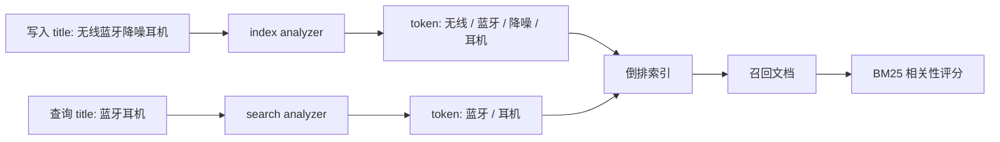

# 分词器与中文检索建模

## 1. 这一章解决什么问题

全文搜索的效果很大程度取决于分词。英文可以按空格、标点和词形变化处理, 中文却没有天然空格。默认 standard analyzer 会把中文按较细粒度拆分, 对商品搜索、文章搜索、知识库问答来说通常不够好。

这篇文章讲清楚 analyzer 的组成、如何调试分词、中文检索常见建模方式, 以及 IK 分词、同义词、拼音、keyword 子字段的工程取舍。

## 2. 核心概念

Analyzer 通常由三部分组成:

| 组成 | 作用 | 例子 |
|---|---|---|
| Character filter | 分词前处理字符 | HTML 清理、字符替换 |
| Tokenizer | 把文本切成 token | standard、keyword、ik_max_word |
| Token filter | token 后处理 | lowercase、stop、synonym、edge_ngram |

常见字段建模:

| 字段 | 类型 | 用途 |
|---|---|---|
| `title` | `text` | 全文搜索 |
| `title.keyword` | `keyword` | 精确匹配、排序、聚合 |
| `title.search` | `text` | 搜索时使用更粗粒度 analyzer |
| `suggest` | `completion` 或 edge ngram text | 自动补全 |
| `brand` | `keyword` | 精确过滤 |
| `brand.normalized` | `keyword` + normalizer | 大小写归一化精确匹配 |

分词器有 index analyzer 和 search analyzer 两个维度。索引时可以切得细一些提高召回, 搜索时可以切得粗一些提高精度。

## 3. 原理拆解

全文检索的基本链路:



中文检索通常要平衡召回和精度。

切得太细, 召回高但噪音多。例如“南京市长江大桥”被拆出“南京”“市长”“长江”“大桥”, 可能产生歧义。切得太粗, 精度高但漏召回。例如只识别“蓝牙耳机”, 用户搜“耳机”时可能匹配不足。

商品搜索常见策略是:

- 标题字段使用中文分词器建立全文索引。
- 品牌、类目、型号使用 keyword 精确过滤。
- 标题保留 keyword 子字段用于去重、排序或精确匹配。
- 建立同义词, 例如 “耳麦,耳机”, “手机,移动电话”。
- 对自动补全使用 completion suggester 或 edge ngram 字段。

## 4. 使用示例

### 4.1 调试默认分词

```http
GET _analyze
{
  "analyzer": "standard",
  "text": "无线蓝牙降噪耳机"
}
```

也可以用 explain 查看某个查询为什么命中文档:

```http
GET products_cn/_explain/1
{
  "query": {
    "match": {
      "title": "蓝牙耳机"
    }
  }
}
```

如果安装了 IK 插件, 可以调试:

```http
GET _analyze
{
  "analyzer": "ik_max_word",
  "text": "无线蓝牙降噪耳机"
}
```

```http
GET _analyze
{
  "analyzer": "ik_smart",
  "text": "无线蓝牙降噪耳机"
}
```

一般来说, `ik_max_word` 更偏召回, `ik_smart` 更偏精度。

### 4.2 定义中文标题字段

```http
PUT products-cn
{
  "settings": {
    "analysis": {
      "analyzer": {
        "cn_index_analyzer": {
          "type": "custom",
          "tokenizer": "ik_max_word",
          "filter": ["lowercase"]
        },
        "cn_search_analyzer": {
          "type": "custom",
          "tokenizer": "ik_smart",
          "filter": ["lowercase"]
        }
      },
      "normalizer": {
        "lowercase_normalizer": {
          "type": "custom",
          "filter": ["lowercase"]
        }
      }
    }
  },
  "mappings": {
    "properties": {
      "product_id": { "type": "keyword" },
      "title": {
        "type": "text",
        "analyzer": "cn_index_analyzer",
        "search_analyzer": "cn_search_analyzer",
        "fields": {
          "keyword": {
            "type": "keyword",
            "ignore_above": 256
          }
        }
      },
      "brand": {
        "type": "keyword",
        "normalizer": "lowercase_normalizer"
      },
      "category": { "type": "keyword" },
      "price": { "type": "scaled_float", "scaling_factor": 100 }
    }
  }
}
```

注意: `ik_max_word` 和 `ik_smart` 不是 ES 内置分词器, 需要安装对应插件。没有插件时, 这段配置会创建失败。

### 4.3 写入与查询

```http
POST products-cn/_doc/1
{
  "product_id": "sku-001",
  "title": "无线蓝牙降噪耳机",
  "brand": "SoundPlus",
  "category": "earphone",
  "price": 299
}
```

```http
GET products-cn/_search
{
  "query": {
    "bool": {
      "must": [
        {
          "match": {
            "title": {
              "query": "蓝牙耳机",
              "operator": "and"
            }
          }
        }
      ],
      "filter": [
        { "term": { "brand": "soundplus" } },
        { "range": { "price": { "lte": 300 } } }
      ]
    }
  }
}
```

### 4.4 同义词示例

同义词可以放在配置文件, 也可以使用 ES 8.x 的 synonyms 管理能力。简单示例:

```http
PUT products-synonym
{
  "settings": {
    "analysis": {
      "filter": {
        "cn_synonym": {
          "type": "synonym_graph",
          "synonyms": [
            "耳机, 耳麦",
            "手机, 移动电话"
          ]
        }
      },
      "analyzer": {
        "cn_search_with_synonym": {
          "tokenizer": "standard",
          "filter": ["lowercase", "cn_synonym"]
        }
      }
    }
  },
  "mappings": {
    "properties": {
      "title": {
        "type": "text",
        "search_analyzer": "cn_search_with_synonym"
      }
    }
  }
}
```

生产中更常见的是搜索时扩展同义词, 这样同义词调整不一定需要全量重建索引。但如果希望同义词参与索引时召回, 就要接受重建成本。

## 5. 工程取舍

IK 分词上手快, 中文搜索场景常用, 但词库维护是长期工作。新品牌、新型号、新热词如果不进词库, 搜索体验会下降。

同义词能提升召回, 也可能引入噪音。比如“苹果”在水果和手机两个领域含义不同, 同义词必须结合业务域治理。

拼音搜索对电商和联系人搜索有价值, 但会显著增加索引体积和误召回。不要把拼音字段和主标题字段混在一起, 通常单独建字段并降低权重。

自动补全可以用 completion suggester, 也可以用 edge ngram。completion 性能好, 但功能模型相对专用; edge ngram 更灵活, 但索引体积更大。

`search_analyzer` 的调整比 `analyzer` 灵活。索引 analyzer 变更通常需要重建索引, 搜索 analyzer 有些场景可以通过新字段或查询参数调整。

## 6. 实战与排障

搜索效果不好时, 排查顺序:

1. 用 `_analyze` 看索引分词和搜索分词。
2. 用 `_explain` 看目标文档为什么得分低或没有匹配。
3. 检查字段是否查错, 例如对 `title.keyword` 做 match。
4. 检查 `operator`, `minimum_should_match`, boost 是否过于严格。
5. 检查业务词库、停用词、同义词是否覆盖。
6. 用 profile API 判断是否是查询性能问题, 而不是相关性问题。

示例:

```http
GET products-cn/_analyze
{
  "field": "title",
  "text": "无线蓝牙降噪耳机"
}
```

```http
GET products-cn/_explain/1
{
  "query": {
    "match": {
      "title": "蓝牙耳机"
    }
  }
}
```

插件治理也很重要。集群中所有相关节点都要安装同版本分词插件, 否则 shard 分配、索引创建或查询可能失败。升级 ES 时也要确认插件版本兼容。

## 7. 小结

- 分词器决定全文检索的召回和精度。
- Analyzer 由 character filter、tokenizer、token filter 组成。
- 中文检索通常需要专门分词器和业务词库。
- 索引时可偏召回, 搜索时可偏精度, 通过 analyzer/search_analyzer 分工。
- 同义词、拼音、自动补全都能改善体验, 但会带来索引体积、误召回和维护成本。
- `_analyze`, `_explain`, profile API 是搜索效果排障的三件套。
- 生产环境要把词库、同义词和插件版本纳入发布治理。
