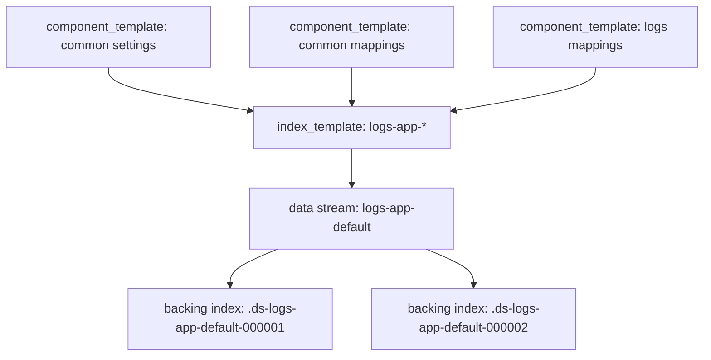
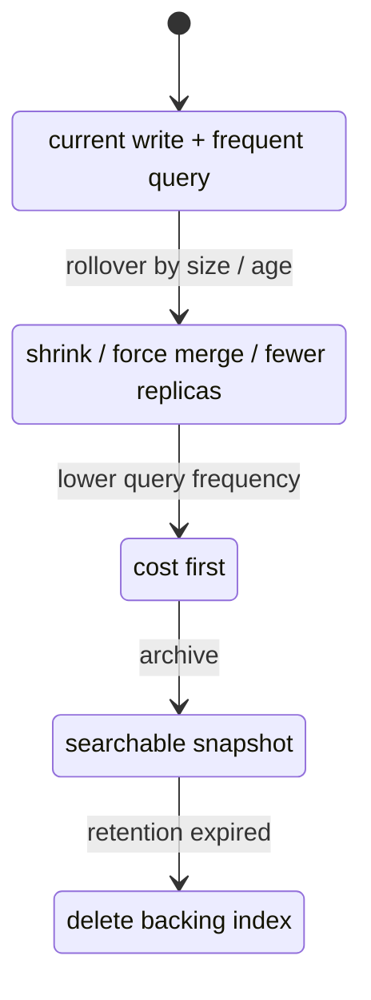

# Index Template 与索引生命周期治理

## 1. 这一章解决什么问题

日志、指标、订单流水这类数据通常会不断产生新索引。如果每次都手工创建 mapping、settings、alias 和生命周期策略, 很容易出现字段类型不一致、分片规划混乱、历史索引无法清理等问题。

Index Template 和 ILM 的作用, 就是把“新索引应该长什么样”和“索引从创建到删除怎么流转”自动化。ES 8.x 中还要重点理解 composable index template、component template 和 data stream。

## 2. 核心概念

| 概念 | 说明 |
|---|---|
| Legacy index template | 旧版模板, 仍可能在老集群中看到 |
| Component template | 可复用的 settings/mappings/aliases 片段 |
| Composable index template | 组合多个 component template 的新模板 |
| Priority | 多模板匹配时的优先级 |
| Data stream | 面向追加写时间序列数据的逻辑流 |
| Backing index | data stream 背后的真实索引 |
| ILM | Index Lifecycle Management, 索引生命周期管理 |
| Rollover | 根据大小、文档数或时间滚动创建新索引 |
| Hot/Warm/Cold/Frozen | 数据分层阶段 |

一句话理解: component template 负责复用片段, index template 负责匹配新索引, ILM 负责索引老化流转, data stream 负责把时间序列写入体验包装起来。

## 3. 原理拆解

Composable template 的结构:



当创建一个索引或 data stream backing index 时, ES 会根据 index pattern 找到匹配的模板, 按 priority 选择和合并配置。多个 component template 中的 settings/mappings 会组合进最终索引。

ILM 的典型流程:



日志和指标优先考虑 data stream, 因为它天然要求追加写、基于 `@timestamp`, 并且和 template、ILM 集成顺滑。普通业务搜索索引则继续使用 alias + rollover 或手动版本化索引。

## 4. 使用示例

### 4.1 创建 ILM 策略

```http
PUT _ilm/policy/logs-app-policy
{
  "policy": {
    "phases": {
      "hot": {
        "actions": {
          "rollover": {
            "max_primary_shard_size": "30gb",
            "max_age": "1d"
          }
        }
      },
      "warm": {
        "min_age": "7d",
        "actions": {
          "forcemerge": {
            "max_num_segments": 1
          },
          "set_priority": {
            "priority": 50
          }
        }
      },
      "delete": {
        "min_age": "30d",
        "actions": {
          "delete": {}
        }
      }
    }
  }
}
```

### 4.2 创建 component templates

通用 settings:

```http
PUT _component_template/ct-logs-settings
{
  "template": {
    "settings": {
      "number_of_shards": 2,
      "number_of_replicas": 1,
      "index.lifecycle.name": "logs-app-policy"
    }
  }
}
```

通用 mapping:

```http
PUT _component_template/ct-logs-mappings
{
  "template": {
    "mappings": {
      "dynamic": true,
      "properties": {
        "@timestamp": { "type": "date" },
        "service.name": { "type": "keyword" },
        "log.level": { "type": "keyword" },
        "message": { "type": "text" },
        "trace.id": { "type": "keyword" },
        "labels": { "type": "flattened" }
      }
    }
  }
}
```

### 4.3 创建 data stream 模板

```http
PUT _index_template/it-logs-app
{
  "index_patterns": ["logs-app-*"],
  "data_stream": {},
  "priority": 500,
  "composed_of": [
    "ct-logs-settings",
    "ct-logs-mappings"
  ],
  "template": {
    "settings": {
      "refresh_interval": "5s"
    }
  },
  "_meta": {
    "description": "Application logs data stream template"
  }
}
```

写入 data stream:

```http
POST logs-app-order/_doc
{
  "@timestamp": "2026-05-25T10:00:00+08:00",
  "service": {
    "name": "order-service"
  },
  "log": {
    "level": "INFO"
  },
  "message": "order paid successfully",
  "trace": {
    "id": "trace-001"
  },
  "labels": {
    "region": "cn-east",
    "tenant": "t001"
  }
}
```

查看:

```http
GET _data_stream/logs-app-order
GET _cat/indices/.ds-logs-app-order-*?v
GET logs-app-order/_search
{
  "query": {
    "range": {
      "@timestamp": {
        "gte": "now-1d"
      }
    }
  }
}
```

### 4.4 普通索引的 alias + rollover

对于非 data stream 的业务索引:

```http
PUT _ilm/policy/products-policy
{
  "policy": {
    "phases": {
      "hot": {
        "actions": {
          "rollover": {
            "max_primary_shard_size": "50gb",
            "max_age": "30d"
          }
        }
      }
    }
  }
}
```

```http
PUT products-000001
{
  "settings": {
    "index.lifecycle.name": "products-policy",
    "index.lifecycle.rollover_alias": "products-write"
  },
  "aliases": {
    "products-write": {
      "is_write_index": true
    },
    "products-read": {}
  },
  "mappings": {
    "properties": {
      "product_id": { "type": "keyword" },
      "title": { "type": "text" },
      "created_at": { "type": "date" }
    }
  }
}
```

手动触发 rollover:

```http
POST products-write/_rollover
{
  "conditions": {
    "max_docs": 1000000
  }
}
```

## 5. 工程取舍

Data stream 很适合日志、指标、APM、审计等追加写时间序列数据。它要求文档有 `@timestamp`, 写入通常面向 stream 名称, 背后的 backing index 由 ES 管理。它不适合大量更新、删除单条历史文档的业务模型。

普通 index template + alias 更适合商品、用户、订单搜索这类业务索引。你可以更精细地控制读写别名、重建索引、版本切换和回滚。

ILM 能自动治理历史数据, 但不要盲目照抄阶段。小集群没有 warm/cold 节点时, 配了迁移阶段也没有意义。先从 hot + delete 开始, 再根据硬件分层演进。

Rollover 条件要优先关注 primary shard 大小, 而不是只按天滚动。每天数据量波动很大时, 只按日期可能产生过小或过大的 shard。

Component template 适合沉淀统一字段规范, 例如 ECS 字段、通用 settings、安全审计字段。过度拆分模板会让排查合并结果变复杂。

## 6. 实战与排障

### 6.1 查看模板最终效果

```http
POST _index_template/_simulate_index/logs-app-order
```

这个 API 很适合在正式写入前检查最终 settings/mappings 是否符合预期。

### 6.2 查看 ILM 状态

```http
GET logs-app-order/_ilm/explain
GET _ilm/policy/logs-app-policy
GET _cat/indices/logs-app-*?v
```

如果 rollover 不发生, 常见原因:

- 没有配置 `index.lifecycle.rollover_alias`。
- alias 没有设置 `is_write_index: true`。
- data stream 或索引不满足 rollover 条件。
- ILM 处于错误状态, 需要看 explain。
- 索引名称不符合 `name-000001` 这类 rollover 模式。

### 6.3 模板优先级冲突

多个模板匹配同一个索引时, priority 高的模板会优先。排查:

```http
GET _index_template
POST _index_template/_simulate_index/logs-app-order
```

生产中建议给平台内置模板、业务模板、临时测试模板规划优先级区间, 避免互相覆盖。

### 6.4 字段规范治理

日志字段建议围绕 ECS 设计, 至少统一:

- `@timestamp`
- `service.name`
- `host.name`
- `log.level`
- `event.dataset`
- `trace.id`
- `message`
- `labels`

字段规范一旦进入模板, 后续所有新索引都会受影响。因此模板变更要走发布流程, 最好先用 simulate API 验证。

## 7. 小结

- Index Template 解决新索引自动套用 settings、mappings、aliases 的问题。
- ES 8.x 推荐 composable index template 和 component template。
- Data stream 适合追加写时间序列数据, 和 ILM 天然配合。
- ILM 用阶段化策略治理 rollover、冷热分层和删除。
- Rollover 应关注 shard 大小、时间和文档数, 不要只按日期切。
- 模板 priority 冲突是生产常见坑, 上线前用 simulate API 验证。
- 普通业务索引用 alias + 版本化索引, 日志指标优先考虑 data stream + ILM。
