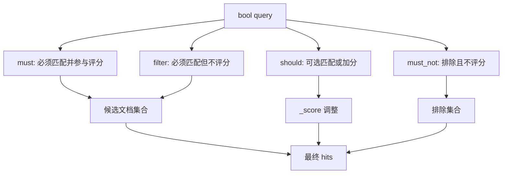

# 复合查询 Bool Query 实战

## 1. 这一章解决什么问题

真实业务里的搜索条件很少只有一个。商品搜索可能同时包含关键词、类目、品牌、价格区间、库存状态、门店、活动标签；日志检索可能同时包含服务名、时间范围、错误码、traceId 和关键字。Bool Query 就是 Elasticsearch 中最常用的复合查询能力，它负责把多个查询条件组合成一棵可执行的查询树。

这一章重点不是背参数，而是理解 `must`、`filter`、`should`、`must_not` 的语义差异，以及它们如何影响评分、缓存和性能。

## 2. 核心概念

### 2.1 Query Context 与 Filter Context

ES 查询有两种执行语境：

| 语境 | 是否计算相关性分数 | 典型用途 | 是否更容易缓存 |
|---|---:|---|---:|
| Query Context | 是 | 关键词搜索、相关性排序 | 否 |
| Filter Context | 否 | 精确过滤、权限、时间范围、状态筛选 | 是 |

在 `must` 和 `should` 中的查询通常参与评分；在 `filter` 和 `must_not` 中的查询不参与评分，更适合放精确条件。

Bool Query 的执行语义可以这样理解:



### 2.2 Bool Query 四个核心子句

| 子句 | 语义 | 是否参与评分 | 常见用途 |
|---|---|---:|---|
| `must` | 必须匹配 | 是 | 主关键词、必须命中的语义条件 |
| `filter` | 必须匹配 | 否 | 状态、时间、租户、权限、价格区间 |
| `should` | 最好匹配 | 是 | 召回扩展、加权偏好、可选条件 |
| `must_not` | 必须不匹配 | 否 | 排除下架、屏蔽黑名单、排除测试数据 |

## 3. 基础 DSL 示例

下面是一个商品搜索查询：关键词必须相关，商品必须上架，价格在 100 到 500 之间，优先返回品牌为 `sony` 或有活动标签的商品。

```json
GET products/_search
{
  "query": {
    "bool": {
      "must": [
        {
          "match": {
            "title": "wireless headphone"
          }
        }
      ],
      "filter": [
        {
          "term": {
            "status": "online"
          }
        },
        {
          "range": {
            "price": {
              "gte": 100,
              "lte": 500
            }
          }
        }
      ],
      "should": [
        {
          "term": {
            "brand.keyword": {
              "value": "sony",
              "boost": 2
            }
          }
        },
        {
          "term": {
            "tags.keyword": "promotion"
          }
        }
      ],
      "must_not": [
        {
          "term": {
            "is_deleted": true
          }
        }
      ]
    }
  }
}
```

这个查询有一个典型实践：能放进 `filter` 的条件不要放进 `must`。例如状态、租户、时间范围、价格区间本质上不是相关性条件，不需要参与 `_score` 计算。

## 4. minimum_should_match

`should` 的语义容易误解。它不是永远“至少匹配一个”。

- 如果 bool query 只有 `should`，默认至少匹配一个。
- 如果 bool query 已经有 `must` 或 `filter`，`should` 默认只是加分项。
- 如果希望 `should` 至少命中指定数量，需要显式设置 `minimum_should_match`。

```json
GET products/_search
{
  "query": {
    "bool": {
      "must": [
        {
          "match": {
            "title": "phone"
          }
        }
      ],
      "should": [
        { "term": { "features.keyword": "5g" } },
        { "term": { "features.keyword": "fast_charge" } },
        { "term": { "features.keyword": "oled" } }
      ],
      "minimum_should_match": 1
    }
  }
}
```

`minimum_should_match` 还可以写成百分比或组合规则，适合多词召回控制：

```json
"minimum_should_match": "2<-25% 9<-3"
```

这种写法表示条件越多时允许少量不命中，避免召回过窄。

## 5. constant_score：只过滤不评分

如果查询完全不关心相关性，只想按时间、热度或业务字段排序，可以用 `constant_score` 包裹过滤条件，让所有命中文档获得相同分数。

```json
GET orders/_search
{
  "query": {
    "constant_score": {
      "filter": {
        "bool": {
          "filter": [
            { "term": { "tenant_id": "t_001" } },
            { "term": { "status": "paid" } },
            {
              "range": {
                "created_at": {
                  "gte": "now-7d"
                }
              }
            }
          ]
        }
      },
      "boost": 1.0
    }
  },
  "sort": [
    { "created_at": "desc" }
  ]
}
```

这类查询适合订单、日志、工单、消息列表等“过滤 + 排序”的场景。

## 6. 工程取舍

### 6.1 条件放在哪里

| 条件类型 | 推荐位置 | 原因 |
|---|---|---|
| 关键词搜索 | `must` | 需要相关性评分 |
| 状态、租户、权限 | `filter` | 精确过滤，不需要评分 |
| 时间范围 | `filter` | 常用于缩小数据范围 |
| 价格区间 | `filter` | 精确约束 |
| 偏好品牌、标签 | `should` | 命中则加分，不命中也可返回 |
| 黑名单、删除标记 | `must_not` | 排除集合 |

### 6.2 Bool 嵌套不要失控

复杂业务容易生成几十层 bool 嵌套，带来两个问题：

- 查询很难阅读和审计。
- 查询树过深，改动时容易改变语义。

实践中可以把查询构造分为三层：召回条件、过滤条件、排序/加权条件。业务代码中也最好把 DSL 构造函数按这三类拆开，而不是把所有参数拼在一个方法里。

## 7. 常见坑

- 把 `term` 用在 `text` 字段上，结果查不到，因为 `text` 字段经过分词，原始字符串可能并不存在。
- 把大量精确过滤条件放在 `must`，导致不必要的评分计算。
- 认为 `should` 一定会过滤结果，实际上有 `must` 或 `filter` 时它默认只是加分项。
- 滥用 `must_not` 做大集合排除，可能导致查询代价很高。
- 查询里没有时间范围，直接扫全量日志索引，最终慢在分片数量和候选集过大。

## 8. 排障清单

当 bool query 很慢时，优先检查：

- 是否限制了时间范围或业务分区。
- 高选择性的过滤条件是否放在 `filter`。
- 是否对 `text` 字段做了精确匹配。
- 是否存在大规模 `should` 条件或巨大的 `terms` 列表。
- 是否可以使用 `profile` API 看每个子查询耗时。

```json
GET products/_search
{
  "profile": true,
  "query": {
    "bool": {
      "must": [
        { "match": { "title": "phone" } }
      ],
      "filter": [
        { "term": { "status": "online" } }
      ]
    }
  }
}
```

## 9. 小结

- Bool Query 是业务搜索最核心的组合查询能力。
- `must` 解决“必须相关”，`filter` 解决“必须满足但不评分”。
- `should` 常用于加权、扩展召回和偏好排序。
- `minimum_should_match` 是控制召回松紧的关键参数。
- 精确过滤优先放入 `filter`，这是性能和语义都更稳的写法。
- 慢查询不要靠感觉优化，先用 `profile` 和慢查询日志定位最贵的子查询。
