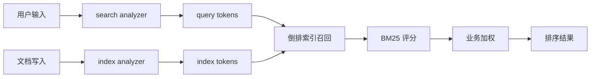

# 全文搜索与相关性排序

## 1. 这一章解决什么问题

全文搜索和普通过滤最大的区别在于：用户输入的是自然语言，系统需要先分词，再召回，再按相关性排序。用户搜“无线降噪耳机”，可能希望命中“蓝牙主动降噪头戴耳机”“无线耳麦”“Sony noise cancelling headphone”等结果，这背后涉及 analyzer、倒排索引、BM25、短语匹配、多字段召回和业务加权。

这一章围绕 ES 的全文查询展开：`match`、`match_phrase`、`multi_match`、`query_string` 等查询怎么用，相关性分数从哪里来，以及生产中如何调优搜索体验。

## 2. 核心概念

### 2.1 分词决定能否召回

全文检索字段通常是 `text` 类型。文档写入时，ES 会用 analyzer 把文本拆成 token；查询时，也会用 analyzer 把用户输入拆成 token，再到倒排索引中召回文档。

```json
GET products/_analyze
{
  "analyzer": "standard",
  "text": "Wireless noise cancelling headphone"
}
```

中文场景中，默认 analyzer 往往不够，需要使用 IK、jieba、自定义词典、同义词等方案。

### 2.2 BM25 排序

ES 默认相关性算法是 BM25。可以粗略理解为：

- 查询词在文档中出现得越多，相关性越高，但收益会递减。
- 查询词越稀有，区分度越高，权重越大。
- 字段越短，命中词占比越高，相关性越高。

这解释了为什么同一个词命中短标题，通常比分散在长正文中更靠前。

全文搜索的主链路如下:



## 3. match 查询

`match` 是最常用的全文查询。它会分析查询文本，再用分析后的 token 去倒排索引召回。

```json
GET products/_search
{
  "query": {
    "match": {
      "title": {
        "query": "wireless headphone",
        "operator": "and"
      }
    }
  }
}
```

`operator` 默认为 `or`，表示命中任意 token 即可召回。改成 `and` 后要求所有 token 都命中，召回更精准但可能漏掉结果。

也可以使用 `minimum_should_match` 控制召回松紧：

```json
GET products/_search
{
  "query": {
    "match": {
      "title": {
        "query": "wireless bluetooth noise cancelling headphone",
        "minimum_should_match": "70%"
      }
    }
  }
}
```

## 4. match_phrase 查询

`match_phrase` 关注词序和距离，适合短语搜索。

```json
GET products/_search
{
  "query": {
    "match_phrase": {
      "title": {
        "query": "wireless headphone",
        "slop": 1
      }
    }
  }
}
```

`slop` 表示允许 token 之间有一定距离。`slop` 越大，召回越宽，但成本也会上升。

短语查询适合：

- 歌词、文档、标题中的连续短语。
- 商品标题中“品牌 + 型号”的顺序匹配。
- 日志 message 中的固定错误片段。

## 5. multi_match 多字段查询

真实搜索通常不是只搜一个字段。商品搜索可能同时搜索标题、副标题、品牌、类目、属性。

```json
GET products/_search
{
  "query": {
    "multi_match": {
      "query": "sony wireless headphone",
      "fields": [
        "title^3",
        "subtitle^2",
        "brand^4",
        "category"
      ],
      "type": "best_fields"
    }
  }
}
```

字段后的 `^` 表示 boost。品牌字段命中通常更有价值，因此权重更高。

常见 `type`：

| type | 适用场景 |
|---|---|
| `best_fields` | 多字段中某一个字段强命中即可，例如标题或品牌 |
| `most_fields` | 多个字段共同贡献分数，例如正文、摘要、标题 |
| `cross_fields` | 多字段像一个字段一样搜索，例如 first_name + last_name |
| `phrase` | 多字段短语匹配 |
| `bool_prefix` | 搜索框自动补全的前缀召回 |

## 6. query_string 与 simple_query_string

`query_string` 支持用户输入语法，例如 `AND`、`OR`、括号、通配符、字段限定。

```json
GET logs/_search
{
  "query": {
    "query_string": {
      "query": "service:payment AND (timeout OR exception)",
      "default_field": "message"
    }
  }
}
```

它很强，但也很危险：用户输入语法错误会导致查询失败，通配符也可能拖垮查询。面向普通用户的搜索框更推荐 `simple_query_string`，语法错误会被忽略。

```json
GET logs/_search
{
  "query": {
    "simple_query_string": {
      "query": "timeout + payment",
      "fields": ["message", "service"]
    }
  }
}
```

## 7. 相关性调优

### 7.1 字段权重

标题命中通常比正文命中更重要：

```json
"fields": ["title^5", "summary^2", "content"]
```

### 7.2 业务加权

相关性不等于最终排序。商品搜索常常还要考虑销量、库存、价格、点击率和上新时间。可以用 `function_score` 做轻量业务加权。

```json
GET products/_search
{
  "query": {
    "function_score": {
      "query": {
        "multi_match": {
          "query": "wireless headphone",
          "fields": ["title^3", "brand^2", "description"]
        }
      },
      "field_value_factor": {
        "field": "sales",
        "modifier": "log1p",
        "factor": 0.2,
        "missing": 0
      },
      "boost_mode": "sum",
      "score_mode": "sum"
    }
  }
}
```

注意不要让业务分完全淹没文本相关性，否则搜索会变成“销量榜”。

## 8. 中文搜索实践

中文检索通常要关注：

- 分词器：IK、jieba、自定义 analyzer。
- 专有词：品牌、型号、人名、地名需要加入词典。
- 同义词：手机/移动电话、耳机/耳麦。
- 拼音：适合联系人、地名、品牌搜索。
- 短语：中文标题中词序也很重要。

一个常见 mapping 思路是为同一字段建立多字段：

```json
PUT products
{
  "mappings": {
    "properties": {
      "title": {
        "type": "text",
        "analyzer": "ik_max_word",
        "search_analyzer": "ik_smart",
        "fields": {
          "keyword": {
            "type": "keyword"
          }
        }
      }
    }
  }
}
```

## 9. 常见坑

- 用 `term` 查 `text` 字段，忽略了分词。
- 搜索召回少，先怀疑 DSL，实际上是 analyzer 没有按预期切词。
- 多字段搜索不加权，导致正文里偶然命中的文档压过标题精准命中的文档。
- `query_string` 暴露给普通用户，输入特殊字符导致查询异常。
- 短语查询 `slop` 设置过大，召回泛化且查询变慢。

## 10. 小结

- 全文搜索的核心链路是分词、召回、评分、排序。
- `match` 适合普通全文搜索，`match_phrase` 适合短语和词序敏感场景。
- `multi_match` 是多字段搜索的主力，字段 boost 是基础调优手段。
- BM25 解释了词频、稀有度和字段长度对排序的影响。
- 中文检索的关键常常不是 DSL，而是 analyzer、词典和同义词治理。
- 业务排序可以补充相关性，但不要替代相关性。
