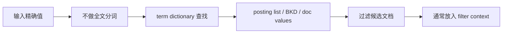

# Term 级查询与精确过滤

## 1. 这一章解决什么问题

全文查询解决“像不像”，Term 级查询解决“是不是”。在订单、日志、权限、商品筛选、标签过滤等场景里，我们经常需要按照精确值过滤：状态是否为 paid，租户是否为 t_001，价格是否在区间内，字段是否存在，id 是否在集合中。

Term 级查询通常不分析查询文本，而是直接拿输入值去索引中匹配，因此它和字段类型、normalizer、doc values、倒排索引结构关系很紧。

## 2. 核心概念

### 2.1 Term Query 不分词

`term` 查询不会对输入做全文分析。它适合查 `keyword`、数字、日期、boolean、ip 等精确字段。

```json
GET products/_search
{
  "query": {
    "term": {
      "brand.keyword": "sony"
    }
  }
}
```

如果对 `text` 字段执行：

```json
{
  "term": {
    "title": "Sony Wireless Headphone"
  }
}
```

很可能查不到，因为 `title` 写入时已经被分成多个 token。

Term 级查询的典型路径:



### 2.2 精确过滤优先放在 filter

Term 级查询多数不需要评分，建议放进 bool 的 `filter`。

```json
GET orders/_search
{
  "query": {
    "bool": {
      "filter": [
        { "term": { "tenant_id": "t_001" } },
        { "term": { "status": "paid" } },
        {
          "range": {
            "created_at": {
              "gte": "now-1d"
            }
          }
        }
      ]
    }
  }
}
```

## 3. 常用 Term 级查询

### 3.1 term

单值精确匹配。

```json
GET logs/_search
{
  "query": {
    "term": {
      "level": "ERROR"
    }
  }
}
```

### 3.2 terms

多值集合匹配，类似 SQL 中的 `IN`。

```json
GET products/_search
{
  "query": {
    "terms": {
      "brand.keyword": ["sony", "bose", "apple"]
    }
  }
}
```

`terms` 列表不要无限大。超大集合过滤可能带来较高内存和 CPU 开销，必要时应改为临时索引 join、业务预筛选或权限缓存。

### 3.3 range

区间查询，适合数字和日期。

```json
GET products/_search
{
  "query": {
    "range": {
      "price": {
        "gte": 100,
        "lt": 500
      }
    }
  }
}
```

日期范围支持日期数学：

```json
GET logs-*/_search
{
  "query": {
    "range": {
      "@timestamp": {
        "gte": "now-15m",
        "lte": "now"
      }
    }
  }
}
```

### 3.4 exists

判断字段是否存在。

```json
GET users/_search
{
  "query": {
    "exists": {
      "field": "email"
    }
  }
}
```

字段为空数组、`null` 或未写入时通常不算存在；空字符串可能算存在，需要结合 mapping 和写入数据确认。

### 3.5 ids

按 `_id` 集合查询。

```json
GET products/_search
{
  "query": {
    "ids": {
      "values": ["p_001", "p_002"]
    }
  }
}
```

如果业务经常按 id 批量读取，`_mget` 可能更直接。

## 4. 前缀、通配符和正则

### 4.1 prefix

```json
GET products/_search
{
  "query": {
    "prefix": {
      "sku.keyword": "A2026"
    }
  }
}
```

前缀查询比任意通配符更可控，但在高基数字段上仍要谨慎。

### 4.2 wildcard

```json
GET products/_search
{
  "query": {
    "wildcard": {
      "sku.keyword": {
        "value": "A*99"
      }
    }
  }
}
```

前导通配符非常危险：

```json
"value": "*99"
```

它会让 ES 很难利用 term dictionary 的前缀结构，代价可能急剧上升。

### 4.3 regexp

正则查询更灵活，也更需要限制。

```json
GET products/_search
{
  "query": {
    "regexp": {
      "sku.keyword": "A[0-9]{4}"
    }
  }
}
```

生产环境中，面向用户输入的 wildcard/regexp 最好经过白名单、长度限制和超时保护。

## 5. normalizer：keyword 字段的标准化

`keyword` 不分词，但可以使用 normalizer 做小写化、去重音等标准化。

```json
PUT users
{
  "settings": {
    "analysis": {
      "normalizer": {
        "lowercase_normalizer": {
          "type": "custom",
          "filter": ["lowercase", "asciifolding"]
        }
      }
    }
  },
  "mappings": {
    "properties": {
      "email": {
        "type": "keyword",
        "normalizer": "lowercase_normalizer"
      }
    }
  }
}
```

这样 `Alice@Example.COM` 和 `alice@example.com` 会落到同一个标准化 term 上。

## 6. 工程取舍

| 查询 | 适合 | 注意点 |
|---|---|---|
| `term` | 单值精确匹配 | 字段通常应是 keyword/number/date |
| `terms` | 小到中等集合过滤 | 集合过大时成本高 |
| `range` | 时间、价格、数值区间 | 尽量配合索引选择缩小范围 |
| `exists` | 字段存在性 | 注意 null、空数组、空字符串差异 |
| `prefix` | 前缀编码、自动补全弱需求 | 高基数字段要压测 |
| `wildcard` | 模糊编号、运维检索 | 避免前导通配符 |
| `regexp` | 复杂模式匹配 | 严格限制输入 |

## 7. 常见坑

- 对 `text` 字段使用 `term`，查不到预期结果。
- 用 wildcard 实现搜索框，导致线上查询不可控。
- 把大小写敏感问题留给查询时处理，而不是在写入时用 normalizer 规范化。
- 时间范围没有写时区，导致跨时区数据分析偏差。
- 用巨大的 `terms` 做权限过滤，查询体和执行成本都失控。

## 8. 小结

- Term 级查询强调精确匹配，通常不经过分词。
- 精确条件优先放入 `filter`，让语义和性能更清晰。
- `keyword`、数字、日期、boolean 是 Term 查询的常见字段类型。
- wildcard 和 regexp 是高风险能力，生产环境要限制输入。
- normalizer 是解决 keyword 大小写和标准化问题的好工具。
