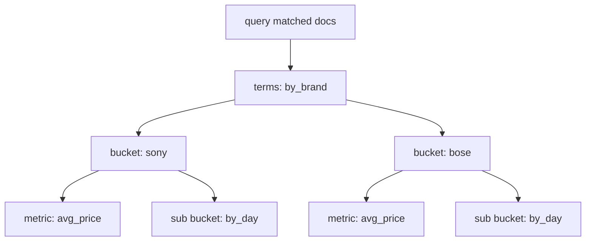

# Bucket 聚合分析实战

## 1. 这一章解决什么问题

搜索回答“哪些文档匹配”，聚合回答“这些文档呈现什么分布”。Bucket 聚合负责把文档分桶，例如按品牌分组、按价格区间分组、按天统计日志量、按状态拆分订单。它是日志分析、商品筛选、运营报表和监控看板里的核心能力。

这一章重点讲常用 Bucket 聚合的语义、DSL 示例和生产注意点，尤其是 `terms` 的精度问题、`date_histogram` 的时间边界、nested 聚合和高基数字段风险。

## 2. 核心概念

Bucket 聚合会把命中文档划入多个桶，每个桶通常包含：

- `key`：桶的标识，例如品牌名、日期、区间。
- `doc_count`：落入这个桶的文档数量。
- 子聚合结果：例如每个品牌下的平均价格、销售额。

聚合是在查询结果集上执行的。也就是说，先由 `query` 缩小文档范围，再在范围内聚合。

聚合树通常是层层嵌套的:



## 3. terms 聚合

`terms` 是最常见的分组聚合，类似 SQL 的 `GROUP BY field`。

```json
GET products/_search
{
  "size": 0,
  "query": {
    "term": {
      "status": "online"
    }
  },
  "aggs": {
    "by_brand": {
      "terms": {
        "field": "brand.keyword",
        "size": 10
      }
    }
  }
}
```

`size: 0` 表示不返回具体文档，只返回聚合结果。

### 3.1 shard_size 与误差

`terms` 聚合是分布式执行的。每个 shard 先返回自己的 top N，再由协调节点合并。因此默认情况下，小 shard 上不够靠前的桶可能在全局合并时被漏掉。

可以通过 `shard_size` 提高每个分片返回的候选桶数量：

```json
"terms": {
  "field": "brand.keyword",
  "size": 20,
  "shard_size": 200
}
```

代价是内存和网络传输增加。对于高基数字段，`terms` 不适合直接拉取所有唯一值，应考虑 composite 聚合分页。

## 4. histogram 与 range

### 4.1 histogram

按固定数值间隔分桶：

```json
GET products/_search
{
  "size": 0,
  "aggs": {
    "price_histogram": {
      "histogram": {
        "field": "price",
        "interval": 100,
        "min_doc_count": 0
      }
    }
  }
}
```

适合价格分布、响应耗时分布、用户年龄分布等。

### 4.2 range

自定义区间更适合业务筛选。

```json
GET products/_search
{
  "size": 0,
  "aggs": {
    "price_ranges": {
      "range": {
        "field": "price",
        "ranges": [
          { "to": 100 },
          { "from": 100, "to": 500 },
          { "from": 500 }
        ]
      }
    }
  }
}
```

## 5. date_histogram

时间序列分析使用 `date_histogram`。

```json
GET logs-*/_search
{
  "size": 0,
  "query": {
    "range": {
      "@timestamp": {
        "gte": "now-24h"
      }
    }
  },
  "aggs": {
    "logs_per_hour": {
      "date_histogram": {
        "field": "@timestamp",
        "fixed_interval": "1h",
        "time_zone": "+08:00",
        "min_doc_count": 0
      }
    }
  }
}
```

`fixed_interval` 表示固定长度，如 `1h`、`10m`；`calendar_interval` 表示日历语义，如 `1d`、`1M`，会考虑自然月、夏令时等。

## 6. filters 聚合

`filters` 可以一次性计算多个条件桶。

```json
GET orders/_search
{
  "size": 0,
  "aggs": {
    "status_groups": {
      "filters": {
        "filters": {
          "paid": { "term": { "status": "paid" } },
          "refunded": { "term": { "status": "refunded" } },
          "high_value": { "range": { "amount": { "gte": 1000 } } }
        }
      }
    }
  }
}
```

它适合看板里固定口径的多指标统计。

## 7. nested 聚合

如果字段是 `nested` 类型，必须用 nested 聚合进入嵌套文档上下文。

```json
GET products/_search
{
  "size": 0,
  "aggs": {
    "attrs": {
      "nested": {
        "path": "attributes"
      },
      "aggs": {
        "by_attr_name": {
          "terms": {
            "field": "attributes.name.keyword"
          },
          "aggs": {
            "by_attr_value": {
              "terms": {
                "field": "attributes.value.keyword"
              }
            }
          }
        }
      }
    }
  }
}
```

商品属性筛选经常需要 nested，但 nested 会增加索引和查询成本。能用扁平化字段解决的场景，不要过度 nested 化。

## 8. composite 聚合：高基数字段分页

如果需要遍历所有桶，例如导出所有用户 ID 的统计结果，可以用 composite 聚合分页。

```json
GET events/_search
{
  "size": 0,
  "aggs": {
    "by_user": {
      "composite": {
        "size": 1000,
        "sources": [
          {
            "user_id": {
              "terms": {
                "field": "user_id"
              }
            }
          }
        ]
      }
    }
  }
}
```

返回结果里的 `after_key` 可用于下一页。

## 9. 常见坑

- 对 `text` 字段做 terms 聚合，触发 fielddata 或直接失败。聚合字段应使用 `keyword` 或有 doc values 的字段。
- 忽略 `shard_size` 和误差，误以为 terms top N 永远精确。
- date_histogram 忘记设置 `time_zone`，日报、小时报表边界错位。
- 在高基数字段上做大 size 的 terms 聚合，导致内存压力。
- nested 字段不用 nested 聚合，得到错误统计。

## 10. 小结

- Bucket 聚合负责分桶，是报表和筛选的基础。
- `terms` 最常用，但要理解分布式 top N 的误差。
- 时间序列优先使用 `date_histogram`，并明确时区。
- 高基数字段全量遍历考虑 composite 聚合。
- 聚合字段要提前建模，不能等线上慢了再补救。
