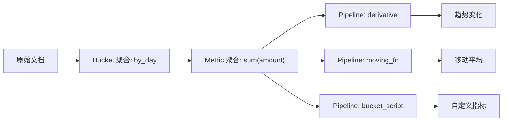

# Metric 与 Pipeline 聚合实战

## 1. 这一章解决什么问题

Bucket 聚合负责分组，Metric 聚合负责在每个分组里计算指标。比如按天分桶后计算订单金额总和，按服务分组后计算 P95 响应耗时，按品牌分组后计算平均价格。Pipeline 聚合则更进一步：它基于已有聚合结果再做二次计算，例如环比、移动平均、累计值和异常过滤。

这一章关注指标统计如何写、如何解释，以及哪些聚合会带来精度或性能问题。

Metric 和 Pipeline 聚合的关系可以这样看:



## 2. Metric 聚合基础

### 2.1 常见单值指标

```json
GET orders/_search
{
  "size": 0,
  "query": {
    "range": {
      "created_at": {
        "gte": "now-7d"
      }
    }
  },
  "aggs": {
    "total_amount": {
      "sum": {
        "field": "amount"
      }
    },
    "avg_amount": {
      "avg": {
        "field": "amount"
      }
    },
    "max_amount": {
      "max": {
        "field": "amount"
      }
    }
  }
}
```

常见指标包括 `sum`、`avg`、`min`、`max`、`value_count`。

### 2.2 stats 与 extended_stats

```json
GET products/_search
{
  "size": 0,
  "aggs": {
    "price_stats": {
      "stats": {
        "field": "price"
      }
    },
    "price_extended": {
      "extended_stats": {
        "field": "price"
      }
    }
  }
}
```

`stats` 一次返回 count、min、max、avg、sum；`extended_stats` 还会返回方差、标准差等信息。

## 3. cardinality：去重计数

`cardinality` 用于估算唯一值数量，例如 UV、独立用户数、唯一 traceId 数量。

```json
GET events/_search
{
  "size": 0,
  "aggs": {
    "uv": {
      "cardinality": {
        "field": "user_id",
        "precision_threshold": 40000
      }
    }
  }
}
```

它使用近似算法，并不保证绝对精确。`precision_threshold` 越高，精度越高，内存消耗也越高。对于账务、库存这类必须精确的统计，不应依赖 cardinality 作为最终口径。

## 4. percentiles：百分位统计

日志和监控中，平均值常常会掩盖长尾，P95/P99 更有价值。

```json
GET logs-*/_search
{
  "size": 0,
  "query": {
    "range": {
      "@timestamp": {
        "gte": "now-1h"
      }
    }
  },
  "aggs": {
    "latency_percentiles": {
      "percentiles": {
        "field": "duration_ms",
        "percents": [50, 90, 95, 99]
      }
    }
  }
}
```

百分位也是近似统计。监控趋势足够好用，但如果用于结算或精确审计，需要离线计算或专用指标系统兜底。

## 5. 分桶后计算指标

按天统计订单金额：

```json
GET orders/_search
{
  "size": 0,
  "query": {
    "range": {
      "created_at": {
        "gte": "now-30d"
      }
    }
  },
  "aggs": {
    "by_day": {
      "date_histogram": {
        "field": "created_at",
        "calendar_interval": "1d",
        "time_zone": "+08:00"
      },
      "aggs": {
        "gmv": {
          "sum": {
            "field": "amount"
          }
        },
        "avg_order_amount": {
          "avg": {
            "field": "amount"
          }
        }
      }
    }
  }
}
```

这就是 Bucket + Metric 的组合。

## 6. Pipeline 聚合

Pipeline 聚合不直接读取原始文档，而是读取其他聚合的结果。

### 6.1 derivative：趋势变化

```json
GET orders/_search
{
  "size": 0,
  "aggs": {
    "by_day": {
      "date_histogram": {
        "field": "created_at",
        "calendar_interval": "1d",
        "time_zone": "+08:00"
      },
      "aggs": {
        "gmv": {
          "sum": {
            "field": "amount"
          }
        },
        "gmv_derivative": {
          "derivative": {
            "buckets_path": "gmv"
          }
        }
      }
    }
  }
}
```

`derivative` 可以看每天 GMV 相比前一天的变化量。

### 6.2 moving_fn：移动窗口

```json
GET orders/_search
{
  "size": 0,
  "aggs": {
    "by_day": {
      "date_histogram": {
        "field": "created_at",
        "calendar_interval": "1d"
      },
      "aggs": {
        "gmv": {
          "sum": {
            "field": "amount"
          }
        },
        "gmv_7d_avg": {
          "moving_fn": {
            "buckets_path": "gmv",
            "window": 7,
            "script": "MovingFunctions.unweightedAvg(values)"
          }
        }
      }
    }
  }
}
```

移动平均适合平滑波动，但它不减少原始聚合成本。

### 6.3 bucket_script：自定义指标

计算支付转化率：

```json
GET events/_search
{
  "size": 0,
  "aggs": {
    "total_view": {
      "filter": {
        "term": {
          "event": "view"
        }
      }
    },
    "total_pay": {
      "filter": {
        "term": {
          "event": "pay"
        }
      }
    },
    "pay_rate": {
      "bucket_script": {
        "buckets_path": {
          "pay": "total_pay._count",
          "view": "total_view._count"
        },
        "script": "params.view == 0 ? 0 : params.pay / params.view"
      }
    }
  }
}
```

### 6.4 bucket_selector：过滤桶

只保留订单数超过 100 的品牌：

```json
GET orders/_search
{
  "size": 0,
  "aggs": {
    "by_brand": {
      "terms": {
        "field": "brand.keyword",
        "size": 100
      },
      "aggs": {
        "total_amount": {
          "sum": {
            "field": "amount"
          }
        },
        "keep_large_bucket": {
          "bucket_selector": {
            "buckets_path": {
              "count": "_count"
            },
            "script": "params.count > 100"
          }
        }
      }
    }
  }
}
```

注意：`bucket_selector` 是在桶已经生成后过滤，并不能减少前面的聚合计算成本。

## 7. top_hits 与 top_metrics

`top_hits` 可以在每个桶里返回若干文档，例如每个品牌下销量最高的商品。

```json
GET products/_search
{
  "size": 0,
  "aggs": {
    "by_brand": {
      "terms": {
        "field": "brand.keyword",
        "size": 10
      },
      "aggs": {
        "top_products": {
          "top_hits": {
            "size": 3,
            "_source": ["title", "price", "sales"],
            "sort": [
              { "sales": "desc" }
            ]
          }
        }
      }
    }
  }
}
```

如果只需要某个排序下的少量字段，`top_metrics` 往往更轻。

## 8. 常见坑

- 把 cardinality 当精确去重计数。
- 只看 avg，不看 P95/P99，忽略长尾问题。
- pipeline 聚合以为能减少原始计算，实际上它只处理聚合后的桶。
- `top_hits` 返回太多字段和文档，导致响应体巨大。
- 在没有 doc values 的字段上做指标聚合，性能和内存都会出问题。

## 9. 小结

- Metric 聚合负责指标统计，Bucket 聚合负责分组。
- cardinality 和 percentiles 是近似统计，适合分析趋势，不适合强一致结算。
- Pipeline 聚合适合做环比、移动平均、累计和自定义指标。
- Pipeline 聚合不会减少前置聚合成本。
- 指标字段的 mapping 设计直接决定聚合性能。
