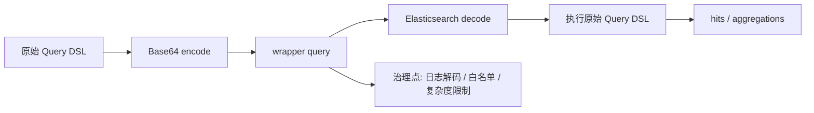

# Wrapper Query 与复杂查询封装

## 1. 这一章解决什么问题

Wrapper Query 是 ES 中一个不常用但有时很方便的查询：它允许把一段完整 Query DSL 编码成 Base64 字符串，再作为查询的一部分提交。它常见于某些客户端封装、查询模板系统、跨语言传递查询条件或需要把原始 DSL 当作字符串保存和转发的场景。

它的价值是“包住一段查询”，但风险也很明显：可读性差、审计困难、调试不便，甚至可能绕过上层查询构造器的限制。

Wrapper Query 的处理链路:



## 2. 核心概念

Wrapper Query 的结构很简单：

```json
{
  "query": {
    "wrapper": {
      "query": "base64 encoded query"
    }
  }
}
```

其中 `query` 字段是 Base64 编码后的 JSON 查询对象。例如原始查询：

```json
{
  "term": {
    "status": "online"
  }
}
```

编码后放入 wrapper。

## 3. REST 示例

假设原始查询是：

```json
{
  "bool": {
    "filter": [
      {
        "term": {
          "tenant_id": "t_001"
        }
      },
      {
        "term": {
          "status": "online"
        }
      }
    ]
  }
}
```

Base64 编码后可以这样查询：

```json
GET products/_search
{
  "query": {
    "wrapper": {
      "query": "eyJib29sIjp7ImZpbHRlciI6W3sidGVybSI6eyJ0ZW5hbnRfaWQiOiJ0XzAwMSJ9fSx7InRlcm0iOnsic3RhdHVzIjoib25saW5lIn19XX19"
    }
  }
}
```

在 Kibana Dev Tools 中调试 wrapper 不舒服，所以实际排障时建议先解码为原始 DSL。

## 4. PowerShell 编码和解码

在当前 Windows 环境中，可以用 PowerShell 快速编码：

```powershell
$json = '{"term":{"status":"online"}}'
[Convert]::ToBase64String([Text.Encoding]::UTF8.GetBytes($json))
```

解码：

```powershell
$encoded = 'eyJ0ZXJtIjp7InN0YXR1cyI6Im9ubGluZSJ9fQ=='
[Text.Encoding]::UTF8.GetString([Convert]::FromBase64String($encoded))
```

## 5. Java 客户端中的封装思路

不建议在业务代码里到处手写 wrapper。更好的方式是把它限制在一个很小的适配层里：

```java
String rawQuery = """
{
  "term": {
    "status": "online"
  }
}
""";

String encoded = Base64.getEncoder()
    .encodeToString(rawQuery.getBytes(StandardCharsets.UTF_8));
```

然后在统一查询网关或 Repository 层中构造 wrapper。这样可以集中做校验、日志、审计和限流。

## 6. 适用场景

Wrapper Query 可以考虑用于：

- 查询条件由外部系统生成，当前服务只负责透传。
- 查询模板存储在数据库或配置中心里，需要运行时注入。
- 某些客户端 DSL 构造能力不足，但允许传入原始查询。
- 网关层需要保留原始查询作为字符串，同时交给 ES 执行。

但它不适合普通业务查询的默认写法。大多数情况下，直接写结构化 DSL 更清晰。

## 7. 风险与治理

### 7.1 可读性差

Base64 字符串不能直接看出查询语义。日志、审计、代码 review 都会变困难。

治理建议：

- 日志中同时打印解码后的 DSL。
- 查询平台展示原始 JSON，而不是只展示 encoded 字符串。
- 对 wrapper 查询保留创建人、来源系统、模板版本。

### 7.2 安全和越权风险

如果用户可以直接提交 wrapper，就可能绕过业务层限制，例如移除租户过滤、扩大时间范围、执行高成本 wildcard。

治理建议：

- 不要把 wrapper 直接暴露给终端用户。
- 服务端必须强制注入租户、权限、时间范围等过滤条件。
- 对解码后的 DSL 做白名单校验。

### 7.3 性能风险

Wrapper Query 本身不慢，真正慢的是被包住的查询。问题在于它隐藏了查询结构，容易绕过常规优化。

治理建议：

- 解码后做复杂度检查，例如禁止前导 wildcard、限制 terms 数量、限制聚合层级。
- 设置超时、terminate_after 或业务层限流。
- 对慢查询记录解码后的 DSL。

## 8. 替代方案

### 8.1 Search Template

如果目标是复用查询模板，ES 的 search template 更清晰。

```json
GET products/_search/template
{
  "source": {
    "query": {
      "bool": {
        "filter": [
          {
            "term": {
              "tenant_id": "{{tenant_id}}"
            }
          }
        ]
      }
    }
  },
  "params": {
    "tenant_id": "t_001"
  }
}
```

### 8.2 业务查询构造器

如果查询来自业务参数，建议用结构化构造器生成 DSL，而不是拼接 JSON 字符串。这样可以更容易做参数校验、默认过滤和单元测试。

### 8.3 查询网关

大规模 ES 平台常见做法是建设查询网关，统一处理：

- 租户和权限过滤。
- 查询复杂度限制。
- 慢查询采样。
- 查询模板版本管理。
- 熔断和降级。

## 9. 常见坑

- 以为 Base64 是加密。它只是编码，任何人都能解码。
- 日志只记录 encoded 字符串，线上排障时无法快速判断查询内容。
- 允许前端直接传 wrapper，导致权限过滤被绕过。
- 查询模板没有版本管理，线上变更后难以回滚。
- wrapper 中包了大聚合或前导 wildcard，却绕过了普通 DSL 校验。

## 10. 小结

- Wrapper Query 的本质是把原始 Query DSL 用 Base64 包起来执行。
- 它适合查询透传、模板存储和客户端适配，不适合作为普通业务查询默认方案。
- Base64 不是安全机制，不能替代权限校验。
- 生产使用 wrapper 必须配合解码日志、DSL 白名单、复杂度限制和超时控制。
- 能用 search template 或结构化查询构造器时，优先选择更可读、更可治理的方案。
