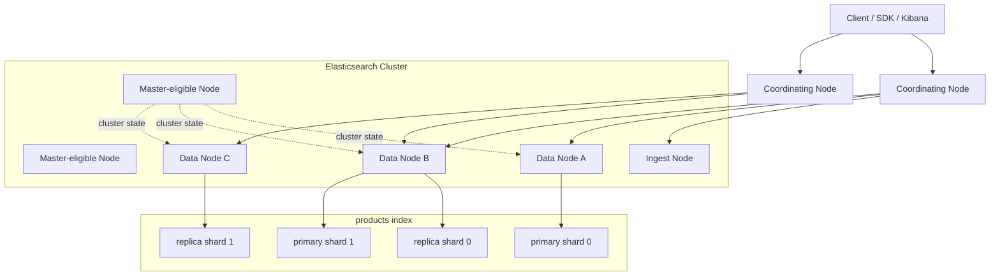
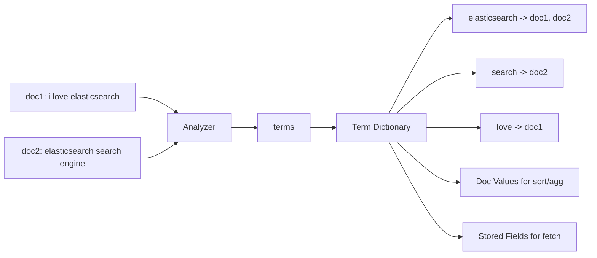
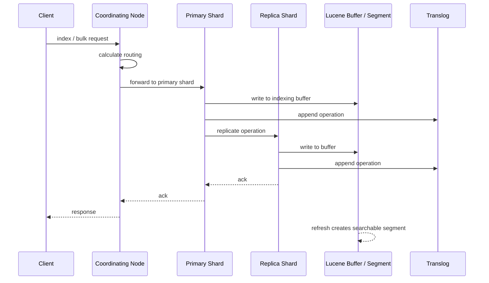

# 图解 ES 核心原理

## 1. 这一章解决什么问题

很多人第一次使用 Elasticsearch 时，会把它理解成“能做全文检索的数据库”：建索引、写文档、查文档，一切看起来都像 CRUD。但真正进入生产之后，问题会变得更具体：为什么刚写入的数据有时搜索不到？为什么分片越多不一定越快？为什么同一个查询在不同节点上耗时差很多？为什么更新一条文档背后可能产生删除标记和新的 segment？

这一章不急着钻进单个 API，而是先用一张整体地图把 ES 的核心原理串起来：ES 如何站在 Lucene 之上提供分布式能力，索引、分片、副本、节点之间是什么关系，倒排索引、segment、refresh、translog、merge 又如何影响读写链路。后面的写入、读取、倒排索引章节，都会从这张地图继续展开。

## 2. 核心概念

### 2.1 ES 与 Lucene 的分工

Lucene 是一个单机搜索库，负责倒排索引、segment 存储、相关性评分、排序、列式字段存储等底层能力。Elasticsearch 则把 Lucene 包装成分布式搜索引擎，提供 REST API、集群管理、分片路由、副本同步、索引生命周期、安全权限、监控运维等能力。

可以粗略理解为：

| 层次 | 主要职责 | 典型对象 |
|---|---|---|
| Elasticsearch 集群层 | 节点发现、主节点选举、索引元数据、分片分配、REST API、权限与运维 | cluster、node、index、shard、replica |
| Elasticsearch 执行层 | 路由、协调节点、写入复制、查询合并、聚合归并、bulk、scroll、PIT | coordinating node、primary shard、replica shard |
| Lucene 存储与检索层 | 倒排索引、segment、term dictionary、posting list、doc values、BM25 | segment、term、posting、stored fields |

### 2.2 集群、节点、索引、分片

- Cluster：一组共同工作的 ES 节点，持有统一的集群状态。
- Node：运行中的 ES 实例，可以承担 master-eligible、data、ingest、coordinating、machine learning 等角色。
- Index：逻辑数据集合，类似搜索领域中的“文档集合”，但不是关系型数据库的表。
- Shard：索引的物理拆分单元，每个 shard 本质上是一个 Lucene index。
- Primary shard：主分片，写入请求必须先落到主分片。
- Replica shard：副本分片，用于容灾和分担读请求，不能和对应主分片分配在同一节点上。
- Segment：Lucene 的不可变小索引文件集合，是 ES 近实时搜索能力的关键。

### 2.3 近实时搜索

ES 不是每写入一条文档就立刻让它被搜索到。写入先进入内存 buffer 和 translog，随后通过 refresh 生成新的 segment 并打开 searcher，数据才对搜索可见。默认情况下，常见索引的 `refresh_interval` 为 1 秒左右，因此 ES 被称为 near real-time search，也就是近实时搜索。

这里要区分三个概念：

- refresh：让内存中的新文档变成可搜索的 segment，通常不等于持久化到磁盘。
- flush：提交 Lucene commit point，并裁剪 translog，使恢复成本可控。
- merge：把多个小 segment 合并成较大的 segment，清理删除标记，减少查询开销。

## 3. 原理总览图

### 3.1 集群拓扑



在 ES 中，任何节点都可以接收客户端请求。接收请求的节点会成为 coordinating node，负责解析请求、根据路由找到目标分片、分发子请求、合并结果并返回给客户端。生产环境中也可以部署专门的协调节点，避免重查询、重聚合请求挤占数据节点资源。

### 3.2 从文档到倒排索引



全文检索的核心不是逐行扫描文档，而是把字段内容经过 analyzer 处理成 term，再建立 term 到文档列表的映射。term dictionary 用来快速定位词项，posting list 记录包含该词项的文档及词频、位置等信息。排序、聚合通常依赖 doc values，返回原文则依赖 stored fields 或 `_source`。

### 3.3 写入与搜索的生命周期



写入成功不等于立刻能被搜索到。只要主分片和所需副本写入成功，客户端就可以收到响应；但搜索可见性要等 refresh。实时 GET by id 可以从 translog 或内存中取到最新版本，因此它和 search 的可见性语义并不完全相同。

## 4. 关键机制拆解

### 4.1 节点角色

ES 8.x 中节点角色更加细分，常见角色包括：

- master-eligible：参与主节点选举，维护集群状态。
- data：存储分片并执行读写请求，细分为 hot、warm、cold、frozen、content 等数据层角色。
- ingest：执行 ingest pipeline，例如解析日志、补字段、geoip、grok。
- coordinating：没有专门角色名，任何节点都可协调请求；如果一个节点不承担 master/data/ingest 等角色，通常可作为专用协调节点。
- ml、transform、remote_cluster_client：用于机器学习、转换任务和跨集群访问。

主节点不是所有请求的入口，也不负责每条数据的读写。它更像集群元数据的管理者，负责索引创建、分片分配、节点上下线感知等控制面工作。把大量查询请求打到 master 节点，是生产环境中很常见的误用。

### 4.2 分片不是越多越好

分片是 ES 水平扩展的基础，但分片也有固定成本：

- 每个 shard 都是一个 Lucene index，会占用文件句柄、堆内存、缓存和线程调度成本。
- 查询会被 fan out 到多个 shard，分片越多，协调节点合并结果的压力越大。
- 小分片过多会产生大量小 segment，增加 merge 和查询开销。
- 单个 shard 过大又会导致恢复慢、迁移慢、热点难治理。

实践中需要结合数据量、查询模式、写入速率和生命周期规划分片。日志类索引通常通过 rollover 控制单分片大小；业务搜索索引更关注路由、热点字段和查询范围。

### 4.3 分片路由

默认情况下，文档会根据 `_id` 或自定义 routing 路由到某个主分片：

```text
target_shard = hash(routing) % number_of_primary_shards
```

如果业务天然按租户、店铺、用户、订单域隔离查询，可以考虑显式 routing，让相关数据落在同一分片，从而减少查询 fan out。但 routing 会带来热点风险：一个大租户可能把单个 shard 打爆，所以它更适合数据分布相对均匀、查询强绑定的场景。

### 4.4 一致性与可见性

ES 的一致性模型可以分成三个层面理解：

- 写入确认：由 primary 和 replica 的复制确认决定，可以通过 `wait_for_active_shards` 控制写入前需要多少活跃分片。
- 搜索可见：由 refresh 决定，默认近实时，而不是强实时。
- 并发冲突：通过 `_seq_no` 和 `_primary_term` 做乐观并发控制，避免旧版本覆盖新版本。

一个典型误区是：接口返回 201 Created 后马上用 search 查不到，就认为写入失败。实际可能只是还没 refresh。需要强制读到最新结果时，可以使用 `refresh=wait_for`，但高频使用会牺牲写入吞吐。

## 5. 使用示例

### 5.1 查看集群和分片

```bash
GET _cluster/health
GET _cat/nodes?v
GET _cat/indices?v
GET _cat/shards/products?v
```

### 5.2 创建一个更接近生产的索引

```json
PUT products-v1
{
  "settings": {
    "number_of_shards": 3,
    "number_of_replicas": 1,
    "refresh_interval": "1s"
  },
  "mappings": {
    "properties": {
      "title": {
        "type": "text",
        "fields": {
          "keyword": {
            "type": "keyword",
            "ignore_above": 256
          }
        }
      },
      "category_id": { "type": "keyword" },
      "price": { "type": "scaled_float", "scaling_factor": 100 },
      "created_at": { "type": "date" }
    }
  }
}
```

### 5.3 观察 segment

```bash
GET products-v1/_segments
GET _cat/segments/products-v1?v
```

如果持续 bulk 写入，会看到 segment 数量先增加，随后后台 merge 把小 segment 合并。查询变慢、磁盘 IO 升高、CPU 被 merge 占用时，`_cat/segments` 是很值得看的入口。

## 6. 工程取舍

### 6.1 写入吞吐与搜索实时性

`refresh_interval` 越短，搜索越接近实时，但会产生更多小 segment，增加写入和 merge 成本。日志、指标这类高吞吐场景，常见做法是写入高峰期调大 refresh interval，甚至临时设置为 `-1`，批量导入完成后再手动 refresh。

### 6.2 副本数与资源成本

副本可以提升可用性和读吞吐，但也会放大写入成本。写入请求必须复制到副本，副本越多，写入链路越长，占用磁盘也越多。生产环境至少需要 1 个副本，但离线导入、临时重建索引时可以先设为 0，导入后再恢复副本。

### 6.3 routing 与热点

显式 routing 可以降低查询成本，但它把扩展性的一部分交给业务键分布。如果 routing key 不均匀，热点 shard 会拖慢整个索引。大型多租户系统通常需要给大租户单独索引、单独 routing 策略，或者做租户拆分。

## 7. 常见坑

- 把 ES 当强事务数据库使用：ES 更适合搜索和分析，不适合复杂事务、跨文档强一致更新。
- 主分片数随手设置：主分片数创建后不能直接修改，只能 split、shrink 或 reindex，需要提前规划。
- 忽略 `_source` 成本：保留 `_source` 便于返回、更新、重建索引，但会占用磁盘；禁用前要非常谨慎。
- 查询所有分片：没有 routing、没有时间范围、没有索引别名裁剪的查询，会放大协调节点压力。
- 小 segment 过多：频繁 refresh、小批量写入、索引过多都可能导致 segment 数量失控。
- 把 master 节点当业务入口：重查询和 bulk 写入应避免打到专用 master 节点。

## 8. 小结

- ES 的核心能力来自 Lucene，分布式能力来自 ES 的集群、分片、路由和副本机制。
- 一个 shard 本质上是一个 Lucene index，segment 是 Lucene 检索与存储的基本单位。
- 写入成功、GET 可见、search 可见是三个不同层面的事情。
- refresh 决定近实时可见性，flush 控制提交点与 translog，merge 影响长期查询和磁盘效率。
- 分片可以扩展容量和并发，但过多分片会带来协调、内存、文件和 merge 成本。
- routing 是强力优化手段，也可能制造热点，需要结合业务键分布使用。
- 理解 ES 原理的目的不是背术语，而是能在写入、查询、扩容、排障时判断代价在哪里。
