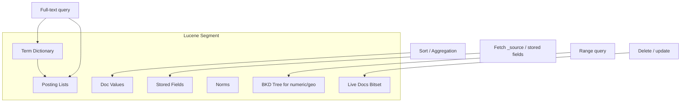
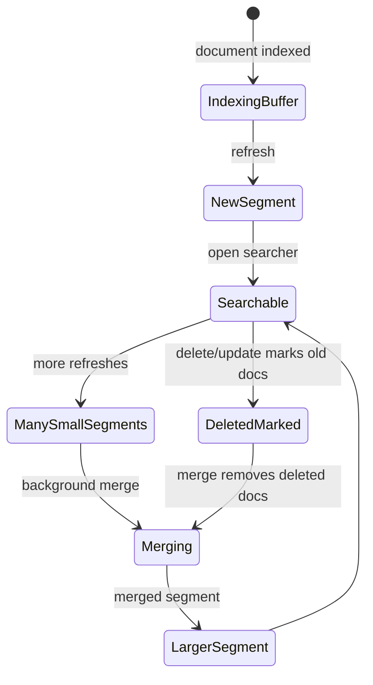

# 倒排索引与 Lucene 段机制

## 1. 这一章解决什么问题

如果只从 API 层看 Elasticsearch，`match`、`term`、`range`、`sort`、`terms aggregation` 都只是不同的查询语法。但在底层，它们依赖的数据结构完全不同：全文检索依赖倒排索引，排序和聚合主要依赖 doc values，文档返回依赖 stored fields 或 `_source`，近实时搜索依赖 segment。

这一章聚焦 Lucene 的存储和检索模型。理解倒排索引之后，很多 ES 现象会变得直观：为什么 `text` 字段不能直接做精确聚合？为什么 wildcard 前缀通配很慢？为什么更新文档不是原地修改？为什么 refresh 过于频繁会影响写入？为什么 force merge 不是万能加速按钮？

## 2. 核心概念

### 2.1 正排索引与倒排索引

正排索引是“文档 -> 字段内容”的视角，适合按 id 读取文档。倒排索引是“词项 -> 文档集合”的视角，适合通过关键词找文档。

例如有三条商品标题：

| doc_id | title |
|---|---|
| 1 | apple iphone phone case |
| 2 | samsung phone charger |
| 3 | apple watch charger |

倒排索引可以表示为：

| term | posting list |
|---|---|
| apple | 1, 3 |
| phone | 1, 2 |
| charger | 2, 3 |
| iphone | 1 |
| samsung | 2 |
| watch | 3 |

搜索 `apple phone` 时，Lucene 不需要扫描所有文档，而是找到 `apple` 和 `phone` 的 posting list，再做求交、求并、评分和排序。

### 2.2 term dictionary

term dictionary 保存字段中出现过的所有 term，并支持快速查找。实际实现不会是简单的 HashMap，因为词项数量可能非常大，且需要按字典序进行前缀、范围、自动机等操作。Lucene 常用 FST 等紧凑结构减少内存占用，并通过磁盘文件承载大量 term 数据。

term dictionary 解决的是“有没有这个词、这个词在哪里”的问题。

### 2.3 posting list

posting list 记录某个 term 出现在哪些文档中，以及可选的词频、位置、偏移等信息。不同查询会用到不同信息：

- term query：主要需要 doc id 列表。
- match query：需要多个 term 的 posting list，并结合 BM25 评分。
- phrase query：需要位置信息判断短语是否连续。
- highlight：可能需要 offsets 或重新分析原文。

posting list 解决的是“哪些文档命中了这个词、命中得怎么样”的问题。

### 2.4 doc values

doc values 是面向列的磁盘数据结构，主要服务排序、聚合和脚本访问。它和倒排索引方向相反，更像：

```text
price: doc1 -> 1999, doc2 -> 299, doc3 -> 899
brand: doc1 -> apple, doc2 -> samsung, doc3 -> apple
```

对 `keyword`、数值、日期、boolean、ip 等字段，doc values 默认开启。对 `text` 字段通常不适合开启 doc values；如果要对文本做聚合或排序，应使用 `.keyword` 子字段或单独建模。

### 2.5 segment

segment 是 Lucene 的不可变索引片段。新文档写入后，refresh 会生成新的 segment；更新和删除不会原地改旧 segment，而是追加新文档并给旧文档打删除标记。后台 merge 会把多个小 segment 合并为大 segment，并清理删除文档。

不可变 segment 带来的收益是读路径简单、缓存友好、并发安全；代价是更新删除会产生额外空间和后台 merge 压力。

## 3. 原理拆解

### 3.1 从文本到倒排索引


一个 `text` 字段写入时，会经过 analyzer：

- character filter：预处理字符，例如 HTML 清理、字符替换。
- tokenizer：把字符串切分成 token，例如 standard tokenizer、ik tokenizer。
- token filter：小写化、停用词、同义词、词干化等。

查询时，如果使用 `match`，查询文本也会经过 analyzer；如果使用 `term`，查询值不会被分析，会直接拿原始 term 去匹配倒排索引。这就是为什么用 `term` 查 `text` 字段经常查不到：索引里可能存的是小写、分词后的 token，而不是原字符串。

### 3.2 Lucene 内部存储视角



几个常被混淆的结构：

- inverted index：服务全文和 term 级检索。
- doc values：服务排序、聚合和脚本。
- stored fields：服务按文档取回字段，`_source` 也是以 stored field 形式保存。
- norms：保存长度归一化等评分相关信息。
- BKD tree：服务数值、日期、地理位置等范围查询。
- live docs：标记哪些 doc 仍然有效，删除和更新都会影响它。

### 3.3 Segment 生命周期



segment 不可变，所以 ES 可以让旧 searcher 继续读旧 segment，新 searcher 打开新 segment。这也是 ES 可以高并发搜索的基础。但代价也明显：高频 refresh 会产生大量小 segment；大量更新删除会积累删除标记；merge 会消耗 CPU、磁盘 IO 和临时磁盘空间。

### 3.4 更新为什么像删除再新增

在 Lucene 中，文档不能原地更新。ES 的 update API 看起来像局部更新，底层通常会：

1. 读取旧文档 `_source`。
2. 执行脚本或合并 partial document。
3. 将旧文档标记删除。
4. 写入一条新文档。

这意味着频繁更新大文档会带来明显成本：读取 `_source`、重新分析字段、写新 segment、积累删除标记、触发 merge。对高频变更字段，常见策略是拆分冷热字段，把高频变化数据放在独立索引或外部 KV/数据库中。

## 4. 使用示例

### 4.1 查看 analyzer 结果

```json
POST _analyze
{
  "analyzer": "standard",
  "text": "The Quick Brown Fox jumps over Elasticsearch"
}
```

中文检索需要特别关注 analyzer。默认 standard analyzer 对中文常常不能满足业务语义，需要结合 IK、jieba、smartcn、Nori 或自定义词典方案。

### 4.2 text 与 keyword 双字段建模

```json
PUT article-demo
{
  "mappings": {
    "properties": {
      "title": {
        "type": "text",
        "analyzer": "standard",
        "fields": {
          "keyword": {
            "type": "keyword",
            "ignore_above": 256
          }
        }
      },
      "tags": {
        "type": "keyword"
      },
      "publish_time": {
        "type": "date"
      }
    }
  }
}
```

`title` 用于全文检索，`title.keyword` 用于精确过滤、排序或聚合。这个建模模式非常常见，也是避免误用 `fielddata` 的关键。

### 4.3 查看 segment 和删除比例

```bash
GET article-demo/_segments
GET _cat/segments/article-demo?v
```

如果某些 segment 的 deleted docs 比例很高，说明更新删除较多。短期内这是正常现象，后台 merge 会逐步清理；如果长期堆积，需要检查写入模式、merge 压力、磁盘 IO 和 refresh 策略。

## 5. 工程取舍

### 5.1 text、keyword 与 fielddata

`text` 字段默认适合全文检索，不适合聚合和排序。如果强行对 `text` 开启 fielddata，ES 会把倒排结构加载到堆内存中构造列式视图，极易造成 heap 飙升。生产中更推荐为需要聚合/排序的字段建 `keyword` 子字段。

### 5.2 doc values 的成本

doc values 默认保存在磁盘上，排序和聚合时通过文件系统缓存受益。它减少了堆内存压力，但不是免费午餐：每个开启 doc values 的字段都会增加磁盘占用。对完全不参与排序、聚合、脚本的字段，可以评估关闭 doc values。

### 5.3 `_source` 是否禁用

禁用 `_source` 可以节省磁盘，但会影响 update、reindex、高亮、调试、数据恢复和未来重建能力。多数业务不建议禁用 `_source`，更常见的优化是使用 source filtering 控制返回字段，或压缩存储。

### 5.4 merge 与 force merge

force merge 可以减少 segment 数量，在只读索引上可能提升查询效率并节省空间。但它非常消耗 IO，且对仍在写入的索引可能适得其反：刚合并完又继续产生新 segment。生产中通常只对冷数据、只读索引、低峰期执行 force merge。

## 6. 常见坑

- 用 `term` 查询 `text` 字段：查询值不分词，容易和索引 term 对不上。
- 对高基数字段随意做 terms 聚合：即使有 doc values，也会消耗大量内存和网络归并成本。
- 打开 fielddata 解决排序问题：短期能跑，长期容易引发内存故障。
- 高频 refresh：数据更快可搜，但小 segment 数量增加，写入吞吐下降。
- 误以为删除马上释放磁盘：删除只是标记，真正释放依赖 merge。
- 对热写入索引 force merge：容易和正常写入、merge 抢 IO。
- 忽略 keyword 的 `ignore_above`：过长字符串不会进入 keyword 子字段，聚合或过滤结果可能“少数据”。

## 7. 实战排查清单

当遇到“查询慢、写入慢、磁盘涨得快”时，可以按下面顺序检查：

1. 看 segment 数量：`GET _cat/segments/index?v`。
2. 看 refresh 设置：`GET index/_settings`。
3. 看字段 mapping：是否误用 `text` 聚合、是否开启 fielddata。
4. 看删除比例：`_segments` 中 deleted docs 是否长期偏高。
5. 看 merge 压力：节点 stats、hot threads、磁盘 IO。
6. 看查询 profile：确认慢在 term 查找、排序、聚合还是 fetch。

## 8. 小结

- 倒排索引解决“通过词找文档”，term dictionary 和 posting list 是核心结构。
- doc values 解决“按字段列式访问”，主要服务排序、聚合和脚本。
- stored fields 和 `_source` 解决“把文档取回来”，不要和倒排索引混为一谈。
- segment 不可变是 Lucene 高并发读的基础，也是更新删除成本的来源。
- refresh 生成可搜索 segment，merge 合并 segment 并清理删除标记。
- 建模时要明确每个字段的用途：检索、过滤、排序、聚合、返回，避免一个字段承担所有职责。
