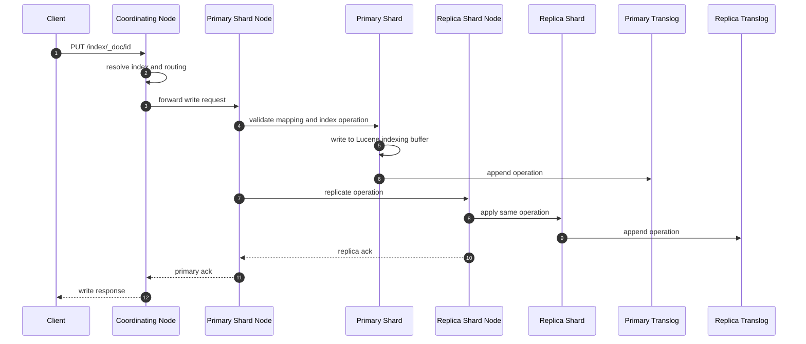
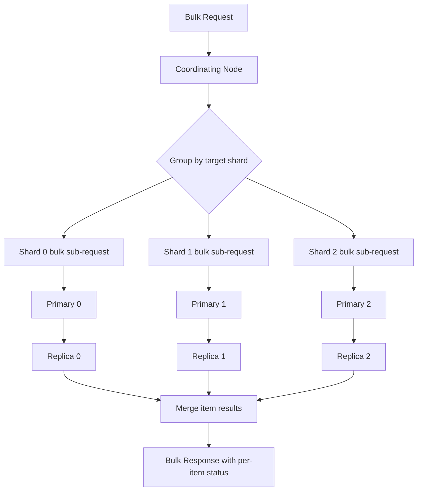
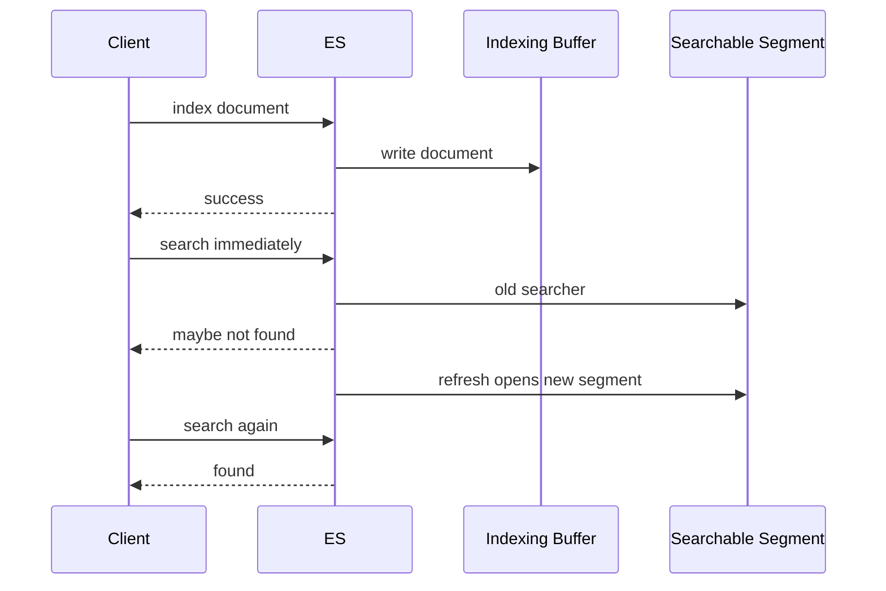

# ES 写入文档流程详解

## 1. 这一章解决什么问题

写入 Elasticsearch 看起来只是一个简单请求：`POST index/_doc/1`。但在分布式系统里，一条文档从客户端到真正可搜索，需要经历协调节点、路由计算、主分片写入、副本复制、translog 追加、refresh、flush、merge 等多个阶段。

理解写入链路之后，才能解释这些生产问题：为什么 bulk 有时成功一部分失败一部分？为什么写入返回成功但搜索不到？为什么调大 refresh interval 能提升吞吐？为什么副本越多写入越慢？为什么 translog 太大会影响恢复？为什么同一个索引某个 shard 写入特别慢？

## 2. 核心概念

### 2.1 coordinating node

客户端请求到达的节点就是协调节点。它负责解析请求、确认目标索引、根据 routing 找到主分片所在节点、转发请求，并在主副本完成后汇总响应。bulk 写入时，协调节点还要把一批操作按目标 shard 拆分成多个子请求。

### 2.2 routing

ES 通过 routing 决定文档进入哪个主分片。默认 routing 值是 `_id`，也可以由业务显式指定：

```text
shard = hash(routing) % number_of_primary_shards
```

显式 routing 可以让同一租户、同一店铺、同一用户的数据落在同一分片，减少查询 fan out；但如果 key 分布不均，会导致热点分片。

### 2.3 primary 与 replica

写入必须先到 primary shard。primary 写入成功后，会把操作复制到 replica shard。只有主分片和要求的副本完成后，客户端才收到成功响应。`number_of_replicas` 越高，可用性和读扩展越好，但写入成本也越高。

### 2.4 translog

translog 是事务日志。文档写入 Lucene 内存 buffer 后，还会追加到 translog。即使还没有 flush 成 Lucene commit，节点异常重启后也可以通过 translog 重放恢复最近写入。

translog 关注的是“已确认写入如何恢复”，refresh 关注的是“写入何时可搜索”，两者不是一回事。

### 2.5 refresh、flush、merge

- refresh：把内存 buffer 中的数据打开为新的可搜索 segment。
- flush：执行 Lucene commit，生成稳定提交点，并清理旧 translog。
- merge：后台合并小 segment，清理删除标记，优化长期检索效率。

## 3. 写入流程

### 3.1 单文档写入时序



写入链路中的几个关键点：

1. mapping 校验、动态字段推断、ingest pipeline 处理可能发生在真正写入前。
2. primary 是写入顺序的权威，负责分配 sequence number。
3. replica 应用 primary 发来的同一操作，保持与主分片一致。
4. 返回成功说明操作已被主分片和要求的副本确认，不代表已经 refresh。

### 3.2 Bulk 写入流程



bulk 的响应不是简单成功或失败，而是每个 item 都有状态。生产代码必须检查 `errors: true` 和每条 item 的失败原因，不能只看 HTTP 状态码。常见失败包括 mapping 冲突、版本冲突、队列拒绝、主分片不可用、文档过大等。

### 3.3 refresh 后才可搜索



如果业务要求写入后马上搜索可见，有三种常见方案：

- 请求带 `refresh=wait_for`：等待下一次 refresh 后返回，适合低频强可见写入。
- 请求带 `refresh=true`：立即 refresh，成本更高，不适合高频写入。
- 读写分离语义：写后按 id 用 GET 查详情，搜索结果接受近实时延迟。

## 4. 写入相关配置与示例

### 4.1 创建索引时设置写入参数

```json
PUT orders-write-demo
{
  "settings": {
    "number_of_shards": 3,
    "number_of_replicas": 1,
    "refresh_interval": "5s",
    "index.translog.durability": "request"
  },
  "mappings": {
    "properties": {
      "tenant_id": { "type": "keyword" },
      "order_id": { "type": "keyword" },
      "amount": { "type": "scaled_float", "scaling_factor": 100 },
      "status": { "type": "keyword" },
      "created_at": { "type": "date" }
    }
  }
}
```

`index.translog.durability` 常见值：

- `request`：每次请求成功前尽量 fsync translog，可靠性更高，写入成本更高。
- `async`：周期性 fsync，吞吐更好，但异常断电时可能丢失最近一小段已确认写入。

金融、订单等关键数据不应轻易使用 `async`；日志、埋点等可重放数据可以在明确风险后评估。

### 4.2 Bulk 示例

```json
POST _bulk
{ "index": { "_index": "orders-write-demo", "_id": "o-1", "routing": "tenant-a" } }
{ "tenant_id": "tenant-a", "order_id": "o-1", "amount": 19900, "status": "paid", "created_at": "2026-05-25T10:00:00+08:00" }
{ "index": { "_index": "orders-write-demo", "_id": "o-2", "routing": "tenant-a" } }
{ "tenant_id": "tenant-a", "order_id": "o-2", "amount": 9900, "status": "created", "created_at": "2026-05-25T10:01:00+08:00" }
```

bulk 调优要关注三个维度：

- 单批大小：常见从 5MB 到 15MB 起步压测，而不是固定多少条。
- 并发数：以节点 CPU、IO、线程池拒绝率和延迟为准。
- 错误处理：对 429、503 等可重试错误做指数退避，对 mapping 错误直接进入死信队列。

### 4.3 写后可见

```json
PUT orders-write-demo/_doc/o-3?refresh=wait_for&routing=tenant-a
{
  "tenant_id": "tenant-a",
  "order_id": "o-3",
  "amount": 5200,
  "status": "paid",
  "created_at": "2026-05-25T10:03:00+08:00"
}
```

`refresh=wait_for` 比 `refresh=true` 更温和，它等待已有 refresh 周期，而不是每次都强制产生新 segment。但如果大量请求都使用它，仍然会增加请求等待和 refresh 压力。

## 5. 并发控制

### 5.1 seq_no 与 primary_term

ES 使用 `_seq_no` 和 `_primary_term` 做乐观并发控制。读取文档时拿到这两个值，更新时带回去：

```json
PUT orders-write-demo/_doc/o-1?if_seq_no=10&if_primary_term=3
{
  "tenant_id": "tenant-a",
  "order_id": "o-1",
  "amount": 19900,
  "status": "refunded",
  "created_at": "2026-05-25T10:00:00+08:00"
}
```

如果文档已被其他请求更新，seq_no 不匹配，请求会失败。这样可以避免“后提交的旧数据覆盖新数据”。

### 5.2 外部版本

如果上游数据库或消息系统已有严格递增版本，也可以使用 external version。但要确保版本单调递增，否则会产生难排查的数据覆盖问题。多数业务优先使用 ES 内置的 seq_no/primary_term。

## 6. 工程取舍

### 6.1 refresh_interval 怎么调

- 搜索体验要求高：保持默认 1s 或使用 `refresh=wait_for` 处理少量关键写入。
- 高吞吐导入：临时设置 `refresh_interval=-1`，导入完成后恢复并手动 refresh。
- 日志写入：可设置 5s、10s、30s，根据可见性要求和吞吐压测确定。

```json
PUT orders-write-demo/_settings
{
  "index": {
    "refresh_interval": "10s"
  }
}
```

### 6.2 副本数怎么调

批量导入新索引时，常见做法：

1. 创建索引，`number_of_replicas=0`，调大 refresh interval。
2. bulk 导入。
3. 恢复 `number_of_replicas=1` 或更多。
4. 手动 refresh，必要时对只读索引 force merge。
5. 用 alias 切流。

这个策略可以显著提升重建速度，但导入期间容灾能力下降，只适合可重建数据或受控迁移窗口。

### 6.3 routing 是否使用

适合显式 routing 的场景：

- 查询几乎总是带租户、用户、店铺等固定维度。
- routing key 分布相对均匀。
- 单 key 数据量不会无限增长。

不适合的场景：

- 查询经常跨所有租户。
- 少数大客户数据远超其他客户。
- 未来需要灵活扩容单个 routing key。

## 7. 常见坑

- bulk 不检查 item 级错误：导致一部分数据悄悄失败。
- 写入后立刻 search 验证：误把 refresh 延迟当成写入失败。
- 动态 mapping 放任不管：字段类型被第一条脏数据推错，后续写入持续失败。
- refresh 设置过短：小 segment 暴增，merge 压力升高。
- 副本过多：读吞吐上去了，写入延迟和磁盘成本也一起上去。
- 热点 routing：单个分片 CPU、IO、队列爆满，其他分片很空。
- 文档过大：ES 不适合存储巨型 JSON，fetch、merge、网络传输都会受影响。
- update 高频改大文档：底层重写整篇文档，不是原地 patch。

## 8. 写入排障清单

### 8.1 看线程池和拒绝

```bash
GET _cat/thread_pool/write?v
GET _nodes/stats/thread_pool
```

如果出现 write rejected，说明写入请求超过节点处理能力。需要降低并发、调整 bulk 大小、扩容数据节点，或检查磁盘 IO、merge 压力。

### 8.2 看 translog 与 flush

```bash
GET orders-write-demo/_stats?filter_path=indices.*.total.translog,indices.*.total.flush
```

translog 过大时，节点恢复会变慢。需要关注 flush 频率、磁盘性能和写入峰值。

### 8.3 看 indexing 与 merge

```bash
GET orders-write-demo/_stats/indexing,merge,refresh,segments
GET _nodes/hot_threads
```

如果 merge 占用明显，可能是 refresh 太频繁、小批量写太多、更新删除比例高或磁盘 IO 不足。

## 9. 小结

- 写入请求先到协调节点，再根据 routing 转发到目标主分片。
- primary shard 是写入顺序和 seq_no 的权威，replica 复制 primary 的操作。
- translog 保障异常恢复，refresh 保障搜索可见，flush 保障提交点与 translog 裁剪。
- bulk 必须按 item 处理结果，不能只看 HTTP 状态码。
- refresh_interval、副本数、bulk 大小、并发数是写入吞吐的主要调优旋钮。
- 显式 routing 可以优化局部查询，也可能制造热点。
- 高频更新本质上是删除旧文档并新增文档，要把它当成高成本写入来设计。
