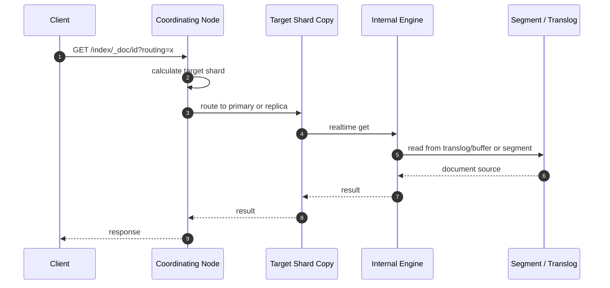
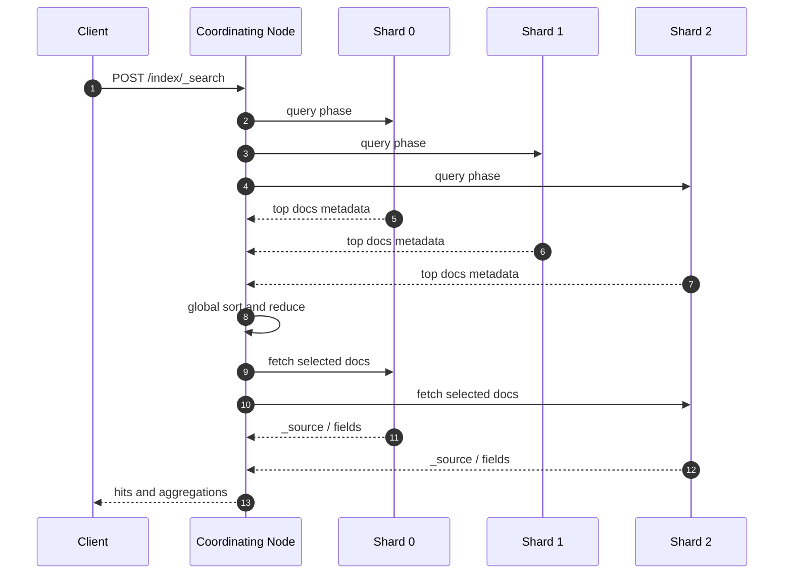

# ES 读取与搜索流程详解

## 1. 这一章解决什么问题

读取 Elasticsearch 有两类典型路径：按 `_id` 获取单篇文档，以及通过 query DSL 搜索一批文档。前者更像 KV 读取，后者是分布式搜索和归并。很多线上问题都发生在这两者被混用的时候：写入后 GET 能查到但 search 查不到，深分页把集群打慢，排序字段没建好导致内存暴涨，聚合请求在协调节点上耗尽资源。

这一章重点拆解 GET、search 的执行流程，尤其是 search 的 query phase 和 fetch phase。同时补充分页、routing、preference、DFS query then fetch、search_after、PIT 等生产实践。

## 2. 核心概念

### 2.1 GET by id

GET by id 根据 `_id` 和 routing 直接定位到目标分片，然后读取文档。它不需要在所有分片上执行搜索，也不依赖相关性评分。实时 GET 可以看到还没 refresh 的最新写入，因此它的可见性通常强于 search。

### 2.2 Search

search 是分布式查询。协调节点会把查询请求分发到相关分片，每个分片本地执行查询、排序、聚合，然后协调节点合并 top hits 和聚合结果。search 默认只看已 refresh 的 segment，因此是近实时。

### 2.3 Query phase

query phase 负责在每个 shard 上执行查询，计算匹配文档、评分、排序，并返回轻量结果，例如 doc id、score、sort values。协调节点把所有 shard 返回的候选结果归并，得到全局 top N。

### 2.4 Fetch phase

fetch phase 根据 query phase 选出的 doc id，到对应 shard 取回 `_source`、stored fields、highlight、script fields 等完整内容。fetch phase 经常被低估：如果返回字段很大、highlight 很重、分页很深，fetch 也会成为瓶颈。

### 2.5 PIT 与 search_after

`from/size` 适合浅分页，不适合深分页。深分页会要求每个 shard 维护并返回大量候选结果。`search_after` 基于上一页最后一条的排序值继续向后翻，配合 PIT 可以在多次请求之间保持一致的搜索视图，是现代 ES 深分页和游标式翻页的常用方案。

## 3. GET 读取流程



GET by id 的性能关键在于路由。如果创建文档时用了自定义 routing，读取时也必须带同样 routing，否则 ES 可能找错分片并返回 not found。

```bash
GET orders-write-demo/_doc/o-1?routing=tenant-a
```

## 4. Search 执行流程

### 4.1 Query then fetch



默认 search 类型是 query then fetch。它分两阶段：

1. Query phase：各 shard 找出本地 top K。
2. Fetch phase：协调节点根据全局 top K 回源取完整文档。

这里的 K 不是只等于 `size`。如果使用 `from=1000&size=20`，每个 shard 通常都要返回前 1020 条候选，协调节点再归并丢弃前 1000 条。这就是深分页昂贵的根源。

### 4.2 DFS query then fetch

默认相关性评分在每个 shard 本地计算词频、文档频率等统计信息。小数据、多分片时，同一个 term 在不同 shard 的分布差异可能导致评分略有偏差。`dfs_query_then_fetch` 会先收集全局词频统计，再执行查询，评分更一致，但多了一轮请求，延迟更高。

```json
GET products-v1/_search?search_type=dfs_query_then_fetch
{
  "query": {
    "match": {
      "title": "wireless mouse"
    }
  }
}
```

生产中只有在相关性排序对一致性非常敏感、且数据规模或分片分布导致明显偏差时，才考虑使用 DFS。

## 5. 搜索示例

### 5.1 带过滤、排序和字段裁剪的查询

```json
GET orders-write-demo/_search
{
  "track_total_hits": false,
  "_source": ["order_id", "tenant_id", "amount", "status", "created_at"],
  "query": {
    "bool": {
      "filter": [
        { "term": { "tenant_id": "tenant-a" } },
        { "range": { "created_at": { "gte": "now-7d/d" } } }
      ],
      "must": [
        { "term": { "status": "paid" } }
      ]
    }
  },
  "sort": [
    { "created_at": "desc" },
    { "_id": "desc" }
  ],
  "size": 20
}
```

几个实践点：

- 精确条件放到 filter context，避免不必要评分并有机会使用缓存。
- 排序字段使用 keyword、date、numeric 等具备 doc values 的字段。
- 使用 `_source` 过滤减少 fetch 和网络传输。
- 不需要精确总数时设置 `track_total_hits: false` 或限制统计阈值。

### 5.2 使用 routing 缩小查询范围

```json
GET orders-write-demo/_search?routing=tenant-a
{
  "query": {
    "bool": {
      "filter": [
        { "term": { "tenant_id": "tenant-a" } },
        { "term": { "status": "paid" } }
      ]
    }
  }
}
```

如果写入时按 `tenant_id` routing，查询时也带 routing，可以只打到目标 shard，而不是 fan out 到所有 shard。这对多租户系统很有价值，但前提是 routing 策略没有制造热点。

## 6. 分页机制

### 6.1 from/size 的边界

`from/size` 简单直观，适合前几页：

```json
GET orders-write-demo/_search
{
  "from": 0,
  "size": 20,
  "query": {
    "term": {
      "tenant_id": "tenant-a"
    }
  },
  "sort": [
    { "created_at": "desc" },
    { "_id": "desc" }
  ]
}
```

但深分页代价很高。假设 20 个 shard，`from=10000&size=20`，每个 shard 都可能需要返回 10020 条候选，协调节点要归并最多 200400 条候选，只为返回 20 条。默认 `index.max_result_window` 是为了防止这种请求拖垮集群。

### 6.2 search_after

`search_after` 使用上一页最后一条命中的 sort values 作为游标：

```json
GET orders-write-demo/_search
{
  "size": 20,
  "query": {
    "term": {
      "tenant_id": "tenant-a"
    }
  },
  "sort": [
    { "created_at": "desc" },
    { "_id": "desc" }
  ],
  "search_after": ["2026-05-25T10:03:00.000+08:00", "o-3"]
}
```

要求：

- sort 顺序稳定。
- 最后加一个唯一字段作为 tie breaker，常见用 `_id` 的 keyword 拷贝字段，或使用 PIT 返回的 `_shard_doc`。
- 不支持随机跳页，只适合“下一页”式翻页。

### 6.3 PIT 保持一致视图

没有 PIT 时，多页查询之间可能发生 refresh，新写入或删除的文档会改变排序结果，导致重复或漏数据。PIT 可以打开一个 point in time，后续请求在同一个搜索视图中翻页。

```json
POST orders-write-demo/_pit?keep_alive=1m
```

返回：

```json
{
  "id": "PIT_ID"
}
```

分页查询：

```json
GET /_search
{
  "size": 20,
  "pit": {
    "id": "PIT_ID",
    "keep_alive": "1m"
  },
  "query": {
    "term": {
      "tenant_id": "tenant-a"
    }
  },
  "sort": [
    { "created_at": "desc" },
    { "_shard_doc": "desc" }
  ]
}
```

关闭 PIT：

```json
DELETE /_pit
{
  "id": "PIT_ID"
}
```

PIT 不是免费资源。它会延长旧 segment 的生命周期，因此需要合理设置 `keep_alive`，并在结束后关闭。

## 7. 工程取舍

### 7.1 preference 的作用

`preference` 可以控制查询选择哪些 shard copy，常用于提升分页稳定性或缓存命中：

```bash
GET products-v1/_search?preference=user-123
```

同一个 preference 会尽量路由到相同 shard copy，有助于利用 request cache、减少同一用户翻页时结果抖动。但它不是强一致保证，不能替代 PIT。

### 7.2 track_total_hits 的成本

精确统计总命中数可能很贵，尤其是宽泛查询。对于列表页，很多时候只需要知道“是否还有下一页”，不需要精确总数。可以设置：

```json
{
  "track_total_hits": 10000
}
```

或直接：

```json
{
  "track_total_hits": false
}
```

### 7.3 fetch phase 优化

fetch phase 常见优化：

- 使用 `_source` includes/excludes 控制返回字段。
- 避免在列表页返回大字段、长正文、巨型数组。
- 高亮只对必要字段开启，并限制片段数量。
- 避免复杂 script fields。
- 对详情页用 GET，不要用 search 精确查一条。

### 7.4 聚合查询的归并成本

聚合不是只在 shard 本地算完就结束。terms、cardinality、percentiles 等聚合都需要协调节点做 reduce。高基数字段、大 size、多层嵌套聚合会放大内存和网络成本。聚合慢时，要同时看 shard 本地执行和协调节点 reduce。

## 8. 常见坑

- 写入后 search 立刻查不到：通常是 refresh 延迟，不一定是写入失败。
- 自定义 routing 写入后 GET 不带 routing：可能返回 not found。
- 深分页调大 `max_result_window`：只是放开保护阈值，不能消除查询成本。
- search_after 排序不唯一：翻页可能重复或漏数据。
- PIT keep_alive 设置过长：旧 segment 无法及时释放，磁盘和文件句柄压力上升。
- 列表页返回完整 `_source`：网络和 fetch 成本被大字段拖慢。
- 对 text 字段排序：可能触发 fielddata 或直接报错，应使用 keyword/doc values 字段。
- 忽略协调节点：重聚合、深分页、跨索引查询常常慢在协调节点归并。

## 9. 搜索排障清单

### 9.1 使用 profile 定位慢在哪里

```json
GET orders-write-demo/_search
{
  "profile": true,
  "query": {
    "bool": {
      "filter": [
        { "term": { "tenant_id": "tenant-a" } }
      ]
    }
  }
}
```

profile 可以看到 query rewrite、term 查询、collector、aggregation 等耗时。它适合调试，不建议在生产高频打开。

### 9.2 查看慢查询日志

慢查询日志需要在索引级别配置阈值：

```json
PUT orders-write-demo/_settings
{
  "index.search.slowlog.threshold.query.warn": "2s",
  "index.search.slowlog.threshold.fetch.warn": "1s"
}
```

query 慢和 fetch 慢的优化方向不同。query 慢通常看索引结构、过滤条件、分词、排序、聚合；fetch 慢通常看返回字段、高亮、脚本和大文档。

### 9.3 观察 shard 与协调节点

```bash
GET _cat/thread_pool/search?v
GET _nodes/hot_threads
GET orders-write-demo/_stats/search,query_cache,request_cache
```

如果 search 线程池拒绝、hot threads 中大量聚合或排序，说明查询负载已经超过节点能力或查询模型需要优化。

## 10. 小结

- GET by id 是定向读取，search 是分布式查询和归并，两者可见性和成本不同。
- search 默认采用 query phase + fetch phase，深分页会放大每个 shard 的候选结果数量。
- routing 可以显著缩小查询范围，但必须和写入 routing 策略一致。
- `from/size` 适合浅分页，深分页优先使用 `search_after + PIT`。
- PIT 提供一致搜索视图，但会占用资源，需要短 keep_alive 并及时关闭。
- 搜索优化不仅看 query，也要看 fetch、排序、聚合和协调节点 reduce。
- 生产排障时要区分 query 慢、fetch 慢、协调节点归并慢，分别处理。
