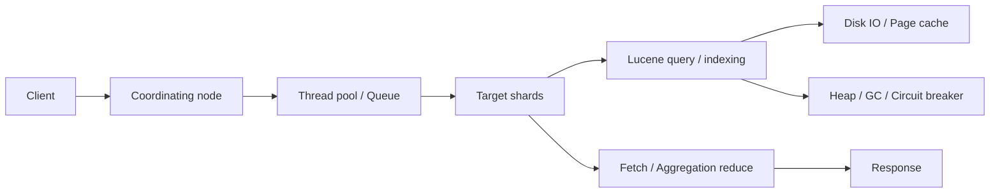

# Elasticsearch 性能优化清单

> 这一篇不是“把所有参数都调一遍”的速成表，而是把 ES 性能问题拆成写入、查询、聚合、分片、JVM、系统和监控七条线。真正的优化一定从业务目标和瓶颈证据开始：吞吐、延迟、成本、稳定性，最多同时优先两个。

## 1. 问题背景

Elasticsearch 的性能问题通常不是单点问题，而是链路问题。一次看似简单的慢查询，可能同时受 mapping 设计、分片数量、segment 数量、磁盘 I/O、JVM GC、线程池排队和聚合字段基数影响；一次写入堆积，也可能来自 bulk 过大、refresh 过频、replica 同步压力、ingest pipeline 过重或者热点路由。

生产优化要避免两个误区：

- 只盯某个参数，比如一上来就改 heap、改 refresh、改 shard 数。
- 只看平均值，比如平均延迟正常，但 P95/P99 被少量大查询拖垮。

我更推荐用“目标 - 指标 - 假设 - 实验 - 回滚”的方式做优化。先写清楚目标，比如“日志写入从 8 万条/秒提升到 15 万条/秒，P99 查询小于 800ms，集群 yellow 不超过 1 分钟”；再用压测、慢日志、Profile API、nodes stats 和业务日志验证瓶颈。

## 2. 核心概念

### 2.1 读写性能的底层约束

ES 的写入链路大致是：client bulk -> coordinating node -> primary shard -> translog -> indexing buffer -> replica -> refresh 生成可搜索 segment -> 后台 merge。写入吞吐受 CPU、磁盘、分片并发、refresh、merge、replica 和 pipeline 共同限制。

ES 的查询链路大致是：coordinating node 广播请求到相关 shard -> query phase 收集 top N 或聚合中间结果 -> fetch phase 拉取 `_source` -> 合并返回。查询延迟受命中 shard 数、倒排索引质量、排序字段、聚合字段、缓存、磁盘 page cache 和协调节点压力影响。

生产排障可以先按链路定位瓶颈:



### 2.2 常见性能指标

| 维度 | 关键指标 | 说明 |
|---|---|---|
| 写入 | indexing rate、bulk latency、indexing pressure、refresh/merge time | 判断写入是否被 CPU、I/O 或 refresh/merge 拖住 |
| 查询 | query latency P95/P99、search thread queue、slowlog | 判断是否存在大查询、热点分片和协调节点瓶颈 |
| 聚合 | request breaker、fielddata breaker、global ordinals 构建时间 | 判断是否被高基数字段或超大 bucket 拖垮 |
| 分片 | shard size、shard count、segment count、relocation time | 判断分片过大、过小、过多或迁移过慢 |
| JVM | heap used、GC time、old GC frequency、circuit breaker | 判断内存压力和熔断风险 |
| 系统 | CPU iowait、disk latency、IOPS、page cache、network | 判断底层资源是否已到天花板 |
| 集群 | cluster health、pending tasks、disk watermark、rejected | 判断稳定性风险 |

## 3. 实践方法

### 3.1 写入优化

写入优化的核心目标是减少每条文档的固定成本，并让后台 refresh、replica、merge 跟得上前台写入。

**1. 使用 bulk，而不是单条写入**

bulk 大小没有通用最佳值，建议从 5MB、10MB、20MB 阶梯压测。过小浪费网络和协调成本，过大会增加 heap 压力、失败重试成本和长尾延迟。

```bash
curl -u elastic:$ES_PASSWORD -H "Content-Type: application/x-ndjson" \
  -X POST "https://localhost:9200/products/_bulk?refresh=false" \
  --data-binary @bulk-products.ndjson
```

**2. 导入期临时放宽 refresh**

业务允许近实时延迟变大时，把 `refresh_interval` 从默认值调大，批量导入完成后再恢复。对于离线重建索引，可以短时间设置为 `-1` 禁用自动 refresh，导入后手动 refresh。

```http
PUT products_v2/_settings
{
  "index": {
    "refresh_interval": "30s"
  }
}
```

导入完成：

```http
PUT products_v2/_settings
{
  "index": {
    "refresh_interval": "1s"
  }
}

POST products_v2/_refresh
```

**3. 导入期降低副本，导入后恢复**

如果数据源可重放，且导入窗口可控，可以先设置 `number_of_replicas: 0`，导入完成后再恢复副本。代价是导入期间节点故障可能导致这部分新写数据不可用，所以必须有上游重放能力或快照兜底。

```http
PUT products_v2/_settings
{
  "index": {
    "number_of_replicas": 0
  }
}
```

**4. 避免写入热点**

按用户 ID、租户 ID、订单 ID 等 routing 写入时，要确认 key 的分布是否均匀。时间序列索引也要防止所有写入都打到同一个过小索引或同一批 shard。

```http
POST orders_write/_doc?routing=tenant_1024
{
  "tenant_id": "tenant_1024",
  "order_id": "O202605250001",
  "amount": 199.00,
  "created_at": "2026-05-25T10:00:00+08:00"
}
```

**5. 简化 mapping 和 ingest pipeline**

写入吞吐差时，检查是否有过多字段、多字段 `fields`、复杂 painless script、geo 解析、attachment 解析、过多 runtime fields 或不必要的 analyzer。能在上游清洗的字段，不一定都要在 ingest pipeline 里做。

```http
GET _nodes/stats/ingest?filter_path=nodes.*.ingest
```

### 3.2 查询优化

查询优化的主线是：减少需要访问的 shard，减少每个 shard 的候选文档，减少 fetch 的字段，避免昂贵查询。

**1. filter 放过滤，query 放相关性**

不参与评分的条件放到 `filter`，让语义更清晰，也更容易复用缓存。

```http
GET products/_search
{
  "track_total_hits": false,
  "_source": ["title", "brand", "price", "cover"],
  "query": {
    "bool": {
      "must": [
        { "match": { "title": "无线降噪耳机" } }
      ],
      "filter": [
        { "term": { "status": "online" } },
        { "range": { "price": { "gte": 100, "lte": 1000 } } }
      ]
    }
  },
  "sort": [
    { "_score": "desc" },
    { "sales_30d": "desc" }
  ],
  "size": 20
}
```

**2. 治理深分页**

`from + size` 深分页会让每个 shard 都维护更多候选结果。用户搜索页建议限制最大页数；需要游标翻页时使用 `search_after`，需要稳定视图时配合 PIT。

```http
POST /products/_pit?keep_alive=1m
```

```http
GET /_search
{
  "pit": {
    "id": "PIT_ID_FROM_PREVIOUS_RESPONSE",
    "keep_alive": "1m"
  },
  "size": 20,
  "sort": [
    { "updated_at": "desc" },
    { "_shard_doc": "desc" }
  ],
  "search_after": ["2026-05-25T10:00:00+08:00", 4294967298],
  "query": {
    "term": {
      "status": "online"
    }
  }
}
```

**3. 避免无边界 wildcard/regexp**

`*keyword*`、复杂正则、前缀过短的 prefix 查询很容易变成高成本 term 枚举。搜索建议、前缀匹配、模糊匹配应优先通过建模解决，例如 edge ngram、search_as_you_type、completion suggester 或专门的 keyword 归一化字段。

**4. 控制 fetch 成本**

只返回必要字段，避免大 `_source`、大数组字段、高亮大字段、script_fields 和 inner_hits 滥用。

```http
GET logs-*/_search
{
  "size": 100,
  "_source": false,
  "fields": ["@timestamp", "service.name", "log.level", "message"],
  "query": {
    "range": {
      "@timestamp": {
        "gte": "now-15m",
        "lte": "now"
      }
    }
  }
}
```

### 3.3 聚合优化

聚合优化的第一原则是控制 bucket 数。很多生产事故不是查询命中文档太多，而是聚合产生了过多中间桶。

**1. terms 聚合设置合理 size 和 shard_size**

```http
GET orders/_search
{
  "size": 0,
  "query": {
    "range": {
      "created_at": {
        "gte": "now-7d"
      }
    }
  },
  "aggs": {
    "top_brands": {
      "terms": {
        "field": "brand_id",
        "size": 20,
        "shard_size": 200
      },
      "aggs": {
        "gmv": {
          "sum": {
            "field": "pay_amount"
          }
        }
      }
    }
  }
}
```

**2. 大结果集遍历用 composite aggregation**

当你要分页拉取所有 bucket，而不是只看 Top N，优先考虑 composite aggregation。

```http
GET orders/_search
{
  "size": 0,
  "aggs": {
    "by_day_brand": {
      "composite": {
        "size": 500,
        "sources": [
          { "day": { "date_histogram": { "field": "created_at", "calendar_interval": "1d" } } },
          { "brand": { "terms": { "field": "brand_id" } } }
        ]
      }
    }
  }
}
```

**3. 高基数字段提前评估**

`cardinality` 是近似统计，不适合当作强一致计数；高基数字段上的 `terms`、`significant_terms`、多层嵌套聚合都要先用小时间窗压测。对低延迟报表，可以考虑预聚合、rollup/downsample 或写入 ClickHouse/Druid 等 OLAP 系统。

### 3.4 分片优化

分片是 ES 性能和成本的地基。分片过大影响恢复、迁移和查询并行度；分片过小会导致 cluster state、线程池、文件句柄和 heap 开销上升。

常用经验：

- 日志/指标类索引用 data stream + ILM rollover，按 `max_primary_shard_size`、`max_age` 或 `max_docs` 滚动。
- 每个主分片尽量控制在可恢复、可迁移的范围内，常见热数据目标可从 20GB-50GB 起步压测。
- 不要为了“并行”盲目增加分片。单次查询命中过多 shard，会把协调节点拖慢。
- 小租户不要一租户一索引，优先共享索引并用租户字段过滤；大租户再考虑独立索引或 routing。

查看分片：

```http
GET _cat/shards?v&s=store:desc
```

查看索引段：

```http
GET _cat/segments/products_v2?v
```

基于 rollover 的索引生命周期示例：

```http
PUT _ilm/policy/logs_hot_warm_delete
{
  "policy": {
    "phases": {
      "hot": {
        "actions": {
          "rollover": {
            "max_primary_shard_size": "40gb",
            "max_age": "1d"
          }
        }
      },
      "warm": {
        "min_age": "7d",
        "actions": {
          "forcemerge": {
            "max_num_segments": 1
          }
        }
      },
      "delete": {
        "min_age": "30d",
        "actions": {
          "delete": {}
        }
      }
    }
  }
}
```

### 3.5 JVM 与内存优化

ES 的 heap 不是越大越好。heap 太小容易频繁 GC 和熔断；heap 太大挤压文件系统缓存，查询反而变慢。生产上通常让 JVM heap 和文件系统缓存各有足够空间，并避免 swap。

关键建议：

- 使用 ES 自动 heap 设置作为起点，再根据角色和负载调整。
- 保留足够 page cache，搜索和聚合非常依赖 OS 缓存。
- 禁用 swap，避免 JVM 被换出导致长时间停顿。
- 使用 doc values 支撑排序、聚合和脚本读取，避免 text 字段打开 fielddata。
- 关注 circuit breaker，不要把熔断当成“ES 不稳定”，它通常是在保护节点。

查看节点 JVM：

```http
GET _nodes/stats/jvm?filter_path=nodes.*.jvm.mem,nodes.*.jvm.gc
```

查看熔断器：

```http
GET _nodes/stats/breaker
```

Linux 禁用 swap 示例：

```bash
sudo swapoff -a
sudo sysctl -w vm.swappiness=1
```

### 3.6 系统与硬件优化

ES 对磁盘和内存很敏感。CPU 够用但磁盘延迟高，查询和 merge 都会抖；内存够大但 heap 占满，也会让 page cache 不够。

建议基线：

- 热数据使用 SSD/NVMe，避免把热查询放在机械盘上。
- 热节点优先保证磁盘低延迟，而不是只看容量。
- 日志写入场景要关注 sustained write，不只看峰值 IOPS。
- 网络要给 shard recovery、CCR、remote reindex、snapshot 留余量。
- 设置合理文件句柄、线程数、虚拟内存映射数。

Linux 基础项：

```bash
ulimit -n 65535
sudo sysctl -w vm.max_map_count=262144
```

### 3.7 监控与压测

没有监控的优化很容易变成玄学。至少要接入：

- Stack Monitoring 或 Prometheus exporter。
- 慢查询日志和慢写入日志。
- JVM GC 日志。
- 业务侧请求耗时、错误码、超时率。
- 压测工具：Rally、JMeter、wrk、自研回放工具。

开启慢日志示例：

```http
PUT products/_settings
{
  "index.search.slowlog.threshold.query.warn": "2s",
  "index.search.slowlog.threshold.fetch.warn": "1s",
  "index.indexing.slowlog.threshold.index.warn": "1s"
}
```

查询 Profile：

```http
GET products/_search
{
  "profile": true,
  "query": {
    "match": {
      "title": "无线耳机"
    }
  }
}
```

查看热点线程：

```http
GET _nodes/hot_threads
```

## 4. 命令与配置速查

快速抓取一组排障现场:

```http
GET _cluster/health
GET _cat/nodes?v&h=name,ip,heap.percent,ram.percent,cpu,load_1m,node.role,master
GET _cat/thread_pool/search,write?v
GET _nodes/hot_threads
GET _cat/recovery?v
```

### 4.1 集群健康与分片

```http
GET _cluster/health?pretty
GET _cat/nodes?v
GET _cat/indices?v&s=store.size:desc
GET _cat/shards?v&s=state,index
GET _cluster/allocation/explain
```

### 4.2 线程池与拒绝

```http
GET _cat/thread_pool/search,write,bulk?v&h=node_name,name,active,queue,rejected,completed
GET _nodes/stats/thread_pool
```

### 4.3 写入压测索引设置

```http
PUT bulk_test
{
  "settings": {
    "number_of_shards": 3,
    "number_of_replicas": 0,
    "refresh_interval": "30s"
  },
  "mappings": {
    "properties": {
      "id": { "type": "keyword" },
      "title": { "type": "text" },
      "category_id": { "type": "keyword" },
      "price": { "type": "scaled_float", "scaling_factor": 100 },
      "created_at": { "type": "date" }
    }
  }
}
```

### 4.4 查询限流思路

ES 自身有线程池和熔断器，但业务系统最好在入口做更明确的查询治理：

```json
{
  "max_time_range_days": 31,
  "max_page_size": 100,
  "max_from": 5000,
  "forbid_leading_wildcard": true,
  "max_terms_agg_size": 1000,
  "timeout": "2s"
}
```

## 5. 工程取舍

| 优化手段 | 收益 | 代价 | 适合场景 |
|---|---|---|---|
| bulk 增大 | 提升吞吐 | 增加失败重试成本和 heap 压力 | 离线导入、日志写入 |
| refresh 调大 | 降低 segment 生成频率 | 搜索可见性延迟增加 | 近实时要求不高的写入 |
| 副本降为 0 | 导入更快 | 导入期容灾能力下降 | 可重放数据、离线重建 |
| 分片减少 | 降低管理开销、提升缓存效率 | 单 shard 过大时恢复慢 | 小索引、小租户、多索引场景 |
| routing | 减少查询命中 shard | 可能产生热点和迁移复杂度 | 强租户隔离、按用户查询 |
| index sorting | 加速排序/交集查询 | 写入变慢，建模固定 | 查询模式稳定的索引 |
| eager global ordinals | 降低首次聚合抖动 | refresh 变慢，内存增加 | 高频 terms 聚合字段 |
| 预聚合 | 查询极快 | 数据延迟、灵活性下降 | 固定报表、看板指标 |

## 6. 排障清单

### 6.1 查询慢

1. 看业务入口：是所有查询慢，还是某类 DSL 慢。
2. 查慢日志：确认慢在 query phase 还是 fetch phase。
3. 用 Profile API：定位具体 query、aggregation 或 script。
4. 查命中 shard 数：跨太多索引/分片会拖慢协调节点。
5. 查 `_source` 大小和高亮：fetch 慢通常和大字段、inner_hits、高亮有关。
6. 查线程池：`search` queue 和 rejected 是否升高。
7. 查节点资源：CPU、iowait、GC、磁盘水位。
8. 查热点分片：某个 shard QPS 或 store 明显偏高。

### 6.2 写入慢

1. 看 bulk 响应：是否有 429、版本冲突、mapping 异常。
2. 看 write/bulk 线程池：queue、rejected 是否增长。
3. 看 ingest stats：pipeline 是否成为瓶颈。
4. 看 refresh/merge：是否频繁 refresh 或 merge backlog。
5. 看磁盘：iowait、写延迟、磁盘水位。
6. 看 mapping：字段爆炸、动态字段、复杂 analyzer。
7. 看热点：是否单一 routing key 或单个索引写入过热。
8. 看副本：跨机架/跨可用区同步是否拖慢。

### 6.3 聚合爆内存

1. 限制时间范围和过滤条件。
2. 限制 `terms.size`，避免多层大 bucket。
3. 用 `composite` 分页取 bucket。
4. 对高基数字段压测，必要时预聚合。
5. 检查 request breaker 和 fielddata breaker。
6. 禁止在 text 字段上临时打开 fielddata，除非非常清楚风险。

### 6.4 集群不稳定

1. 看 `_cluster/health` 和 unassigned shard。
2. 看 pending tasks，确认是否 cluster state 更新堆积。
3. 看磁盘水位，超过 high/flood stage 会影响分片分配和写入。
4. 看 master 节点负载，避免 master 混跑重查询/重写入。
5. 看 shard 数是否过多，索引模板是否失控。
6. 看 GC、old heap 和熔断器。

## 7. 小结

- 写入优化围绕 bulk、refresh、replica、pipeline、热点和 merge 展开。
- 查询优化的关键是少打 shard、少取字段、少做昂贵查询、少做深分页。
- 聚合优化最重要的是控制 bucket 数和字段基数。
- 分片规划不是一次性决策，需要结合 ILM、rollover 和数据增长持续治理。
- JVM heap 要和文件系统缓存一起看，ES 搜索性能高度依赖 page cache。
- 监控、慢日志、Profile API 和压测是优化闭环，不是排障时才临时打开的工具。

## 8. 参考资料

- [Tune for indexing speed - Elastic Docs](https://www.elastic.co/guide/en/elasticsearch/reference/current/tune-for-indexing-speed.html)
- [Tune for search speed - Elastic Docs](https://www.elastic.co/guide/en/elasticsearch/reference/current/tune-for-search-speed.html/)
- [Size your shards - Elastic Docs](https://www.elastic.co/guide/en/elasticsearch/reference/current/size-your-shards.html)
- [Elasticsearch performance optimizations - Elastic Docs](https://www.elastic.co/docs/deploy-manage/production-guidance/optimize-performance)
