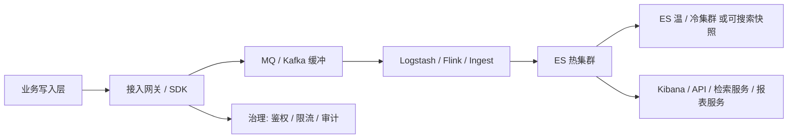

# 万亿级 ES 集群实践复盘

> “万亿级”不是一个神秘数字，它意味着数据、索引、分片、查询、成本和故障都会被放大。小集群靠经验能跑，大规模集群必须靠架构边界、自动化治理和可验证的运维纪律。

## 1. 问题背景

当 ES 集群进入百 TB、PB 级存储，或者文档量达到千亿、万亿级时，系统的主要矛盾会发生变化：

- 不是“能不能查”，而是“能不能稳定地查”。
- 不是“能不能写”，而是“写入、查询、merge、迁移、备份能不能互不拖垮”。
- 不是“能不能扩容”，而是“扩容、缩容、故障恢复是否有确定性”。
- 不是“单次查询多快”，而是“全平台查询是否可治理、可审计、可限流”。

很多大厂分享会提到万亿级日志、风控、推荐、监控或搜索集群。具体业务不同，但可复用的方法论很相似：分层、分域、分流、治理、自动化。

## 2. 核心概念

### 2.1 大规模 ES 的四个边界

**数据边界**：哪些数据必须进 ES，保留多久，热数据和冷数据如何分层，原始数据是否可重放。

**查询边界**：允许什么查询，不允许什么查询；交互式查询、报表查询、离线导出是否共用同一个集群。

**租户边界**：业务线、租户、环境、索引模式如何隔离；热点租户是否有独立资源池。

**故障边界**：单节点、单机架、单可用区、单集群故障时，系统降级到什么程度，恢复需要多久。

### 2.2 典型架构分层



大规模场景里，直接让所有业务客户端写 ES 往往很难治理。接入层至少要做：

- 鉴权和租户识别。
- 索引名、alias、routing 规范校验。
- bulk 大小和并发控制。
- 错误重试和死信队列。
- 查询 DSL 审计、改写、限流、超时。

## 3. 实践方法

### 3.1 数据接入：让 ES 从“被打”变成“被调度”

大规模写入必须引入缓冲层。Kafka/Flink/Logstash/自研消费者的价值不只是削峰，更重要的是可重放、可限速、可暂停、可观测。

一个常见写入策略：

```text
业务日志 -> Kafka Topic
  -> Flink 清洗、补字段、脱敏、路由
  -> Bulk Writer 按索引和分片批量聚合
  -> Elasticsearch write alias
  -> 失败写入进入 DLQ
```

Bulk Writer 的关键参数：

```json
{
  "bulk_max_bytes": "10mb",
  "bulk_max_actions": 5000,
  "flush_interval": "3s",
  "max_inflight_requests": 4,
  "retry_on_status": [429, 502, 503, 504],
  "max_retry": 8,
  "backoff": "exponential",
  "dead_letter_queue": "kafka://es-dlq"
}
```

这里的工程取舍是：写入链路越稳，端到端延迟越可能增加；但万亿级集群里，稳定性通常比毫秒级新鲜度更重要。真正需要低延迟的数据，可以走单独热链路。

### 3.2 索引分区：按生命周期而不是只按日期

日志场景经常按天建索引，但按天并不总是最优。高峰日可能单 shard 过大，低峰日又产生大量小 shard。更稳妥的方式是 data stream + ILM rollover。

```http
PUT _ilm/policy/app_logs_policy
{
  "policy": {
    "phases": {
      "hot": {
        "actions": {
          "rollover": {
            "max_primary_shard_size": "40gb",
            "max_age": "1d"
          }
        }
      },
      "warm": {
        "min_age": "3d",
        "actions": {
          "forcemerge": {
            "max_num_segments": 1
          }
        }
      },
      "delete": {
        "min_age": "30d",
        "actions": {
          "delete": {}
        }
      }
    }
  }
}
```

模板中绑定生命周期：

```http
PUT _index_template/app_logs_template
{
  "index_patterns": ["logs-app-*"],
  "data_stream": {},
  "template": {
    "settings": {
      "index.lifecycle.name": "app_logs_policy",
      "index.number_of_shards": 6,
      "index.number_of_replicas": 1
    },
    "mappings": {
      "dynamic": "strict",
      "properties": {
        "@timestamp": { "type": "date" },
        "service.name": { "type": "keyword" },
        "trace.id": { "type": "keyword" },
        "log.level": { "type": "keyword" },
        "message": { "type": "match_only_text" }
      }
    }
  },
  "priority": 200
}
```

`dynamic: strict` 不是必须，但大规模日志里非常推荐做字段治理。字段爆炸会把 cluster state、mapping、heap 和查询体验一起拖下水。

### 3.3 集群分层：热、温、冷、专用角色

大规模集群不要让所有节点承担所有角色。常见拆分：

- dedicated master：只负责集群管理，不跑重查询。
- hot data：SSD/NVMe，高写入、高查询。
- warm data：容量优先，查询频率较低，可 force merge。
- cold/frozen：低频查询，可结合 searchable snapshot。
- ingest node：复杂 pipeline 处理。
- coordinating node：承接查询入口和聚合归并。
- transform/ml 节点：运行专门计算任务。

节点角色示例：

```yaml
node.roles: [ data_hot, ingest ]
```

```yaml
node.roles: [ master ]
```

```yaml
node.roles: [ data_warm ]
```

工程上要避免两个极端：小集群过早拆太细，导致资源碎片；大集群所有节点混跑，导致故障和瓶颈不可控。

### 3.4 查询治理：统一入口比事后排障更重要

万亿级 ES 最怕“任意 DSL 直连集群”。一条没有时间范围的聚合、一个 leading wildcard、一个无限 `terms.size`，都可能造成级联抖动。

查询网关可以做这些事情：

- 强制时间范围。
- 限制 `from + size`，引导使用 `search_after`。
- 禁止或审批 leading wildcard、regexp、大脚本。
- 限制聚合层数、bucket 数和 timeout。
- 根据租户和业务线做 QPS/并发配额。
- 给查询打标签，写入审计日志，方便追责和优化。

一个查询策略配置可以长这样：

```json
{
  "tenant": "risk",
  "allowed_indices": ["risk-events-*"],
  "max_time_range": "7d",
  "max_result_window": 10000,
  "max_page_size": 200,
  "max_aggs_depth": 3,
  "max_terms_size": 500,
  "timeout": "3s",
  "allow_script": false,
  "allow_regex": false
}
```

对业务 API，可以把 DSL 封装成有限参数：

```http
GET /api/search/orders?keyword=耳机&brand=sony&min_price=100&max_price=2000&page_size=20
```

内部再生成受控 DSL，而不是让前端直接传任意查询。

### 3.5 容量规划：从单 shard 压测外推

大规模容量规划不要靠“线上试一下”。更可靠的流程：

1. 选取真实样本数据。
2. 建立候选 mapping。
3. 单节点单 shard 写入压测，得到单 shard 写入上限、查询延迟、segment 增长。
4. 多 shard、多节点扩展压测，观察是否线性扩展。
5. 加入副本、refresh、merge、查询混合负载。
6. 预留恢复、迁移、快照和突发流量余量。

容量估算基础公式：

```text
主数据容量 = 日增原始数据量 * 索引膨胀系数 * 保留天数
总磁盘容量 = 主数据容量 * (1 + 副本数) / 目标磁盘利用率
节点数 = 总磁盘容量 / 单节点可用数据盘容量
```

索引膨胀系数要实测。不同 mapping、分词器、doc_values、stored fields、source 压缩设置都会影响结果。

### 3.6 成本控制：把“都放 ES”改成“分层使用 ES”

ES 很强，但不便宜。成本优化的关键是把数据按价值分层：

- 热数据：高频检索、需要低延迟，保留在 hot tier。
- 温数据：低频分析，可降低副本、force merge、迁移到 warm tier。
- 冷数据：偶发审计，可用 searchable snapshot 或对象存储。
- 离线明细：如果只做批量扫描和报表，可放湖仓或 OLAP。

字段也要分层：

- 需要全文检索的字段才用 `text`。
- 需要过滤、排序、聚合的字段用 `keyword`/numeric/date。
- 只展示不检索的大字段谨慎进入 ES。
- 日志 message 可考虑 `match_only_text`。
- 避免一份字段被多种 analyzer 过度复制。

### 3.7 稳定性治理：演练比文档更可靠

大规模集群要把故障演练制度化：

- 单 data node 下线，观察副本提升和恢复耗时。
- 单 hot 节点磁盘打满，验证水位告警和写入保护。
- master 节点重启，验证选主时间和业务影响。
- 查询风暴，验证网关限流和熔断。
- Kafka 堆积，验证写入恢复速度。
- snapshot restore，验证 RTO/RPO。

故障演练记录模板：

```markdown
## 演练名称

- 时间：
- 集群：
- 故障注入：
- 预期影响：
- 实际影响：
- 告警是否触发：
- 自动恢复是否成功：
- 人工操作：
- RTO：
- RPO：
- 待改进项：
```

## 4. 命令与配置示例

用 routing 把同一租户或业务分区的数据聚到固定分片, 可以减少查询 fan-out:

```http
POST logs-app-default/_doc?routing=tenant_a
{
  "@timestamp": "2026-05-25T10:00:00+08:00",
  "tenant_id": "tenant_a",
  "service": "payment",
  "message": "payment timeout"
}

GET logs-app-default/_search?routing=tenant_a
{
  "query": {
    "term": {
      "tenant_id": "tenant_a"
    }
  }
}
```

routing 是强约束能力, 一旦选错会造成热点分片, 所以必须结合租户规模和数据分布评估。

### 4.1 查看集群压力

```http
GET _cluster/health
GET _cat/nodes?v&h=name,roles,heap.percent,ram.percent,cpu,load_1m,disk.used_percent,node.role
GET _cat/thread_pool/search,write?v&h=node_name,name,active,queue,rejected,completed
GET _nodes/stats/indices,os,process,jvm,thread_pool,breaker
```

### 4.2 查看索引和分片规模

```http
GET _cat/indices/logs-app-*?v&s=store.size:desc
GET _cat/shards/logs-app-*?v&s=store:desc
GET logs-app-*/_stats/store,docs,segments
```

### 4.3 查询网关加 timeout

```http
GET logs-app-*/_search
{
  "timeout": "2s",
  "terminate_after": 100000,
  "track_total_hits": false,
  "query": {
    "bool": {
      "filter": [
        {
          "range": {
            "@timestamp": {
              "gte": "now-1h",
              "lte": "now"
            }
          }
        },
        {
          "term": {
            "service.name": "payment"
          }
        }
      ]
    }
  },
  "size": 50
}
```

### 4.4 读写分离思路

对极端写入场景，可以通过 CCR 或双写把搜索负载从写入集群拿走：

```text
leader 集群：承接写入，少量实时校验查询
follower 集群：承接用户搜索、报表、看板
```

这会增加成本和一致性复杂度，但可以减少搜索和写入抢资源。

## 5. 工程取舍

### 5.1 大集群还是多集群

单个超大集群的优点是资源池大、管理入口少、查询跨域方便；缺点是故障影响面大、cluster state 大、治理复杂。多集群的优点是故障隔离强、业务边界清晰、升级灵活；缺点是资源碎片、跨集群查询和运维自动化更复杂。

常见选择：

- 平台日志：按业务域或数据等级拆多集群。
- 商品搜索：核心链路独立集群。
- 风控检索：按实时/离线、在线/审计拆集群。
- 监控指标：独立于业务搜索集群，避免故障互相影响。

### 5.2 强隔离还是高利用率

强隔离意味着关键业务有独立资源池，稳定性更好但利用率下降。共享集群利用率更高，但必须有租户配额、查询治理、资源审计和成本分摊机制。

### 5.3 原始明细还是预聚合

原始明细灵活，但大范围聚合贵。预聚合查询快，但会牺牲灵活性和实时性。生产里经常两者并存：ES 保存近 7-30 天明细，报表系统保存长期聚合结果。

## 6. 排障清单

### 6.1 大规模集群抖动

1. 先看是否全局抖动：所有索引慢，还是某业务索引慢。
2. 看 master pending tasks：是否 mapping 更新、分片分配、模板变更堆积。
3. 看热点节点：CPU、heap、磁盘、网络是否集中在少数节点。
4. 看热点索引和 shard：是否单租户或单 routing key 打爆。
5. 看查询审计：是否新上线 DSL 或报表任务放大。
6. 看写入链路：Kafka lag、bulk rejected、DLQ 是否增加。
7. 看恢复/迁移：是否有大量 shard relocation 或 snapshot restore。

### 6.2 数据增长失控

1. 检查 ILM 是否正常 rollover/delete。
2. 检查模板是否被新索引命中。
3. 检查是否新增高膨胀字段或动态字段。
4. 检查副本数是否被误调高。
5. 检查 force merge/downsample/searchable snapshot 是否按计划执行。
6. 对业务方输出索引成本账单，建立数据保留审批。

### 6.3 查询风暴

1. 网关立即限流或熔断问题租户。
2. 降级关闭高成本功能：高亮、复杂聚合、导出。
3. 缩小默认时间范围。
4. 临时增加 coordinating node 或搜索副本。
5. 保留慢日志和审计日志，事后回放分析。

## 7. 小结

- 万亿级 ES 的核心不是参数调优，而是边界治理。
- 写入链路要有缓冲、重试、死信和限速，不能让业务直接把集群打穿。
- 索引生命周期要用模板、data stream、ILM 和 rollover 自动化治理。
- 查询入口要收敛，任意 DSL 直连集群是大规模事故高发源。
- 成本优化依赖冷热分层、字段治理、预聚合和数据保留策略。
- 大集群稳定性靠演练、监控、自动化和配额，不靠临时救火。

## 8. 参考资料

- [Size your shards - Elastic Docs](https://www.elastic.co/guide/en/elasticsearch/reference/current/size-your-shards.html)
- [Elasticsearch performance optimizations - Elastic Docs](https://www.elastic.co/docs/deploy-manage/production-guidance/optimize-performance)
- [Index lifecycle actions - Elastic Docs](https://www.elastic.co/guide/en/elasticsearch/reference/current/_actions.html)
- [Tune for indexing speed - Elastic Docs](https://www.elastic.co/guide/en/elasticsearch/reference/current/tune-for-indexing-speed.html)
