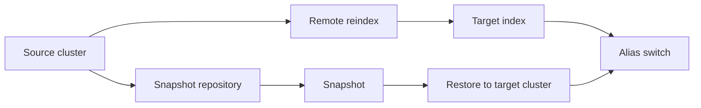
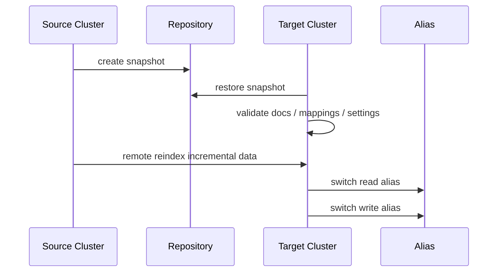

# ES 备份恢复与迁移方案

> 备份不是“有快照就行”，迁移也不是“跑个 reindex 就完”。生产方案要回答四个问题：备份了什么、能恢复到哪里、恢复要多久、失败后怎么回滚。

## 1. 问题背景

ES 中的数据经常来自数据库、日志、消息队列或业务服务。很多团队因此会低估 ES 备份的重要性，认为“反正可以重建”。但生产里真正需要恢复的往往不只是文档：

- index template、component template、ILM policy、ingest pipeline。
- Kibana saved objects、告警规则、Fleet/安全相关系统索引。
- 别名、data stream、索引设置和部分集群状态。
- 大量历史数据，重放可能需要数小时甚至数天。

备份恢复和迁移要按 RPO/RTO 设计：

- RPO：最多允许丢多少数据，比如 5 分钟、1 小时、1 天。
- RTO：最长允许多久恢复服务，比如 30 分钟、4 小时、1 天。

如果没有演练，RPO/RTO 都只是愿望。

## 2. 核心概念

### 2.1 snapshot/restore

Snapshot 是 ES 官方推荐的备份方式。它基于 Lucene segment 做增量快照，可以在集群运行时执行，用于灾备、误删恢复、跨集群复制数据和冷数据存储。

Snapshot 默认可包含：

- 集群状态。
- 普通索引和 data stream。
- 索引 aliases。
- index templates、ILM policies、ingest pipelines 等配置。
- 部分 Elastic Stack feature states。

但 snapshot 不包含：

- 注册过的 snapshot repository 配置。
- 节点本地配置文件。
- transient cluster settings。
- 节点证书、安全文件等操作系统层面的配置。

### 2.2 repository

Repository 是快照存储位置。常见类型：

- `fs`：共享文件系统，适合自建机房，但要求所有 master/data 节点可访问同一路径。
- `s3`：对象存储，适合云上和跨集群。
- `gcs`、`azure`：对应云厂商对象存储。
- `url`：只读仓库，常用于从已有仓库恢复。

Repository 不能被 ES 以外的程序随意修改，否则可能导致仓库损坏或快照不可用。

### 2.3 reindex 与 remote reindex

`_reindex` 是逻辑迁移：从源索引读取 `_source`，写入目标索引。它适合：

- 修改 mapping。
- 调整分片数。
- 字段清洗和脚本转换。
- 跨版本迁移，尤其是旧版本索引无法直接恢复到新集群时。

remote reindex 是从远端 ES 集群读取数据写入当前集群。它比 snapshot 更灵活，但通常更慢，也依赖 `_source` 开启。

备份迁移的两条主路径:



### 2.4 alias 切换

别名是零停机迁移的关键。业务写入 `products_write`，查询 `products_read`，底层真实索引从 `products_v1` 切换到 `products_v2`。

```text
products_write -> products_v1
products_read  -> products_v1

重建 products_v2 后：

products_write -> products_v2
products_read  -> products_v2
```

切换必须用 `_aliases` 原子操作完成。

## 3. 实践方法

### 3.1 快照备份方案

#### 3.1.1 注册 FS repository

所有相关节点的 `elasticsearch.yml` 要配置共享路径：

```yaml
path.repo: ["/mnt/es-backups"]
```

注册仓库：

```http
PUT _snapshot/prod_fs_repo
{
  "type": "fs",
  "settings": {
    "location": "/mnt/es-backups/prod",
    "compress": true
  }
}
```

验证仓库：

```http
POST _snapshot/prod_fs_repo/_verify
```

#### 3.1.2 注册 S3 repository

先安装/确认 S3 repository 插件和 keystore 凭据，然后注册：

```http
PUT _snapshot/prod_s3_repo
{
  "type": "s3",
  "settings": {
    "bucket": "company-es-backup",
    "base_path": "prod-cluster-a",
    "region": "ap-southeast-1",
    "compress": true,
    "server_side_encryption": true
  }
}
```

#### 3.1.3 手动创建快照

全量业务快照：

```http
PUT _snapshot/prod_s3_repo/snapshot_2026_05_25_0100?wait_for_completion=false
{
  "indices": "logs-*,orders-*,products-*",
  "ignore_unavailable": true,
  "include_global_state": false,
  "metadata": {
    "owner": "search-platform",
    "reason": "daily backup"
  }
}
```

查看当前快照任务：

```http
GET _snapshot/prod_s3_repo/_current
```

查看快照详情：

```http
GET _snapshot/prod_s3_repo/snapshot_2026_05_25_0100
```

#### 3.1.4 SLM 自动化

```http
PUT _slm/policy/daily_logs_snapshot
{
  "schedule": "0 30 1 * * ?",
  "name": "<daily-logs-{now/d}>",
  "repository": "prod_s3_repo",
  "config": {
    "indices": ["logs-*"],
    "ignore_unavailable": true,
    "include_global_state": false
  },
  "retention": {
    "expire_after": "30d",
    "min_count": 7,
    "max_count": 60
  }
}
```

手动触发：

```http
POST _slm/policy/daily_logs_snapshot/_execute
```

查看状态：

```http
GET _slm/stats
GET _slm/policy/daily_logs_snapshot
```

### 3.2 恢复方案

#### 3.2.1 恢复到新索引

这是最安全的恢复方式，避免覆盖现有索引。

```http
POST _snapshot/prod_s3_repo/snapshot_2026_05_25_0100/_restore
{
  "indices": "orders-*",
  "ignore_unavailable": true,
  "include_global_state": false,
  "rename_pattern": "(.+)",
  "rename_replacement": "restore_$1",
  "index_settings": {
    "index.number_of_replicas": 0
  }
}
```

恢复后检查：

```http
GET _cat/recovery/restore_orders-*?v
GET _cat/indices/restore_orders-*?v
```

#### 3.2.2 恢复原索引

恢复到同名索引前，通常需要关闭或删除原索引。生产上更推荐先恢复到临时索引，校验无误后通过 alias 切流。

```http
POST orders_2026_05_25/_close
```

```http
POST _snapshot/prod_s3_repo/snapshot_2026_05_25_0100/_restore
{
  "indices": "orders_2026_05_25",
  "include_global_state": false
}
```

```http
POST orders_2026_05_25/_open
```

#### 3.2.3 恢复受 ILM 管理的索引

恢复旧快照时要小心 ILM 立刻执行 rollover、forcemerge 或 delete。必要时先停 ILM，恢复后再调整策略。

```http
POST _ilm/stop
```

恢复完成并检查后：

```http
POST _ilm/start
```

### 3.3 同版本/兼容版本迁移：优先 snapshot restore

如果源集群和目标集群版本兼容，且目标能访问同一个 repository，snapshot restore 通常最快、最完整、最少业务侵入。

迁移流程：

1. 源集群注册 repository。
2. 源集群执行快照。
3. 目标集群注册同一个 repository。
4. 目标集群 restore 到新索引或新集群。
5. 校验 doc count、mapping、alias、查询样例。
6. 切换业务读写入口。
7. 保留旧集群一段时间用于回滚。

目标集群注册只读仓库：

```http
PUT _snapshot/migrate_repo
{
  "type": "s3",
  "settings": {
    "bucket": "company-es-backup",
    "base_path": "prod-cluster-a",
    "readonly": true
  }
}
```

### 3.4 跨版本/重建 mapping：remote reindex

remote reindex 适合从旧集群迁移到新集群，同时调整 mapping、字段名、分片数或 analyzer。

目标集群 `elasticsearch.yml` 中允许远端：

```yaml
reindex.remote.whitelist: ["old-es.example.com:9200"]
```

先在目标集群创建新索引：

```http
PUT products_v2
{
  "settings": {
    "number_of_shards": 6,
    "number_of_replicas": 1,
    "refresh_interval": "30s"
  },
  "mappings": {
    "properties": {
      "product_id": { "type": "keyword" },
      "title": {
        "type": "text",
        "fields": {
          "keyword": { "type": "keyword", "ignore_above": 256 }
        }
      },
      "brand_id": { "type": "keyword" },
      "price": { "type": "scaled_float", "scaling_factor": 100 },
      "updated_at": { "type": "date" }
    }
  }
}
```

执行 remote reindex：

```http
POST _reindex?wait_for_completion=false
{
  "source": {
    "remote": {
      "host": "https://old-es.example.com:9200",
      "username": "reindex_user",
      "password": "REDACTED",
      "socket_timeout": "2m",
      "connect_timeout": "10s"
    },
    "index": "products_v1",
    "size": 1000,
    "query": {
      "range": {
        "updated_at": {
          "lte": "now"
        }
      }
    }
  },
  "dest": {
    "index": "products_v2",
    "op_type": "create"
  }
}
```

查看任务：

```http
GET _tasks?actions=*reindex&detailed=true
```

限速调整：

```http
POST _reindex/TASK_ID/_rethrottle?requests_per_second=500
```

注意：reindex 不会复制源索引 settings、mapping、template，目标索引必须提前建好。

### 3.5 别名切换与零停机迁移

#### 3.5.1 初始别名

```http
POST _aliases
{
  "actions": [
    {
      "add": {
        "index": "products_v1",
        "alias": "products_read"
      }
    },
    {
      "add": {
        "index": "products_v1",
        "alias": "products_write",
        "is_write_index": true
      }
    }
  ]
}
```

#### 3.5.2 全量迁移后增量追平

全量 reindex 期间，源索引仍有新写入。常见做法：

1. 记录全量开始时间 `t0`。
2. 对 `products_v1` 全量 reindex 到 `products_v2`。
3. 根据 `updated_at >= t0` 做一次或多次增量 reindex。
4. 短暂停写或双写校验。
5. 原子切 alias。

增量：

```http
POST _reindex?wait_for_completion=false
{
  "source": {
    "index": "products_v1",
    "query": {
      "range": {
        "updated_at": {
          "gte": "2026-05-25T01:00:00+08:00"
        }
      }
    }
  },
  "dest": {
    "index": "products_v2",
    "version_type": "external"
  }
}
```

#### 3.5.3 原子切换

```http
POST _aliases
{
  "actions": [
    {
      "remove": {
        "index": "products_v1",
        "alias": "products_read"
      }
    },
    {
      "remove": {
        "index": "products_v1",
        "alias": "products_write"
      }
    },
    {
      "add": {
        "index": "products_v2",
        "alias": "products_read"
      }
    },
    {
      "add": {
        "index": "products_v2",
        "alias": "products_write",
        "is_write_index": true
      }
    }
  ]
}
```

回滚也使用同样的 `_aliases` 原子操作切回 `products_v1`，前提是旧索引在观察期内没有删除，并且写入一致性策略允许回滚。

### 3.6 迁移校验

不要只看 reindex 返回成功。至少校验：

- 源和目标 doc count。
- 关键查询 Top N 是否一致。
- 聚合指标是否在误差范围内。
- mapping 是否符合预期。
- alias 是否指向正确索引。
- 写入、更新、删除语义是否正确。
- 业务侧错误率和延迟是否正常。

```http
GET products_v1/_count
GET products_v2/_count
GET products_v2/_mapping
GET _alias/products_read
```

抽样校验脚本思路：

```bash
for id in $(cat sample_product_ids.txt); do
  curl -s "$OLD_ES/products_v1/_doc/$id" > old.json
  curl -s "$NEW_ES/products_v2/_doc/$id" > new.json
  diff old.json new.json || echo "diff: $id"
done
```

## 4. 工程取舍

| 方案 | 优点 | 代价 | 适合场景 |
|---|---|---|---|
| snapshot/restore | 快、完整、官方推荐 | 受版本兼容和仓库访问限制 | 灾备、同版本迁移、大规模恢复 |
| remote reindex | 可改 mapping、跨版本灵活 | 慢、依赖 `_source`、不复制 settings | 重建索引、跨大版本迁移 |
| 双写迁移 | 切换平滑，增量简单 | 业务改造复杂，一致性难 | 核心在线业务 |
| CCR | 近实时复制，读写分离 | 许可、成本、运维复杂 | 跨集群容灾、读写隔离 |
| Logstash/自研同步 | 转换灵活 | 需要维护任务和一致性 | 数据清洗、异构迁移 |

## 5. 备份恢复演练

一次完整迁移可以按这个顺序演练:



### 5.1 演练目标

每个核心集群至少定期做一次恢复演练。演练不是为了证明“快照能跑”，而是为了证明在真实约束下可以恢复服务。

演练要记录：

- 快照开始和结束时间。
- 快照大小和增量大小。
- 恢复目标集群规格。
- 恢复耗时。
- 校验耗时。
- 切换耗时。
- 失败点和人工操作。

### 5.2 演练流程

```text
准备临时目标集群
  -> 注册只读 repository
  -> restore 指定索引到 restore_* 临时索引
  -> 检查 recovery、health、count、mapping
  -> 运行核心查询回归
  -> 模拟 alias 切换
  -> 删除临时索引或保留观察
  -> 输出演练报告
```

### 5.3 演练检查清单

- repository 是否所有节点可访问。
- 快照是否包含系统索引或 feature state。
- restore 是否受版本兼容限制。
- 目标集群磁盘是否足够。
- 目标集群 template/ILM/pipeline 是否冲突。
- 恢复后的 replica 是否需要临时设为 0。
- ILM 是否会误删恢复数据。
- alias 是否会覆盖现有业务入口。
- 应用配置是否支持快速切换 ES endpoint。

## 6. 排障清单

### 6.1 快照失败

1. 查看 repository verify 是否通过。
2. 检查对象存储权限、bucket、base_path、region。
3. 检查 FS repository 是否所有节点都挂载同一路径。
4. 查看 `_snapshot/repo/_current` 和 master 日志。
5. 检查是否有分片不可用。
6. 检查 snapshot 并发和网络带宽。

### 6.2 恢复慢

1. 查看 `_cat/recovery`，确认慢在下载、索引打开还是 replica 分配。
2. 临时降低 `number_of_replicas`，先恢复主分片。
3. 确认目标磁盘和网络没有瓶颈。
4. 避免恢复同时跑大量查询和写入。
5. 检查 allocation filtering 和磁盘水位。

### 6.3 reindex 慢或失败

1. 查看 task 状态和 failures。
2. 调低 batch size，尤其是大文档。
3. 给目标索引临时调大 refresh_interval。
4. 检查目标 mapping 冲突。
5. 使用 `conflicts=proceed` 时记录冲突数，不能静默忽略。
6. remote reindex 检查白名单、认证、SSL 和网络超时。

### 6.4 alias 切换后异常

1. 立即确认 `_alias` 指向。
2. 检查写 alias 是否只有一个 `is_write_index: true`。
3. 检查应用是否缓存旧索引名。
4. 核对新索引 mapping 和旧索引兼容性。
5. 用原子 `_aliases` 切回旧索引。

## 7. 小结

- Snapshot/restore 是 ES 生产备份的主方案，不能用复制 data 目录替代。
- Repository 是备份可靠性的核心，必须验证权限、可达性和不可被外部篡改。
- Restore 最安全的方式是恢复到新索引，校验后再通过 alias 切换。
- Remote reindex 适合跨版本、改 mapping 和数据清洗，但要提前创建目标索引。
- 迁移要设计全量、增量、停写/双写、校验、切换和回滚。
- 备份方案没有演练就不算完成。

## 8. 参考资料

- [Snapshot and restore - Elastic Docs](https://www.elastic.co/guide/en/elasticsearch/reference/current/snapshot-restore.html)
- [Create, monitor and delete snapshots - Elastic Docs](https://www.elastic.co/guide/en/elasticsearch/reference/current/snapshots-take-snapshot.html)
- [Reindex documents - Elastic Docs](https://www.elastic.co/guide/en/elasticsearch/reference/current/docs-reindex.html/)
- [Migrate your Elasticsearch data - Elastic Docs](https://www.elastic.co/docs/manage-data/migrate)
- [Restore managed indices and manage ILM actions - Elastic Docs](https://www.elastic.co/guide/en/elasticsearch/reference/current/index-lifecycle-and-snapshots.html)
