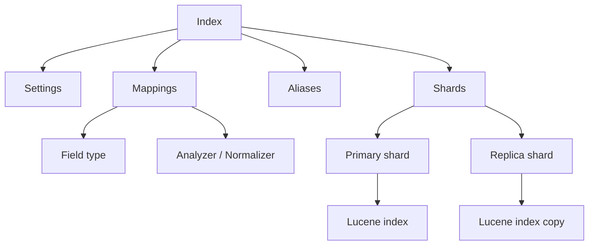
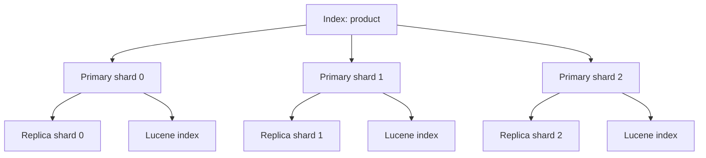
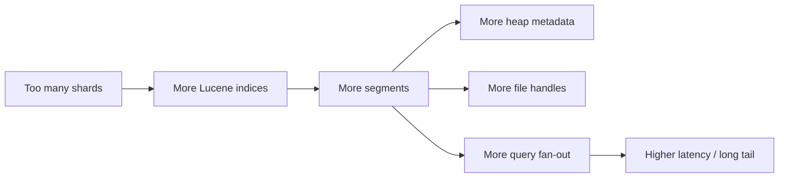

# 如何合理规划 Elasticsearch 的索引

> 来源整理：根据微信公众号文章《如何合理规划Elasticsearch的索引｜得物技术》提取、总结并重写为技术博客版本。本文围绕索引设计、字段类型、别名、mapping、分片副本、资源消耗和稳定性治理展开，并在文末补充面向 5 年经验开发/架构候选人的高质量面试追问。

## 1. 文章摘要

Elasticsearch 的索引不是随手建一张“表”这么简单。索引结构会直接影响查询性能、写入吞吐、磁盘成本、堆内存、集群状态、扩容难度和线上稳定性。

原文的核心观点是：创建索引时必须结合业务场景决定字段类型、是否分词、是否索引、分片数、副本数和别名策略；索引创建前要纳入技术方案评审，而不是照抄其他业务的建表脚本。

文章重点包括：

- 什么是 index，以及它和关系型数据库表的区别。
- alias 的作用：查询聚合、零停机切换、动态扩分片。
- mapping 的不可变性和字段类型选择。
- `text`、`keyword`、numeric/date 等字段类型的适用场景。
- 分片和副本的概念、规划方式和资源成本。
- 不同场景下的分片规划：读多、写多、日志、小数据量索引。
- 索引规划和集群稳定性之间的关系。

## 2. 为什么索引规划很重要

ES 中很多问题不是运行一段时间后才产生的，而是在索引创建那一刻就埋下了：

- 字段类型选错，后续无法直接修改。
- 分片数过少，数据增长后单分片过大。
- 分片数过多，集群元数据、内存、文件句柄、查询 fan-out 成本变高。
- 没有 alias，重建索引或扩分片时需要改代码。
- `text` 字段滥用，造成分词、倒排索引和 fielddata 成本。
- 动态 mapping 放任字段膨胀，导致 mapping explosion。
- 每次写入后显式 refresh，拖垮 IO 和 CPU。

索引设计应该成为技术方案的一部分，而不是开发完成后临时补一个 `PUT index`。

## 3. Index、Document、Mapping 和 Alias

ES 中的 index 是具有相似特征的文档集合。每条 document 是一个 JSON 对象，index 通过 mapping 定义字段结构，通过 settings 定义分片、副本、refresh 等索引级参数。



示例索引：

```http
PUT /index_demo
{
  "aliases": {
    "index_demo_alias": {}
  },
  "settings": {
    "index": {
      "refresh_interval": "5s",
      "number_of_shards": 3,
      "number_of_replicas": 1
    }
  },
  "mappings": {
    "properties": {
      "id": {
        "type": "long"
      },
      "name": {
        "type": "text",
        "fields": {
          "keyword": {
            "type": "keyword",
            "ignore_above": 256
          }
        }
      },
      "status": {
        "type": "keyword"
      },
      "createDate": {
        "type": "long"
      }
    }
  }
}
```

## 4. Alias：索引治理的基础设施

Alias 可以指向一个或多个 index，也可以作为业务访问入口。大多数 ES API 支持使用 alias 代替 index。

Alias 的典型用途：

- 业务代码访问 alias，而不是直接访问物理 index。
- 多索引联合查询。
- reindex 后零停机切换。
- 滚动索引和动态扩容。

创建索引时指定 alias：

```http
PUT /product_v1
{
  "aliases": {
    "product_read": {},
    "product_write": {
      "is_write_index": true
    }
  },
  "settings": {
    "number_of_shards": 3,
    "number_of_replicas": 1
  },
  "mappings": {
    "properties": {
      "title": {
        "type": "text",
        "fields": {
          "keyword": {
            "type": "keyword",
            "ignore_above": 256
          }
        }
      }
    }
  }
}
```

零停机切换 alias：

```http
POST /_aliases
{
  "actions": [
    {
      "remove": {
        "index": "product_v1",
        "alias": "product_read"
      }
    },
    {
      "add": {
        "index": "product_v2",
        "alias": "product_read"
      }
    }
  ]
}
```

没有 alias 的系统，在重建索引、扩分片、mapping 调整时往往要改代码、重新发布应用，治理成本会明显变高。

## 5. Mapping：字段类型一旦选错，代价很高

Mapping 是文档结构声明，决定字段如何被索引、存储、查询、排序和聚合。

关键点：

- 字段类型创建后不能直接修改。
- 可以新增字段，但不能随意改变已有字段类型。
- 动态 mapping 会根据首次写入数据推断类型，容易误判。
- 字段数量不应无限增长，避免 mapping explosion。
- 不需要查询的字段应设置 `index: false` 或不写入 ES。

```http
PUT /order_v1
{
  "mappings": {
    "dynamic": "strict",
    "properties": {
      "order_id": {
        "type": "keyword"
      },
      "user_id": {
        "type": "keyword"
      },
      "amount": {
        "type": "scaled_float",
        "scaling_factor": 100
      },
      "created_at": {
        "type": "date",
        "format": "strict_date_optional_time||epoch_millis"
      },
      "remark": {
        "type": "text",
        "index": false
      }
    }
  }
}
```

如果字段类型真的选错，通常只能通过新建索引 + reindex + alias 切换解决。

## 6. 字段类型选择

### 6.1 text：全文搜索

`text` 字段会经过 analyzer 分词，并建立倒排索引，适合标题、正文、描述、日志 message 等需要全文检索的内容。

适合：

- 商品标题搜索。
- 文章正文检索。
- 日志文本分析。
- 中文分词搜索。

不适合：

- 精确过滤。
- 排序。
- 聚合。
- ID、状态码、枚举值。

### 6.2 keyword：精确匹配、排序和聚合

`keyword` 不分词，字段值作为整体索引，适合结构化字符串。

适合：

- 订单号、用户 ID、商品 ID。
- 状态、类型、枚举。
- 标签、分类。
- 排序、聚合、精确过滤。

`ignore_above` 可以限制过长字符串不进入索引，减少不必要的索引成本：

```http
"sku_code": {
  "type": "keyword",
  "ignore_above": 128
}
```

### 6.3 numeric/date：范围查询和数值计算

numeric/date 适合范围查询、排序和指标聚合。例如价格、金额、时间、库存、计数等。

但如果一个数字字段只用于精确匹配，比如订单号、商品 ID，不一定要用 numeric，使用 `keyword` 反而更符合业务语义。

### 6.4 wildcard：模糊匹配

如果确实存在大量通配符查询，尤其是 keyword 上的模糊匹配，应考虑 `wildcard` 字段类型，而不是直接在 keyword 上做前导通配符。

## 7. 字段设计建议

整理原文建议并补充工程化判断：

- 不需要全文搜索的字符串优先使用 `keyword`。
- 不确定是否需要全文搜索时，可以使用 multi-fields：`text + keyword`。
- 枚举字段默认使用 `keyword`。
- 业务不需要范围查询的数字 ID 可以使用 `keyword`。
- 时间字段建议使用 `date` 或 `long`，不要默认用 keyword。
- 中文分词不要直接依赖默认 analyzer，常见选择是 `ik_smart`，谨慎使用切词更细的 `ik_max_word`。
- 尽量避免对 `text` 字段做聚合，fielddata 会增加堆内存压力。
- 字段数量要控制，建议只把真正需要搜索、过滤、排序、聚合的字段写入 ES。
- 对不需要查询的字段设置 `index: false`。
- 避免每次写入后显式 refresh。
- `now` 这类动态时间查询不利于缓存，能用绝对时间就用绝对时间。

## 8. Shard：分片和副本的本质

ES 的一个 index 会拆成多个 primary shard，每个 shard 本质上是一个 Lucene index。副本 shard 是主分片的拷贝，用于高可用和分担读请求。



文档路由公式可以简化理解为：

```text
target_shard = hash(_id or routing) % number_of_primary_shards
```

主分片数在索引创建后通常不能直接修改；副本数可以动态调整。

## 9. 分片数规划

分片数不是越多越好。分片过少会导致单分片过大，写入、迁移、恢复和查询都变慢；分片过多会导致内存、文件句柄、集群状态、查询协调和网络开销上升。

### 9.1 读多场景

建议单分片约 20GB-40GB，尽量减少主分片数量，避免查询 fan-out 过大和长尾子请求。

读多场景可以适当增加副本数提升查询吞吐，但副本越多，写入复制成本越高。

### 9.2 写多场景

建议单分片约 10GB-20GB。小分片在 refresh、segment merge、写入落盘方面通常更灵活，但也不能过度拆分。

写多场景更应关注：

- bulk 大小。
- refresh interval。
- replica 数量。
- segment merge 压力。
- translog 和磁盘 IO。

### 9.3 日志场景

日志场景要按每日写入量、保留周期、查询模式和节点数评估。

常见策略：

- 按天、周、月滚动索引。
- 使用 index template 统一 mapping 和 settings。
- 使用 ILM 管理 hot/warm/cold/delete。
- 如果日志只用于短期排障，副本数可以降低以节省成本。

### 9.4 小数据量索引

小索引不要盲目增加分片。分片数过多不仅不能提升性能，还会引入管理开销和数据分布不均。

小数据量索引通常设置 1-2 个主分片即可。如果读压力较大，优先增加副本或优化查询。

### 9.5 通用估算

```text
主分片数 ≈ 预估总数据量 / 目标单分片大小
```

常见目标单分片大小：

- 普通业务：10GB-50GB。
- 读多场景：20GB-40GB。
- 写多场景：10GB-20GB。
- 日志归档：可适当放宽到 50GB-100GB，但要结合恢复和查询成本。

平台治理中还要考虑：

- 分片数尽量和 data 节点数匹配，避免分布不均。
- 不要轻易使用自定义 routing，容易造成数据倾斜。
- 使用 `index.routing.allocation.total_shards_per_node` 限制单节点承载某索引的分片数。

示例：

```http
PUT /product_v1/_settings
{
  "index.routing.allocation.total_shards_per_node": 2
}
```

## 10. 分片与资源消耗

每个分片都是一个独立 Lucene index，因此分片数量会直接影响资源。

| 资源 | 分片过多的影响 |
|---|---|
| 堆内存 | 分片元数据、缓存、segment 元数据增多 |
| 文件句柄 | 每个 shard/segment 都会打开文件 |
| CPU | 查询 fan-out、结果归并、segment merge 成本增加 |
| 网络 | 多分片查询需要跨节点协调 |
| 集群状态 | shard routing 和 metadata 变大 |
| 恢复速度 | 分片迁移和 recovery 变复杂 |

Segment 过多也会带来额外问题：

- 查询需要遍历更多 segment。
- segment 元数据占用堆内存。
- merge 压力增加。
- 频繁 merge 可能带来 IO 抖动和 GC 压力。



## 11. 索引规划检查清单

创建索引前至少问这些问题：

- 这个索引用来搜索、过滤、排序还是聚合？
- 哪些字段需要全文搜索？
- 哪些字段只需要精确匹配？
- 哪些字段不需要索引？
- 是否需要中文分词？
- 是否需要 alias？
- 预计每日写入量是多少？
- 数据保留多久？
- 查询 QPS 和写入 QPS 大概多少？
- 单文档大小和总数据量预估是多少？
- 主分片数和副本数如何设置？
- 是否是时序数据，是否需要 ILM？
- 是否需要 reindex 或零停机切换能力？
- 是否有大字段、动态字段、嵌套字段风险？

## 12. 总结

合理规划 ES 索引，本质是在业务查询模型、数据规模、性能、成本和集群稳定性之间做平衡。

核心建议：

- alias 是索引治理的基础，尽量所有业务访问都走 alias。
- mapping 要先设计，不要依赖动态推断。
- 字段类型按业务查询方式选择，不要所有字符串都用 text。
- 不需要查询的字段不要索引。
- 分片数要基于数据量和访问模型估算，不要照抄。
- 副本数能提升读吞吐和高可用，但会增加写入和存储成本。
- refresh、fielddata、wildcard、聚合、大字段都是常见性能坑。

索引结构直接影响集群稳定性。创建索引前多花半小时评审，往往能避免后面数周的慢查询、扩容和重建成本。

## 13. 面试追问：五年资深开发与架构设计视角

下面这些问题适合考察候选人是否真正理解 ES 索引规划，而不是只会写 Query DSL。

### 13.1 业务建模与索引边界

1. 你会如何判断一个业务数据适不适合放进 Elasticsearch？
2. ES 索引和 MySQL 表的边界是什么？哪些查询应该留在 MySQL？
3. 设计商品搜索索引时，你会如何划分 title、brand、category、price、sales、tags 的字段类型？
4. 一个业务方说“所有字段都要能查”，你会如何评估和反驳？
5. 如果索引字段后续经常变化，你会如何设计 mapping 和动态字段策略？

### 13.2 Mapping 与字段类型

6. `text` 和 `keyword` 的区别是什么？为什么 `text` 不适合排序和聚合？
7. 订单号、商品 ID 这类数字字符串应该用 long 还是 keyword？为什么？
8. 什么情况下会给同一个字段同时建 `text` 和 `keyword` 子字段？
9. `ignore_above` 解决什么问题？如果设置过小会有什么风险？
10. 动态 mapping 可能带来哪些线上事故？如何治理 mapping explosion？

### 13.3 分词与搜索体验

11. 中文搜索为什么不能直接使用默认分词器？
12. `ik_smart` 和 `ik_max_word` 在召回和噪音上有什么差异？
13. 商品标题搜索如何兼顾召回、精确度和排序？
14. 同义词应该在索引阶段处理还是查询阶段处理？有什么取舍？
15. 如果业务要支持前缀、模糊、拼音搜索，你会如何设计字段？

### 13.4 分片规划

16. 分片数为什么不是越多越好？
17. 一个 500GB 的索引，你会如何估算主分片数？
18. 读多、写多、日志、小数据量索引的分片策略有什么不同？
19. 为什么小数据量索引设置很多分片反而会变慢？
20. 自定义 routing 有什么好处和风险？什么场景才值得用？

### 13.5 副本、性能与成本

21. 增加副本一定能提升查询性能吗？什么时候不能？
22. 副本数增加对写入性能有什么影响？
23. 日志场景为什么有时可以把副本数设为 0？风险是什么？
24. 如何通过 `total_shards_per_node` 避免某个索引压垮单节点？
25. 分片过多会带来哪些集群级资源消耗？

### 13.6 线上治理与演进

26. 索引创建后发现主分片数不合理，如何无停机治理？
27. 没有 alias 的老系统要做 reindex，你会如何设计迁移方案？
28. 线上出现慢查询，你如何判断是字段类型问题、分片问题还是查询 DSL 问题？
29. 如果业务每次写入后都手动 refresh，你会如何解释风险并改造？
30. 请设计一套“索引创建审批/评审机制”，你会要求业务方提供哪些信息？

这些追问的重点是看候选人能否把 ES 当作搜索和分析系统来设计，而不是把它当成一个“随便建表、随便查”的数据库。

## 参考来源

- 微信公众号文章：[如何合理规划Elasticsearch的索引｜得物技术](https://mp.weixin.qq.com/s/eKuD4eSF4FS9Fw5xdj6Sow)
