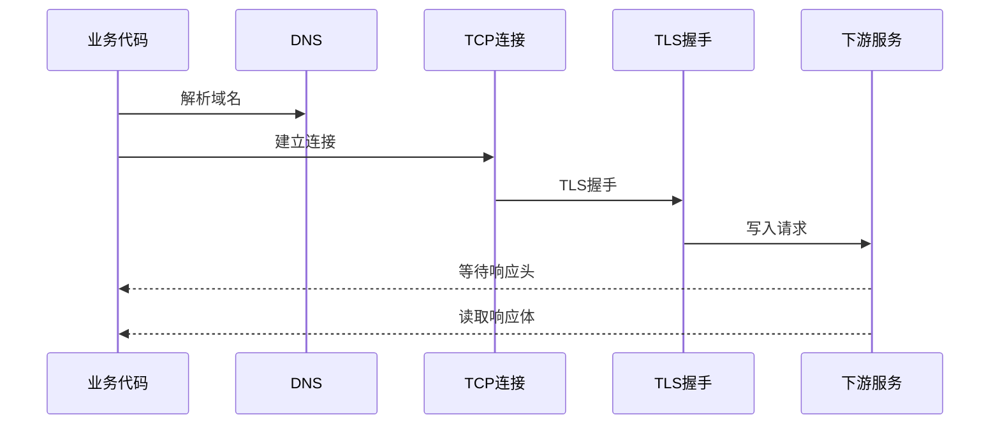
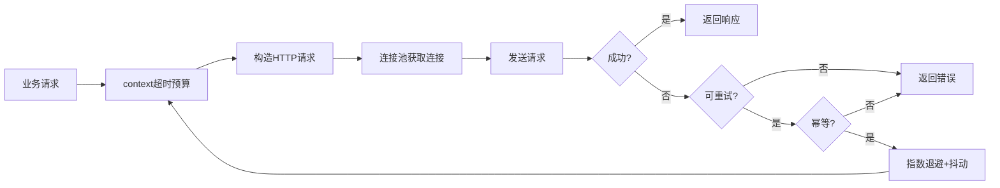

# Golang HTTP请求超时与重试：构建高可靠网络请求

> 来源整理：微信文章《Golang HTTP请求超时与重试：构建高可靠网络请求｜得物技术》
>
> 原文链接：https://mp.weixin.qq.com/s/2v9A6CRjmyMoOK8vFJF5Ag
>
> 本文为技术博客化整理和工程视角扩展，不逐段搬运原文。

## 1. 问题背景

在分布式系统中，HTTP 调用是服务之间最常见的连接方式之一。它看起来只是一次 `client.Do(req)`，但背后牵涉到：

- DNS 解析。
- TCP 建连。
- TLS 握手。
- 连接池复用。
- 请求体写入。
- 响应头等待。
- 响应体读取。
- 上游限流、失败、慢响应和重试。

如果 HTTP 客户端没有明确的超时、重试、幂等和连接池策略，轻则用户请求偶发失败，重则引发连接池耗尽、 goroutine 堆积、服务雪崩和业务状态不一致。

典型事故场景：

- 支付回调调用第三方接口超时，但本地订单状态已经推进。
- 下游接口慢响应，导致上游 goroutine 和连接长期占用。
- 瞬时网络抖动触发大量客户端同时重试，把下游进一步打垮。
- 非幂等写接口重试后重复扣款、重复发券、重复创建订单。

因此，生产级 HTTP 客户端设计，不是“能发请求”就够了，而是要系统性处理 **超时、取消、重试、幂等、限流和资源复用**。

## 2. 超时控制为什么是资源保护

超时不是为了让请求更快，而是为了给资源占用设置边界。

如果一个请求没有超时限制，它可能长期占用：

- goroutine。
- TCP 连接。
- 文件描述符。
- 连接池槽位。
- 上游请求上下文。
- 业务线程/协程资源。

当慢请求大量堆积时，新请求无法获取连接或执行机会，故障会沿调用链扩散。

HTTP 超时至少要覆盖几个阶段：



不同阶段需要不同的控制点：

- `net.Dialer.Timeout`：TCP 建连超时。
- `TLSHandshakeTimeout`：TLS 握手超时。
- `ResponseHeaderTimeout`：等待响应头超时。
- `http.Client.Timeout`：整个请求生命周期超时。
- `context.WithTimeout`：请求级超时和跨服务取消传播。

## 3. 生产级HTTP Client基础配置

不要直接使用 `http.DefaultClient` 作为生产客户端。它的 `Timeout` 默认为 0，意味着整体请求没有截止时间。

一个更稳妥的基础配置如下：

```go
func NewHTTPClient() *http.Client {
	transport := &http.Transport{
		DialContext: (&net.Dialer{
			Timeout:   3 * time.Second,
			KeepAlive: 30 * time.Second,
		}).DialContext,
		TLSHandshakeTimeout:   5 * time.Second,
		ResponseHeaderTimeout: 5 * time.Second,
		ExpectContinueTimeout: 1 * time.Second,
		IdleConnTimeout:       90 * time.Second,
		MaxIdleConns:          1000,
		MaxIdleConnsPerHost:   100,
	}

	return &http.Client{
		Transport: transport,
		Timeout:   10 * time.Second,
	}
}
```

这里的几个关键点：

- `Timeout` 是整个请求维度的兜底时间。
- `ResponseHeaderTimeout` 能防止下游长期不返回响应头。
- `MaxIdleConnsPerHost` 默认值很小，高并发调用同一域名时要主动调大。
- `IdleConnTimeout` 控制空闲连接保留时间，避免连接资源长期占用。

## 4. 用context传递超时和取消

`http.Client.Timeout` 是客户端级配置，适合做兜底。`context.Context` 更适合表达一次业务请求的超时预算。

例如，一个入口请求总预算是 800ms，内部调用库存、价格、营销、支付时，不应该每个下游都各自使用固定 5s 超时，否则整体 SLA 会失控。

更合理的方式是：入口生成带 deadline 的 context，下游调用继承这个 deadline，必要时再给子调用收紧时间。

```go
func RequestWithTracing(ctx context.Context, client *http.Client, url string) (*http.Response, error) {
	ctx, cancel := context.WithTimeout(ctx, 5*time.Second)
	defer cancel()

	req, err := http.NewRequestWithContext(ctx, http.MethodGet, url, nil)
	if err != nil {
		return nil, fmt.Errorf("create request: %w", err)
	}

	if requestID, ok := ctx.Value("request-id").(string); ok {
		req.Header.Set("X-Request-ID", requestID)
	}

	resp, err := client.Do(req)
	if err != nil {
		if errors.Is(ctx.Err(), context.DeadlineExceeded) {
			return nil, fmt.Errorf("request timeout: %w", ctx.Err())
		}
		if errors.Is(ctx.Err(), context.Canceled) {
			return nil, fmt.Errorf("request canceled: %w", ctx.Err())
		}
		return nil, fmt.Errorf("request failed: %w", err)
	}
	return resp, nil
}
```

需要注意：`context.WithTimeout` 和 `http.Client.Timeout` 是叠加关系，谁先到期谁生效。生产上可以用 `context` 表达业务预算，用 `Client.Timeout` 做防御性兜底。

## 5. 重试不是越多越可靠

重试是双刃剑。

它能缓解瞬时网络抖动、短暂限流、下游临时不可用；但如果策略不当，也会放大流量，制造惊群效应。

一个可靠重试策略至少要考虑：

- 最大重试次数。
- 初始退避时间。
- 最大退避时间。
- 抖动 jitter。
- 错误类型判断。
- 上下文取消。
- 幂等性。
- 下游 `Retry-After` 头。

## 6. 指数退避与抖动

指数退避的目的是让失败请求不要立刻同时冲回下游。抖动的目的是让多个客户端不要在同一时间点重试。

```go
type RetryPolicy struct {
	MaxRetries     int
	InitialBackoff time.Duration
	MaxBackoff     time.Duration
	JitterFactor   float64
}

func (p RetryPolicy) Backoff(attempt int) time.Duration {
	if attempt <= 0 {
		return p.InitialBackoff
	}

	backoff := p.InitialBackoff * time.Duration(1<<(attempt-1))
	if backoff > p.MaxBackoff {
		backoff = p.MaxBackoff
	}

	jitterRange := float64(backoff) * p.JitterFactor
	jitter := time.Duration(rand.Float64()*2*jitterRange - jitterRange)
	return backoff + jitter
}
```

通用重试执行器：

```go
func Retry(ctx context.Context, policy RetryPolicy, fn func() error) error {
	var lastErr error

	for attempt := 0; attempt <= policy.MaxRetries; attempt++ {
		if attempt > 0 {
			timer := time.NewTimer(policy.Backoff(attempt))
			select {
			case <-timer.C:
			case <-ctx.Done():
				timer.Stop()
				return fmt.Errorf("retry canceled: %w", ctx.Err())
			}
		}

		err := fn()
		if err == nil {
			return nil
		}
		lastErr = err

		if !ShouldRetry(err) {
			return err
		}
	}

	return fmt.Errorf("max retries exceeded: %w", lastErr)
}
```

## 7. 哪些错误可以重试

不是所有错误都应该重试。

通常可以重试：

- 网络超时。
- 临时网络错误。
- HTTP 408。
- HTTP 429，但最好尊重 `Retry-After`。
- HTTP 500、502、503、504。
- 业务定义的临时不可用。

通常不应该重试：

- HTTP 400 参数错误。
- HTTP 401/403 鉴权失败。
- HTTP 404 资源不存在。
- 非幂等写操作。
- 明确的业务失败，例如余额不足、库存不足、风控拒绝。

示例：

```go
func ShouldRetry(err error) bool {
	var netErr net.Error
	if errors.As(err, &netErr) {
		return netErr.Timeout()
	}

	var statusErr *HTTPStatusError
	if errors.As(err, &statusErr) {
		switch statusErr.StatusCode {
		case http.StatusRequestTimeout,
			http.StatusTooManyRequests,
			http.StatusInternalServerError,
			http.StatusBadGateway,
			http.StatusServiceUnavailable,
			http.StatusGatewayTimeout:
			return true
		default:
			return false
		}
	}

	return errors.Is(err, ErrRateLimited) || errors.Is(err, ErrServiceUnavailable)
}
```

## 8. 幂等是重试的前提

只谈重试，不谈幂等，是很危险的。

例如：

- 查询接口重试通常安全。
- 支付扣款重试可能重复扣款。
- 发券接口重试可能重复发券。
- 创建订单重试可能生成多笔订单。

常见幂等方案：

- 请求 ID：客户端生成唯一 requestId，服务端识别重复请求。
- 唯一索引：订单号、外部交易号、防重 token。
- 乐观锁：`update ... where version = ?`。
- 状态机：只允许合法状态流转。
- Redis `SET NX`：处理短周期并发请求。
- 结果缓存：重复请求返回第一次处理结果。

Redis 幂等示例：

```go
type IdempotentClient struct {
	redisClient *redis.Client
	prefix      string
	ttl         time.Duration
	client      *http.Client
}

func (c *IdempotentClient) Do(req *http.Request, requestID string) (*http.Response, error) {
	ctx := req.Context()
	key := fmt.Sprintf("%s:%s", c.prefix, requestID)

	ok, err := c.redisClient.SetNX(ctx, key, "processing", c.ttl).Result()
	if err != nil {
		return nil, fmt.Errorf("idempotent lock failed: %w", err)
	}
	if !ok {
		return nil, fmt.Errorf("duplicate request: %s", requestID)
	}

	resp, err := c.client.Do(req)
	if err != nil {
		_ = c.redisClient.Del(ctx, key).Err()
		return nil, err
	}

	_ = c.redisClient.Set(ctx, key, "completed", c.ttl).Err()
	return resp, nil
}
```

幂等键 TTL 要大于最大重试周期加业务处理时间。例如最大重试窗口 30 秒，业务处理 5 秒，TTL 至少应设置到 60 秒以上，避免重试还没结束幂等键就过期。

## 9. 连接池调优

高并发 HTTP 客户端的瓶颈经常不是请求代码，而是连接复用。

`http.Transport` 默认 `MaxIdleConnsPerHost` 较小。如果服务高频调用同一个下游域名，默认值很容易限制吞吐。

生产配置示例：

```go
func NewOptimizedTransport() *http.Transport {
	return &http.Transport{
		MaxIdleConns:        1000,
		MaxIdleConnsPerHost: 100,
		IdleConnTimeout:     90 * time.Second,
		DialContext: (&net.Dialer{
			Timeout:   2 * time.Second,
			KeepAlive: 30 * time.Second,
		}).DialContext,
		TLSHandshakeTimeout:   5 * time.Second,
		ExpectContinueTimeout: 1 * time.Second,
		DisableCompression:    false,
		TLSClientConfig: &tls.Config{
			MinVersion: tls.VersionTLS12,
		},
	}
}
```

连接池调优要结合：

- 下游域名数量。
- 单机 QPS。
- 下游响应时间。
- 并发 goroutine 数。
- 连接建立成本。
- NAT/SLB/网关连接限制。

不要盲目把连接池调得很大，否则可能给下游、网关或本机文件描述符带来额外压力。

## 10. sync.Pool要谨慎使用

原文提到用 `sync.Pool` 复用 `http.Request` 降低内存分配。这个思路在高频对象创建场景有价值，但在 HTTP 请求上要非常谨慎：

- `http.Request` 内部字段多，复用不彻底容易串数据。
- Header、Body、Context、URL 等都要正确重置。
- 请求对象通常包含上下文和 Body 生命周期，复用错误会引入隐蔽 bug。
- Go 的 GC 和逃逸优化已经很强，盲目池化未必收益明显。

如果确实要使用 `sync.Pool`，优先池化更简单、生命周期更清楚的对象，例如临时 buffer。

```go
var bufferPool = sync.Pool{
	New: func() any {
		buf := make([]byte, 0, 32*1024)
		return &buf
	},
}

func AcquireBuffer() *[]byte {
	buf := bufferPool.Get().(*[]byte)
	*buf = (*buf)[:0]
	return buf
}

func ReleaseBuffer(buf *[]byte) {
	if cap(*buf) > 128*1024 {
		return
	}
	bufferPool.Put(buf)
}
```

对 `http.Request` 这种复杂对象，除非有压测数据证明收益，并且团队能保证重置逻辑正确，否则不建议作为默认优化手段。

## 11. 生产级HTTP客户端设计清单

一个较完整的 Go HTTP 客户端应具备：

- 明确的 `http.Client.Timeout` 兜底。
- 基于 `context` 的请求级超时和取消。
- 连接、TLS、响应头等阶段性超时。
- 合理的连接池参数。
- 指数退避 + 抖动的重试策略。
- 精确的可重试错误判断。
- 幂等键或业务幂等保障。
- 限流和熔断，避免重试放大故障。
- 追踪 ID 透传。
- 指标监控：成功率、错误码、P95/P99、重试次数、超时次数、连接池状态。
- 日志采样，避免错误风暴下日志打爆磁盘。

可以用下面的逻辑理解整体链路：



## 12. 面试时有含金量的追问

### 12.1 Go HTTP基础与超时

1. **`http.Client.Timeout` 和 `context.WithTimeout` 有什么区别？同时设置时谁生效？**
   - 看是否能答出整体请求超时、请求级取消传播、二者取更早截止时间。

2. **`ResponseHeaderTimeout` 和 `Client.Timeout` 分别控制什么？**
   - 前者只管等待响应头，后者管整个请求生命周期。

3. **为什么不建议直接使用 `http.DefaultClient`？**
   - 重点是默认无整体超时、不可控连接池、缺少业务级配置。

4. **一次 HTTP 请求可能在哪些阶段卡住？**
   - DNS、TCP、TLS、写请求、等响应头、读 body、连接池等待。

5. **上游接口 SLA 是 300ms，你会怎么分配下游调用超时？**
   - 看是否有超时预算意识，而不是每个下游都固定 3 秒。

### 12.2 重试与故障保护

6. **哪些错误可以重试，哪些错误不应该重试？**
   - 能区分网络临时错误、429/5xx、业务失败、参数错误。

7. **为什么重试必须加指数退避和 jitter？**
   - 看是否理解惊群效应和下游保护。

8. **重试为什么可能导致服务雪崩？**
   - 重试会放大流量，尤其在下游已经慢或挂时。

9. **如何处理 429 的 `Retry-After`？**
   - 应优先尊重服务端给出的退避时间，并设置最大等待上限。

10. **重试应该放在客户端 SDK、网关还是业务代码里？**
    - 好答案会区分通用网络重试、业务幂等重试和网关层重试边界。

### 12.3 幂等与业务一致性

11. **为什么写接口重试前必须确认幂等？**
    - 看是否能举出重复扣款、重复发券、重复下单等问题。

12. **请求 ID 幂等和数据库唯一索引幂等有什么区别？**
    - 前者偏请求级防重，后者偏业务事实唯一性。

13. **Redis SET NX 做幂等有什么坑？**
    - TTL 过短、处理失败删除时机、处理中状态、结果缓存、Redis 故障。

14. **如果第一次请求处理成功但响应超时，第二次重试应该返回什么？**
    - 资深回答应提到结果缓存、按业务单号查询最终状态、幂等返回第一次结果。

15. **支付扣款接口如何设计幂等？**
    - 外部交易号唯一索引、状态机、幂等返回、对账补偿、审计流水。

### 12.4 连接池与性能优化

16. **`MaxIdleConnsPerHost` 为什么默认值可能不够？**
    - 高频调用同一域名时默认空闲连接太少，导致频繁建连。

17. **连接池开得越大越好吗？**
    - 不是。会受下游连接数、本机 FD、网关/NAT、内存和服务端保护限制。

18. **`sync.Pool` 适合优化什么，不适合优化什么？**
    - 适合生命周期清楚的临时对象，不适合复杂状态对象盲目复用。

19. **怎么证明一次 HTTP 客户端优化真的有效？**
    - 压测前后对比 P95/P99、错误率、重试次数、连接复用率、GC、CPU、FD。

20. **如果线上大量 `context deadline exceeded`，你会怎么排查？**
    - 区分客户端超时过短、下游慢、网络问题、连接池耗尽、DNS、TLS、限流、重试放大。

### 12.5 架构设计与业务思考

21. **支付、库存、营销三个下游都要调用时，超时预算怎么设计？串行还是并行？**
    - 看是否能结合业务依赖、降级策略、并行 fan-out、总 SLA 设计。

22. **重试和熔断、限流是什么关系？**
    - 重试提高成功率，熔断避免持续打故障点，限流保护自己和下游。

23. **如何避免客户端重试和网关重试叠加？**
    - 要有全链路重试预算和统一约定，否则一次用户请求可能被放大成多次下游请求。

24. **如果下游接口偶发超时但业务不能失败，你有哪些兜底方案？**
    - 缓存、异步化、任务补偿、降级结果、读旧值、最终一致。

25. **如何把 HTTP 客户端能力做成团队公共组件？**
    - 支持统一超时、重试、幂等、 tracing、metrics、日志、配置中心和按接口覆盖策略。

## 13. 总结

Go 的 HTTP 标准库很强，但默认配置不是生产高可用策略。

可靠 HTTP 客户端的关键不是“请求失败就重试”，而是：

- 用超时保护资源。
- 用 context 传递取消和预算。
- 用指数退避与抖动保护下游。
- 用错误分类避免无效重试。
- 用幂等保障业务一致性。
- 用连接池和监控支撑高并发。

对资深开发和架构师来说，HTTP 客户端设计本质上是一次小型的分布式系统设计：既要考虑单次调用成功率，也要考虑故障扩散、业务一致性、下游保护和可观测性。
