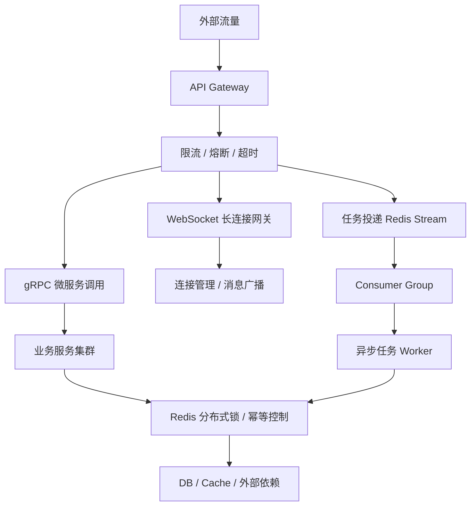
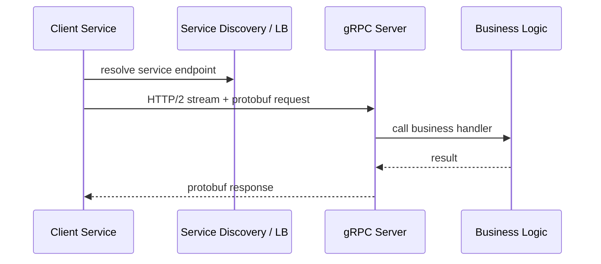
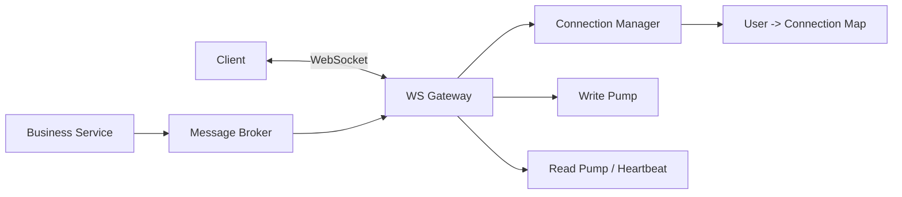
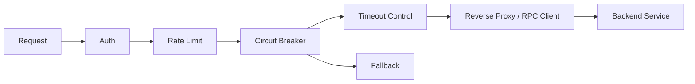
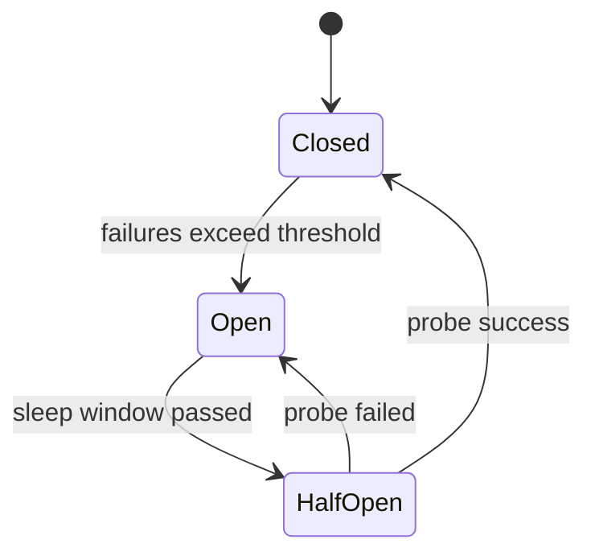
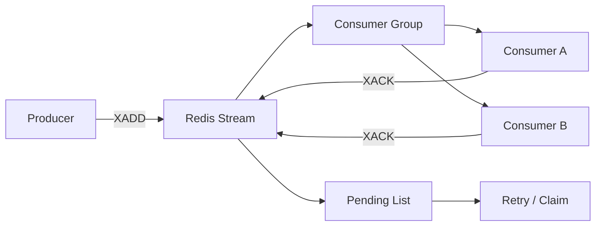
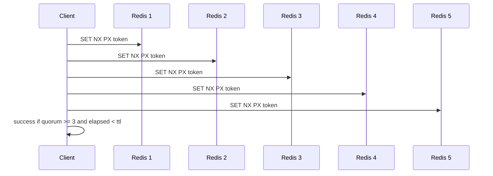

# Go 语言在高并发高可用系统中的实践与解决方案

> 来源整理：根据微信公众号文章《Go语言在高并发高可用系统中的实践与解决方案｜得物技术》提取、总结并重写为技术博客版本。本文不复刻原文表达，而是围绕工程问题、技术方案、代码骨架和落地取舍进行结构化整理。

## 1. 文章摘要

原文围绕 Go 在高并发、高可用系统中的落地实践，选取了五类典型场景：

- 微服务高并发通信：使用 `gRPC + Protocol Buffers + HTTP/2` 降低服务间调用开销。
- 实时消息推送：使用 `WebSocket + Goroutine + Channel` 支撑长连接和消息广播。
- API 网关治理：使用限流、熔断、超时、降级控制入口流量。
- 分布式任务队列：使用 `Redis Stream + Consumer Group` 做异步削峰和可靠消费。
- 分布式锁：使用 Redis/RedLock 思路解决跨节点互斥，但需要理解其适用边界。

文章的核心观点是：Go 的价值不只是语法简单，而在于它把高并发系统中最常见的几个能力内建或低成本化了，包括轻量级协程、调度器、网络库、上下文取消、原子操作、标准库工程化能力和跨平台部署。

## 2. 高并发高可用系统的核心矛盾

高并发系统并不是单纯“把 QPS 做高”。真正难的是在流量突增、依赖抖动、节点故障和数据竞争同时出现时，系统还能维持可解释、可降级、可恢复的状态。

可以把核心矛盾概括为：

| 矛盾 | 典型表现 | Go 侧解决抓手 |
|---|---|---|
| 同步阻塞 vs 高并发 | 每请求一个线程，线程池耗尽，延迟飙升 | Goroutine、非阻塞网络、HTTP/2 |
| 文本协议易用 vs 性能开销 | JSON 体积大、解析慢、类型不稳定 | Protobuf、gRPC |
| 长连接实时性 vs 资源占用 | WebSocket 连接数大，广播容易阻塞 | Goroutine、Channel、连接池 |
| 流量洪峰 vs 后端容量 | 瞬时请求打垮 DB/下游服务 | 限流、熔断、队列削峰 |
| 异步任务可靠性 vs 简单队列 | 消息丢失、重复消费、消费堆积 | Redis Stream、消费者组、幂等 |
| 分布式互斥 vs 故障复杂度 | 锁误删、锁过期、网络分区 | token、TTL、续期、幂等兜底 |

一张总览图如下：



## 3. 场景一：微服务高并发通信，为什么选择 gRPC

### 3.1 问题背景

微服务架构中，服务间通信直接影响整体吞吐和延迟。电商、交易、推荐、履约等系统中，一个入口请求可能串联用户、商品、库存、订单、支付、风控等多个服务。流量高峰时，服务间调用会从“业务实现细节”变成“系统瓶颈”。

传统 `HTTP/1.1 + JSON` 方案容易遇到几个问题：

- 连接复用能力有限，请求多时连接数和上下文切换成本高。
- JSON 是文本协议，体积和序列化成本较高。
- 接口契约弱，字段变更更容易在运行时暴露问题。
- 客户端负载均衡、超时、重试、熔断等治理能力需要额外建设。

### 3.2 方案拆解

`gRPC + Protocol Buffers + HTTP/2` 的组合解决的是“高频服务调用”的通信效率和契约治理问题。



核心收益：

- HTTP/2 多路复用：一个 TCP 连接承载多个并发 stream，减少连接爆炸。
- Protobuf 二进制编码：体积小、解析快、强类型。
- IDL 契约：通过 `.proto` 文件生成多语言客户端和服务端代码。
- 流式 RPC：天然支持客户端流、服务端流、双向流。
- Go runtime：每个请求可以用 Goroutine 处理，调度成本低于 OS 线程。

### 3.3 代码骨架

服务定义：

```proto
syntax = "proto3";

package user.v1;

option go_package = "example.com/app/gen/user/v1;userv1";

service UserService {
  rpc GetUser(GetUserRequest) returns (GetUserResponse);
}

message GetUserRequest {
  int64 user_id = 1;
}

message GetUserResponse {
  int64 user_id = 1;
  string username = 2;
  string email = 3;
}
```

服务端实现：

```go
type UserServer struct {
	userv1.UnimplementedUserServiceServer
}

func (s *UserServer) GetUser(ctx context.Context, req *userv1.GetUserRequest) (*userv1.GetUserResponse, error) {
	if req.UserId <= 0 {
		return nil, status.Error(codes.InvalidArgument, "invalid user_id")
	}

	return &userv1.GetUserResponse{
		UserId:   req.UserId,
		Username: fmt.Sprintf("user_%d", req.UserId),
		Email:    fmt.Sprintf("user_%d@example.com", req.UserId),
	}, nil
}

func main() {
	lis, err := net.Listen("tcp", ":50051")
	if err != nil {
		log.Fatal(err)
	}

	s := grpc.NewServer(
		grpc.MaxConcurrentStreams(1024),
	)
	userv1.RegisterUserServiceServer(s, &UserServer{})

	log.Fatal(s.Serve(lis))
}
```

客户端调用要把超时放在第一位：

```go
ctx, cancel := context.WithTimeout(context.Background(), 200*time.Millisecond)
defer cancel()

resp, err := client.GetUser(ctx, &userv1.GetUserRequest{UserId: 1001})
if err != nil {
	return err
}
fmt.Println(resp.Username)
```

### 3.4 工程取舍

gRPC 适合内部服务间高频调用，不一定适合所有公网 API。公网开放接口仍可能优先使用 HTTP/JSON，因为浏览器、调试工具、网关生态更成熟。

落地时重点关注：

- 必须设置超时，不要让请求无限挂起。
- 重试只适合幂等接口，写接口重试要非常谨慎。
- 服务端要控制最大并发 stream、最大消息体和连接空闲时间。
- Protobuf 字段只能新增，不能随意复用旧字段编号。
- 对外接口需要配合认证、审计、限流和观测。

## 4. 场景二：实时消息推送，WebSocket 的连接治理

### 4.1 问题背景

实时消息推送广泛存在于 IM、直播、协同编辑、在线客服、交易行情、监控告警等场景。传统轮询会带来大量空请求，长轮询又会占用服务端资源并增加复杂度。

WebSocket 提供了全双工长连接，但它把系统挑战从“请求处理”转移到了“连接治理”：

- 单机连接数如何扩展？
- 慢客户端是否拖垮广播？
- 用户连接如何鉴权、续期、踢下线？
- 多节点之间如何找到目标用户所在连接？
- 消息如何保证至少一次、最多一次或最终可达？

### 4.2 典型架构



Go 的优势在于可以为每条连接维护轻量 Goroutine：一个读循环、一个写循环，再通过 Channel 做消息投递。

### 4.3 代码骨架

```go
type Client struct {
	UserID string
	Conn   *websocket.Conn
	Send   chan []byte
}

func (c *Client) readPump() {
	defer c.Conn.Close()
	c.Conn.SetReadLimit(1024 * 64)

	for {
		_, msg, err := c.Conn.ReadMessage()
		if err != nil {
			return
		}
		_ = handleClientMessage(c.UserID, msg)
	}
}

func (c *Client) writePump() {
	ticker := time.NewTicker(30 * time.Second)
	defer func() {
		ticker.Stop()
		c.Conn.Close()
	}()

	for {
		select {
		case msg, ok := <-c.Send:
			if !ok {
				_ = c.Conn.WriteMessage(websocket.CloseMessage, nil)
				return
			}
			if err := c.Conn.WriteMessage(websocket.TextMessage, msg); err != nil {
				return
			}
		case <-ticker.C:
			if err := c.Conn.WriteMessage(websocket.PingMessage, nil); err != nil {
				return
			}
		}
	}
}
```

### 4.4 工程取舍

WebSocket 系统最怕慢连接和无限队列。实践建议：

- 每个连接的发送 Channel 必须有边界，满了就丢弃、降级或断开。
- 心跳既要发现断连，也要避免过于频繁造成额外负载。
- 多实例部署时，连接路由需要借助 Redis、MQ 或一致性路由。
- 重要消息不要只依赖 WebSocket 推送，必须有离线消息或补偿拉取。
- 写循环中不要做复杂业务逻辑，避免阻塞连接发送。

## 5. 场景三：API 网关限流与熔断

### 5.1 问题背景

API 网关是流量入口，也是保护后端系统的第一道防线。没有网关治理时，突发流量会直接打到业务服务、缓存和数据库，导致排队、超时、重试风暴，最后形成级联故障。

高可用网关通常需要同时具备：

- 限流：控制单位时间内请求量。
- 熔断：下游异常时快速失败。
- 超时：不让请求无限占用资源。
- 降级：返回兜底结果或排队提示。
- 隔离：不同租户、接口、调用方互不拖垮。

### 5.2 典型链路



### 5.3 限流代码骨架

Go 官方扩展库 `golang.org/x/time/rate` 提供了令牌桶实现：

```go
type LimiterMiddleware struct {
	limiter *rate.Limiter
}

func NewLimiterMiddleware(r rate.Limit, burst int) *LimiterMiddleware {
	return &LimiterMiddleware{
		limiter: rate.NewLimiter(r, burst),
	}
}

func (m *LimiterMiddleware) Handle(next http.Handler) http.Handler {
	return http.HandlerFunc(func(w http.ResponseWriter, r *http.Request) {
		if !m.limiter.Allow() {
			http.Error(w, "too many requests", http.StatusTooManyRequests)
			return
		}
		next.ServeHTTP(w, r)
	})
}
```

按用户或接口维度限流时，不要只有一个全局 limiter：

```go
type KeyedLimiter struct {
	mu       sync.Mutex
	limiters map[string]*rate.Limiter
}

func (k *KeyedLimiter) Get(key string) *rate.Limiter {
	k.mu.Lock()
	defer k.mu.Unlock()

	limiter := k.limiters[key]
	if limiter == nil {
		limiter = rate.NewLimiter(100, 200)
		k.limiters[key] = limiter
	}
	return limiter
}
```

### 5.4 熔断与超时

熔断器通常按状态机工作：



超时应该通过 `context.Context` 贯穿到下游调用：

```go
ctx, cancel := context.WithTimeout(r.Context(), 300*time.Millisecond)
defer cancel()

req = req.WithContext(ctx)
resp, err := http.DefaultClient.Do(req)
```

### 5.5 工程取舍

限流和熔断不是为了“拒绝用户”，而是为了保证系统在压力下有秩序地失败。

落地建议：

- 限流维度至少包括接口、调用方、租户、用户或 IP。
- 熔断必须配合观测指标，否则阈值只是在拍脑袋。
- 降级响应要被产品和业务接受，不能临时乱返回。
- 重试必须有退避和上限，避免放大流量。
- 网关层保护不了所有问题，业务内部仍要有超时和隔离。

## 6. 场景四：Redis Stream 分布式任务队列

### 6.1 问题背景

异步任务队列常用于订单后置处理、消息通知、积分发放、日志处理、图片转码等场景。简单 Redis List 可以完成基本队列，但在可靠消费、消费组、消息确认、失败重试方面能力有限。

Redis Stream 提供了类似日志流的数据结构，支持：

- 追加写入消息。
- 消费者组。
- Pending Entries List。
- 手动 ACK。
- 按 ID 回溯。
- 多消费者并发消费。

### 6.2 消费模型



### 6.3 Go 代码骨架

生产消息：

```go
func Publish(ctx context.Context, rdb *redis.Client, stream string, values map[string]any) error {
	return rdb.XAdd(ctx, &redis.XAddArgs{
		Stream: stream,
		Values: values,
	}).Err()
}
```

消费者：

```go
func Consume(ctx context.Context, rdb *redis.Client, stream, group, consumer string) error {
	for {
		result, err := rdb.XReadGroup(ctx, &redis.XReadGroupArgs{
			Group:    group,
			Consumer: consumer,
			Streams:  []string{stream, ">"},
			Count:    10,
			Block:    5 * time.Second,
		}).Result()
		if err == redis.Nil {
			continue
		}
		if err != nil {
			return err
		}

		for _, s := range result {
			for _, msg := range s.Messages {
				if err := handleTask(ctx, msg.Values); err != nil {
					continue
				}
				_ = rdb.XAck(ctx, stream, group, msg.ID).Err()
			}
		}
	}
}
```

创建消费组：

```go
err := rdb.XGroupCreateMkStream(ctx, "order_tasks", "order_workers", "$").Err()
if err != nil && !strings.Contains(err.Error(), "BUSYGROUP") {
	return err
}
```

### 6.4 工程取舍

Redis Stream 适合中等规模任务队列和业务内异步流，不等价于 Kafka。

注意点：

- 消费处理必须幂等，因为失败重试可能导致重复消费。
- ACK 要在业务处理成功后执行。
- Pending 消息要有巡检和重新认领机制。
- Stream 长度要裁剪，避免 Redis 内存无限增长。
- 大规模日志流、长期存储和复杂回放更适合 Kafka/Pulsar。

## 7. 场景五：Redis RedLock 与分布式互斥

### 7.1 问题背景

分布式锁用于解决跨进程、跨节点的互斥问题，例如防止重复下单、定时任务多实例抢占、库存扣减、资源分配等。

但分布式锁不是万能药。它只能降低并发冲突概率，不能替代业务幂等、唯一约束和状态机校验。

### 7.2 单 Redis 锁的正确姿势

最基本的 Redis 锁应该满足：

- 加锁使用 `SET key value NX PX ttl`，保证原子加锁和过期。
- value 使用唯一 token，解锁时只删除自己的锁。
- 解锁使用 Lua 脚本，保证比较和删除原子。

```go
func TryLock(ctx context.Context, rdb *redis.Client, key string, ttl time.Duration) (string, bool, error) {
	token := uuid.NewString()
	ok, err := rdb.SetNX(ctx, key, token, ttl).Result()
	return token, ok, err
}

const unlockScript = `
if redis.call("GET", KEYS[1]) == ARGV[1] then
  return redis.call("DEL", KEYS[1])
end
return 0
`

func Unlock(ctx context.Context, rdb *redis.Client, key, token string) error {
	return rdb.Eval(ctx, unlockScript, []string{key}, token).Err()
}
```

### 7.3 RedLock 思路

RedLock 试图在多个独立 Redis 实例上获取锁，只有当多数节点加锁成功，并且总耗时小于锁 TTL 时，才认为加锁成功。



### 7.4 工程取舍

RedLock 有争议，核心原因是分布式系统中的时钟漂移、网络分区、进程暂停和 GC 停顿都可能破坏“锁仍然有效”的假设。

实践建议：

- 如果只是避免重复触发任务，单 Redis 锁 + 幂等通常足够。
- 如果是金融、库存等强一致场景，不要只靠 Redis 锁，应使用数据库唯一约束、事务、乐观锁或共识系统。
- 锁的 TTL 必须小于业务可接受窗口，并为业务执行时间留足余量。
- 长任务需要续期，但续期失败必须能中止或进入补偿。
- 所有加锁保护的业务都要设计幂等。

## 8. Go 支撑高并发的底层能力

原文总结了 Go 在高并发高可用场景中的几个基础能力，可以进一步归纳为：

### 8.1 Goroutine 与调度器

Goroutine 初始栈小、创建成本低，由 Go runtime 通过 M:N 调度映射到 OS 线程。它让“一连接一协程”“一请求一协程”在工程上可行。

### 8.2 Channel 与 Context

Channel 适合表达生产者消费者、连接写队列、任务投递等并发模型。`context.Context` 则是 Go 服务端最重要的取消传播机制，应该贯穿 HTTP、gRPC、DB、Redis 等调用链。

### 8.3 标准库网络能力

`net/http`、`http2`、`net`、`sync`、`atomic`、`pprof`、`expvar` 等标准库让 Go 服务可以低成本具备网络处理、并发控制和性能诊断能力。

### 8.4 编译部署简单

Go 生成单二进制文件，容器镜像小，冷启动快，适合微服务、网关、Worker、边缘节点等场景。

## 9. 落地清单

### 9.1 服务调用

- 所有 RPC/HTTP 调用必须设置超时。
- 重试必须限制次数、加退避，并只用于幂等请求。
- gRPC 接口通过 proto 管理版本，不复用字段编号。
- 配置连接池、最大并发 stream、最大消息大小。

### 9.2 长连接

- 每个连接的发送队列有上限。
- 心跳、读超时、写超时必须配置。
- 重要消息有离线补偿和拉取机制。
- 多节点连接路由要可观测。

### 9.3 网关治理

- 限流维度包括用户、租户、接口、调用方。
- 熔断阈值来自指标，不靠猜。
- 所有下游调用都有超时。
- 降级策略提前和业务约定。

### 9.4 队列与锁

- 异步任务必须幂等。
- Redis Stream 要监控 pending、lag、stream length。
- 分布式锁必须使用唯一 token 和 Lua 解锁。
- 强一致业务不要只依赖 Redis 锁。

## 10. 总结

Go 适合高并发高可用系统，不是因为它能自动解决所有分布式问题，而是因为它降低了构建这些能力的工程成本：

- 用 Goroutine 承载大量并发连接和请求。
- 用 Channel、Context、sync/atomic 构建清晰的并发控制。
- 用 gRPC、WebSocket、Redis Stream 等生态组件覆盖常见高并发场景。
- 用简单部署和强标准库降低运维复杂度。

但最终系统是否可靠，仍取决于工程设计：超时、限流、熔断、幂等、补偿、观测、压测和故障演练缺一不可。Go 提供的是好工具，不是免死金牌。

## 参考来源

- 微信公众号文章：[Go语言在高并发高可用系统中的实践与解决方案｜得物技术](https://mp.weixin.qq.com/s/u8IqBf5H1FGamlYKi5e0Hg)
