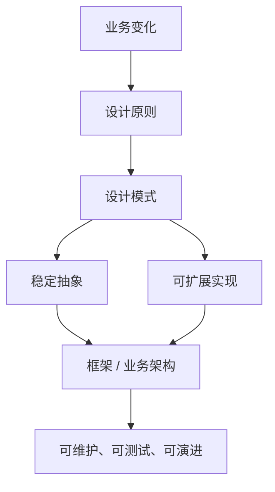
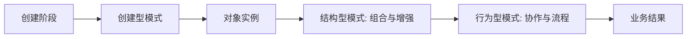
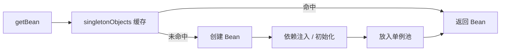
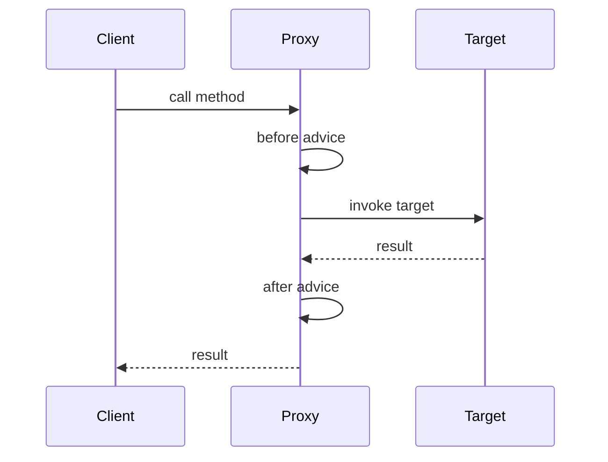
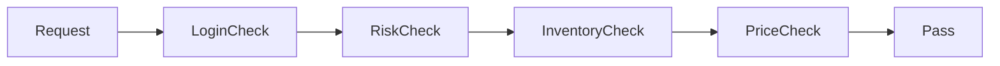
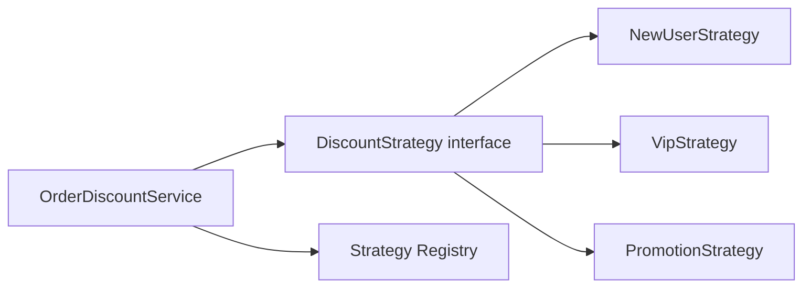

# Java 设计模式：原理、框架应用与实战全解析

> 来源整理：根据微信公众号文章《Java 设计模式：原理、框架应用与实战全解析｜得物技术》提取、总结并重写为技术博客版本。本文不复刻原文大段代码，而是围绕设计原则、模式分类、框架应用和业务重构实践进行结构化整理。

## 1. 文章摘要

设计模式不是语法，也不是为了让代码显得“高级”的模板。它本质上是前人对常见设计问题的经验沉淀，用来解决“需求变化”和“系统复杂度”之间的矛盾。

原文的主线可以概括为：

- 设计模式以面向对象设计原则为基础，目标是高内聚、低耦合。
- GoF 23 种模式可分为创建型、结构型和行为型三类。
- 设计模式大量存在于 Spring、MyBatis、JDK、Servlet 等框架中。
- 实际业务改造时，不应照搬模式，而应围绕扩展点、稳定点和变化点选择模式。

一张图理解设计模式的定位：



## 2. 设计模式的核心思想

设计模式最重要的不是记住名字，而是理解两个基本思想：

- 面向接口编程，而不是面向具体实现编程。
- 优先使用组合，而不是滥用继承。

如果一个系统在新增需求时总是要修改大量旧代码，说明系统缺少稳定抽象；如果一个类承担了太多分支和流程，说明变化点没有被隔离；如果继承层级越来越深，说明复用方式可能已经失控。

## 3. 三类设计模式与生命周期

| 类型 | 关注点 | 生命周期阶段 | 代表模式 |
|---|---|---|---|
| 创建型模式 | 对象如何创建 | 组件创建 | 单例、工厂方法、抽象工厂、建造者、原型 |
| 结构型模式 | 对象如何组合 | 组件使用 | 代理、适配器、装饰器、外观、桥接、组合、享元 |
| 行为型模式 | 对象如何协作 | 组件交互 | 策略、观察者、责任链、模板方法、命令、状态、中介者 |



## 4. 七大设计原则：模式背后的判断标准

| 原则 | 核心含义 | 开发判断 |
|---|---|---|
| 开闭原则 OCP | 对扩展开放，对修改关闭 | 新需求优先“加类”，少改旧逻辑 |
| 依赖倒置 DIP | 依赖抽象，不依赖具体实现 | 通过接口注入，而不是直接 new |
| 合成复用 CRP | 优先组合/聚合，而非继承 | 复用能力先组合，再考虑继承 |
| 单一职责 SRP | 一个类只负责一个核心职责 | 一个类有多个修改原因就该拆 |
| 接口隔离 ISP | 接口保持小而专用 | 避免胖接口迫使实现类写空方法 |
| 里氏替换 LSP | 子类可替换父类且不破坏契约 | 子类不要改变父类语义 |
| 迪米特法则 LOD | 尽量少知道其他对象 | 通过门面、中介、服务层降低耦合 |

这些原则不是教条。真实项目中要权衡复杂度：简单逻辑过度抽象会增加阅读成本；稳定业务缺少抽象则会在后续迭代中快速腐化。

## 5. 创建型模式：把创建和使用分离

创建型模式解决的是“对象怎么来”的问题。核心价值是：使用方不必关心具体实例化过程。

### 5.1 单例模式

单例保证一个类在 JVM 内只有一个实例，并提供全局访问点。它适合配置、连接池、线程池、全局注册表等场景。

推荐写法之一是静态内部类：

```java
public final class AppConfig {
    private AppConfig() {
    }

    private static class Holder {
        private static final AppConfig INSTANCE = new AppConfig();
    }

    public static AppConfig getInstance() {
        return Holder.INSTANCE;
    }
}
```

静态内部类写法利用类加载机制保证线程安全，同时具备延迟加载能力。

在 Spring 中，Bean 默认作用域就是 singleton。Spring 并不是简单套用单例类，而是通过容器缓存统一管理对象生命周期：



### 5.2 工厂方法与抽象工厂

工厂模式用于屏蔽对象创建细节，让调用方依赖抽象。

```java
public interface PaymentService {
    void pay(PaymentRequest request);
}

public class AlipayService implements PaymentService {
    public void pay(PaymentRequest request) {
        // alipay logic
    }
}

public class WechatPayService implements PaymentService {
    public void pay(PaymentRequest request) {
        // wechat pay logic
    }
}

public class PaymentFactory {
    public PaymentService get(String channel) {
        return switch (channel) {
            case "ALIPAY" -> new AlipayService();
            case "WECHAT" -> new WechatPayService();
            default -> throw new IllegalArgumentException("unsupported channel");
        };
    }
}
```

在 Spring 项目中，更推荐把工厂交给容器：

```java
@Component
public class PaymentRouter {
    private final Map<String, PaymentService> services;

    public PaymentRouter(List<PaymentService> paymentServices) {
        this.services = paymentServices.stream()
                .collect(Collectors.toMap(PaymentService::channel, Function.identity()));
    }

    public PaymentService route(String channel) {
        PaymentService service = services.get(channel);
        if (service == null) {
            throw new IllegalArgumentException("unsupported channel");
        }
        return service;
    }
}
```

这其实是“工厂 + 策略 + 依赖倒置”的组合。

### 5.3 建造者模式

建造者适合构造参数很多、对象创建过程复杂、需要保持不可变性的场景。

```java
OrderCreateCommand command = OrderCreateCommand.builder()
        .userId(1001L)
        .skuId(2002L)
        .quantity(2)
        .couponId(3003L)
        .build();
```

它的收益是让对象创建更清晰，但不要为只有两三个字段的简单对象滥用 Builder。

## 6. 结构型模式：组合、适配与增强

结构型模式解决的是“对象之间如何组合”的问题。

### 6.1 代理模式

代理模式为目标对象提供一个替身，在调用前后增加控制逻辑。Spring AOP、事务、权限、缓存、日志都大量使用代理思想。



典型应用：

- Spring AOP：基于 JDK 动态代理或 CGLIB。
- MyBatis Mapper：接口没有实现类，运行时由代理对象执行 SQL。
- RPC Client：本地接口代理远程调用。

### 6.2 适配器模式

适配器用于把不兼容接口转换成系统需要的接口。

```java
public interface SmsSender {
    void send(String phone, String content);
}

public class ThirdPartySmsClient {
    public void push(String mobile, String text) {
        // third-party api
    }
}

public class SmsClientAdapter implements SmsSender {
    private final ThirdPartySmsClient client;

    public SmsClientAdapter(ThirdPartySmsClient client) {
        this.client = client;
    }

    public void send(String phone, String content) {
        client.push(phone, content);
    }
}
```

当外部系统接口变化时，变化被限制在 adapter 内部。

### 6.3 装饰器模式

装饰器用于在不改变原对象的情况下动态增强能力。JDK IO 是经典例子：

```java
InputStream in = new BufferedInputStream(new FileInputStream("data.txt"));
```

业务中也常用于链式增强，例如：

- 原始查询服务。
- 增加缓存装饰。
- 增加监控装饰。
- 增加降级装饰。

装饰器和代理的区别：代理更强调访问控制，装饰器更强调能力叠加。

### 6.4 外观模式

外观模式用一个统一入口隐藏复杂子系统。典型例子是业务应用服务层：

```java
public class OrderFacade {
    public OrderResult createOrder(CreateOrderRequest request) {
        // check user
        // check stock
        // calculate price
        // create order
        // publish event
        return result;
    }
}
```

外观不是“大而全上帝类”。它应该编排流程，不应该吞掉所有业务细节。

## 7. 行为型模式：隔离变化的业务流程

行为型模式解决的是“对象如何协作”的问题。

### 7.1 策略模式

策略模式适合消除大量 `if-else` 或 `switch` 分支。

```java
public interface DiscountStrategy {
    String type();

    Money calculate(OrderContext context);
}

@Component
public class NewUserDiscountStrategy implements DiscountStrategy {
    public String type() {
        return "NEW_USER";
    }

    public Money calculate(OrderContext context) {
        return context.totalAmount().multiply(0.9);
    }
}
```

策略路由：

```java
@Component
public class DiscountService {
    private final Map<String, DiscountStrategy> strategies;

    public DiscountService(List<DiscountStrategy> strategyList) {
        this.strategies = strategyList.stream()
                .collect(Collectors.toMap(DiscountStrategy::type, Function.identity()));
    }

    public Money calculate(String type, OrderContext context) {
        return strategies.get(type).calculate(context);
    }
}
```

### 7.2 责任链模式

责任链适合校验、过滤、审批、风控等顺序处理场景。



代码骨架：

```java
public interface OrderCheckHandler {
    void check(OrderContext context);
}

@Component
public class RiskCheckHandler implements OrderCheckHandler {
    public void check(OrderContext context) {
        if (context.riskLevel().isHigh()) {
            throw new BizException("risk rejected");
        }
    }
}
```

责任链的关键是顺序、短路和可观测性。每个 handler 应该只做一件事。

### 7.3 模板方法模式

模板方法适合流程固定、部分步骤可变的场景，例如导入任务、支付流程、数据同步。

```java
public abstract class AbstractImportTask {
    public final void execute() {
        validate();
        List<?> rows = read();
        process(rows);
        afterCommit();
    }

    protected abstract void validate();

    protected abstract List<?> read();

    protected abstract void process(List<?> rows);

    protected void afterCommit() {
    }
}
```

模板方法的风险是继承耦合较强。如果变化点很多，策略或组合可能比继承更合适。

### 7.4 观察者模式

观察者用于事件发布和订阅。Spring 事件机制就是典型应用。

```java
public record OrderCreatedEvent(Long orderId) {
}

@Component
public class OrderEventListener {
    @EventListener
    public void onOrderCreated(OrderCreatedEvent event) {
        // send coupon, notify, build search index
    }
}
```

观察者适合解耦主流程和后置动作，但重要链路要谨慎异步化，避免失败不可见。

## 8. 框架中的设计模式

| 框架/组件 | 设计模式 | 示例 |
|---|---|---|
| Spring BeanFactory | 工厂、单例 | Bean 创建和单例缓存 |
| Spring AOP | 代理 | 事务、日志、权限、缓存 |
| Spring ApplicationEvent | 观察者 | 事件发布订阅 |
| Spring Template | 模板方法 | JdbcTemplate、RestTemplate |
| MyBatis Mapper | 代理 | Mapper 接口动态代理 |
| Servlet Filter | 责任链 | Web 请求过滤链 |
| JDK IO | 装饰器 | BufferedInputStream 包装 FileInputStream |
| Collections | 适配器/装饰器 | unmodifiableList、synchronizedList |

理解框架中的模式有两个价值：

- 读源码时能更快识别结构。
- 写业务代码时能复用成熟设计，不用重新发明抽象。

## 9. 实战：用模式改造复杂业务分支

假设订单优惠计算最初写成这样：

```java
public Money calculate(Order order, String discountType) {
    if ("NEW_USER".equals(discountType)) {
        return newUserDiscount(order);
    }
    if ("VIP".equals(discountType)) {
        return vipDiscount(order);
    }
    if ("PROMOTION".equals(discountType)) {
        return promotionDiscount(order);
    }
    return Money.zero();
}
```

问题很典型：

- 新增一种优惠要修改老代码，违反开闭原则。
- 一个类承载多个算法，违反单一职责。
- 难以单独测试某个优惠策略。
- 分支越来越多后，回归风险升高。

改造思路：



改造后：

```java
public interface DiscountStrategy {
    DiscountType support();

    Money calculate(Order order);
}

@Service
public class OrderDiscountService {
    private final Map<DiscountType, DiscountStrategy> registry;

    public OrderDiscountService(List<DiscountStrategy> strategies) {
        this.registry = strategies.stream()
                .collect(Collectors.toMap(DiscountStrategy::support, Function.identity()));
    }

    public Money calculate(Order order, DiscountType type) {
        DiscountStrategy strategy = registry.get(type);
        if (strategy == null) {
            return Money.zero();
        }
        return strategy.calculate(order);
    }
}
```

升级收益：

- 新增策略只需要新增类。
- 每个策略可单独单元测试。
- 主流程稳定，变化点局部化。
- 代码结构和业务语义更接近。

## 10. 使用设计模式的反面清单

设计模式不是越多越好。以下情况要警惕：

- 为了模式而模式，把简单逻辑拆成过多类。
- 抽象早于变化，在需求还不稳定时过度设计。
- 模式命名很漂亮，但业务边界没有变清晰。
- 用继承实现复用，导致父类越来越重。
- 所有流程都做成责任链，调试时找不到执行路径。
- 策略过多但没有注册、监控和默认处理。

一个实用判断标准：

> 当一个需求变化已经第二次或第三次以相似方式出现，再抽象通常比第一次就抽象更稳。

## 11. 总结

设计模式的价值不是背诵 23 个名字，而是训练一种工程判断：

- 哪些部分是稳定的？
- 哪些部分会变化？
- 变化点应该被隔离到哪里？
- 扩展是否可以不修改主流程？
- 抽象带来的收益是否大于理解成本？

在 Java 生态中，设计模式几乎无处不在：Spring 的 Bean 管理、AOP、事件机制，MyBatis 的 Mapper 代理，Servlet 的 Filter 链，JDK IO 的装饰器。理解它们，可以帮助我们更好地读框架源码，也能让业务代码更可维护。

最终要记住：设计模式不是代码模板，而是管理复杂度的语言。

## 参考来源

- 微信公众号文章：[Java 设计模式：原理、框架应用与实战全解析｜得物技术](https://mp.weixin.qq.com/s/wcOOVTSW6PGAhNqKXbgkqQ)
