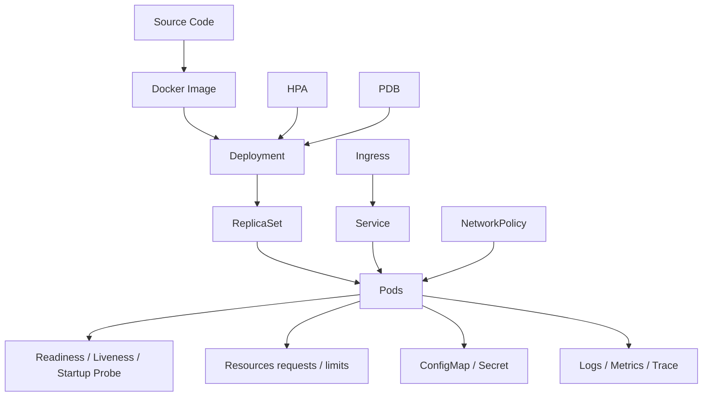
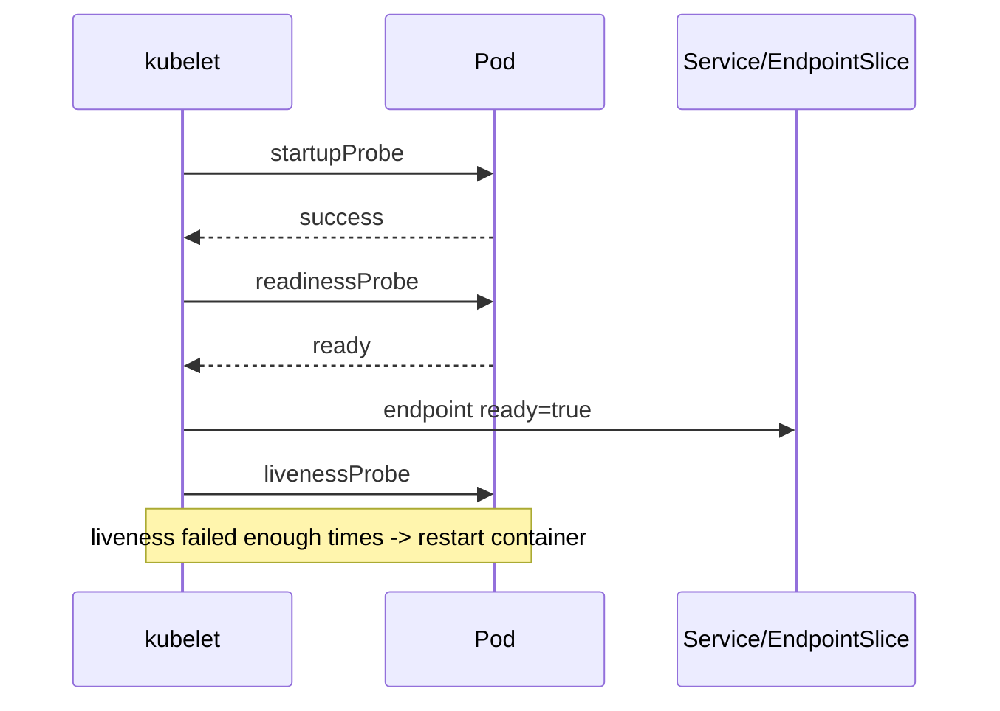
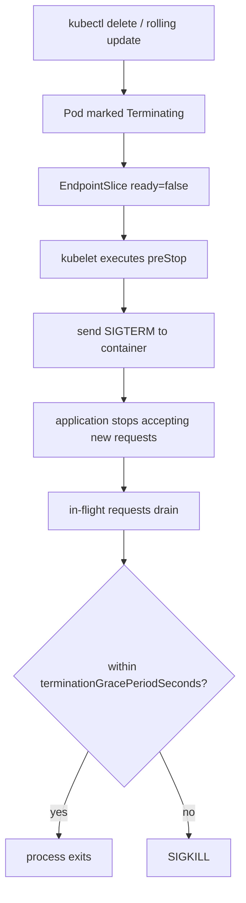
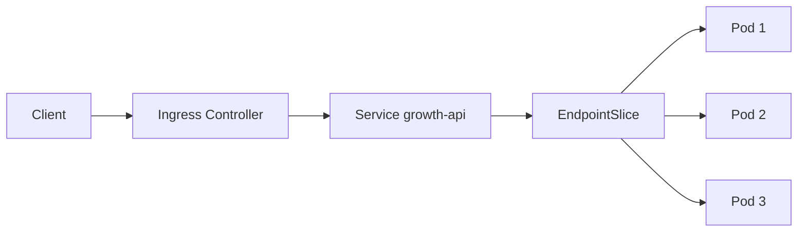

# Kubernetes 应用接入生产实战教程

## 1. 文章摘要

Kubernetes 对后端应用的影响，远远不止“把 jar 包放进容器、写一份 Deployment YAML”。它会改变应用的启动方式、健康检查、发布过程、资源使用、服务发现、日志采集、故障定位和容量治理。

后端最该关心的是：

- K8s 如何影响应用行为。
- K8s 如何影响发布稳定性。
- requests/limits 如何影响 CPU、内存、P99 和 OOM。
- 线上排障如何从接口问题定位到 Pod、Node、Service、Ingress、DNS、存储和控制面。

运维最该关心的是：

- 集群稳定性：Node、kubelet、控制面、etcd。
- 网络：CNI、Service、DNS、Ingress、NetworkPolicy。
- 存储：PV/PVC/CSI、挂载、扩容、备份恢复。
- 安全：RBAC、Secret、镜像、Pod 安全上下文。
- 容量：调度、资源碎片、HPA、节点扩缩容。
- 变更治理：灰度、回滚、配置发布、可观测性。

这篇文章通过一个可运行的 Go Web 服务，完整演示应用接入 Kubernetes 的生产化改造：镜像构建、Deployment、Probe、优雅终止、Service、Ingress、资源限制、配置密钥、HPA、PDB、NetworkPolicy、排障命令和源码分析。

## 2. 实战目标

我们要把一个普通后端服务接入 K8s，并让它具备生产所需的基本能力：



最终你应该能回答：

- 应用启动慢时，startupProbe 怎么保护它？
- 应用依赖数据库未就绪时，readinessProbe 为什么不能直接放行？
- 发布时如何避免新 Pod 没准备好就接流量？
- 删除 Pod 时如何优雅摘流和等待请求处理完成？
- CPU limit 为什么可能导致 P99 抖动？
- OOMKilled 到底是应用问题、配置问题还是节点压力？
- Service 访问不通，如何从 Pod、EndpointSlice、CoreDNS、Ingress 分层定位？

## 3. 示例项目结构

```text
k8s-production-lab/
  app/
    main.go
    go.mod
    Dockerfile
  k8s/
    00-namespace.yaml
    01-config-secret.yaml
    02-deployment.yaml
    03-service.yaml
    04-ingress.yaml
    05-hpa.yaml
    06-pdb.yaml
    07-network-policy.yaml
    08-storage-demo.yaml
```

## 4. 后端服务源码：健康检查与优雅终止

这个服务故意做了几件生产上非常关键的事：

- `/livez`：只判断进程是否活着。
- `/readyz`：判断是否可以接流量。
- `/startupz`：判断启动阶段是否完成。
- 收到 `SIGTERM` 后先把 readiness 置为 false，再等待请求排空。
- 日志里打印实例、版本、request id，方便排障。

`app/go.mod`：

```go
module k8s-production-lab

go 1.22
```

`app/main.go`：

```go
package main

import (
	"context"
	"encoding/json"
	"errors"
	"log"
	"net/http"
	"os"
	"os/signal"
	"sync/atomic"
	"syscall"
	"time"
)

type response struct {
	App       string `json:"app"`
	Version   string `json:"version"`
	Instance  string `json:"instance"`
	RequestID string `json:"request_id,omitempty"`
	Message   string `json:"message"`
}

func main() {
	appName := getenv("APP_NAME", "growth-api")
	version := getenv("APP_VERSION", "v1")
	instance := getenv("HOSTNAME", "local")
	startupDelay := durationEnv("STARTUP_DELAY", 3*time.Second)
	shutdownTimeout := durationEnv("SHUTDOWN_TIMEOUT", 20*time.Second)

	var started atomic.Bool
	var ready atomic.Bool
	var shuttingDown atomic.Bool

	go func() {
		log.Printf("app=%s version=%s instance=%s startup_delay=%s", appName, version, instance, startupDelay)
		time.Sleep(startupDelay)
		started.Store(true)
		ready.Store(true)
		log.Printf("app startup completed")
	}()

	mux := http.NewServeMux()
	mux.HandleFunc("/startupz", func(w http.ResponseWriter, r *http.Request) {
		if !started.Load() {
			http.Error(w, "starting", http.StatusServiceUnavailable)
			return
		}
		_, _ = w.Write([]byte("ok"))
	})

	mux.HandleFunc("/livez", func(w http.ResponseWriter, r *http.Request) {
		_, _ = w.Write([]byte("ok"))
	})

	mux.HandleFunc("/readyz", func(w http.ResponseWriter, r *http.Request) {
		if !ready.Load() || shuttingDown.Load() {
			http.Error(w, "not ready", http.StatusServiceUnavailable)
			return
		}
		_, _ = w.Write([]byte("ok"))
	})

	mux.HandleFunc("/api/hello", func(w http.ResponseWriter, r *http.Request) {
		writeJSON(w, response{
			App:       appName,
			Version:   version,
			Instance:  instance,
			RequestID: r.Header.Get("X-Request-Id"),
			Message:   "hello from kubernetes",
		})
	})

	mux.HandleFunc("/api/slow", func(w http.ResponseWriter, r *http.Request) {
		time.Sleep(2 * time.Second)
		writeJSON(w, response{
			App:      appName,
			Version:  version,
			Instance: instance,
			Message:  "slow request done",
		})
	})

	server := &http.Server{
		Addr:              ":8080",
		Handler:           mux,
		ReadHeaderTimeout: 3 * time.Second,
	}

	go func() {
		log.Printf("http server listen on :8080")
		if err := server.ListenAndServe(); !errors.Is(err, http.ErrServerClosed) {
			log.Fatalf("server failed: %v", err)
		}
	}()

	stop := make(chan os.Signal, 1)
	signal.Notify(stop, syscall.SIGTERM, syscall.SIGINT)
	<-stop

	log.Printf("received shutdown signal, mark readiness=false")
	shuttingDown.Store(true)
	ready.Store(false)

	ctx, cancel := context.WithTimeout(context.Background(), shutdownTimeout)
	defer cancel()
	if err := server.Shutdown(ctx); err != nil {
		log.Printf("graceful shutdown timeout: %v", err)
	}
	log.Printf("server stopped")
}

func getenv(key, fallback string) string {
	v := os.Getenv(key)
	if v == "" {
		return fallback
	}
	return v
}

func durationEnv(key string, fallback time.Duration) time.Duration {
	v := os.Getenv(key)
	if v == "" {
		return fallback
	}
	d, err := time.ParseDuration(v)
	if err != nil {
		return fallback
	}
	return d
}

func writeJSON(w http.ResponseWriter, v any) {
	w.Header().Set("Content-Type", "application/json")
	_ = json.NewEncoder(w).Encode(v)
}
```

### 4.1 应用行为分析

K8s 不会理解你的业务，只会根据容器进程、Probe、资源状态和控制器期望状态做动作。

这意味着：

- 进程活着，不代表可以接流量。
- readiness 通过，不代表依赖链路真的健康，除非你的 `/readyz` 做了正确判断。
- liveness 配太激进，会在高峰期把慢服务反复杀死。
- 没有优雅终止，滚动发布时就可能丢请求。

五年后端视角下，K8s 接入的第一步不是写 YAML，而是改造应用自己的生命周期语义。

## 5. 镜像构建

`app/Dockerfile`：

```dockerfile
FROM golang:1.22-alpine AS builder
WORKDIR /src
COPY go.mod .
COPY main.go .
RUN go build -trimpath -ldflags="-s -w" -o /app main.go

FROM alpine:3.20
RUN addgroup -S app && adduser -S app -G app
WORKDIR /work
COPY --from=builder /app /work/app
USER app
EXPOSE 8080
ENTRYPOINT ["/work/app"]
```

构建镜像：

```bash
docker build -t growth-api:v1 ./app
```

如果使用 kind：

```bash
kind create cluster --name k8s-lab
kind load docker-image growth-api:v1 --name k8s-lab
```

镜像生产建议：

- 使用多阶段构建，减少镜像体积。
- 不使用 `latest`，每次发布用不可变版本号或 digest。
- 尽量非 root 用户运行。
- 在 CI 中做镜像漏洞扫描。
- 镜像启动命令要简单明确，不把复杂业务逻辑塞进 shell 脚本。

## 6. Namespace、配置与密钥

`k8s/00-namespace.yaml`：

```yaml
apiVersion: v1
kind: Namespace
metadata:
  name: growth
```

`k8s/01-config-secret.yaml`：

```yaml
apiVersion: v1
kind: ConfigMap
metadata:
  name: growth-api-config
  namespace: growth
data:
  APP_NAME: growth-api
  STARTUP_DELAY: 3s
  SHUTDOWN_TIMEOUT: 20s
---
apiVersion: v1
kind: Secret
metadata:
  name: growth-api-secret
  namespace: growth
type: Opaque
stringData:
  TOKEN: demo-token
```

配置分析：

- ConfigMap 适合非敏感配置。
- Secret 不等于天然安全，只是以 Secret 对象管理敏感数据，仍要结合 RBAC、etcd 加密和外部密钥系统。
- 环境变量注入的配置不会自动热更新；Volume 投射可以更新，但应用是否感知取决于自身实现。

## 7. Deployment：Probe、资源与优雅终止

`k8s/02-deployment.yaml`：

```yaml
apiVersion: apps/v1
kind: Deployment
metadata:
  name: growth-api
  namespace: growth
  labels:
    app: growth-api
spec:
  replicas: 3
  revisionHistoryLimit: 5
  strategy:
    type: RollingUpdate
    rollingUpdate:
      maxSurge: 1
      maxUnavailable: 0
  selector:
    matchLabels:
      app: growth-api
  template:
    metadata:
      labels:
        app: growth-api
        version: v1
    spec:
      terminationGracePeriodSeconds: 40
      securityContext:
        seccompProfile:
          type: RuntimeDefault
      containers:
        - name: app
          image: growth-api:v1
          imagePullPolicy: IfNotPresent
          ports:
            - name: http
              containerPort: 8080
          env:
            - name: APP_VERSION
              value: v1
          envFrom:
            - configMapRef:
                name: growth-api-config
            - secretRef:
                name: growth-api-secret
          startupProbe:
            httpGet:
              path: /startupz
              port: http
            periodSeconds: 2
            failureThreshold: 30
          readinessProbe:
            httpGet:
              path: /readyz
              port: http
            periodSeconds: 5
            timeoutSeconds: 1
            failureThreshold: 2
          livenessProbe:
            httpGet:
              path: /livez
              port: http
            periodSeconds: 10
            timeoutSeconds: 1
            failureThreshold: 3
          lifecycle:
            preStop:
              exec:
                command:
                  - /bin/sh
                  - -c
                  - sleep 8
          resources:
            requests:
              cpu: "200m"
              memory: "256Mi"
            limits:
              cpu: "1"
              memory: "512Mi"
          securityContext:
            allowPrivilegeEscalation: false
            runAsNonRoot: true
            runAsUser: 1000
            capabilities:
              drop:
                - ALL
```

### 7.1 Probe 分析



`startupProbe` 用来保护慢启动应用。在 startupProbe 成功之前，其他 probe 会被延后，避免应用还在启动就被 liveness 杀掉。

`readinessProbe` 决定 Pod 是否进入 Service Endpoint。发布稳定性很大程度取决于 readiness 是否准确。如果应用只判断进程活着，数据库、缓存、配置、预热都没完成就接流量，滚动发布时就会出现“Pod Running 但接口失败”。

`livenessProbe` 只应该判断进程是否不可恢复。不要把外部依赖放进 liveness，否则数据库抖动会导致所有应用 Pod 被 K8s 重启，问题会被放大。

### 7.2 优雅终止分析

Pod 删除或滚动更新时，大致流程是：



应用要主动处理 `SIGTERM`。K8s 只能发信号，不能保证你的应用真的停止接新请求，也不能替你的线程池、连接池和请求队列做排空。

`terminationGracePeriodSeconds` 要大于应用排空时间、preStop 时间和框架 shutdown 时间。太短会丢请求，太长会影响发布速度和故障恢复。

### 7.3 资源配置分析

`requests` 主要影响调度和资源预留。scheduler 根据 requests 判断 Pod 能不能放到某个 Node 上。

`limits` 是运行时上限。CPU limit 可能导致 CFS throttling，表现为 CPU 使用率看起来没满，但接口 P99 抖动。Memory limit 超过后可能触发 OOMKilled。

生产经验：

- 核心在线服务不要把 CPU limit 设得过低。
- 内存 limit 要覆盖堆、堆外、线程栈、连接缓冲、native memory。
- JVM 服务要显式理解容器内存，Go 服务要关注 GC、goroutine、连接池和大对象。
- requests 过小会造成节点过度超卖，requests 过大会造成资源碎片和成本浪费。

## 8. Service 与 Ingress

`k8s/03-service.yaml`：

```yaml
apiVersion: v1
kind: Service
metadata:
  name: growth-api
  namespace: growth
spec:
  type: ClusterIP
  selector:
    app: growth-api
  ports:
    - name: http
      port: 80
      targetPort: http
```

`k8s/04-ingress.yaml`：

```yaml
apiVersion: networking.k8s.io/v1
kind: Ingress
metadata:
  name: growth-api
  namespace: growth
  annotations:
    nginx.ingress.kubernetes.io/proxy-connect-timeout: "1"
    nginx.ingress.kubernetes.io/proxy-read-timeout: "5"
    nginx.ingress.kubernetes.io/proxy-send-timeout: "5"
spec:
  ingressClassName: nginx
  rules:
    - host: growth.local
      http:
        paths:
          - path: /
            pathType: Prefix
            backend:
              service:
                name: growth-api
                port:
                  name: http
```

流量路径：



Service 本身不是进程，它是 Kubernetes 里的服务抽象。真正可转发的后端来自 EndpointSlice。如果 Service 访问不通，第一反应不应该只看 Service YAML，而应该看 EndpointSlice 是否存在 ready endpoints。

排查命令：

```bash
kubectl get svc -n growth
kubectl get endpointslice -n growth -l kubernetes.io/service-name=growth-api
kubectl describe ingress growth-api -n growth
kubectl logs -n ingress-nginx deploy/ingress-nginx-controller
```

## 9. HPA、PDB 与容量治理

`k8s/05-hpa.yaml`：

```yaml
apiVersion: autoscaling/v2
kind: HorizontalPodAutoscaler
metadata:
  name: growth-api
  namespace: growth
spec:
  scaleTargetRef:
    apiVersion: apps/v1
    kind: Deployment
    name: growth-api
  minReplicas: 3
  maxReplicas: 10
  metrics:
    - type: Resource
      resource:
        name: cpu
        target:
          type: Utilization
          averageUtilization: 60
```

`k8s/06-pdb.yaml`：

```yaml
apiVersion: policy/v1
kind: PodDisruptionBudget
metadata:
  name: growth-api
  namespace: growth
spec:
  minAvailable: 2
  selector:
    matchLabels:
      app: growth-api
```

HPA 不是瞬时扩容神器。它依赖指标采集、计算周期、镜像拉取、调度、启动、readiness 通过，这些都会带来延迟。大促、抢券、秒杀场景不能只依赖 HPA，通常需要提前预扩容。

PDB 用于约束自愿驱逐，比如节点维护、集群升级。它不能防止节点宕机，也不能防止应用自己 Crash。

容量治理要看：

- 单 Pod QPS、P95/P99。
- CPU throttling。
- 内存 RSS、OOMKilled。
- 副本数和可用区分布。
- Node 资源碎片。
- HPA 扩容速度。
- Ingress、Service、CoreDNS 是否成为瓶颈。

## 10. NetworkPolicy 与安全边界

`k8s/07-network-policy.yaml`：

```yaml
apiVersion: networking.k8s.io/v1
kind: NetworkPolicy
metadata:
  name: growth-api-ingress-only
  namespace: growth
spec:
  podSelector:
    matchLabels:
      app: growth-api
  policyTypes:
    - Ingress
  ingress:
    - from:
        - namespaceSelector:
            matchLabels:
              kubernetes.io/metadata.name: ingress-nginx
      ports:
        - protocol: TCP
          port: 8080
```

注意：NetworkPolicy 是否生效取决于 CNI 插件是否支持。配置了 YAML 但 CNI 不支持，策略可能不会真正拦截流量。

安全接入清单：

- Pod 非 root 运行。
- drop Linux capabilities。
- 不挂载宿主机敏感目录。
- Secret 最小权限读取。
- ServiceAccount 最小 RBAC。
- 镜像来源可信、版本不可变。
- 对外入口统一走 Ingress 或网关。
- 命名空间按业务、环境或租户隔离。

## 11. 存储示例与边界

`k8s/08-storage-demo.yaml`：

```yaml
apiVersion: v1
kind: PersistentVolumeClaim
metadata:
  name: growth-api-data
  namespace: growth
spec:
  accessModes:
    - ReadWriteOnce
  resources:
    requests:
      storage: 1Gi
---
apiVersion: apps/v1
kind: Deployment
metadata:
  name: growth-api-with-storage
  namespace: growth
spec:
  replicas: 1
  selector:
    matchLabels:
      app: growth-api-with-storage
  template:
    metadata:
      labels:
        app: growth-api-with-storage
    spec:
      containers:
        - name: app
          image: growth-api:v1
          ports:
            - containerPort: 8080
          volumeMounts:
            - name: data
              mountPath: /data
      volumes:
        - name: data
          persistentVolumeClaim:
            claimName: growth-api-data
```

这个例子只是说明 PVC 接入方式，不代表普通 Web 服务一定要挂持久盘。多数无状态后端应把状态放到数据库、Redis、MQ、对象存储，而不是写在容器文件系统里。

有状态服务放 K8s 时要单独设计：

- 数据备份。
- 数据恢复。
- 存储扩容。
- 跨节点迁移。
- 可用区拓扑。
- StatefulSet 升级策略。
- CSI 插件稳定性。

## 12. 操作步骤

### 12.1 创建集群和镜像

```bash
kind create cluster --name k8s-lab
docker build -t growth-api:v1 ./app
kind load docker-image growth-api:v1 --name k8s-lab
```

### 12.2 部署应用

```bash
kubectl apply -f k8s/00-namespace.yaml
kubectl apply -f k8s/01-config-secret.yaml
kubectl apply -f k8s/02-deployment.yaml
kubectl apply -f k8s/03-service.yaml
```

查看状态：

```bash
kubectl get deploy,pod,svc -n growth -o wide
kubectl describe deploy growth-api -n growth
kubectl get events -n growth --sort-by=.lastTimestamp
```

### 12.3 本地访问

```bash
kubectl port-forward -n growth svc/growth-api 8080:80
curl -H "X-Request-Id: demo-001" http://localhost:8080/api/hello
```

### 12.4 发布新版本

构建 v2：

```bash
docker build -t growth-api:v2 ./app
kind load docker-image growth-api:v2 --name k8s-lab
```

更新镜像：

```bash
kubectl set image deployment/growth-api app=growth-api:v2 -n growth
kubectl rollout status deployment/growth-api -n growth
```

回滚：

```bash
kubectl rollout history deployment/growth-api -n growth
kubectl rollout undo deployment/growth-api -n growth
```

### 12.5 模拟 Pod 删除与优雅终止

```bash
kubectl get pod -n growth
kubectl delete pod -n growth -l app=growth-api
kubectl get pod -n growth -w
kubectl logs -n growth -l app=growth-api --tail=100
```

观察应用日志中是否出现 `received shutdown signal`，以及是否能在终止期间停止接新流量。

### 12.6 模拟常见故障

镜像拉取失败：

```bash
kubectl set image deployment/growth-api app=growth-api:not-exist -n growth
kubectl describe pod -n growth -l app=growth-api
kubectl rollout undo deployment/growth-api -n growth
```

资源过小导致异常：

```bash
kubectl edit deployment growth-api -n growth
```

把 memory limit 调得很小后，观察：

```bash
kubectl get pod -n growth
kubectl describe pod <pod-name> -n growth
kubectl logs <pod-name> -n growth --previous
```

Service 无 endpoint：

```bash
kubectl get endpointslice -n growth
kubectl get pod -n growth --show-labels
kubectl describe svc growth-api -n growth
```

## 13. 线上排障 SOP

### 13.1 Pod 异常

```bash
kubectl get pod -n growth -o wide
kubectl describe pod <pod> -n growth
kubectl logs <pod> -n growth
kubectl logs <pod> -n growth --previous
kubectl get events -n growth --sort-by=.lastTimestamp
```

判断：

- `ImagePullBackOff`：镜像名、tag、仓库权限、节点网络。
- `CrashLoopBackOff`：应用启动失败、配置错误、依赖不可用。
- `OOMKilled`：内存 limit、泄漏、大对象、节点压力。
- `Pending`：资源不足、PVC 未绑定、调度约束、污点未容忍。
- `Running but not Ready`：readiness 失败，查应用依赖和健康接口。

### 13.2 发布异常

```bash
kubectl rollout status deploy/growth-api -n growth
kubectl describe deploy growth-api -n growth
kubectl get rs -n growth
kubectl get pod -n growth -l app=growth-api
```

重点看：

- 新 ReplicaSet 是否创建。
- 新 Pod 是否 Pending。
- readiness 是否通过。
- maxSurge/maxUnavailable 是否导致发布卡住。
- PDB 是否阻止驱逐。
- 新版本配置是否缺失。

### 13.3 网络异常

```bash
kubectl get svc,endpointslice -n growth
kubectl exec -n growth deploy/growth-api -- nslookup growth-api.growth.svc.cluster.local
kubectl exec -n growth deploy/growth-api -- wget -qO- http://growth-api.growth.svc.cluster.local/api/hello
kubectl describe ingress growth-api -n growth
```

分层判断：

- Pod IP 能访问吗？
- Service 有 endpoint 吗？
- CoreDNS 解析正常吗？
- kube-proxy 或 CNI 是否异常？
- Ingress Controller 是否把请求转到正确 Service？
- NetworkPolicy 是否拦截？

### 13.4 节点与集群异常

```bash
kubectl get node -o wide
kubectl describe node <node>
kubectl top node
kubectl top pod -A
kubectl get pods -A -o wide | grep <node>
```

关注：

- Node Ready/NotReady。
- MemoryPressure、DiskPressure、PIDPressure。
- kubelet 状态。
- 容器运行时状态。
- 镜像垃圾回收。
- 节点磁盘和 inode。

### 13.5 控制面异常

生产集群还要看：

- apiserver latency。
- etcd fsync、leader、db size。
- scheduler pending queue。
- controller-manager workqueue。
- kubelet 同步延迟。
- watch/list 压力。

这些不是普通业务开发每天都查，但五年后端需要知道：如果所有 namespace 都异常，问题大概率不在某个 Deployment YAML，而在控制面、节点或网络基础设施。

## 14. 源码精读：K8s 如何驱动这些行为

### 14.1 Deployment 滚动发布

源码路径：

- `pkg/controller/deployment/deployment_controller.go`
- `pkg/controller/deployment/rolling.go`
- `pkg/controller/replicaset/replica_set.go`

核心逻辑：

Deployment Controller 监听 Deployment、ReplicaSet、Pod 变化，然后不断 reconcile 当前状态和期望状态。滚动发布不是一次性命令，而是控制器持续调整新旧 ReplicaSet 副本数。

`maxSurge` 决定最多额外创建多少 Pod，`maxUnavailable` 决定发布期间最多允许多少不可用。对核心服务，`maxUnavailable: 0` 更稳，但会消耗额外容量。

### 14.2 Probe 与 kubelet

源码路径：

- `pkg/kubelet/prober/`
- `pkg/kubelet/status/status_manager.go`
- `pkg/kubelet/kubelet.go`

核心逻辑：

kubelet 在节点上周期性执行 probe，并根据结果更新 Pod status。readiness 失败会影响 EndpointSlice ready 状态，liveness 失败会触发容器重启，startupProbe 成功前会保护其他 probe 不过早介入。

Probe 是应用和 K8s 之间的健康契约。契约写错，K8s 会非常认真地执行错误动作。

### 14.3 Pod 终止与容器运行时

源码路径：

- `pkg/kubelet/kuberuntime/kuberuntime_container.go`
- `pkg/kubelet/kuberuntime/kuberuntime_manager.go`
- `pkg/kubelet/pod_workers.go`

核心逻辑：

kubelet 负责执行 preStop、发送停止容器请求，并通过 CRI 调用 containerd/CRI-O。容器运行时最终向进程发送信号并等待退出。超过 grace period 后，容器会被强制终止。

所以优雅终止不是 K8s 单方面能完成的，它需要应用处理 SIGTERM、停止接流量、排空请求。

### 14.4 Service、EndpointSlice 与 kube-proxy

源码路径：

- `pkg/controller/endpointslice/`
- `pkg/proxy/`
- `pkg/proxy/iptables/`
- `pkg/proxy/ipvs/`

核心逻辑：

EndpointSlice Controller 根据 Service selector 和 Pod readiness 维护 EndpointSlice。kube-proxy 监听 Service 和 EndpointSlice，把它们转换成节点上的转发规则。

Service 访问不通，要先确认 endpoint 是否存在，再看 kube-proxy/CNI/DNS。只盯着 Service YAML 看，很容易误判。

### 14.5 调度、资源与驱逐

源码路径：

- `pkg/scheduler/`
- `pkg/kubelet/eviction/`
- `pkg/kubelet/cm/`

核心逻辑：

Scheduler 根据 requests、亲和性、污点容忍、拓扑分布等条件选择节点。kubelet 在节点资源紧张时根据 QoS、优先级和使用量进行驱逐。

内存 request 不等于硬限制，memory limit 才更接近运行时上限。CPU request 影响调度和权重，CPU limit 可能引入 throttling。

## 15. 生产经常改造的地方

### 15.1 启动改造

问题：

- 应用启动慢。
- 缓存预热没完成。
- 依赖配置中心或数据库未就绪。
- Pod Running 但接口不可用。

改造：

- 增加 startupProbe。
- readiness 等待关键依赖。
- 启动失败要快速暴露错误。
- 镜像启动命令不要隐藏异常。

### 15.2 健康检查改造

问题：

- liveness 调了数据库，数据库抖动导致 Pod 全部重启。
- readiness 太浅，新 Pod 过早接流量。
- probe 超时时间太短，高峰期误判。

改造：

- liveness 只查不可恢复死锁或进程存活。
- readiness 查接流量条件。
- startupProbe 保护慢启动。
- probe 接口要轻量，不依赖复杂业务链路。

### 15.3 发布流程改造

问题：

- 手动 apply 不可审计。
- 发布失败不能快速回滚。
- 新版本未 ready 就接流量。
- 删除旧 Pod 时请求丢失。

改造：

- 使用 Helm/Kustomize/GitOps。
- 设置合理 rollingUpdate。
- 增加 PDB 和拓扑分布。
- 应用处理 SIGTERM。
- 发布后观察错误率、P99、重启次数。

### 15.4 资源配置改造

问题：

- requests 太小，节点过度超卖。
- limits 太小，CPU throttling 或 OOMKilled。
- 不同服务混跑导致互相影响。

改造：

- 按压测和历史指标设置 requests。
- 核心服务谨慎设置 CPU limit。
- 内存 limit 覆盖真实峰值。
- 用 namespace quota 和 limit range 做治理。

### 15.5 网络入口改造

问题：

- Ingress timeout 不匹配。
- Header 丢失。
- WebSocket/gRPC 配置缺失。
- TLS 证书过期。
- Service 无 endpoint。

改造：

- 统一 Ingress 规范。
- 透传 trace id、真实 IP、协议。
- 对慢接口拆单独超时。
- 证书自动续期。
- 给入口层加限流和观测。

### 15.6 可观测性改造

问题：

- Pod 重启后日志丢失。
- 没有 request id。
- 告警只知道服务不可用，不知道哪个 Pod/Node/版本。

改造：

- 日志包含 namespace、pod、node、version、request id。
- 指标包含 QPS、错误率、P99、CPU、内存、重启、OOM、throttling。
- 链路追踪覆盖 Ingress、应用、RPC、DB、MQ。
- 事件和 rollout 历史纳入发布看板。

## 16. 热门生产场景与改造方案

### 16.1 Java/Go 应用容器化最容易踩哪些坑？

Java 服务：

- JVM 堆、直接内存、Metaspace、线程栈、JIT、GC native memory 都会消耗容器内存。
- 只设置 `-Xmx` 不够，还要给堆外和系统预留空间。
- CPU limit 太低会影响 GC、线程调度和 P99。
- 启动慢要配 startupProbe，避免被 liveness 误杀。

Go 服务：

- Go runtime 会感知 CPU，但高版本才更好支持容器资源约束。
- goroutine、连接池、大对象、日志 buffer 都可能导致内存上涨。
- CPU throttling 会让 tail latency 抖动。
- 要处理 SIGTERM，关闭 HTTP server、RPC client、MQ consumer。

我的经验是：容器化不是把进程关进盒子，而是把应用资源使用显式化。以前在物理机上被机器余量掩盖的问题，到了 K8s 会被 requests/limits 放大出来。

### 16.2 发布时如何避免“新 Pod Ready 但业务不可用”？

要把 readiness 从“进程存活”改成“可接流量”：

```go
// 伪代码：readiness 可以检查本地初始化和关键依赖，但不要做重型调用
func ready() bool {
    return cacheWarmed &&
        configLoaded &&
        dbPoolInitialized &&
        downstreamCircuitReady
}
```

注意：

- readiness 不要每次都查慢 SQL。
- 不要把偶发外部依赖失败直接变成全量 NotReady。
- 缓存预热、配置加载、线程池初始化必须纳入启动流程。
- 发布后要看新版本 Pod 的错误率，而不是只看 rollout success。

### 16.3 大促前 K8s 容量怎么评估？

容量评估可以按链路分层：


估算方式：

- 单 Pod 在目标 P99 下能承载多少 QPS。
- 峰值 QPS / 单 Pod QPS = 理论副本数。
- 再乘以冗余系数，例如 1.3 到 2。
- 检查 Node 是否有足够 requests 容量。
- 检查 Ingress、CoreDNS、下游依赖是否同步扩容。

HPA 只能兜底，不能替代大促预扩容。尤其是镜像拉取慢、启动慢、readiness 慢的服务，等 HPA 扩起来时第一波流量已经打穿了。

### 16.4 多可用区部署如何降低单点风险？

核心服务建议配置拓扑分布：

```yaml
topologySpreadConstraints:
  - maxSkew: 1
    topologyKey: topology.kubernetes.io/zone
    whenUnsatisfiable: ScheduleAnyway
    labelSelector:
      matchLabels:
        app: growth-api
```

分析：

- Pod 尽量跨可用区分布，降低单 AZ 故障影响。
- `ScheduleAnyway` 更偏可用性，资源不足时仍允许调度。
- `DoNotSchedule` 更严格，但可能导致 Pending。
- 还要配合 PDB、反亲和、节点池和入口流量切换。

### 16.5 配置发布如何避免全量事故？

配置比代码更容易造成事故，因为它经常绕过完整测试。建议：

- ConfigMap/Secret 变更进入 Git。
- 配置分环境、分业务、分版本。
- 应用启动时校验必要配置。
- 配置变更触发灰度发布，而不是全量热更新。
- 高风险配置加开关和回滚路径。

如果配置通过环境变量注入，ConfigMap 更新不会自动改变已运行进程。生产里常见做法是变更配置后滚动重启，或者用专门的动态配置中心。

### 16.6 集群节点 NotReady 怎么判断影响面？

第一步不是立刻重启节点，而是判断：

- 哪些 Pod 在这个 Node 上。
- 是否有核心服务单副本落在该节点。
- PDB 是否允许驱逐。
- 是否有本地盘或 hostPath。
- Node 是 NotReady 还是 Unknown。
- kubelet、容器运行时、网络插件是否异常。

命令：

```bash
kubectl get node -o wide
kubectl describe node <node>
kubectl get pod -A -o wide | grep <node>
kubectl get events -A --sort-by=.lastTimestamp
```

如果是节点级故障，应用团队和平台团队要一起看：应用是否有足够副本，调度是否能迁移，存储是否允许迁移，入口流量是否已经避开异常节点。

### 16.7 CoreDNS 抖动为什么会拖垮业务？

很多应用在请求下游时依赖 DNS。CoreDNS 抖动会表现为：

- 应用连接下游偶发超时。
- 服务名解析慢。
- 短连接服务错误率升高。
- 日志里看不到明显业务异常。

治理方式：

- 应用侧连接池和 DNS 缓存合理配置。
- 减少高频短连接。
- CoreDNS 扩副本、加缓存、看 QPS 和 latency。
- 检查 ndots 配置导致的无效查询放大。
- 对核心下游使用稳定服务名和连接复用。

### 16.8 K8s 中如何做灰度和回滚？

常见方式：

- Deployment 滚动发布：简单稳定，适合大多数服务。
- 多 Deployment + Service selector：可以做版本隔离。
- Ingress 按 Header/Cookie/权重灰度：适合入口流量控制。
- Service Mesh：适合复杂流量治理。
- Argo Rollouts：适合自动化金丝雀和指标回滚。

关键点：

- 灰度必须绑定指标：错误率、P99、业务转化、下游依赖。
- 回滚要验证配置、镜像、数据库变更是否可逆。
- 只会 `kubectl rollout undo` 不等于会发布治理。

## 17. 面试追问与回答

### 17.1 K8s 中 Pod Running 是否代表应用可用？

回答：不代表。Running 只表示 Pod 已经绑定节点，容器进程可能已经启动。应用是否能接流量由 readiness 决定。生产中我更关注 Ready 状态、EndpointSlice 和业务健康接口。

### 17.2 readiness 和 liveness 最大区别是什么？

回答：readiness 决定是否接流量，失败时 Pod 不会被重启；liveness 判断容器是否需要重启，失败次数达到阈值会触发重启。把外部依赖放进 liveness 是常见事故源。

### 17.3 为什么 startupProbe 对慢启动应用很重要？

回答：没有 startupProbe 时，liveness 可能在应用初始化期间就开始探测，导致慢启动应用被反复杀死。startupProbe 成功前，其他 probe 会被保护起来，适合 JVM、缓存预热、模型加载等场景。

### 17.4 滚动发布为什么要设置 maxUnavailable: 0？

回答：核心在线服务通常不能在发布时主动减少可用副本。`maxUnavailable: 0` 可以保证旧副本在新副本 ready 前不被减少，但代价是需要额外容量，所以要和 `maxSurge`、资源配额一起评估。

### 17.5 CPU limit 为什么会造成 P99 抖动？

回答：CPU limit 会触发 CFS quota 限制，容器达到配额后会被 throttling。应用看到的现象可能是 CPU 使用率不高但延迟上升，尤其是 Go/JVM 在线服务高峰期更明显。

### 17.6 OOMKilled 怎么判断是应用泄漏还是 limit 不合理？

回答：先看容器内存曲线、重启前日志、`kubectl describe pod` 的 Last State，再对比历史峰值、流量、版本变更和 limit 设置。如果内存线性增长，多半是泄漏；如果流量峰值瞬间超过 limit，可能是容量配置问题。

### 17.7 Service 访问不通你会怎么排？

回答：先查 Pod 是否 Ready，再查 Service selector 是否匹配，再查 EndpointSlice 是否有 ready endpoint，然后从同 namespace Pod 内访问 Service DNS。如果 endpoint 正常再查 CoreDNS、kube-proxy、CNI、NetworkPolicy 和 Ingress。

### 17.8 HPA 能不能解决大促流量突增？

回答：不能完全依赖。HPA 有指标采集、扩容计算、调度、镜像拉取和启动延迟。大促要预扩容，HPA 用来兜底平滑波动，而不是承担第一波峰值。

### 17.9 为什么应用要处理 SIGTERM？

回答：滚动发布、缩容、节点维护都会终止 Pod。应用如果不处理 SIGTERM，就可能在请求处理中被杀。正确做法是收到 SIGTERM 后停止接新请求，等待 in-flight 请求完成，再退出。

### 17.10 有状态服务是否适合放 K8s？

回答：K8s 可以通过 StatefulSet、PVC、CSI 承载有状态服务，但不自动解决数据一致性、备份恢复、性能和跨可用区容灾。是否放 K8s 取决于团队运维能力、存储能力和业务 RTO/RPO。

### 17.11 Deployment、ReplicaSet、Pod 三者是什么关系？

回答：Deployment 管发布策略和期望版本，ReplicaSet 管某个模板版本的副本数，Pod 是实际运行实例。滚动发布时 Deployment 会创建新 ReplicaSet、缩放新旧 ReplicaSet，最终让新 Pod 替代旧 Pod。

### 17.12 requests 和 limits 的区别是什么？

回答：requests 用于调度和资源预留，limits 是运行时上限。CPU request 影响调度和 CPU 权重，CPU limit 可能导致 throttling；memory request 影响调度、QoS 和驱逐，memory limit 超过可能 OOMKilled。

### 17.13 QoS 等级有什么生产意义？

回答：QoS 影响节点资源紧张时的驱逐优先级。Guaranteed 最稳，但资源成本高；Burstable 是多数在线服务常见选择；BestEffort 最容易被驱逐，不适合核心服务。生产里我会让核心服务至少有合理 requests，避免被当成低优先级负载。

### 17.14 Pod Pending 一般怎么排查？

回答：看 `kubectl describe pod` 的 Events。常见原因是 CPU/内存 requests 不满足、节点 taint 未容忍、亲和性过严、PVC 未绑定、镜像拉取 Secret 缺失、节点不可调度。Pending 是调度问题，不是应用代码已经启动失败。

### 17.15 CrashLoopBackOff 和 ImagePullBackOff 有什么区别？

回答：ImagePullBackOff 是镜像还没拉下来，容器根本没启动；CrashLoopBackOff 是容器启动后进程反复退出。前者查镜像名、仓库权限、网络；后者查应用日志、启动命令、配置、依赖和资源。

### 17.16 为什么 liveness 不能依赖数据库？

回答：数据库抖动时，如果 liveness 依赖数据库，所有 Pod 都可能被 kubelet 重启，导致连接风暴和故障扩大。数据库依赖更适合影响 readiness 或业务熔断，不应该轻易作为“进程不可恢复”的判断。

### 17.17 Ingress 502/504 和应用 Pod 有什么关系？

回答：Ingress 502 可能是 Service 无 endpoint、Pod 未 ready、后端端口不通、协议不匹配；504 多半是 upstream 超时。排查要从 Ingress 日志看 upstream，再看 Service、EndpointSlice、Pod readiness 和应用日志。

### 17.18 ConfigMap 更新后应用为什么没生效？

回答：环境变量注入不会动态更新；Volume 投射更新也有同步延迟，而且应用要自己监听文件变化。很多团队选择配置变更后触发滚动发布，保证配置版本和应用版本可追踪。

### 17.19 PDB 能不能保证服务永远可用？

回答：不能。PDB 只约束自愿驱逐，比如节点维护和升级。节点宕机、Pod Crash、OOM、强制删除不受 PDB 完全保护。PDB 是发布和维护稳定性的工具，不是高可用的全部。

### 17.20 StatefulSet 和 Deployment 最大区别是什么？

回答：StatefulSet 提供稳定身份、稳定网络名、有序部署和稳定 PVC，适合有状态服务。Deployment 更适合无状态服务，Pod 身份可替换。真正的区别不是“能不能挂盘”，而是实例身份和数据绑定关系。

### 17.21 kube-proxy、CNI、CoreDNS 分别影响什么？

回答：CNI 负责 Pod 网络和跨节点通信；kube-proxy 负责 Service 到 Endpoint 的转发规则；CoreDNS 负责服务名解析。Service 访问失败时，这三层都可能有关，要按 DNS、VIP、Pod IP 分层排查。

### 17.22 如何判断问题在 K8s 还是应用？

回答：先看应用自身日志和健康接口，再看 Pod Events、Probe、资源、重启；如果多个服务同时异常，再看 Node、DNS、Ingress、CNI、apiserver。我的习惯是先缩小范围：单 Pod、单服务、单 Node、单 namespace，还是全局问题。

### 17.23 为什么说 K8s 会放大应用的不规范？

回答：K8s 会严格执行声明式配置。应用不处理 SIGTERM，发布就会丢请求；健康检查乱写，就会误摘流或误重启；资源配置不准，就会 throttling 或 OOM；日志无 request id，Pod 漂移后排障更难。它让工程纪律变成生产结果。

### 17.24 如何设计一套后端服务接入 K8s 的 checklist？

回答：我会覆盖镜像、启动命令、配置、Secret、Probe、resources、日志、指标、trace、Service、Ingress、HPA、PDB、优雅终止、灰度回滚、安全上下文、RBAC、容量压测和故障演练。上线前至少演练 Pod 删除、节点维护、依赖抖动和回滚。

### 17.25 如果线上 K8s 服务 P99 抖动，你怎么排？

回答：先按版本、Pod、Node、URI 聚合 P99；再看 CPU throttling、GC、内存、重启、readiness 抖动；然后看 Ingress、Service、CoreDNS、下游依赖。K8s 侧重点是资源限制、调度分布、网络路径和发布变更，应用侧重点是代码、依赖和业务压力。

## 18. 参考资料

- Kubernetes 官方文档：https://kubernetes.io/docs/
- Kubernetes Pod Lifecycle：https://kubernetes.io/docs/concepts/workloads/pods/pod-lifecycle/
- Kubernetes Probes：https://kubernetes.io/docs/concepts/configuration/liveness-readiness-startup-probes/
- Kubernetes Resource Management：https://kubernetes.io/docs/concepts/configuration/manage-resources-containers/
- Kubernetes Deployments：https://kubernetes.io/docs/concepts/workloads/controllers/deployment/
- Kubernetes Services：https://kubernetes.io/docs/concepts/services-networking/service/
- Kubernetes Ingress：https://kubernetes.io/docs/concepts/services-networking/ingress/
- Kubernetes 源码：https://github.com/kubernetes/kubernetes

