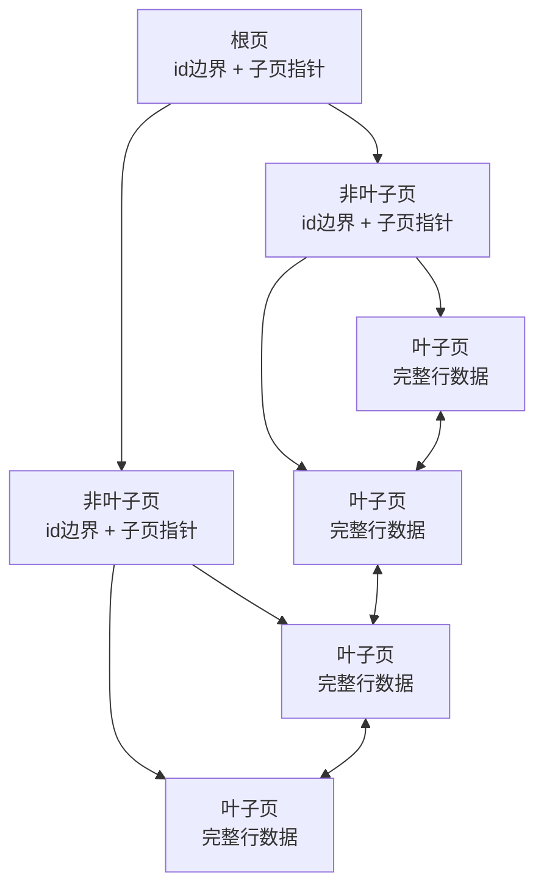
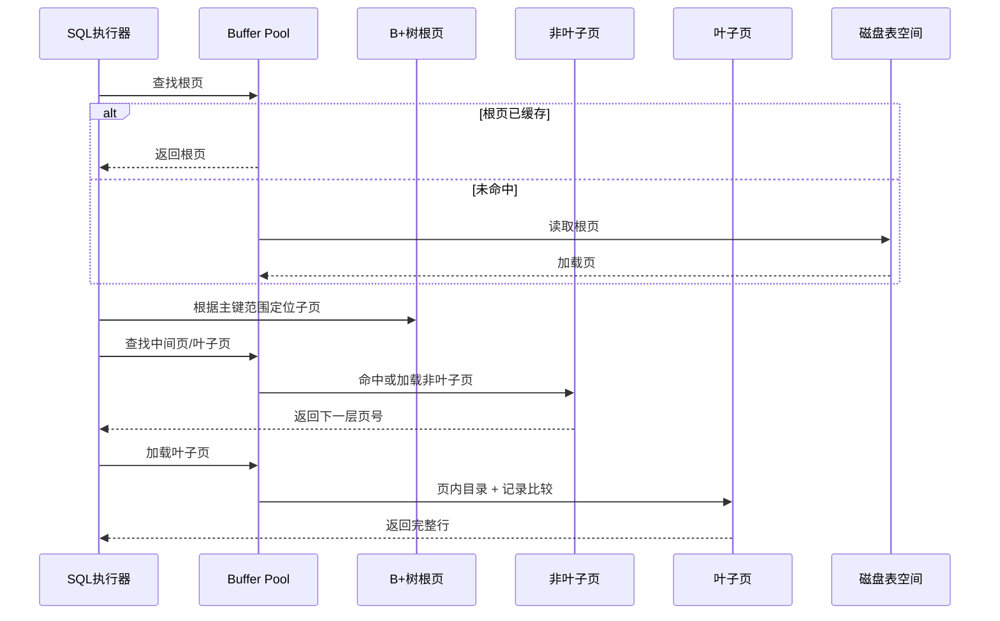
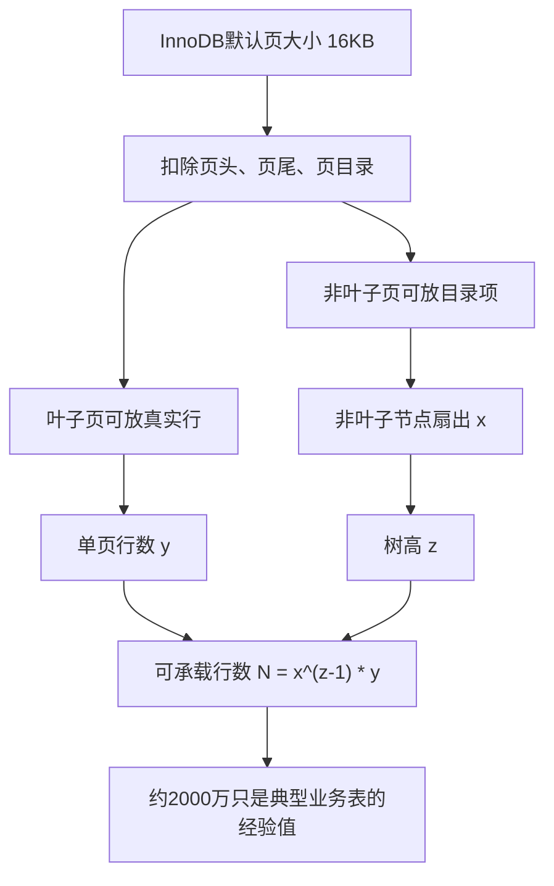
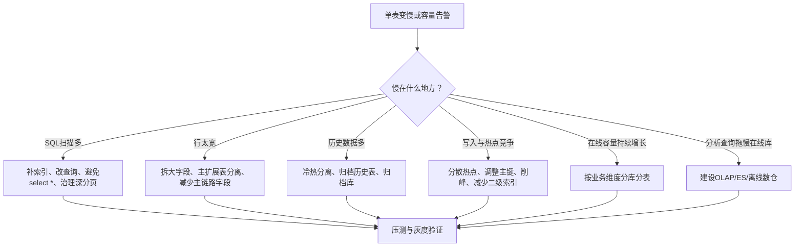

# MySQL单表为何不建议超过2000万行：B+树与16KB页的工程解释

> 来源整理：微信文章《MySQL单表为何别超2000万行？揭秘B+树与16KB页的生死博弈｜得物技术》
>
> 原文链接：https://mp.weixin.qq.com/s/pxyN2KLI7-CGNKZXIFYv2A
>
> 本文为技术博客化整理和工程视角扩展，不是逐段搬运原文。

## 1. 问题背景

很多 MySQL 经验里都会听到一句话：**单表数据量最好不要超过千万级，常见建议是 2000 万行左右就要考虑拆分、归档或治理。**

这句话不是 MySQL 的硬性限制，也不是所有业务都到了 2000 万就一定变慢。它背后的核心前提通常是：

- 使用 InnoDB 存储引擎。
- 使用默认 B+ 树索引结构。
- 表结构比较普通，列数不算极端，单行大小大致在几百字节到 1KB 量级。
- 查询依赖主键索引或普通二级索引。

所谓“2000 万行”更准确地说，是一个来自 **InnoDB 数据页、B+ 树高度、单页行数、非叶子节点扇出** 的经验阈值。

## 2. InnoDB如何组织数据

InnoDB 的数据并不是一行一行孤立地散落在磁盘上，而是以 **页 Page** 为基本单位组织。

默认情况下，InnoDB 页大小是 **16KB**。一页里不只存行数据，还包括页头、页尾、页目录、校验信息、前后页指针等元信息。真正能放行记录的空间会小于 16KB。

一个简化的数据页结构可以理解为：

```text
+----------------------+
| Page Header          |  页号、前后页指针、页类型等
+----------------------+
| Infimum/Supremum     |  页内边界记录
+----------------------+
| User Records         |  用户行记录
+----------------------+
| Free Space           |  空闲空间
+----------------------+
| Page Directory       |  页内目录，辅助二分查找
+----------------------+
| Page Trailer         |  校验、LSN 等
+----------------------+
```

也可以把它抽象成下面这个页内布局：


页内有目录结构，因此在定位到某个页之后，并不是简单线性扫描所有记录，而是可以借助页目录做更高效的页内查找。

## 3. 从数据页到B+树

如果没有索引，查询一条记录可能需要扫描大量数据页。为了快速定位，InnoDB 使用 B+ 树组织索引。

以聚簇索引为例：

- **叶子节点**：存完整行数据。
- **非叶子节点**：存索引键和指向子页的页号，可以理解为目录。
- **页之间**：叶子页之间通过链表连接，方便范围查询。

简化结构如下：



对主键查询 `select * from user where id = 5`，大致流程是：

1. 从根页开始，根据 id 范围判断应该走哪个子页。
2. 逐层进入非叶子节点，继续定位。
3. 到达叶子页后，在页内查找目标行。
4. 返回完整行数据。

如果树高是 3，理论上最多访问根页、第二层页、叶子页。根页常驻 Buffer Pool 的概率很高，因此实际磁盘 I/O 可能少于树高，但树高仍然是理解索引性能的重要指标。

查询链路可以简化成：



## 4. 2000万行是怎么算出来的

原文给出的推导可以抽象成一个公式：

```text
单表可承载行数 ≈ 非叶子节点扇出 ^ (树高 - 1) × 单个叶子页可存行数
```

设：

- `x`：非叶子节点扇出，即一个非叶子页可以指向多少个子页。
- `y`：一个叶子页能存多少行数据。
- `z`：B+ 树高度。

则：

```text
N ≈ x ^ (z - 1) × y
```

### 4.1 非叶子节点扇出

非叶子节点主要存：

- 索引键，例如 BIGINT 主键 8 字节。
- 子页页号，例如 4 字节。

粗略估算一条目录记录约 12 字节。16KB 页扣除页头、页尾、页目录等元信息后，假设剩余约 15KB。

```text
x ≈ 15KB / 12B ≈ 1280
```

也就是说，一个非叶子页大约能指向 1280 个子页。

### 4.2 单页行数

如果一行数据约 1KB，一个叶子页约能存：

```text
y ≈ 15KB / 1KB ≈ 15 行
```

当树高为 3 时：

```text
N ≈ 1280 ^ (3 - 1) × 15
  ≈ 1280 × 1280 × 15
  ≈ 2457 万
```

这就是“单表 2000 万行左右”的经验来源。

注意，这只是估算。真实行数会受主键长度、行格式、变长字段、页填充率、删除碎片、二级索引数量、Buffer Pool 命中率等影响。

可以用一张图把这个推导关系串起来：



一个更工程化的估算表如下：

| 平均行大小 | 叶子页估算行数 | 三层 B+ 树估算容量 | 典型含义 |
| --- | ---: | ---: | --- |
| 200B | 75 行 | 约 1.2 亿行 | 窄表、字段少、主键点查为主 |
| 500B | 30 行 | 约 4900 万行 | 常见业务主表 |
| 1KB | 15 行 | 约 2450 万行 | 字段较多或存在较长变长字段 |
| 2KB | 7 行 | 约 1100 万行 | 宽表、大字段较多 |

这张表不是精确容量承诺，而是提醒：行数阈值和行宽强相关。真正的评估要结合真实表结构、数据分布和线上访问模式。

## 5. 超过2000万一定慢吗

不一定。

如果单行很小，例如一行只有 250 字节，那么一个叶子页可能放 60 行左右：

```text
N ≈ 1280 ^ 2 × 60
  ≈ 9830 万
```

也就是说，1 亿行仍然可能保持 3 层 B+ 树，主键点查并不会因为“行数过亿”天然变慢。

真正影响性能的是：

- 树高是否增加。
- 查询是否命中索引。
- 是否发生回表。
- Buffer Pool 命中率是否足够高。
- 单行是否过大，导致单页行数过少。
- 二级索引数量是否过多，写入成本是否过高。
- 查询是否包含深分页、大范围扫描、排序、临时表。
- 热点页竞争、锁冲突和 Undo/Purge 压力是否严重。

所以，“2000 万”不是死线，而是提醒你：表的数据规模已经进入需要容量评估和架构治理的区间。

## 6. 为什么MySQL选择B+树而不是B树

B 树和 B+ 树都可以降低树高，但它们的数据放置方式不同：

- B 树：非叶子节点也存完整行数据。
- B+ 树：只有叶子节点存完整行数据，非叶子节点只存索引键和指针。

B+ 树的优势是：

- 非叶子节点更小，单页能放更多目录项，扇出更高。
- 树更矮，定位记录需要访问的页更少。
- 叶子节点通过链表连接，范围查询更友好。
- 所有完整行都在叶子层，查询路径更稳定。

如果非叶子节点也存 1KB 行数据，一个 16KB 页只能放十几条记录，扇出会大幅下降。要承载相同行数，B 树高度可能明显高于 B+ 树，磁盘 I/O 次数也会更多。

## 7. 16KB页大小的工程取舍

InnoDB 默认页大小是 16KB，这不是随便选的，而是在 I/O、内存、树高和页内查找之间做平衡。

页太小：

- 单页存储记录少。
- B+ 树扇出下降。
- 树高更容易增加。
- 同样数据量需要更多页管理。

页太大：

- 每次 I/O 读取更多无关数据。
- Buffer Pool 能缓存的页数量减少。
- 小范围点查可能浪费内存和 I/O。
- 页分裂、脏页刷盘成本可能变大。

因此，16KB 是通用 OLTP 场景下比较折中的选择。MySQL 支持通过 `innodb_page_size` 配置不同页大小，但这是实例初始化级别的参数，不能像普通运行时参数一样随便改。

## 8. 字符串索引与索引长度

字符串字段也可以建立 B+ 树索引，本质上是按字符集和排序规则进行比较和排序。

需要注意：

- 字符串越长，索引项越大。
- 索引项越大，非叶子节点扇出越低。
- 扇出越低，树高越容易增加。
- 长字符串索引也会增加写入和维护成本。

常见优化手段：

- 对长字符串使用前缀索引，例如 `name(20)`。
- 对需要模糊搜索的文本使用全文索引或搜索引擎。
- 合理选择字符集和排序规则。
- 避免在高频 OLTP 主链路上对超长字段建立大索引。

示例：

```sql
-- 示例表：普通业务用户表
CREATE TABLE user_profile (
  id BIGINT UNSIGNED NOT NULL AUTO_INCREMENT,
  user_no VARCHAR(64) NOT NULL,
  nick_name VARCHAR(128) NOT NULL DEFAULT '',
  mobile VARCHAR(32) NOT NULL DEFAULT '',
  ext_json JSON,
  created_at DATETIME NOT NULL,
  PRIMARY KEY (id),
  UNIQUE KEY uk_user_no (user_no),
  KEY idx_mobile_prefix (mobile(11)),
  KEY idx_created_at (created_at)
) ENGINE=InnoDB DEFAULT CHARSET=utf8mb4;

-- 查看表和索引空间，辅助判断行宽与索引成本
SELECT
  table_schema,
  table_name,
  table_rows,
  avg_row_length,
  data_length / 1024 / 1024 AS data_mb,
  index_length / 1024 / 1024 AS index_mb
FROM information_schema.tables
WHERE table_schema = 'app'
  AND table_name = 'user_profile';

-- 查看索引基数，判断选择性是否足够
SHOW INDEX FROM user_profile;
```

这里还要补充一个版本差异：原文提到 InnoDB 单个索引最大 767 字节，这更多对应旧版本/旧行格式下的限制。在 MySQL 5.7/8.0 的常见 DYNAMIC/COMPRESSED 行格式与默认大索引前缀能力下，InnoDB 索引键前缀上限常见为 3072 bytes。实际仍要结合 MySQL 版本、行格式、字符集、页大小和索引类型判断。

## 9. 工程实践建议

### 9.1 不要只看行数，要看行宽

两张表同样 2000 万行，性能可能完全不同：

- A 表每行 200 字节，主键查询为主，Buffer Pool 命中率高。
- B 表每行 2KB，字段多，二级索引多，频繁范围查询和排序。

B 表更容易出问题。

容量评估至少要看：

```text
行数 × 平均行长
主键长度
二级索引数量和字段长度
查询模式：点查 / 范围 / 排序 / 分页 / 聚合
写入频率
冷热数据比例
Buffer Pool 大小和命中率
```

### 9.2 大字段不要直接堆在主表

`TEXT/BLOB/JSON` 等大字段会拉大行大小，降低单页行数，也会影响缓存效率。

常见做法：

- 大字段拆到扩展表。
- 主链路只保留必要摘要字段。
- 冷数据归档到历史表。
- 搜索类字段交给 ES 等搜索系统。

### 9.3 提前规划冷热分离和归档

很多业务数据有明显时效性，例如订单、日志、流水、消息、审计记录。可以按访问频率设计：

- 热表：保留近期高频访问数据。
- 冷表：保留历史低频访问数据。
- 归档库：用于审计、报表、离线分析。

不要等主表已经过亿、DDL 卡住、查询抖动后才开始拆。

### 9.4 二级索引不是越多越好

二级索引叶子节点保存的是二级索引键和主键值。通过二级索引查完整行时，需要回表到聚簇索引。

索引过多会带来：

- 写入时维护多个索引。
- 占用更多磁盘和 Buffer Pool。
- 增加页分裂概率。
- 优化器选择成本变高。

索引设计要围绕高频查询和业务场景，而不是看到字段就建索引。

### 9.5 判断该优化 SQL、拆字段、归档还是分表

容量治理不要一上来就喊“分库分表”。不同瓶颈对应不同手段：



如果是 OLTP 主链路表，我通常会按下面顺序评估：

1. 先看慢 SQL、执行计划、扫描行数、回表次数。
2. 再看行宽、索引大小、Buffer Pool 命中率。
3. 再看数据生命周期，判断历史数据是否还需要留在热表。
4. 再看未来 6 到 12 个月增长趋势。
5. 最后才决定是否进入分库分表或异构读模型。

## 10. 线上评估与压测清单

### 10.1 常用观测 SQL

```sql
-- 表容量、平均行长、数据与索引空间
SELECT
  table_schema,
  table_name,
  table_rows,
  avg_row_length,
  data_length,
  index_length,
  create_time,
  update_time
FROM information_schema.tables
WHERE table_schema = 'app'
ORDER BY data_length + index_length DESC;

-- 查看当前实例 Buffer Pool 和页相关指标
SHOW ENGINE INNODB STATUS;

-- MySQL 8.0 可结合 performance_schema/sys 库观察热点 SQL
SELECT *
FROM sys.statement_analysis
ORDER BY total_latency DESC
LIMIT 20;

-- 查看某条 SQL 是否走到预期索引
EXPLAIN FORMAT=TREE
SELECT *
FROM user_profile
WHERE user_no = 'U10001';
```

### 10.2 压测与灰度关注指标

```text
核心指标：
- QPS / TPS
- P95 / P99 / P999 延迟
- 慢查询数量与扫描行数
- Buffer Pool 命中率
- CPU user/sys/iowait
- 磁盘 IOPS、吞吐、fsync 延迟
- 行锁等待、死锁、热点更新
- redo log、undo、purge 堆积
- 主从复制延迟
- DDL 执行耗时与回滚预案
```

压测时不要只测主键点查。更接近生产的压测至少要覆盖：

- 主键点查。
- 二级索引点查和回表。
- 范围查询。
- 排序分页。
- 热点更新。
- 批量写入。
- 归档任务与在线流量并发。

### 10.3 一个简单的容量评估模板

```text
表名：order_main
当前行数：8000万
月增长：1200万
平均行长：850B
数据大小：约 68GB
索引大小：约 95GB
核心查询：按 order_no、user_id、seller_id、created_at 查询
慢查询：深分页、按时间范围导出、按非分片维度统计
热点：近 30 天订单访问占 92%
治理建议：订单主表保留近 12 个月；历史订单归档；导出走离线；为商家侧建设异构读模型。
```

## 11. 面试时有含金量的追问

下面这些问题不是背概念，而是能看出候选人是否真正理解 MySQL 存储结构、业务建模和架构取舍。

### 11.1 基础原理追问

1. **为什么 2000 万是经验值，不是硬限制？**
   - 重点看候选人是否能说出行宽、页大小、扇出、树高、Buffer Pool、查询模式。

2. **B+ 树高度从 3 变 4，是否一定导致性能断崖？**
   - 看是否理解根页/上层页可能常驻内存，真实成本取决于缓存命中和访问模式。

3. **聚簇索引和二级索引在叶子节点存储内容有什么不同？**
   - 应回答聚簇索引叶子存完整行，二级索引叶子存主键值，可能需要回表。

4. **为什么 B+ 树比 B 树更适合数据库索引？**
   - 重点是扇出、树高、范围查询、磁盘页友好，而不是只说“B+ 树快”。

5. **如果主键从 BIGINT 换成 UUID 字符串，会怎样影响索引？**
   - 看是否能说出主键更大导致非叶子节点扇出下降；随机写导致页分裂；二级索引也会变大，因为二级索引叶子存主键。

### 11.2 SQL与索引设计追问

6. **为什么 `select *` 可能放大回表成本？**
   - 看候选人是否理解覆盖索引和二级索引回表。

7. **什么情况下 1 亿行表也能跑得很稳？**
   - 看是否能结合点查、窄表、主键查询、充足 Buffer Pool、合理索引、冷热数据来回答。

8. **什么情况下 500 万行表也可能很慢？**
   - 宽表、大字段、无索引、低选择性索引、深分页、排序临时表、锁冲突、热点更新。

9. **前缀索引有什么风险？**
   - 区分度不足、无法完全覆盖排序/查询、可能需要回表和额外比较。

10. **联合索引为什么要考虑字段顺序？**
    - 重点是最左前缀、选择性、范围条件截断、排序和覆盖索引。

### 11.3 架构设计追问

11. **如果订单表预计 3 年到 5 亿行，你会怎么设计？**
    - 看是否能从业务维度拆：冷热分离、分库分表、按用户/商家/时间分片、归档、读写分离、ES/OLAP 分流。

12. **什么时候应该分表，什么时候只需要归档？**
    - 看是否能区分在线高频访问、历史查询、监管留存、报表分析等场景。

13. **分库分表后，哪些查询会变难？**
    - 跨分片分页、全局排序、聚合统计、唯一约束、跨分片事务、按非分片键查询。

14. **如果业务必须按订单号、用户ID、商家ID都高频查询，分片键怎么选？**
    - 看是否能提出主分片键、冗余索引表、查询路由表、异构读模型，而不是只说“建联合索引”。

15. **如何设计订单历史归档，避免影响在线交易？**
    - 看是否提到批量迁移限速、双写/校验、归档查询入口、数据一致性、回滚方案、业务低峰执行。

### 11.4 资深开发与业务思考追问

16. **“单表不要超过 2000 万”这个规范如果落到团队，你会怎么制定例外机制？**
    - 好答案应包含容量评估模板、压测报告、慢查询指标、表增长趋势、DBA 评审和例外期限。

17. **你怎么向产品解释为什么要做归档或分表？**
    - 看是否能用业务语言讲清楚稳定性、查询体验、成本、后续迭代风险，而不是只讲 B+ 树。

18. **如果线上表已经 8000 万行，且不能停机，你怎么治理？**
    - 期待回答：先观测慢查询和热点；加索引/改 SQL；拆大字段；归档冷数据；在线 DDL；影子表迁移；灰度切流；回滚预案。

19. **容量治理应该由谁负责：业务开发、架构师还是 DBA？**
    - 更成熟的回答是共同负责：业务开发理解访问模式，DBA 提供存储和运维边界，架构师负责演进方案和风险控制。

20. **你如何判断“性能问题”其实是“业务查询模型设计问题”？**
    - 看是否能从报表查询打在线库、深分页、跨维度搜索、实时聚合等场景，引出 CQRS、搜索引擎、OLAP、缓存和读模型。

### 11.5 高阶排障与落地追问

21. **一个查询走了二级索引但仍然很慢，你会从哪些角度排查？**
    - 重点看是否能覆盖回表量、索引选择性、扫描范围、ICP、排序、临时表、Buffer Pool 命中、锁等待。

22. **为什么二级索引数量过多会拖慢写入？**
    - 应能说明每次插入、更新、删除都要维护多个 B+ 树，可能引发更多页分裂、脏页、redo 和 Buffer Pool 压力。

23. **为什么随机 UUID 主键容易导致页分裂和写放大？**
    - 期待回答随机插入打散叶子页，无法顺序追加，页分裂和缓存抖动更明显。

24. **如果必须使用全局唯一字符串 ID，你会如何降低主键对性能的影响？**
    - 可以讨论雪花 ID、业务号放唯一二级索引、短主键代理键、`UUID_TO_BIN`、时间有序 ID 等方案。

25. **如何判断一张大表更适合归档而不是分库分表？**
    - 看冷热比例、历史数据访问频率、核心查询是否集中在近期数据、是否存在跨历史数据强一致查询。

26. **在线归档 1 亿行历史数据时，如何避免把主库打挂？**
    - 好答案会提到小批量、限速、按主键游标、低峰执行、监控复制延迟、事务大小控制、可中断续跑。

27. **分库分表后，如何解决按非分片键查询的问题？**
    - 可答冗余索引表、查询路由表、异构读模型、搜索系统、广播查询兜底及其成本。

28. **为什么深分页在大表上很危险？有什么替代方案？**
    - 应能说出 `limit offset` 会丢弃大量已扫描数据，可用游标翻页、基于主键/时间的 seek pagination。

29. **如果大表查询 P99 抖动，但平均耗时正常，你会怎么定位？**
    - 看是否能结合慢日志分位数、Buffer Pool miss、磁盘抖动、锁等待、热点页、主从延迟、周期性任务排查。

30. **请设计一套大表治理的完整闭环。**
    - 期待从容量基线、增长预测、慢 SQL 治理、索引评审、归档策略、压测验证、灰度发布、监控告警、复盘规范回答。

## 12. 总结

“MySQL 单表不建议超过 2000 万行”不是玄学，也不是硬规则。它背后的逻辑是：

- InnoDB 默认以 16KB 页组织数据。
- 聚簇索引用 B+ 树组织主键和完整行。
- 非叶子节点扇出决定树有多矮。
- 叶子页能放多少行取决于行大小。
- 当树高增加、回表增多、缓存命中下降时，查询成本会上升。

真正做工程设计时，不要机械卡 2000 万，而要围绕 **行宽、索引、查询模式、冷热比例、增长速度、业务 SLA、运维成本** 做容量治理。

对资深开发和架构师来说，这个问题的价值不在于背出公式，而在于能把底层存储原理转化为业务系统的容量规划、数据生命周期管理和架构演进方案。
