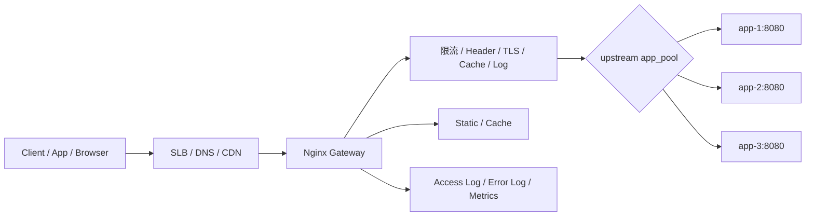
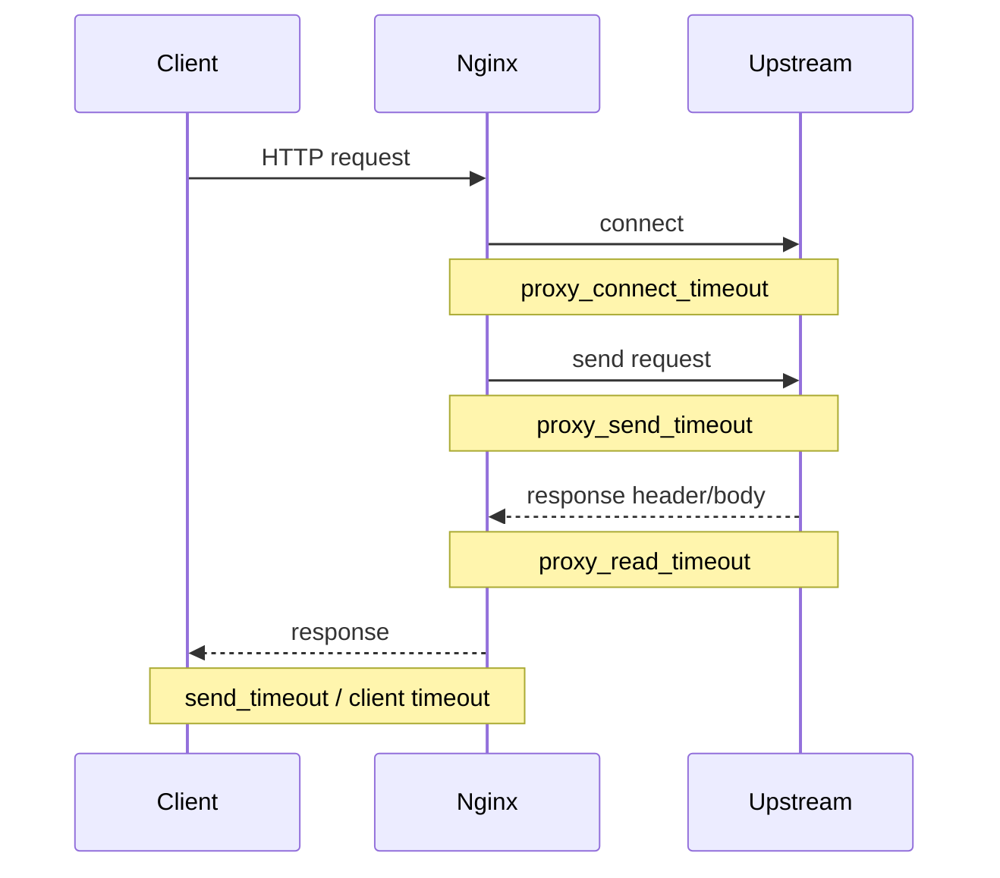
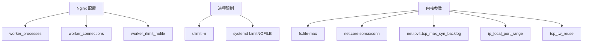
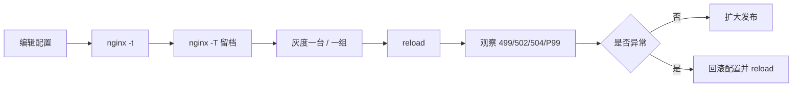
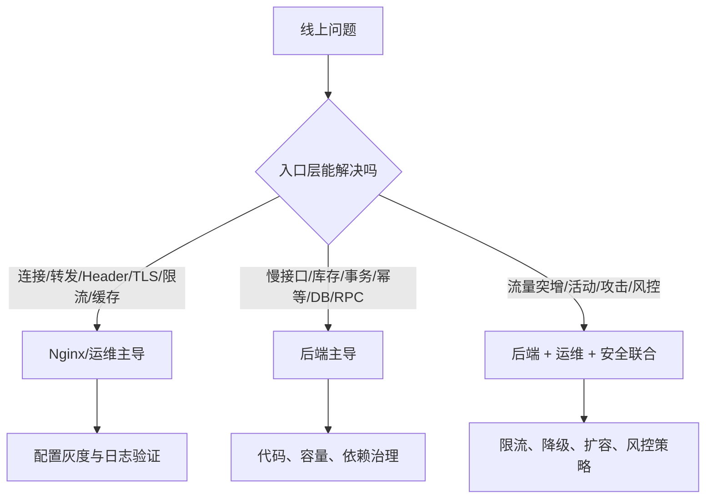

# 后端与运维最关心的 Nginx 生产实战教程

## 1. 文章摘要

后端开发关心 Nginx，通常不是为了背配置，而是为了回答几个生产问题：

- 请求为什么被转发到了这个后端？
- 502、504、499 到底是谁的锅？
- 限流应该挡在 Nginx、网关、服务还是业务代码里？
- Header、真实 IP、灰度标识、链路 ID 为什么一丢就全链路排障困难？
- TLS、日志、连接参数、缓存和 Linux fd 为什么会影响接口稳定性？

运维关心 Nginx，通常也不是为了“能启动”，而是为了把入口层变成稳定、可观测、可灰度、可回滚的流量控制点。

这篇文章用一个生产化反向代理案例，把反向代理、负载均衡、超时、Header、限流、TLS、日志、连接参数、配置发布、缓存、Linux 网络与文件句柄串起来，并补充 Nginx 源码执行路径与线上分析方法。

## 2. 整体实战目标

我们要搭一个面向后端服务的 Nginx 入口层：



它要具备这些能力：

- 反向代理：把外部请求转发给内部后端服务。
- 负载均衡：多个后端节点之间按策略分发。
- 超时控制：防止慢后端拖垮入口连接。
- Header 透传：保留真实 IP、Host、协议、链路 ID。
- 限流限并发：控制突发流量，保护后端。
- TLS 终止：统一证书、协议和安全配置。
- 日志观测：能按请求、upstream、耗时、状态码定位问题。
- 连接参数：匹配 worker、fd、keepalive、系统内核参数。
- 配置发布：先校验、再灰度、可回滚、不中断连接。
- 缓存：对静态资源或可缓存接口降低回源压力。

## 3. 实战目录结构

建议把演练文件放成下面这种结构：

```text
nginx-gateway-lab/
  docker-compose.yml
  app/
    main.go
    Dockerfile
  nginx/
    nginx.conf
    conf.d/
      gateway.conf
    certs/
      server.crt
      server.key
    logs/
    cache/
```

生产环境里不一定用 Docker，但演练时用 Docker 可以让配置、后端、日志和缓存目录边界更清楚。

## 4. 后端示例源码

下面这个 Go 服务用于模拟正常接口、慢接口、大响应和 Header 回显。

```go
package main

import (
	"encoding/json"
	"fmt"
	"log"
	"net/http"
	"os"
	"strings"
	"time"
)

func main() {
	instance := os.Getenv("INSTANCE")
	if instance == "" {
		instance = "app-local"
	}

	http.HandleFunc("/api/hello", func(w http.ResponseWriter, r *http.Request) {
		writeJSON(w, map[string]any{
			"instance":   instance,
			"path":       r.URL.Path,
			"request_id": r.Header.Get("X-Request-Id"),
			"real_ip":    r.Header.Get("X-Real-IP"),
			"forwarded":  r.Header.Get("X-Forwarded-For"),
			"proto":      r.Header.Get("X-Forwarded-Proto"),
			"host":       r.Header.Get("Host"),
		})
	})

	http.HandleFunc("/api/slow", func(w http.ResponseWriter, r *http.Request) {
		time.Sleep(3 * time.Second)
		writeJSON(w, map[string]any{"instance": instance, "status": "slow done"})
	})

	http.HandleFunc("/api/big", func(w http.ResponseWriter, r *http.Request) {
		w.Header().Set("Content-Type", "text/plain")
		w.WriteHeader(http.StatusOK)
		_, _ = w.Write([]byte(strings.Repeat("x", 1024*1024)))
	})

	http.HandleFunc("/healthz", func(w http.ResponseWriter, r *http.Request) {
		_, _ = fmt.Fprintln(w, "ok")
	})

	log.Printf("instance=%s listen=:8080", instance)
	log.Fatal(http.ListenAndServe(":8080", nil))
}

func writeJSON(w http.ResponseWriter, v any) {
	w.Header().Set("Content-Type", "application/json")
	_ = json.NewEncoder(w).Encode(v)
}
```

`Dockerfile`：

```dockerfile
FROM golang:1.22-alpine AS builder
WORKDIR /src
COPY main.go .
RUN go build -o /app main.go

FROM alpine:3.20
COPY --from=builder /app /app
EXPOSE 8080
CMD ["/app"]
```

`docker-compose.yml`：

```yaml
services:
  app1:
    build: ./app
    environment:
      INSTANCE: app-1
  app2:
    build: ./app
    environment:
      INSTANCE: app-2
  nginx:
    image: nginx:1.27
    depends_on:
      - app1
      - app2
    ports:
      - "8088:80"
      - "8443:443"
    volumes:
      - ./nginx/nginx.conf:/etc/nginx/nginx.conf:ro
      - ./nginx/conf.d:/etc/nginx/conf.d:ro
      - ./nginx/certs:/etc/nginx/certs:ro
      - ./nginx/logs:/var/log/nginx
      - ./nginx/cache:/var/cache/nginx
```

## 5. 主配置：进程、事件、日志和连接参数

`nginx/nginx.conf`：

```nginx
user nginx;
worker_processes auto;
worker_rlimit_nofile 65535;

error_log /var/log/nginx/error.log warn;
pid /var/run/nginx.pid;

events {
    worker_connections 8192;
    multi_accept on;
    use epoll;
}

http {
    include       /etc/nginx/mime.types;
    default_type  application/octet-stream;

    log_format gateway
        '$request_id $remote_addr "$request" '
        'status=$status bytes=$body_bytes_sent '
        'rt=$request_time '
        'uaddr=$upstream_addr '
        'ustatus=$upstream_status '
        'uct=$upstream_connect_time '
        'uht=$upstream_header_time '
        'urt=$upstream_response_time '
        'host=$host scheme=$scheme '
        'xff="$http_x_forwarded_for" '
        'ua="$http_user_agent"';

    access_log /var/log/nginx/access.log gateway;

    sendfile on;
    tcp_nopush on;
    tcp_nodelay on;

    keepalive_timeout 30s;
    keepalive_requests 1000;

    client_header_timeout 10s;
    client_body_timeout 30s;
    send_timeout 30s;
    client_max_body_size 20m;

    server_tokens off;

    limit_req_zone $binary_remote_addr zone=api_rate:20m rate=20r/s;
    limit_conn_zone $binary_remote_addr zone=addr_conn:20m;

    proxy_cache_path /var/cache/nginx/proxy
        levels=1:2
        keys_zone=api_cache:100m
        max_size=2g
        inactive=30m
        use_temp_path=off;

    include /etc/nginx/conf.d/*.conf;
}
```

### 5.1 配置分析

`worker_processes auto` 通常让 worker 数跟 CPU 核数匹配。Nginx worker 是事件驱动模型，不是一个请求一个线程，所以 worker 数不需要像 Java 线程池那样开很多。

`worker_connections` 是单个 worker 的最大连接数。反向代理场景要特别注意：一个客户端请求通常至少占用一个客户端连接和一个 upstream 连接，所以粗略估算可承载请求连接数时不能只看 `worker_processes * worker_connections`。

`worker_rlimit_nofile` 解决的是 worker 进程文件描述符上限，必须和系统的 `ulimit -n`、systemd LimitNOFILE、内核参数一起看。只改 Nginx 配置而系统 fd 上限没放开，连接打满时仍会报 `too many open files`。

`log_format` 里最关键的是 `$request_time` 和 `$upstream_*_time`。没有这些字段，排查 502、504、P99 抖动时只能猜。

## 6. 网关配置：反向代理、负载均衡、Header、超时

`nginx/conf.d/gateway.conf`：

```nginx
upstream app_pool {
    least_conn;

    server app1:8080 max_fails=2 fail_timeout=10s;
    server app2:8080 max_fails=2 fail_timeout=10s;

    keepalive 64;
}

map $http_x_request_id $req_id {
    default $http_x_request_id;
    ""      $request_id;
}

server {
    listen 80;
    server_name _;

    location /nginx_status {
        stub_status;
        access_log off;
        allow 127.0.0.1;
        allow 172.16.0.0/12;
        deny all;
    }

    location /static/ {
        root /usr/share/nginx/html;
        expires 7d;
        add_header Cache-Control "public, max-age=604800" always;
    }

    location /api/cacheable/ {
        proxy_pass http://app_pool;
        proxy_http_version 1.1;
        proxy_set_header Connection "";

        proxy_cache api_cache;
        proxy_cache_key "$scheme$request_method$host$request_uri";
        proxy_cache_valid 200 10m;
        proxy_cache_use_stale error timeout updating http_500 http_502 http_503 http_504;
        proxy_cache_lock on;
        add_header X-Cache-Status $upstream_cache_status always;

        include /etc/nginx/conf.d/proxy-common.inc;
    }

    location /api/ {
        limit_req zone=api_rate burst=40 nodelay;
        limit_conn addr_conn 50;

        proxy_pass http://app_pool;
        proxy_http_version 1.1;
        proxy_set_header Connection "";

        include /etc/nginx/conf.d/proxy-common.inc;
    }
}
```

公共代理配置 `nginx/conf.d/proxy-common.inc`：

```nginx
proxy_set_header Host $host;
proxy_set_header X-Request-Id $req_id;
proxy_set_header X-Real-IP $remote_addr;
proxy_set_header X-Forwarded-For $proxy_add_x_forwarded_for;
proxy_set_header X-Forwarded-Proto $scheme;

proxy_connect_timeout 1s;
proxy_send_timeout 5s;
proxy_read_timeout 5s;

proxy_buffering on;
proxy_buffer_size 16k;
proxy_buffers 8 16k;
proxy_busy_buffers_size 64k;

proxy_next_upstream error timeout http_502 http_503 http_504;
proxy_next_upstream_tries 2;
```

### 6.1 反向代理分析

`proxy_pass http://app_pool;` 把请求交给 upstream 模块。Nginx 会根据 upstream 的负载均衡策略选择一个 peer，然后建立或复用到后端的连接。

生产中最容易出问题的是 URI 拼接和 location 匹配：

```nginx
location /api/ {
    proxy_pass http://app_pool;
}
```

这种写法会把原始 URI 原样转发给后端。

```nginx
location /api/ {
    proxy_pass http://app_pool/;
}
```

这种写法会涉及 URI 替换，容易把 `/api/hello` 转成 `/hello`。业务接口迁移时，很多 404 都出在这里。

### 6.2 负载均衡分析

`least_conn` 适合接口耗时差异较大的服务，因为它倾向于把新请求分给当前活跃连接较少的节点。默认 round robin 简单稳定，适合后端实例性能接近、接口耗时相对均衡的场景。

`max_fails` 和 `fail_timeout` 不是主动健康检查。开源 Nginx 默认更多是“请求失败后被动摘除”。如果某个节点没有流量打过去，它不一定会被主动探测恢复。需要主动健康检查时，要结合 NGINX Plus、OpenResty、服务发现、四层负载均衡或外部探测系统。

### 6.3 Header 分析

后端最常用的 Header 有五类：

- `Host`：保留原始域名，避免后端多租户、签名、回调地址生成出错。
- `X-Request-Id`：串联 Nginx、网关、应用、MQ、数据库日志。
- `X-Real-IP`：当前 Nginx 看到的客户端 IP。
- `X-Forwarded-For`：代理链路中的 IP 列表。
- `X-Forwarded-Proto`：告诉后端原始请求是 HTTP 还是 HTTPS。

如果 Nginx 前面还有 SLB/CDN，`$remote_addr` 可能只是上一跳代理 IP。生产中要用 `real_ip_header` 和 `set_real_ip_from` 明确信任边界，不能无脑相信客户端传来的 `X-Forwarded-For`。

```nginx
set_real_ip_from 10.0.0.0/8;
set_real_ip_from 172.16.0.0/12;
real_ip_header X-Forwarded-For;
real_ip_recursive on;
```

这里的核心原则是：只信任你控制的上一层代理，不信任公网客户端直接带来的转发头。

### 6.4 超时分析



`proxy_connect_timeout` 控制连接后端的时间。它通常应该比较短，连接都建不上时，拖太久没有意义。

`proxy_read_timeout` 控制等待后端响应的时间。它不是整个请求总耗时，而是两次读操作之间的超时时间。慢接口要按接口类型拆 location，不要全局把所有接口都调到几十秒。

`proxy_next_upstream` 要谨慎。GET 查询接口重试通常可接受，POST、扣库存、发券、支付类接口如果没有幂等保护，Nginx 重试可能把一次业务操作放大成多次。

## 7. TLS 终止配置

生成本地自签证书用于演练：

```bash
openssl req -x509 -nodes -days 365 \
  -newkey rsa:2048 \
  -keyout nginx/certs/server.key \
  -out nginx/certs/server.crt \
  -subj "/CN=localhost"
```

HTTPS server 示例：

```nginx
server {
    listen 443 ssl http2;
    server_name localhost;

    ssl_certificate /etc/nginx/certs/server.crt;
    ssl_certificate_key /etc/nginx/certs/server.key;

    ssl_protocols TLSv1.2 TLSv1.3;
    ssl_session_cache shared:SSL:50m;
    ssl_session_timeout 10m;
    ssl_session_tickets off;

    add_header Strict-Transport-Security "max-age=31536000; includeSubDomains" always;

    location /api/ {
        limit_req zone=api_rate burst=40 nodelay;
        proxy_pass http://app_pool;
        proxy_http_version 1.1;
        proxy_set_header Connection "";
        include /etc/nginx/conf.d/proxy-common.inc;
    }
}
```

TLS 的生产关注点：

- 证书链是否完整。
- 证书是否快过期。
- SNI 是否匹配多域名。
- TLS 握手 CPU 是否成为瓶颈。
- 是否开启 HTTP/2。
- 后端是否还需要二次 TLS。
- 是否有 HSTS、弱协议、弱加密套件风险。

后端视角要特别注意：Nginx 终止 TLS 后，后端看到的是 HTTP。应用如果需要生成 HTTPS 链接，必须读取 `X-Forwarded-Proto` 或框架对应的 trusted proxy 配置。

## 8. 限流与限并发

```nginx
limit_req_zone $binary_remote_addr zone=api_rate:20m rate=20r/s;
limit_conn_zone $binary_remote_addr zone=addr_conn:20m;

location /api/ {
    limit_req zone=api_rate burst=40 nodelay;
    limit_conn addr_conn 50;
    proxy_pass http://app_pool;
}
```

`limit_req` 是速率限制，基于漏桶思想控制请求进入速度。`burst` 是允许瞬时排队或突发的空间。`nodelay` 表示突发请求不延迟排队，能放行的立即放行，超出的直接拒绝。

`limit_conn` 是连接并发限制，适合控制单 IP 长连接、大下载、慢客户端。

生产中不要只按 IP 限流。移动网络、NAT 出口、企业代理会让大量用户共享一个 IP。更稳妥的做法是按业务标识分层：

- 未登录接口：IP + UA + URI。
- 登录接口：用户 ID、设备 ID、IP。
- 商详/搜索：用户 ID、店铺、业务线。
- 抢券/秒杀：活动 ID + 用户 ID + IP。

Nginx 原生变量能做基础限流，复杂业务限流通常要放到网关、OpenResty、服务端或专门的风控系统。

## 9. 缓存配置与回源保护

```nginx
proxy_cache_path /var/cache/nginx/proxy
    levels=1:2
    keys_zone=api_cache:100m
    max_size=2g
    inactive=30m
    use_temp_path=off;

location /api/cacheable/ {
    proxy_cache api_cache;
    proxy_cache_key "$scheme$request_method$host$request_uri";
    proxy_cache_valid 200 10m;
    proxy_cache_lock on;
    proxy_cache_use_stale error timeout updating http_500 http_502 http_503 http_504;
    add_header X-Cache-Status $upstream_cache_status always;

    proxy_pass http://app_pool;
    include /etc/nginx/conf.d/proxy-common.inc;
}
```

`proxy_cache_lock on` 可以缓解缓存击穿：同一个 key 失效时，只让一个请求回源，其它请求等待或复用结果。

`proxy_cache_use_stale` 可以在后端异常时返回旧缓存，适合商品静态信息、配置、非强一致页面。不适合余额、库存、价格强一致接口。

缓存上线前必须明确：

- cache key 是否包含用户态信息。
- 是否可能缓存带权限的数据。
- 是否需要按登录态、地区、语言、渠道区分。
- 后端更新后如何失效。
- 允许多长时间的旧数据。

对后端来说，Nginx 缓存不是数据库一致性方案，它是入口层降压和容灾手段。

## 10. 日志与可观测性

推荐至少保留这些字段：

```nginx
log_format gateway
    '$request_id $remote_addr "$request" '
    'status=$status bytes=$body_bytes_sent '
    'rt=$request_time '
    'uaddr=$upstream_addr '
    'ustatus=$upstream_status '
    'uct=$upstream_connect_time '
    'uht=$upstream_header_time '
    'urt=$upstream_response_time '
    'cache=$upstream_cache_status '
    'host=$host xff="$http_x_forwarded_for" ua="$http_user_agent"';
```

关键分析方式：

- `rt` 高、`urt` 高：后端慢。
- `rt` 高、`urt` 低：客户端慢、响应大、Nginx 写回慢或限速。
- `uct` 高：连接后端慢，查网络、后端 accept 队列、端口耗尽。
- `ustatus` 多个值：发生过 upstream 重试。
- `uaddr` 集中某节点异常：后端单机问题。
- `499` 多：客户端、SLB、Nginx、后端 timeout 链路不一致。
- `502` 多：upstream 连接、协议、响应头、后端发布问题。
- `504` 多：后端超时，不要只调大 timeout。

常用命令：

```bash
tail -f nginx/logs/access.log
tail -f nginx/logs/error.log

awk '{print $0}' nginx/logs/access.log | grep 'status=504' | head
awk '{print $0}' nginx/logs/access.log | grep 'ustatus=502' | head
```

更推荐把 access log 采集到 ClickHouse、Elasticsearch 或日志平台，按 `uri、status、upstream_addr、upstream_status、request_time、upstream_response_time` 做聚合。

## 11. Linux 网络与文件句柄

Nginx 连接容量涉及三层：



查看命令：

```bash
ulimit -n
cat /proc/$(pgrep -n nginx)/limits
sysctl fs.file-max
sysctl net.core.somaxconn
sysctl net.ipv4.tcp_max_syn_backlog
sysctl net.ipv4.ip_local_port_range
ss -ant | awk '{print $1}' | sort | uniq -c
```

建议基线：

```conf
fs.file-max = 1000000
net.core.somaxconn = 4096
net.ipv4.tcp_max_syn_backlog = 8192
net.ipv4.ip_local_port_range = 10240 65535
net.ipv4.tcp_fin_timeout = 15
```

这些参数不能无脑复制。比如 `tcp_tw_reuse`、端口范围、连接复用策略要结合客户端/服务端角色、内核版本和网络拓扑评估。入口 Nginx 如果同时大量连接 upstream，也可能出现本机临时端口耗尽。

## 12. 配置发布与回滚

生产发布流程：



操作命令：

```bash
nginx -t
nginx -T > /tmp/nginx.full.conf.$(date +%F-%H%M%S)
nginx -s reload
ps -ef | grep nginx
tail -f /var/log/nginx/error.log
```

Docker 演练：

```bash
docker compose up -d --build
docker compose exec nginx nginx -t
docker compose exec nginx nginx -s reload
docker compose logs -f nginx
```

发布原则：

- 每次只改一个主题，方便定位。
- 重要 location、upstream、证书、限流参数必须灰度。
- 发布前保留 `nginx -T` 完整配置快照。
- reload 后观察 error log 和核心指标。
- 回滚不是重启机器，而是恢复上一版配置并 reload。

## 13. 实战验证步骤

启动服务：

```bash
docker compose up -d --build
```

验证负载均衡：

```bash
for i in $(seq 1 10); do curl -s http://localhost:8088/api/hello; done
```

预期看到 `instance` 在 `app-1` 和 `app-2` 之间变化。

验证 Header：

```bash
curl -s -H "X-Request-Id: demo-001" http://localhost:8088/api/hello
```

预期后端能看到 `request_id=demo-001`。

验证超时：

```bash
curl -i http://localhost:8088/api/slow
```

如果 `proxy_read_timeout` 小于后端 sleep 时间，可能看到 504。然后看 access log 的 `rt、uht、urt`。

验证限流：

```bash
ab -n 300 -c 100 http://localhost:8088/api/hello
```

或者：

```bash
wrk -t4 -c100 -d30s http://localhost:8088/api/hello
```

观察是否出现 503 或限流日志。生产里建议把限流状态码、限流日志和业务监控打通，否则业务只会看到“接口偶发失败”。

验证缓存：

```bash
curl -i http://localhost:8088/api/cacheable/hello
curl -i http://localhost:8088/api/cacheable/hello
```

观察 `X-Cache-Status` 从 `MISS` 到 `HIT`。如果一直不命中，检查 cache key、响应状态码、响应头、缓存目录权限。

验证 TLS：

```bash
curl -k -i https://localhost:8443/api/hello
```

## 14. 源码刨析：配置如何落到执行路径

### 14.1 Master/Worker 与 reload

关键文件：

- `src/os/unix/ngx_process_cycle.c`
- `src/core/nginx.c`

核心理解：

Nginx master 负责读取配置、管理 worker、处理信号。`nginx -s reload` 后，master 会重新解析配置，启动新 worker，并通知旧 worker 优雅退出。旧 worker 不再接收新连接，但会继续处理已有连接，所以长连接、大下载、慢请求可能让旧 worker 存活较久。

这解释了一个生产现象：reload 不是硬重启，理论上不该中断正常短连接；但如果你改错证书、日志路径、upstream 或 include 顺序，新 worker 可能启动失败或请求行为变化。

### 14.2 事件循环与连接处理

关键文件：

- `src/event/ngx_event.c`
- `src/event/modules/ngx_epoll_module.c`
- `src/event/ngx_event_accept.c`
- `src/core/ngx_connection.c`

核心理解：

worker 通过事件循环处理监听 fd、客户端连接 fd、upstream fd 和定时器。Linux 下常见是 epoll。Nginx 的高并发不是靠大量线程阻塞等待，而是把 socket 可读、可写、超时都抽象成事件。

这解释了为什么不能在 Nginx worker 里塞阻塞逻辑。无论是第三方模块、Lua 代码还是复杂正则，只要阻塞 worker，就会影响这个 worker 上所有连接。

### 14.3 HTTP phase 与 location

关键文件：

- `src/http/ngx_http_request.c`
- `src/http/ngx_http_core_module.c`
- `src/http/modules/ngx_http_rewrite_module.c`

核心理解：

请求进入 HTTP 模块后，会经过读取请求行、读取 Header、选择 server、匹配 location、执行 rewrite/access/content/log 等阶段。`location` 和 `rewrite` 的行为不是简单从上到下执行，正则、前缀、精确匹配和内部跳转都会影响最终处理路径。

这解释了为什么一个看起来正确的 `proxy_pass` 可能永远不生效：请求可能被更优先的 location、rewrite、try_files 或 error_page 内部跳转带走。

### 14.4 upstream 转发

关键文件：

- `src/http/ngx_http_upstream.c`
- `src/http/ngx_http_upstream_round_robin.c`
- `src/http/modules/ngx_http_proxy_module.c`

核心理解：

`proxy_pass` 最终会进入 upstream 处理流程：初始化 upstream、选择 peer、连接后端、发送请求、读取响应头、转发响应体、处理失败重试、记录 upstream 状态。

`$upstream_addr`、`$upstream_status`、`$upstream_response_time` 可能出现多个值，通常表示请求经历了多次 upstream 尝试。排查时不能只看最终状态，要看重试链路。

### 14.5 limit_req 与共享内存

关键文件：

- `src/http/modules/ngx_http_limit_req_module.c`
- `src/http/modules/ngx_http_limit_conn_module.c`

核心理解：

Nginx 的限流状态需要跨 worker 共享，因此使用共享内存 zone 保存 key 的状态。`zone=api_rate:20m` 不是随便写的，它决定能保存多少限流 key。key 维度越细，zone 越小，越容易出现状态不足或淘汰压力。

### 14.6 proxy cache

关键文件：

- `src/http/ngx_http_file_cache.c`
- `src/http/ngx_http_upstream.c`

核心理解：

Nginx 文件缓存由共享内存索引和磁盘文件组成。共享内存保存 key、元数据、状态；响应体落磁盘。缓存不是纯内存缓存，所以磁盘 IO、目录权限、临时文件路径、缓存清理进程都会影响稳定性。

## 15. 生产高频修复清单

### 15.1 502

常见原因：

- 后端端口未监听。
- 后端发布重启，连接被提前关闭。
- upstream keepalive 复用到已失效连接。
- 后端响应头过大。
- DNS 或服务发现返回了错误地址。

修复动作：

- 查 error log 中 `connect() failed`、`upstream prematurely closed connection`、`too big header`。
- 按 `$upstream_addr` 聚合异常节点。
- 从 Nginx 机器 curl 后端。
- 必要时调 `proxy_buffer_size`，但先确认是否业务异常写了超大 Cookie/Header。

### 15.2 504

常见原因：

- 后端线程池、连接池或数据库慢。
- `proxy_read_timeout` 太短或接口确实超过 SLA。
- 跨机房网络抖动。
- 后端 accept 队列堆积。

修复动作：

- 看 `uht/urt` 是否接近 timeout。
- 按 URI 和 upstream 节点聚合。
- 后端查线程池、慢 SQL、RPC、GC。
- 慢接口独立 location 配置，不要全局放大 timeout。

### 15.3 499

常见原因：

- 客户端或 SLB 超时早于 Nginx。
- 后端慢，客户端等不住。
- 大响应写回慢。
- 移动端网络断开。

修复动作：

- 对齐 Client、CDN、SLB、Nginx、后端 timeout。
- 看 `request_time` 与 `upstream_response_time`。
- 大文件下载拆专门域名或 location。

### 15.4 Header 丢失

常见原因：

- 没有透传 `X-Forwarded-For`。
- 后端框架没有配置 trusted proxy。
- 多层代理重复覆盖 Header。
- 误信任客户端伪造的 Header。

修复动作：

- 明确信任代理范围。
- 保留 request id。
- 统一 Header 规范，写入网关接入文档。

### 15.5 连接打满

常见原因：

- fd 上限不足。
- keepalive 空闲连接过多。
- upstream 慢导致连接堆积。
- 客户端慢读。
- worker 负载不均。

修复动作：

- 查 `stub_status`、`ss`、`lsof`、`/proc/<pid>/limits`。
- 降低不合理 keepalive timeout。
- 扩 fd、worker 或机器。
- 对慢接口限流、降级或拆分。

### 15.6 缓存污染

常见原因：

- cache key 没包含用户态维度。
- 登录接口被缓存。
- 不同渠道、地区、语言共用缓存。
- 后端响应头和 Nginx cache 规则冲突。

修复动作：

- 立即 bypass 或 purge 风险 key。
- 明确可缓存接口白名单。
- cache key 加入必要维度。
- 对敏感接口强制 `proxy_no_cache`。

## 16. 后端与运维的分工边界



五年后端视角下，Nginx 是入口层，不是业务正确性的兜底层。它可以保护后端、隔离异常、降低回源、统一观测，但它解决不了慢 SQL、库存一致性、重复下单、接口幂等和业务风控。

架构设计时要把问题分层：

- 流量入口问题：Nginx、SLB、CDN。
- 服务治理问题：网关、RPC、注册中心、熔断限流。
- 业务一致性问题：应用、缓存、数据库、MQ。
- 容量问题：压测、扩容、分片、降级。
- 可观测问题：日志、指标、链路追踪。

## 17. 热门生产场景与改造方案

### 17.1 大促入口层如何做防护？

大促入口层不要只靠后端扩容。Nginx 至少要承担第一层流量整形：

```nginx
map $request_uri $is_hot_api {
    default 0;
    ~^/api/coupon/grab 1;
    ~^/api/seckill/ 1;
}

limit_req_zone $binary_remote_addr zone=ip_rate:50m rate=30r/s;
limit_req_zone $uri zone=uri_rate:20m rate=5000r/s;

server {
    location /api/coupon/grab {
        limit_req zone=ip_rate burst=20 nodelay;
        limit_req zone=uri_rate burst=1000;
        proxy_pass http://app_pool;
        include /etc/nginx/conf.d/proxy-common.inc;
    }
}
```

分析：

- IP 限流挡住单来源突发，但会误伤 NAT 用户。
- URI 限流保护后端接口总入口，但不能区分用户价值。
- 真正的抢券/秒杀还要靠业务侧令牌、库存预扣、幂等、防刷和 MQ 削峰。
- Nginx 限流的目标是“保护系统不被打穿”，不是保证业务公平。

### 17.2 502/504/499 事故复盘模板

一次线上入口层事故复盘，建议固定回答这些问题：

| 维度 | 关键问题 | 证据 |
|---|---|---|
| 现象 | 哪些域名、URI、状态码异常 | access log、监控 |
| 时间线 | 从何时开始，何时恢复 | 发布记录、告警时间 |
| upstream | 是否集中某个后端节点 | `$upstream_addr` 聚合 |
| timeout | 哪段耗时变高 | `uct/uht/urt/rt` |
| 变更 | 是否有 Nginx、后端、SLB、DNS 变更 | 发布平台 |
| 容量 | 连接、CPU、fd、带宽是否打满 | stub_status、系统指标 |
| 止血 | 摘节点、回滚、限流、扩容是否有效 | 操作记录 |

最有价值的复盘不是“某服务慢导致 504”，而是回答：为什么慢服务能拖垮入口？为什么监控没有提前发现？为什么重试或 timeout 放大了故障？

### 17.3 WebSocket、SSE、gRPC 接入注意点

WebSocket：

```nginx
map $http_upgrade $connection_upgrade {
    default upgrade;
    ""      close;
}

location /ws/ {
    proxy_pass http://app_pool;
    proxy_http_version 1.1;
    proxy_set_header Upgrade $http_upgrade;
    proxy_set_header Connection $connection_upgrade;
    proxy_read_timeout 1h;
}
```

SSE：

```nginx
location /events/ {
    proxy_pass http://app_pool;
    proxy_http_version 1.1;
    proxy_buffering off;
    proxy_read_timeout 1h;
}
```

gRPC：

```nginx
location /grpc.Service/ {
    grpc_pass grpc://grpc_pool;
    grpc_read_timeout 30s;
    grpc_send_timeout 30s;
}
```

分析：

- WebSocket 和 SSE 都是长连接，要单独评估连接数、超时和限并发。
- SSE 通常要关闭 buffering，否则客户端可能迟迟收不到事件。
- gRPC 基于 HTTP/2，不能简单用普通 `proxy_pass` 当 HTTP/1.1 接口处理。
- 长连接业务要关注 reload、旧 worker 退出、连接迁移和发布影响。

### 17.4 真实 IP、风控和多级代理

多级代理链路常见形态：


如果后端拿错真实 IP，会影响：

- 风控黑白名单。
- 用户地理位置。
- 登录异常检测。
- 限流维度。
- 审计追踪。

生产建议：

- Nginx 只信任 CDN/SLB 的来源网段。
- 后端只信任入口 Nginx 注入的规范 Header。
- request id、real ip、xff、host、scheme 都要进日志。
- 安全场景不要让业务直接解析原始 `X-Forwarded-For`，最好由统一网关清洗后下发。

### 17.5 Nginx 容量压测怎么做才不自欺欺人？

压测要避免只压“空接口”和“短连接”：

```bash
wrk -t8 -c1000 -d60s \
  -H "X-Request-Id: bench-001" \
  http://gateway.example.com/api/hello
```

要分场景：

- 短连接 vs keepalive。
- 小响应 vs 大响应。
- GET vs POST body。
- cache hit vs cache miss。
- 单 upstream vs 多 upstream。
- 正常后端 vs 慢后端。
- TLS vs 非 TLS。

压测指标：

- Nginx QPS、P95/P99、错误率。
- worker CPU、连接数、fd。
- upstream connect/header/response time。
- 后端 QPS、线程池、DB、RPC。
- 网卡带宽、包量、重传。

一个常见误区是压出了 Nginx 极限，却没有压出业务真实瓶颈。生产容量要按端到端链路算。

### 17.6 配置体系如何治理？

当 Nginx 配置越来越多，真正的风险不是某个参数不会写，而是配置不可治理：

- include 顺序混乱。
- 多业务共用 location，互相影响。
- 参数散落，没人知道继承关系。
- 线上手改，无法追溯。
- 证书、限流、upstream 修改没有灰度。

建议：

- 按域名、业务、公共片段拆分配置。
- 公共 proxy header、timeout、log 统一 include。
- 配置进入 Git，有代码评审和发布记录。
- 发布前 `nginx -t` 和 `nginx -T`。
- 对高风险变更建立 checklist：证书、rewrite、proxy_pass、limit、cache、real_ip。

## 18. 面试追问与回答

### 18.1 Nginx 反向代理和普通转发的核心区别是什么？

回答：反向代理对客户端隐藏后端服务，客户端只知道 Nginx。Nginx 可以在入口层做 TLS 终止、负载均衡、Header 规范、限流、缓存和日志。业务价值不只是“转发请求”，而是把入口流量治理从单个应用里抽出来。

### 18.2 为什么 Nginx 后端接口要透传 X-Request-Id？

回答：没有 request id，Nginx 日志、应用日志、RPC 日志和数据库慢日志很难串起来。线上排障时，单看状态码只能知道失败，不能知道请求在链路上卡在哪里。我的经验是 request id 应该在入口生成或继承，并在后续所有日志中强制打印。

### 18.3 为什么不能无脑相信 X-Forwarded-For？

回答：公网客户端可以伪造这个 Header。只有来自可信 SLB、CDN 或上层代理的 Header 才能作为真实 IP 来源。生产要用 `set_real_ip_from` 明确信任网段，否则风控、审计、限流都会被绕过。

### 18.4 Nginx 的 retry 为什么可能导致业务事故？

回答：如果 Nginx 对非幂等接口重试，比如下单、扣库存、发券，后端没有幂等键时可能执行多次。重试应该优先用于 GET 或明确幂等的请求，写接口的重试要由业务幂等和状态机兜住。

### 18.5 504 多时为什么不应该第一时间调大 proxy_read_timeout？

回答：调大 timeout 只会让慢请求占用连接更久，可能把后端慢扩散成 Nginx 连接耗尽。正确做法是按 URI、upstream 节点、`uht/urt` 聚合，先确认是后端慢、网络慢还是配置不合理。

### 18.6 limit_req 和 limit_conn 怎么选？

回答：`limit_req` 控制请求速率，适合防突发；`limit_conn` 控制并发连接，适合慢客户端、大下载、长连接。API 防刷通常用 `limit_req`，文件下载或 SSE/WebSocket 更关注 `limit_conn`。

### 18.7 Nginx 缓存适合哪些接口？

回答：适合读多写少、可接受短暂旧数据、权限维度清晰的接口，比如商品静态信息、配置、公开页面。不适合余额、库存、订单状态这类强一致或强用户态数据。

### 18.8 如何判断 P99 高是 Nginx 问题还是后端问题？

回答：看 `$request_time` 和 `$upstream_response_time`。如果两者接近，后端慢概率高；如果 request time 明显更高，可能是客户端慢读、响应体大、Nginx 输出侧阻塞或限速。再结合 `uct/uht/urt` 拆连接、响应头和响应体阶段。

### 18.9 worker_connections 配大就一定能扛更多请求吗？

回答：不一定。它还受 fd 上限、内存、CPU、upstream 连接数、客户端慢读和后端响应速度影响。反向代理场景一个请求可能占两端连接，所以容量要按链路估算。

### 18.10 生产配置发布你会怎么做？

回答：先 `nginx -t`，再 `nginx -T` 留完整配置快照，然后灰度一台或一组，reload 后观察 499/502/504、P99、error log 和 upstream 指标。异常时恢复上一版配置并 reload，而不是临时手改线上配置。

### 18.11 Nginx 为什么能支撑高并发？

回答：核心是 master/worker 进程模型、事件驱动、非阻塞 IO、epoll、多路复用和较少的上下文切换。它不是为每个请求创建线程，而是在 worker 事件循环里处理大量连接的读写事件。但高并发不等于无限容量，TLS、日志、gzip、缓存磁盘 IO、upstream 慢都会成为瓶颈。

### 18.12 Nginx 和 API Gateway 的边界是什么？

回答：Nginx 更适合入口代理、TLS、静态资源、基础限流、缓存和日志。复杂鉴权、用户级限流、动态路由、灰度策略、业务熔断、协议转换通常更适合 API Gateway、OpenResty、Envoy 或应用网关。我的判断标准是：如果策略需要频繁变更、依赖业务上下文或要访问外部系统，就不要轻易塞进普通 Nginx 配置。

### 18.13 proxy_buffering 打开和关闭有什么取舍？

回答：打开 buffering 时，Nginx 可以先从 upstream 读取响应再慢慢写给客户端，保护后端连接尽快释放，但会消耗 Nginx 内存和临时文件。关闭 buffering 适合 SSE、流式下载、实时推送，但后端会被慢客户端拖住更久。生产要按接口类型拆分。

### 18.14 upstream keepalive 为什么可能既提升性能又制造问题？

回答：keepalive 可以复用后端连接，减少 TCP/TLS 握手和端口消耗。但如果后端主动关闭空闲连接、发布重启或连接池配置不匹配，Nginx 复用旧连接时可能遇到 502。要结合后端 keepalive timeout、Nginx keepalive 数量和错误日志一起调。

### 18.15 location 匹配为什么是高频坑？

回答：因为它不是简单按配置顺序匹配。精确匹配、前缀匹配、`^~`、正则匹配、命名 location 和 rewrite 内部跳转都会影响最终路径。很多静态资源 404、接口转发路径错、缓存不命中，本质都是 location 和 proxy_pass URI 拼接没理解。

### 18.16 Nginx 做灰度发布有哪些方式？

回答：简单方式可以用 `split_clients`、Header、Cookie、IP hash 或不同 upstream 权重。复杂灰度要结合发布平台、服务发现或网关。面试里我会强调灰度不是只改权重，还要有指标观察、错误率阈值、回滚机制和用户粘性。

### 18.17 为什么 499 不能简单认为是客户端问题？

回答：499 表示客户端提前断开，但诱因可能是后端慢、Nginx buffering、大响应、SLB timeout、移动网络或前端超时。责任边界要看 `request_time`、`upstream_response_time`、客户端超时配置和链路上的代理超时。

### 18.18 Nginx 日志量太大怎么办？

回答：先判断是否所有请求都需要完整日志。可以对健康检查、静态资源、低价值接口降采样或关闭 access log；核心接口保留完整 timing 和 request id。也要优化日志落盘、日志切割、采集链路和磁盘容量。不要为了省日志把排障关键字段删掉。

### 18.19 Nginx 缓存穿透、击穿、雪崩怎么处理？

回答：穿透要控制 cache key 和非法请求，必要时用空值缓存或业务校验。击穿可以用 `proxy_cache_lock`，避免热点 key 失效时大量回源。雪崩要设置分散过期时间，或者用 stale 缓存兜底。强一致业务不要靠 Nginx cache 解决一致性。

### 18.20 如果入口层 P99 抖动，你的完整排障路径是什么？

回答：先按域名、URI、状态码确认范围，再看 `rt/uct/uht/urt` 拆段；同时看 Nginx worker CPU、连接数、fd、带宽、磁盘 IO；再按 upstream 节点聚合，排查后端发布、线程池、DB、RPC；最后核对 SLB/CDN、DNS、证书、配置发布。我的习惯是先用日志定责，再用指标找瓶颈，避免一上来改 timeout。

## 19. 参考资料

- NGINX 官方文档：https://nginx.org/en/docs/
- NGINX proxy module：https://nginx.org/en/docs/http/ngx_http_proxy_module.html
- NGINX upstream module：https://nginx.org/en/docs/http/ngx_http_upstream_module.html
- NGINX limit req module：https://nginx.org/en/docs/http/ngx_http_limit_req_module.html
- NGINX core module：https://nginx.org/en/docs/ngx_core_module.html
- NGINX 源码：https://github.com/nginx/nginx

