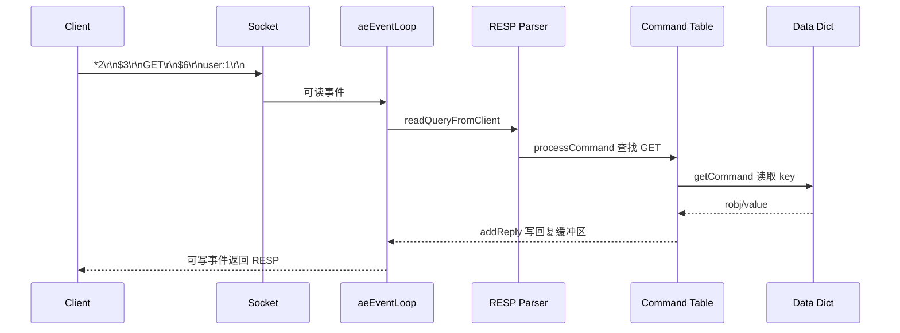

# Redis 是如何执行一条命令的

## 1. 本章要解决的问题

一条 `GET user:1` 从客户端发出后，Redis 到底做了什么？这不是一个“命令语法”问题，而是理解 Redis 性能、阻塞、协议兼容、慢查询和源码入口的起点。

本章要回答四件事：

- 客户端连接、RESP 编码、协议解析和命令分发如何串起来。
- Redis 主线程、事件循环、文件事件、时间事件分别负责什么。
- 命令执行为什么通常是原子的，又为什么仍然可能被慢命令拖垮。
- 生产中如何观察一条命令的延迟来源。

## 2. 核心观点

Redis 执行命令的主线可以概括为：网络事件就绪、读取请求、解析 RESP、查找命令表、执行命令函数、写入回复缓冲区、等待 socket 可写后返回结果。

它快，不是因为每个环节都神秘，而是因为路径短、数据在内存中、事件循环避免了大量线程切换，且大多数命令复杂度可控。但只要某个命令进入 O(N) 扫描、大 value 拷贝、阻塞式磁盘或网络等待，整个主线程都会被影响。

## 3. 原理拆解



Redis 客户端请求使用 RESP 协议编码。数组表示命令及参数，Bulk String 表示二进制安全字符串。服务端读取 socket 后，不是直接做字符串切分，而是维护客户端输入缓冲区，按 RESP 格式增量解析。

命令表保存了命令名、执行函数、参数数量、权限标记、慢命令统计、ACL 分类等元数据。执行 `GET` 时会进入对应命令函数，从全局数据库数组中选择当前 DB，再到 dict 中查找 key。key 命中后还要检查过期时间，过期则触发惰性删除。

时间事件也在事件循环里运行，典型代表是 `serverCron`。它负责过期 key 抽样、统计更新、客户端超时清理、复制心跳、持久化状态推进等后台维护工作。

## 4. 命令与代码示例

RESP 请求示例：

```text
*2
$3
GET
$6
user:1
```

用 `redis-cli --raw` 观察基础请求：

```bash
redis-cli SET user:1 '{"id":1,"name":"Ada"}'
redis-cli GET user:1
redis-cli --latency
redis-cli SLOWLOG GET 10
```

Python 模拟一个极简 RESP 请求：

```python
import socket

payload = b"*2\r\n$3\r\nGET\r\n$6\r\nuser:1\r\n"
sock = socket.create_connection(("127.0.0.1", 6379))
sock.sendall(payload)
print(sock.recv(1024))
sock.close()
```

## 5. 生产实践

生产排查一条命令慢不慢，不能只看应用日志。建议按链路分层：

- 客户端侧：连接池等待、序列化、网络 RTT、超时时间。
- Redis 侧：`SLOWLOG`、`LATENCY DOCTOR`、`INFO commandstats`。
- 系统侧：CPU、网卡、磁盘、fork、内存碎片、连接数。

生产 checklist：

- 禁止在线使用 `KEYS`、大范围 `SMEMBERS`、无边界 `LRANGE 0 -1`。
- 为客户端设置合理超时，避免请求堆积。
- 开启慢日志并设置低于业务 SLA 的阈值，例如 `slowlog-log-slower-than 10000`。
- 为大 key、热 key 和阻塞命令设置专项监控。

## 6. 常见坑

- 把 Redis 原子性理解成“不会阻塞”。命令执行串行，所以单个慢命令会阻塞后续命令。
- 只关注服务端耗时，忽略客户端连接池排队。
- 认为 `GET` 一定快。大 value 会带来内存拷贝和网络传输成本。
- 慢日志只记录命令执行时间，不包含网络排队和响应发送时间。

## 7. 面试追问

- Redis 命令执行为什么通常具备原子性？
- RESP 为什么适合 Redis 这种文本命令系统？
- 慢日志为什么不能完整解释客户端超时？
- `serverCron` 做哪些事情？频率过高或过低有什么影响？

## 8. 章节笔记

- 命令链路：socket 可读 -> 输入缓冲区 -> RESP 解析 -> 命令表 -> 数据库 dict -> 回复缓冲区。
- Redis 的主线程串行执行命令，降低并发控制复杂度。
- 时间事件不是独立业务线程，仍然需要关注主线程被慢命令占用的问题。
- 观察延迟要同时看客户端、Redis 和操作系统。

## 9. 小结

理解一条命令的执行路径，就能把 Redis 的协议、事件循环、数据结构和性能诊断串成一个整体。后续讨论单线程为什么快、多线程 IO 解决什么、Pipeline 为什么有效，本质上都围绕这条链路展开。
