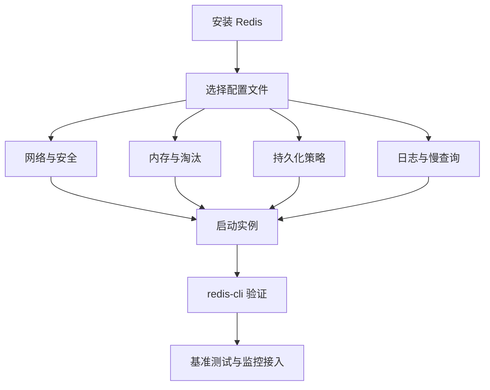

# Redis 快速搭建与生产配置入门

## 1. 本章要解决的问题

Redis 很容易启动，但生产可用的 Redis 不能只靠 `redis-server`。本章从开发环境搭建出发，补齐配置文件、安全、持久化、连接、内存和观测的入门基线。

## 2. 核心观点

开发环境追求快速验证，生产环境追求可控边界。Redis 配置的核心不是背参数，而是明确：谁能访问、最多用多少内存、数据是否需要恢复、慢了如何发现、满了如何处理。

## 3. 原理拆解



Redis 配置可以分为五组：网络访问、认证授权、内存容量、数据可靠性、性能观测。单机练习可以只关注端口和目录，生产至少要明确绑定地址、密码或 ACL、`maxmemory`、淘汰策略、慢日志阈值和持久化模式。

## 4. 命令与代码示例

最小启动：

```bash
redis-server --port 6379
redis-cli -p 6379 PING
```

生产入门配置片段：

```conf
bind 127.0.0.1 10.0.0.12
protected-mode yes
port 6379
daemonize yes
dir /data/redis
logfile /var/log/redis/redis.log

requirepass change-me
maxmemory 8gb
maxmemory-policy allkeys-lfu

appendonly yes
appendfsync everysec
slowlog-log-slower-than 10000
slowlog-max-len 256
latency-monitor-threshold 100
```

基础验证：

```bash
redis-cli -a change-me INFO server
redis-cli -a change-me CONFIG GET maxmemory
redis-cli -a change-me MEMORY STATS
redis-benchmark -n 100000 -c 100 -t get,set -q
```

## 5. 生产实践

建议先形成一份环境差异表：

| 维度 | 开发环境 | 生产环境 |
| --- | --- | --- |
| 访问 | 本机 | 内网白名单 |
| 安全 | 可弱化 | ACL/密码/最小权限 |
| 内存 | 不固定 | 必须设置 maxmemory |
| 持久化 | 可关闭 | 按恢复目标选择 |
| 监控 | 手工观察 | 指标、日志、告警 |

上线 checklist：

- `maxmemory` 小于机器可用内存，给 fork、复制缓冲区和系统留空间。
- 禁止公网暴露 Redis。
- 慢日志、延迟监控、内存指标接入监控系统。
- 明确 RDB/AOF 策略和数据丢失窗口。
- 客户端使用连接池，并设置连接、读写、命令超时。

## 6. 常见坑

- 不设置 `maxmemory`，Redis 把机器内存吃满后被 OOM。
- `bind 0.0.0.0` 加弱密码，导致安全事故。
- 把 `appendfsync always` 当成绝对安全，结果延迟抖动严重。
- 容器环境没有配置持久化目录，重启后数据丢失。

## 7. 面试追问

- `protected-mode` 能替代密码或 ACL 吗？
- `maxmemory-policy` 如何影响缓存系统行为？
- AOF `everysec` 最多可能丢多少数据？
- Redis 单机部署时为什么要给 fork 预留内存？

## 8. 章节笔记

- Redis 配置要围绕安全、容量、恢复、观测四个边界设计。
- 生产环境必须显式设置 `maxmemory` 和淘汰策略。
- AOF everysec 是性能与可靠性的常见折中。
- 上线前用 `redis-benchmark` 只能做基线，不能替代真实业务压测。

## 9. 小结

Redis 上手很快，真正的分水岭在配置边界。先把单机实例配置成“可访问、可限制、可恢复、可观测”，后续再讨论主从、哨兵和集群才有基础。
