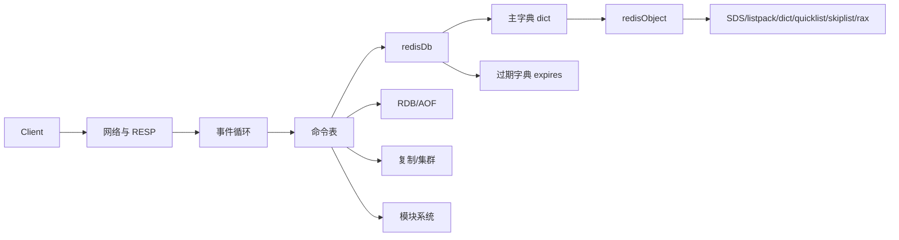

# 一个键值数据库到底包含什么

## 1. 本章要解决的问题

Redis 常被叫作键值数据库，但一个生产级键值数据库并不只是 `Map<String,Object>`。本章建立 Redis 的模块化心智模型：访问层、协议层、索引层、对象系统、过期机制、持久化、复制和事件驱动。

## 2. 核心观点

Redis 的核心数据路径是“内存字典 + 对象编码 + 事件循环”。围绕这条路径，Redis 增加了持久化保证恢复，复制和集群保证扩展，过期和淘汰控制容量，模块系统扩展能力。

## 3. 原理拆解



一个 Redis 实例包含多个逻辑 DB。每个 DB 内部最重要的是两个字典：主字典保存 key 到 value 对象的映射，过期字典保存 key 到过期时间戳的映射。value 并不是裸数据，而是 `redisObject`，里面记录类型、编码、LRU/LFU 信息和底层指针。

这种设计让同一种逻辑类型可以根据规模选择不同编码。例如 Hash 小的时候用 listpack 节省内存，大了以后转为 hashtable 提升查询效率。

## 4. 命令与代码示例

观察对象编码：

```bash
redis-cli SET name ada
redis-cli OBJECT ENCODING name
redis-cli HSET profile:1 name ada city shanghai
redis-cli OBJECT ENCODING profile:1
redis-cli MEMORY USAGE profile:1
```

极简键值数据库伪代码：

```go
type Entry struct {
    Value any
    ExpireAt int64 // 0 means never expire
}

type KV struct {
    dict map[string]Entry
}

func (kv *KV) Get(key string, now int64) (any, bool) {
    e, ok := kv.dict[key]
    if !ok || (e.ExpireAt > 0 && e.ExpireAt <= now) {
        delete(kv.dict, key)
        return nil, false
    }
    return e.Value, true
}
```

## 5. 生产实践

建模时要先判断业务使用 Redis 的角色：

- 缓存：重点是 TTL、淘汰策略、一致性和热点。
- 存储：重点是持久化、备份、容量和恢复演练。
- 队列：重点是可靠消费、堆积、重复和顺序。
- 计数/排行：重点是原子性、内存增长和过期归档。

生产 checklist：

- 每类 key 都有命名规范、TTL 规范和容量估算。
- 重要 key 有 `MEMORY USAGE` 抽样和大 key 扫描。
- 禁止把 Redis 当无限 map 使用。
- 明确每个数据结构的增长上限和清理策略。

## 6. 常见坑

- 只按命令建模，不按底层编码和复杂度建模。
- 忽略 key 本身也占内存，短 value 场景 key 可能是主要开销。
- 以为设置 TTL 就一定准时删除，实际上 Redis 结合惰性删除和定期删除。
- 使用多个逻辑 DB 做强隔离，实际生产更推荐实例或集群层隔离。

## 7. 面试追问

- Redis DB 中为什么要区分主字典和过期字典？
- `redisObject` 记录编码有什么好处？
- 同一个 Hash 为什么会从 listpack 转成 hashtable？
- Redis 为什么不适合做复杂条件查询数据库？

## 8. 章节笔记

- Redis 不是简单 map，而是网络、事件、对象、持久化、高可用组成的系统。
- 主字典负责定位，过期字典负责生命周期。
- 逻辑类型和底层编码是两层概念。
- 生产建模必须把容量、复杂度、过期和恢复一起考虑。

## 9. 小结

理解键值数据库的模块边界，能帮助我们判断 Redis 适合做什么、不适合做什么。后面的 String、Hash、List、Set、ZSet，本质都是在这个对象系统之上的不同编码策略。
