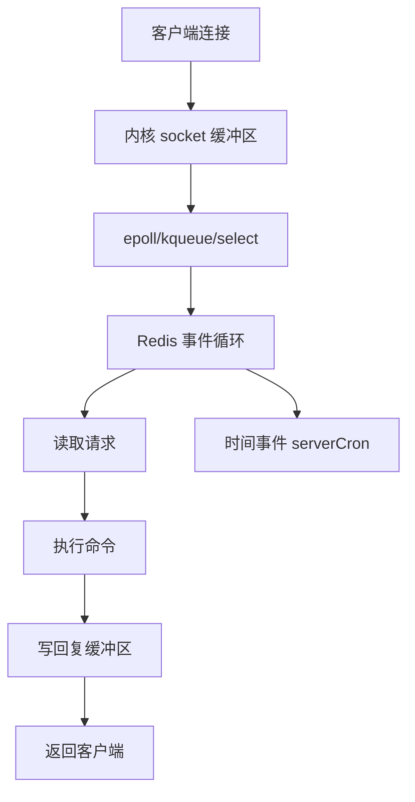

# 为什么单线程 Redis 能那么快

## 1. 本章要解决的问题

Redis 常说“单线程”，但它仍能支撑很高吞吐。这个现象容易被误解：单线程不是没有后台线程，也不是所有工作都单线程，而是核心命令执行路径主要串行化。

## 2. 核心观点

Redis 快的原因是内存访问、IO 多路复用、高效数据结构、短命令路径和避免锁竞争。单线程让命令执行不需要复杂加锁，但代价是任何慢操作都会影响整个实例。

## 3. 原理拆解



Redis 使用 Reactor 模型监听多个连接的可读可写事件。主线程不用为每个连接创建线程，而是等待内核通知哪些 fd 就绪。这样避免了大量线程上下文切换，也避免了多线程共享数据结构的锁竞争。

但单线程的含义有边界：RDB/AOF rewrite 可能 fork 子进程，lazy free 有后台线程，Redis 6 引入了多线程 IO。真正需要记住的是，绝大多数命令的执行仍然在主执行路径上串行完成。

## 4. 命令与代码示例

观察慢命令和延迟：

```bash
redis-cli CONFIG SET slowlog-log-slower-than 10000
redis-cli DEBUG SLEEP 1
redis-cli SLOWLOG GET 5
redis-cli LATENCY DOCTOR
```

不要在线执行的危险示例：

```bash
# 大库中可能阻塞主线程
redis-cli KEYS '*'

# 大集合可能产生长时间遍历和大响应
redis-cli SMEMBERS huge:set
redis-cli LRANGE huge:list 0 -1
```

安全扫描方式：

```bash
redis-cli --scan --pattern 'user:*' | head
redis-cli SSCAN huge:set 0 COUNT 100
```

## 5. 生产实践

单线程模型下，优化目标不是“把 Redis 变成多线程数据库”，而是让每次事件循环处理的任务尽量短。

生产 checklist：

- 按复杂度审查命令，避免 O(N) 命令无边界运行。
- 大 key 拆分，热 key 分散。
- 使用 `SCAN` 替代 `KEYS`，使用分页替代一次性全量读取。
- 设置客户端输出缓冲区限制，避免慢客户端拖累服务端。
- 用 `latency latest`、`SLOWLOG`、`INFO commandstats` 建立延迟看板。

## 6. 常见坑

- 认为 Redis 单线程所以不能利用多核。实际可以通过多实例、分片和 Redis 6 IO 多线程利用多核。
- 认为 O(1) 命令一定无风险。大 value 的网络传输和内存拷贝也会慢。
- 把 `SCAN` 当成绝对无成本，它只是渐进式，仍会消耗 CPU。
- 误把平均延迟当 SLA，Redis 事故往往发生在 P99/P999 抖动。

## 7. 面试追问

- Reactor 模型和线程池模型的差异是什么？
- Redis 单线程如何处理多个客户端连接？
- 哪些命令会破坏单线程的延迟稳定性？
- 为什么慢客户端会影响 Redis？

## 8. 章节笔记

- Redis 核心命令执行串行，避免锁竞争和上下文切换。
- IO 多路复用让单线程管理大量连接成为可能。
- 单线程的最大敌人是慢命令、大 key、大响应和阻塞系统调用。
- 性能治理要盯 P99、慢日志和命令复杂度。

## 9. 小结

Redis 单线程并不神奇，它是工程取舍：用串行执行换简单一致的内存模型，用 IO 多路复用支撑高并发连接。理解这个边界，才能知道什么时候 Redis 快，什么时候会被自己拖慢。
