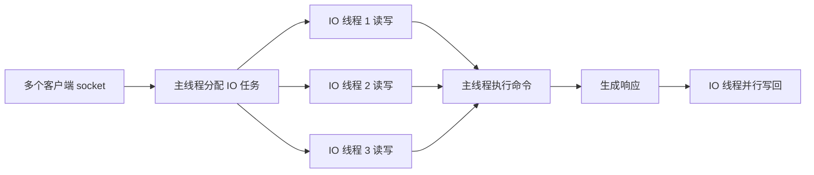

# Redis 6 多线程 IO 到底解决了什么

## 1. 本章要解决的问题

Redis 6 引入多线程 IO 后，很多人以为 Redis 命令执行也完全并行了。事实并非如此。本章解释多线程 IO 的位置、收益边界和配置建议。

## 2. 核心观点

Redis 6 多线程 IO 主要并行化 socket 读写和协议解析前后的部分网络处理，命令执行仍然由主线程串行完成。它解决的是网络 IO 成为瓶颈时的吞吐问题，不解决慢命令阻塞问题。

## 3. 原理拆解



Redis 早期瓶颈往往在主线程执行命令。但随着网卡、客户端数量和 value 规模提升，socket 读写、协议解析、响应写回也可能占据大量 CPU。多线程 IO 让网络读写并行化，减少主线程在数据搬运上的时间。

不过 Redis 的数据结构仍然不是多线程并发修改模型。如果多个线程同时执行写命令，就需要大量锁或 MVCC，复杂度和开销都会显著上升。因此 Redis 6 选择了更保守的改造：IO 可并行，执行仍串行。

## 4. 命令与代码示例

配置示例：

```conf
io-threads 4
io-threads-do-reads yes
```

压测对比：

```bash
redis-benchmark -n 1000000 -c 200 -t get,set -d 1024 -q
redis-cli INFO stats
redis-cli INFO commandstats
```

客户端侧 Java 示例，避免连接池太小导致误判：

```java
GenericObjectPoolConfig<?> pool = new GenericObjectPoolConfig<>();
pool.setMaxTotal(200);
pool.setMaxIdle(100);
pool.setMinIdle(20);
pool.setMaxWait(Duration.ofMillis(50));
```

## 5. 生产实践

适合开启多线程 IO 的场景：

- 实例 CPU 主要消耗在网络读写，命令本身较轻。
- value 中等或偏大，响应写回成本明显。
- 客户端连接数高，吞吐受单核限制。

不适合期待多线程 IO 解决的场景：

- `KEYS`、大集合遍历、Lua 长脚本等慢命令。
- 磁盘、fork、AOF fsync 引起的延迟。
- 热 key 导致单分片压力过高。

生产 checklist：

- 先通过 CPU profile、`INFO commandstats`、网卡指标判断瓶颈。
- 线程数通常小于物理核数，不要盲目开满。
- 开启后压测 P99，而不是只看 QPS。
- 与客户端连接池、Pipeline、分片一起评估。

## 6. 常见坑

- 把多线程 IO 当成慢命令解药。
- 线程数设置过高，导致上下文切换增加。
- 压测只看本机 loopback，无法代表真实网络。
- 忽略客户端序列化、连接池等待和 GC。

## 7. 面试追问

- Redis 6 多线程 IO 和 Memcached 多线程模型有什么差异？
- 为什么命令执行仍然串行？
- 哪些指标能证明网络 IO 是瓶颈？
- 多线程 IO 对大 key 有帮助吗？

## 8. 章节笔记

- Redis 6 多线程 IO 并行的是读写 socket，不是并行执行命令。
- 收益取决于瓶颈是否在网络数据搬运。
- 慢命令、大 key、Lua 长脚本仍会阻塞主执行路径。
- 配置需要压测验证，不能凭感觉开启。

## 9. 小结

Redis 6 多线程 IO 是一次克制的性能增强。它让 Redis 在网络密集场景下更能吃满硬件，但仍保留了主线程串行执行带来的简单性和原子性。
