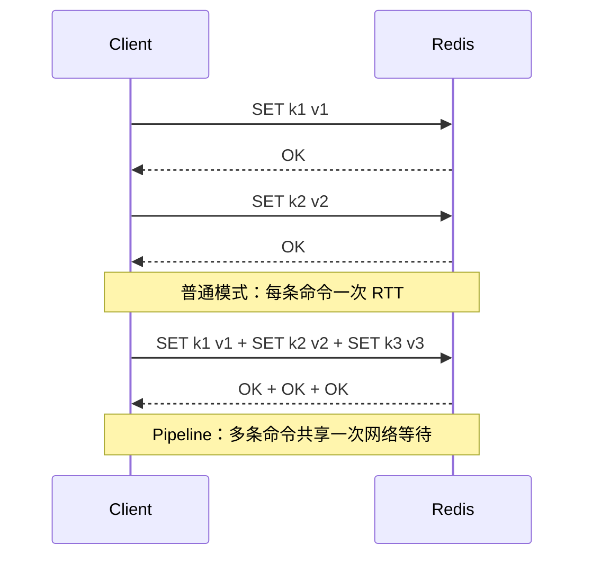

# Pipeline 为什么能提升吞吐

## 1. 本章要解决的问题

单条 Redis 命令很快，但应用一次次同步发送命令仍可能很慢。Pipeline 的价值在于减少网络往返，而不是让 Redis 并行执行命令。本章解释它的收益、边界和风险。

## 2. 核心观点

Pipeline 把多条请求连续写入 socket，再批量读取响应，核心收益是摊薄 RTT。它适合大量独立短命令，不适合无边界批量、大响应、强依赖前序结果的流程。

## 3. 原理拆解



Pipeline 不改变 Redis 服务端的命令顺序。服务端仍按收到的顺序执行命令，只是客户端不等待每条响应就发送下一条。吞吐提升来自减少等待时间和系统调用次数。

Pipeline 与事务不同。事务通过 `MULTI/EXEC` 把命令排队后一次执行，强调执行阶段不被其他客户端命令插入；Pipeline 只是传输优化，不提供事务语义。

## 4. 命令与代码示例

redis-cli 管道导入：

```bash
printf "SET p:1 a\r\nSET p:2 b\r\nGET p:1\r\n" | redis-cli --pipe
```

Python 示例：

```python
import redis

r = redis.Redis(host="127.0.0.1", port=6379, decode_responses=True)
pipe = r.pipeline(transaction=False)
for i in range(1000):
    pipe.set(f"user:{i}:score", i, ex=3600)
results = pipe.execute()
print(len(results))
```

压测：

```bash
redis-benchmark -n 100000 -c 50 -P 1 -t set,get -q
redis-benchmark -n 100000 -c 50 -P 16 -t set,get -q
```

## 5. 生产实践

Pipeline 批大小需要建模。批太小收益有限，批太大会增加客户端内存、服务端输入缓冲区、输出缓冲区和尾延迟。

经验建议：

- 批量写缓存：常从 50、100、500 逐步压测。
- 响应很大的命令不要放入大 pipeline。
- 对强依赖场景，用 Lua 或事务，而不是 pipeline。
- Cluster 场景注意 key 分散到不同 slot 后客户端实现是否支持分组发送。

生产 checklist：

- 监控客户端连接池等待和 Redis 输出缓冲区。
- 设置单批最大命令数和最大字节数。
- 对失败结果逐条处理，不要只看 `execute` 是否抛异常。
- 结合超时、重试和幂等设计。

## 6. 常见坑

- 把 Pipeline 误认为事务。
- 单批塞入几十万条命令，导致延迟尖刺和内存上涨。
- 忽略部分命令失败，批量写入后状态不一致。
- 在跨 slot 场景中使用不支持 cluster pipeline 的客户端。

## 7. 面试追问

- Pipeline 为什么能减少 RTT？
- Pipeline、事务和 Lua 的区别是什么？
- Pipeline 批大小如何选择？
- Cluster 下 Pipeline 有哪些限制？

## 8. 章节笔记

- Pipeline 是客户端传输优化，不改变服务端串行执行模型。
- 收益来自批量发送和批量读取响应。
- 批大小要受内存、响应大小、尾延迟约束。
- 强原子需求优先考虑 Lua 或事务。

## 9. 小结

Pipeline 是 Redis 最常用的吞吐优化手段之一。理解它的本质是减少网络等待，就不会把它误用成事务工具，也能更稳地控制批量操作的风险。
