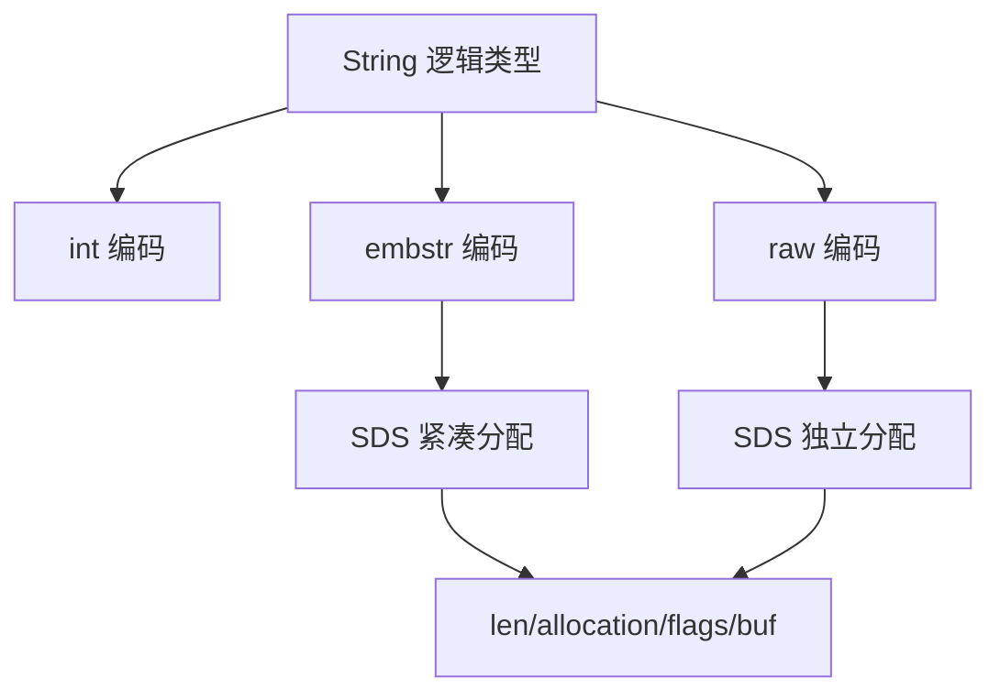

# String 为什么是 Redis 的万金油又为什么可能不好用

## 1. 本章要解决的问题

String 是 Redis 最常用的数据类型，缓存对象、计数器、分布式锁、位图都能用它实现。但“什么都能放”也意味着很容易放错。本章讲清 String 的底层 SDS、编码选择、内存开销和生产建模边界。

## 2. 核心观点

String 的优势是简单、二进制安全、操作丰富；风险是 key/value 内存开销容易被低估，大 value 会拖慢网络和主线程，过度 JSON 化会让局部更新变成整块读写。

## 3. 原理拆解



Redis 没有直接使用 C 的 `char*` 作为字符串，而是使用 SDS。SDS 保存长度、容量和 flags，支持 O(1) 获取长度、二进制安全、预分配扩容和惰性空间释放。String 的对象编码通常包括 `int`、`embstr`、`raw`。短字符串适合 `embstr`，对象头和 SDS 连续分配；长字符串转为 `raw`。

String 适合读写整个值，不适合频繁修改大 JSON 内部的某个字段。如果业务经常局部更新，Hash 往往更合适。

## 4. 命令与代码示例

常用命令：

```bash
SET user:1:name ada EX 3600
GET user:1:name
INCR article:100:views
MSET user:1:age 18 user:1:city shanghai
OBJECT ENCODING user:1:name
MEMORY USAGE user:1:name
```

分布式锁基础写法：

```bash
SET lock:order:100 request-uuid NX PX 30000
```

Lua 安全释放锁：

```lua
if redis.call("GET", KEYS[1]) == ARGV[1] then
  return redis.call("DEL", KEYS[1])
end
return 0
```

## 5. 生产实践

String 建模建议：

- 计数器：`INCRBY`，注意归档和过期。
- 简单缓存：JSON String，适合整体读写。
- 大对象缓存：拆分字段或压缩，控制单 value 大小。
- 状态标记：设置 TTL，避免永久垃圾 key。

生产 checklist：

- 控制 value 大小，常见建议单 value 小于几十 KB，具体看延迟 SLA。
- key 命名包含业务、实体、字段，例如 `user:profile:1001`。
- 批量读取用 `MGET` 或 Pipeline，但控制批大小。
- 大 JSON 局部更新优先考虑 Hash 或 RedisJSON 模块。

## 6. 常见坑

- 把所有对象都序列化成一个大 JSON，导致小字段变更也要全量写。
- 计数器没有过期和归档，长期增长。
- 锁 value 不放唯一 token，误删其他客户端的锁。
- key 太长且数量巨大，key 名本身造成明显内存浪费。

## 7. 面试追问

- SDS 相比 C 字符串解决了什么问题？
- `embstr` 和 `raw` 编码有什么差异？
- String 和 Hash 存对象如何选择？
- 大 value 对 Redis 延迟有什么影响？

## 8. 章节笔记

- String 是二进制安全字符串，底层依赖 SDS。
- String 适合整体读写，不适合频繁局部更新的大对象。
- `INCR`、`SET NX PX`、`MGET` 是 String 的高频实践。
- 大 value 会放大内存拷贝、网络传输和客户端反序列化成本。

## 9. 小结

String 是 Redis 的万金油，但不是万能结构。把它用于简单值、计数器和整体缓存非常自然；一旦对象变大、字段更新频繁或需要复杂查询，就要重新评估建模方式。
