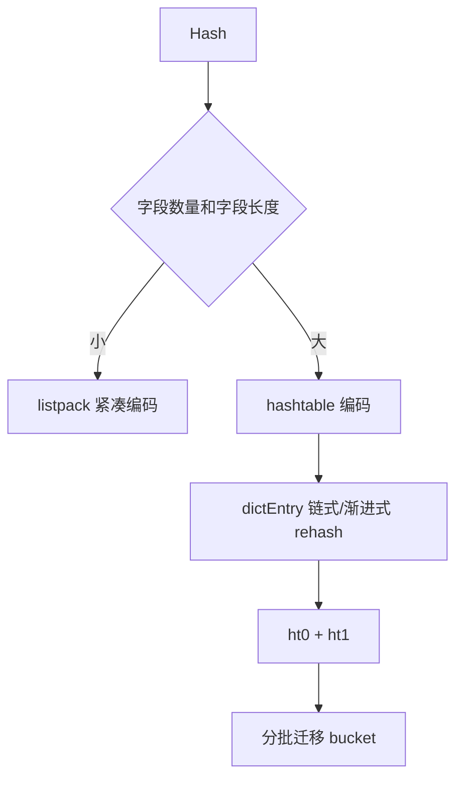

# Hash 如何兼顾内存和查询效率

## 1. 本章要解决的问题

Hash 常用来存用户资料、商品属性、购物车条目。它为什么比多个 String 更省内存？什么时候又会转成 hashtable？本章从 listpack、dict 和渐进式 rehash 讲清 Hash 的取舍。

## 2. 核心观点

Hash 的优势是字段级读写和小对象内存压缩。小 Hash 使用 listpack 紧凑存储，大 Hash 使用 dict 保证查询效率。生产上要控制字段数量、字段大小和热字段访问模式。

## 3. 原理拆解



Redis 新版本使用 listpack 替代 ziplist 作为紧凑编码。listpack 连续内存保存 field-value 对，省去了大量 dictEntry 指针开销。达到阈值后会转换成 hashtable，查询从线性扫描变成平均 O(1)。

dict 扩容不是一次性搬迁所有 bucket，而是渐进式 rehash。Redis 同时维护新旧两个哈希表，每次访问或后台周期搬迁一小部分，避免一次性迁移造成长阻塞。

## 4. 命令与代码示例

常用命令：

```bash
HSET user:1001 name ada city shanghai age 18
HGET user:1001 name
HMGET user:1001 name city
HINCRBY cart:1001 sku:1 1
HGETALL user:1001
OBJECT ENCODING user:1001
MEMORY USAGE user:1001
```

配置阈值：

```conf
hash-max-listpack-entries 512
hash-max-listpack-value 64
```

购物车建模：

```text
cart:{userId}
  field = skuId
  value = count
```

## 5. 生产实践

Hash 适合对象字段相对稳定、需要局部读写的场景，例如用户资料、商品快照、购物车数量。与多个 String 相比，Hash 能减少 key 数量和元数据开销。

生产 checklist：

- 避免单个 Hash 字段无限增长，特别是把全站购物车塞到一个 key。
- 高频读取少数字段用 `HMGET`，谨慎使用 `HGETALL`。
- 对大 Hash 做拆分，例如 `user:profile:{id}:base` 和 `user:profile:{id}:stats`。
- 关注编码转换带来的内存和延迟变化。

## 6. 常见坑

- 把 Hash 当关系表使用，试图按 field 条件搜索。
- 大 Hash 上频繁 `HGETALL`，导致大响应和主线程阻塞。
- 忽略 listpack 到 hashtable 的转换，内存突然上涨。
- 以为 Hash 每个 field 都能独立设置 TTL，Redis 原生 TTL 是 key 级别。

## 7. 面试追问

- Hash 小对象为什么更省内存？
- listpack 和 hashtable 的查询复杂度有什么差异？
- 渐进式 rehash 为什么必要？
- Hash field 能不能单独过期？如何替代实现？

## 8. 章节笔记

- 小 Hash 用 listpack 节省内存，大 Hash 用 hashtable 保证查询。
- dict 扩容通过渐进式 rehash 降低阻塞。
- Hash 适合字段级读写，不适合复杂查询。
- `HGETALL` 只适合小 Hash 或离线工具。

## 9. 小结

Hash 是 Redis 在“内存效率”和“字段查询”之间做得很好的结构。用得好可以显著减少 key 数和序列化成本；用成巨型对象，则会制造新的大 key 问题。
