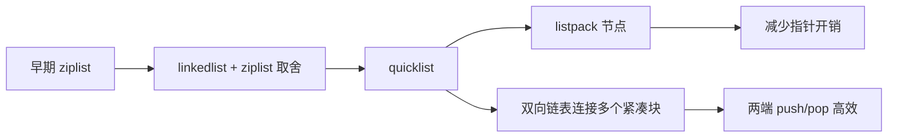

# List 从 ziplist 到 quicklist/listpack 的演进

## 1. 本章要解决的问题

Redis List 既能做列表，也常被用作简单队列。它的底层结构经历了 ziplist、linkedlist、quicklist、listpack 的演进。本章解释这条演进背后的内存、性能和工程取舍。

## 2. 核心观点

List 的核心矛盾是：链表插入删除快但指针开销大，连续内存省空间但中间修改代价高。quicklist 把多个紧凑列表串成双向链表，在内存和操作效率之间折中。

## 3. 原理拆解



ziplist 是连续内存结构，节省空间，但存在连锁更新风险。quicklist 的思路是把 List 拆成多个小的紧凑块，每个块内部连续存储，块之间用链表连接。新版本进一步用 listpack 替代 ziplist，减少连锁更新问题。

List 两端操作如 `LPUSH`、`RPOP` 复杂度较低；按索引访问、范围很大的 `LRANGE`、中间插入删除则要谨慎。

## 4. 命令与代码示例

队列命令：

```bash
LPUSH queue:email job1 job2 job3
RPOP queue:email
BRPOP queue:email 5
LLEN queue:email
LRANGE queue:email 0 9
OBJECT ENCODING queue:email
```

配置示例：

```conf
list-max-listpack-size -2
list-compress-depth 0
```

Python 消费示例：

```python
import redis

r = redis.Redis(decode_responses=True)
while True:
    item = r.brpop("queue:email", timeout=5)
    if item:
        _, payload = item
        print("handle", payload)
```

## 5. 生产实践

List 适合轻量队列，但不适合要求严格可靠投递的大规模消息系统。因为简单 `LPUSH/BRPOP` 消费后消息就消失，消费者处理失败会丢消息。可以用 `BRPOPLPUSH` 做处理中队列，但复杂度会上升。

生产 checklist：

- 控制队列长度，避免堆积成大 key。
- 消费失败需要重试队列或使用 Stream。
- `LRANGE` 必须分页，不要全量拉取。
- 对延迟队列优先考虑 ZSet 或 Stream，而不是 List 轮询。

## 6. 常见坑

- 用 List 做可靠消息队列，却没有 ACK 和重投机制。
- `LRANGE 0 -1` 查看队列，线上直接卡顿。
- 单队列热点严重，所有生产者消费者打到一个 key。
- 忽略消息处理幂等，重试后产生重复副作用。

## 7. 面试追问

- quicklist 为什么比纯 linkedlist 更省内存？
- ziplist/listpack 为什么适合小元素紧凑存储？
- List 做队列和 Stream 做队列有什么差异？
- `BRPOP` 阻塞的是客户端还是 Redis 主线程？

## 8. 章节笔记

- List 的底层演进围绕内存紧凑和操作效率折中。
- quicklist 是链表加紧凑块的组合结构。
- List 两端操作适合队列，范围读取和大队列要谨慎。
- 可靠消息场景更适合 Stream。

## 9. 小结

List 是 Redis 中非常实用的顺序结构，但它不是万能消息队列。理解 quicklist/listpack 的设计后，就能更准确地判断哪些操作便宜，哪些操作会在大规模下变慢。
