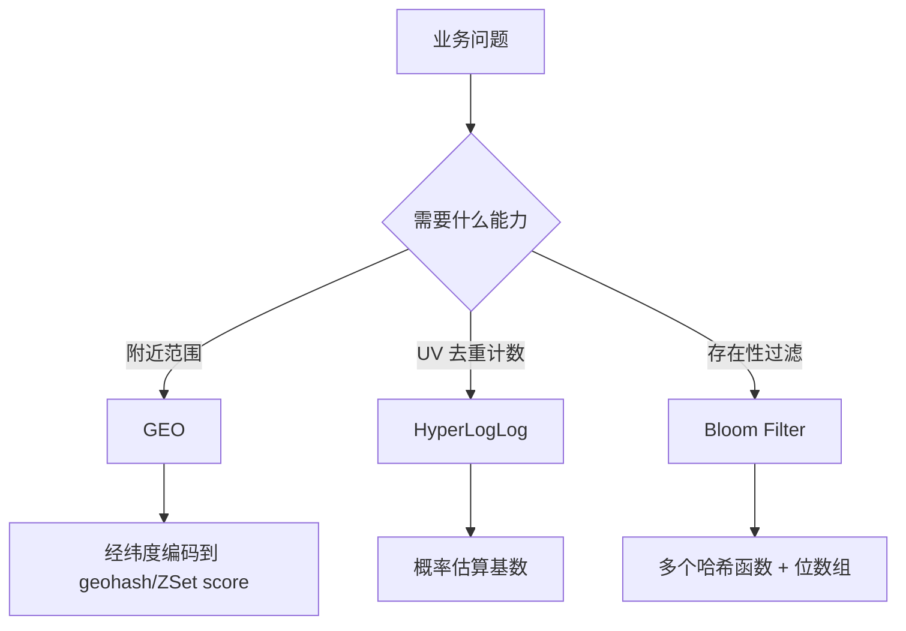

# GEO、HyperLogLog 与 Bloom Filter 的场景边界

## 1. 本章要解决的问题

Redis 除了五大基础类型，还常用于附近的人、UV 统计和存在性过滤。GEO、HyperLogLog、Bloom Filter 都很有用，但它们都带有明确边界：一个是空间索引，一个是近似基数，一个是带误判的存在性判断。

## 2. 核心观点

GEO 适合经纬度附近查询，底层基于有序集合编码地理位置；HyperLogLog 用极小内存估算基数但不保存成员；Bloom Filter 能高效判断“可能存在/一定不存在”，但有误判率且删除困难。

## 3. 原理拆解



GEO 使用经纬度编码，把地理位置映射为可排序值，再借助 ZSet 做范围搜索。HyperLogLog 不是集合，无法列出用户，只能估算去重数量。Bloom Filter 通常来自 RedisBloom 模块，适合在访问数据库前拦截明显不存在的 key。

## 4. 命令与代码示例

GEO：

```bash
GEOADD shop:geo 121.4737 31.2304 shop:shanghai
GEOADD shop:geo 116.4074 39.9042 shop:beijing
GEOSEARCH shop:geo FROMLONLAT 121.48 31.22 BYRADIUS 5 km WITHDIST
```

HyperLogLog：

```bash
PFADD uv:2026-05-25 user:1 user:2 user:3
PFCOUNT uv:2026-05-25
PFMERGE uv:2026-05 uv:2026-05-24 uv:2026-05-25
```

Bloom Filter：

```bash
BF.RESERVE user:exists 0.01 1000000
BF.ADD user:exists user:1001
BF.EXISTS user:exists user:1001
```

## 5. 生产实践

选择边界：

- 需要返回附近对象：GEO。
- 只需要 UV 数量，不关心成员列表：HyperLogLog。
- 需要防缓存穿透，判断 key 是否可能存在：Bloom Filter。
- 需要精确去重且要列出成员：Set。

生产 checklist：

- GEO 按城市、业务或租户拆 key，避免全球数据放一个 key。
- HLL 不能用于需要精确计费的场景。
- Bloom Filter 参数要按容量和误判率提前计算。
- Bloom Filter 扩容困难，业务增长要预留容量或使用可扩展布隆过滤器。

## 6. 常见坑

- 用 HLL 做精确 UV 结算。
- Bloom Filter 判断存在就直接信任数据，不再查缓存或 DB。
- GEO 坐标顺序写反，经度和纬度混淆。
- 不给 Bloom Filter 设计重建流程。

## 7. 面试追问

- HyperLogLog 为什么省内存？代价是什么？
- Bloom Filter 为什么会误判但不会漏判？
- GEO 底层为什么可以用 ZSet？
- Set、HLL、Bloom Filter 如何选择？

## 8. 章节笔记

- GEO 解决空间附近查询，HLL 解决近似基数统计，Bloom Filter 解决存在性过滤。
- 三者都不是万能结构，都牺牲了某些能力换取效率。
- 近似结构不能用于强精确场景。
- 参数容量、误判率和 key 拆分是生产关键。

## 9. 小结

GEO、HyperLogLog 和 Bloom Filter 的共同点是“用专门结构解决专门问题”。只有接受它们的边界，才能真正发挥 Redis 扩展数据结构的价值。
