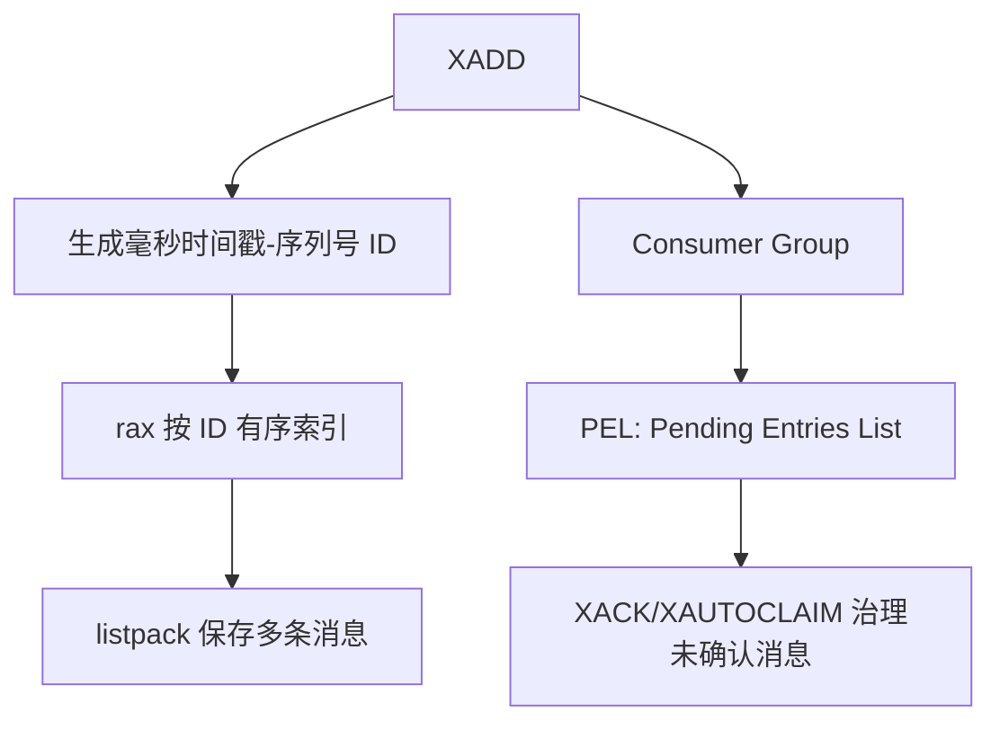

# Stream 为什么使用 Radix Tree

## 1. 本章要解决的问题

Redis Stream 是 Redis 里最接近消息队列的数据类型。它支持消息 ID、消费组、ACK、Pending List。为什么 Stream 底层会使用 Radix Tree？本章从消息有序存储和范围读取解释 rax 的价值。

## 2. 核心观点

Stream 的核心需求是按消息 ID 有序追加、范围查询和消费组追踪。Radix Tree 适合保存有序 key，并通过前缀压缩降低内存；Stream 又把多条消息打包进 listpack，兼顾顺序访问和内存效率。

## 3. 原理拆解



Radix Tree 又称基数树，适合存储具有公共前缀的有序字符串 key。Stream 的消息 ID 单调递增，天然适合有序索引。Redis 不会为每条消息都分配大量独立对象，而是把一批消息压缩到 listpack，再由 rax 进行定位。

消费组维护每个消费者的 pending 状态。消息被投递但未 ACK 时，会进入 PEL。消费者故障后，可以用 `XPENDING` 和 `XAUTOCLAIM` 转移处理权。

## 4. 命令与代码示例

基础生产消费：

```bash
XADD order:stream * orderId 1001 amount 99
XGROUP CREATE order:stream g1 0 MKSTREAM
XREADGROUP GROUP g1 c1 COUNT 10 BLOCK 5000 STREAMS order:stream >
XACK order:stream g1 1700000000000-0
```

查看堆积：

```bash
XLEN order:stream
XPENDING order:stream g1
XINFO STREAM order:stream
XINFO GROUPS order:stream
```

Python 消费骨架：

```python
while True:
    resp = r.xreadgroup("g1", "c1", {"order:stream": ">"}, count=10, block=5000)
    for stream, messages in resp:
        for msg_id, fields in messages:
            handle(fields)
            r.xack("order:stream", "g1", msg_id)
```

## 5. 生产实践

Stream 适合轻中量级可靠消息、异步任务、事件通知和审计流水。与 List 相比，它有消息 ID、消费组和 ACK；与 Kafka 相比，它的分区、长期存储、生态和高吞吐能力有限。

生产 checklist：

- 设置裁剪策略，避免 Stream 无限增长：`XTRIM` 或 `MAXLEN`。
- 监控 `XLEN`、消费组 lag、PEL 数量。
- 消费者处理必须幂等。
- 对长时间 pending 的消息使用 `XAUTOCLAIM`。
- 大消息体不要直接塞 Stream，存对象存储或数据库，Stream 存引用。

裁剪示例：

```bash
XADD order:stream MAXLEN ~ 100000 * orderId 1002 status paid
XTRIM order:stream MAXLEN ~ 100000
```

## 6. 常见坑

- 只消费不 ACK，PEL 越积越多。
- 不裁剪 Stream，内存持续上涨。
- 把 Stream 当 Kafka 替代品，忽略分区和长期堆积能力。
- 消费者异常后没有 pending 转移机制。

## 7. 面试追问

- Stream 为什么适合用 rax 存消息 ID？
- Stream、List、Pub/Sub 的可靠性差异是什么？
- PEL 解决了什么问题，又会带来什么治理成本？
- `MAXLEN ~` 中的近似裁剪有什么意义？

## 8. 章节笔记

- Stream 用 rax 做有序索引，用 listpack 压缩消息内容。
- 消息 ID 是时间戳加序列号，天然适合范围读取。
- 消费组通过 PEL 跟踪未确认消息。
- 生产使用必须处理堆积、ACK、幂等和裁剪。

## 9. 小结

Stream 是 Redis 从缓存走向事件流的重要能力。rax 和 listpack 的组合让它在内存效率和有序读取之间取得平衡，但可靠消息系统的治理工作仍然不能省略。
