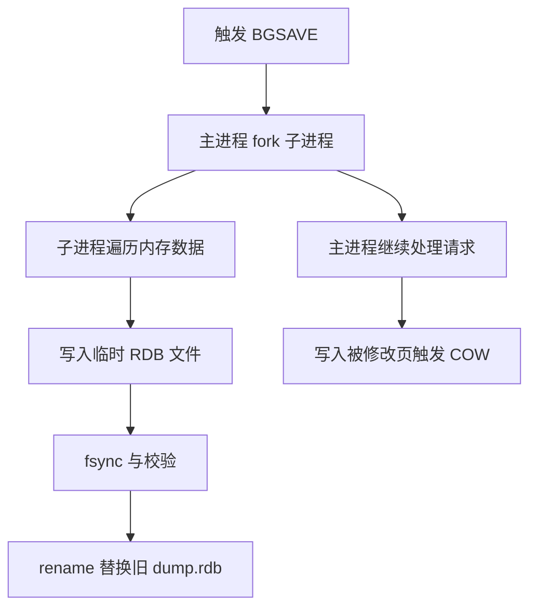

# 14 RDB：Redis 如何生成内存快照

## 本章要解决的问题

RDB 解决的是“如何把某个时刻的内存数据保存成可快速加载的快照”。它不是逐条记录写命令，而是周期性地把数据集序列化到磁盘文件中。理解 RDB，关键不是只会配置 `save`，而是要知道 fork、COW、磁盘写入和恢复速度之间的取舍。

## 核心观点

- RDB 是时间点快照，恢复快，但两次快照之间的数据可能丢失。
- Redis 通过 `fork` 子进程生成 RDB，主进程继续处理请求。
- fork 不是完全无成本，页表复制会造成短暂停顿，写多时 COW 会增加内存峰值。
- RDB 更适合冷备、全量复制基线、灾备恢复，而不是极致数据不丢的场景。

## 原理拆解



RDB 生成一般由 `BGSAVE` 完成。Redis 主进程 fork 出子进程，子进程拥有与父进程相同的虚拟地址空间。Linux 通过 Copy-On-Write 延迟复制物理页：只要父子进程都不修改某个内存页，就共享这页；一旦主进程修改，内核会复制旧页给子进程，保证子进程看到的是 fork 时刻的一致快照。

RDB 文件采用紧凑二进制格式，保存数据库编号、键值对象、过期时间、版本和校验信息。恢复时 Redis 顺序加载文件，重建内存数据结构，因此通常比重放大量 AOF 命令更快。

## 命令与代码示例

`redis.conf` 推荐从业务恢复目标出发配置，而不是机械套模板：

```conf
dir /data/redis
dbfilename dump.rdb

save 900 1
save 300 100
save 60 10000

stop-writes-on-bgsave-error yes
rdbcompression yes
rdbchecksum yes

# 大实例建议开启 lazy free，降低删除大 key 对主线程影响
lazyfree-lazy-eviction yes
lazyfree-lazy-expire yes
lazyfree-lazy-server-del yes
```

手工触发和检查：

```bash
redis-cli BGSAVE
redis-cli INFO persistence
redis-cli LASTSAVE
redis-cli CONFIG GET dir
redis-check-rdb /data/redis/dump.rdb
```

用伪代码理解 COW 内存峰值：

```text
fork_time_memory = used_memory
while child_writing_rdb:
    if parent_modifies_page:
        cow_memory += page_size
peak_memory ~= used_memory + cow_memory + output_buffer
```

## 生产实践

RDB 的核心指标是 `latest_fork_usec`、`rdb_bgsave_in_progress`、`rdb_last_bgsave_status`、`used_memory_rss` 和磁盘吞吐。大实例做 RDB 前，需要评估 fork 暂停和 COW 峰值，尤其是写入密集、内存接近上限、透明大页开启的机器。

一个可用于本机演练的 Docker Compose：

```yaml
services:
  redis-rdb:
    image: redis:7
    command: ["redis-server", "/usr/local/etc/redis/redis.conf"]
    volumes:
      - ./redis.conf:/usr/local/etc/redis/redis.conf
      - ./data:/data
    ports:
      - "6379:6379"
```

上线建议：

- 将 RDB 文件放在独立高速磁盘，避免和业务日志争抢 IO。
- 大实例不要在流量峰值手工执行 `BGSAVE`。
- 保留离线 RDB 备份，并定期用 `redis-check-rdb` 校验。
- 对恢复目标严格的业务，不要只依赖 RDB，应组合 AOF 或上游补偿。

## 常见坑

- 误以为 RDB 不会影响线上延迟，实际 fork 可能造成毫秒到秒级抖动。
- 内存水位过高时执行 BGSAVE，COW 触发 OOM。
- `stop-writes-on-bgsave-error no` 被滥用，RDB 失败后业务继续写入，灾备窗口扩大。
- 只备份 `dump.rdb`，没有记录 Redis 版本、配置和恢复流程。

## 面试追问

1. 为什么 RDB 恢复通常比 AOF 快？
2. fork 为什么会阻塞 Redis 主线程？
3. COW 在 Redis 持久化中解决了什么问题，又带来了什么风险？
4. 如果 Redis 有 100GB 内存，如何评估 BGSAVE 的风险？

## 章节笔记

- RDB 是“某个时间点”的数据照片。
- `BGSAVE` = fork 子进程 + 子进程写文件 + rename 原子替换。
- COW 保证快照一致性，但写入越多，额外内存越高。
- RDB 适合快速恢复和备份，不适合单独承担强可靠写入。

## 小结

RDB 的优点是简单、紧凑、恢复快；代价是快照间隔内的数据可能丢失，并且生成快照时会受到 fork、COW、磁盘 IO 的影响。生产中要把 RDB 看成一套恢复能力，而不是一个配置项：有监控、有演练、有容量预留，才算真正可用。
