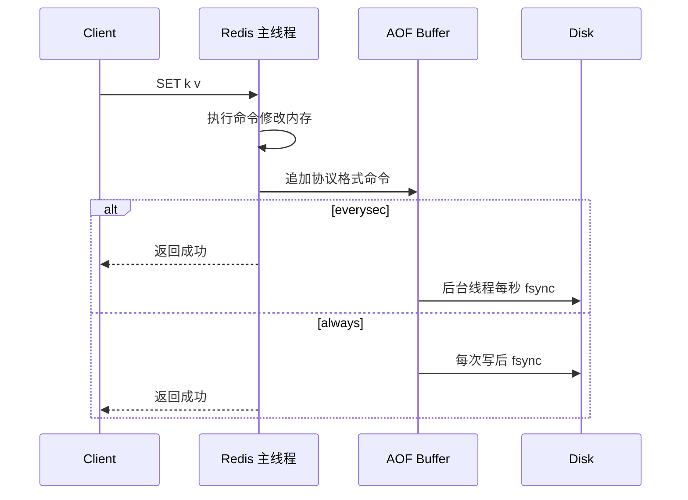

# 15 AOF：每条写命令都记录就安全吗

## 本章要解决的问题

AOF 看起来更可靠：每次写命令都追加到日志，宕机后重放即可恢复。但“记录了命令”不等于“一定不丢数据”，真正要理解的是写入缓冲、刷盘策略、AOF rewrite、文件损坏和恢复耗时之间的边界。

## 核心观点

- AOF 是写后日志，记录会改变数据的 Redis 命令。
- `appendfsync always/everysec/no` 决定可靠性和性能取舍。
- AOF rewrite 用更短命令重建当前数据状态，避免文件无限膨胀。
- AOF 也可能丢最近 1 秒数据、阻塞主线程或在磁盘异常时放大延迟。

## 原理拆解



AOF 的写入顺序是先执行命令，再追加日志，所以叫写后日志。Redis 会把写命令按 RESP 协议格式追加到 AOF buffer，再根据 `appendfsync` 策略刷盘。

AOF rewrite 不会逐条压缩旧 AOF，而是读取当前内存数据，为每个键生成最小命令集合。例如一个 key 被 `INCR` 一万次，rewrite 后可能只剩一条 `SET counter 10000`。rewrite 期间同样依赖 fork 子进程，主进程增量写会进入 rewrite buffer，最后与子进程生成的新 AOF 合并。

## 命令与代码示例

基础配置：

```conf
appendonly yes
appendfilename "appendonly.aof"
appendfsync everysec

auto-aof-rewrite-percentage 100
auto-aof-rewrite-min-size 64mb
no-appendfsync-on-rewrite no
aof-load-truncated yes
aof-use-rdb-preamble yes
```

检查与修复：

```bash
redis-cli INFO persistence
redis-cli BGREWRITEAOF
redis-check-aof --fix /data/redis/appendonly.aof
tail -n 20 /data/redis/appendonly.aof
```

客户端压测观察刷盘策略影响：

```bash
redis-benchmark -t set -n 200000 -c 100 -P 16
redis-cli CONFIG SET appendfsync always
redis-benchmark -t set -n 50000 -c 100 -P 16
```

AOF rewrite 伪代码：

```text
child = fork()
if child:
    for key in dataset:
        emit_minimal_command(key)
    write_temp_aof()
else:
    while rewrite_running:
        append(command, aof_buffer)
        append(command, rewrite_buffer)
    merge(temp_aof, rewrite_buffer)
    rename_as_new_aof()
```

## 生产实践

多数生产系统选择 `appendfsync everysec`：性能稳定，最坏丢失约 1 秒写入。金融级或账务级场景通常不把 Redis 当唯一真相源，而是由数据库、消息日志或业务流水保证最终可追溯。

运维关注点：

- `aof_current_size` 和 `aof_base_size` 判断是否需要 rewrite。
- `aof_delayed_fsync` 判断磁盘 fsync 是否阻塞。
- `aof_last_bgrewrite_status` 监控重写结果。
- AOF 文件增长速度要进入容量告警。

## 常见坑

- 把 `appendfsync always` 当万能保险，导致写延迟急剧上升。
- rewrite 与 RDB、备份任务同时发生，磁盘 IO 被打满。
- AOF 文件损坏后没有演练 `redis-check-aof --fix`。
- 使用 AOF 但没有考虑重放时间，实例很大时恢复可能慢于 RDB。

## 面试追问

1. AOF 为什么采用写后日志，而不是写前日志？
2. `everysec` 最多会丢多少数据？这个说法有什么前提？
3. AOF rewrite 为什么不会读取旧 AOF 文件？
4. `no-appendfsync-on-rewrite` 应该怎么选？

## 章节笔记

- AOF 提高写入可恢复性，但不能让 Redis 变成强一致存储。
- `always` 更可靠但慢，`everysec` 是常用平衡点，`no` 依赖操作系统刷盘。
- rewrite 是“基于当前内存生成新日志”，不是“压缩旧日志”。
- AOF 可靠性最终受磁盘、fsync、操作系统和运维流程影响。

## 小结

AOF 的价值是缩小数据丢失窗口，但它不是免费的。真正的生产方案要同时回答：刷盘策略怎么选、rewrite 何时触发、磁盘打满怎么办、恢复要多久、业务是否能补偿。只有这些问题都有答案，AOF 才算安全。
