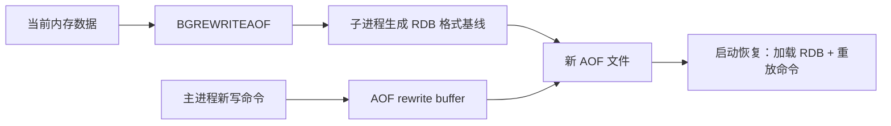

# 16 混合持久化：为什么 RDB 和 AOF 要组合

## 本章要解决的问题

RDB 恢复快但丢数据窗口大，AOF 数据更完整但重放慢。混合持久化尝试把两者组合：AOF 文件前半段使用 RDB 格式保存基线，后半段追加增量写命令，让恢复速度和数据完整性同时更可控。

## 核心观点

- 混合持久化不是同时保存两份文件，而是在 AOF rewrite 后生成“RDB 前缀 + AOF 增量”的新 AOF。
- 启动时先加载 RDB 基线，再重放增量命令。
- 它降低恢复时间，但保留 AOF 刷盘策略的数据丢失边界。
- 兼容性和版本管理很重要，旧版本 Redis 可能不能识别混合格式。

## 原理拆解



混合持久化由 `aof-use-rdb-preamble yes` 控制。触发 AOF rewrite 时，子进程不再把所有键都转换成 Redis 命令，而是先写一个 RDB 格式的快照作为 AOF 文件前缀；rewrite 期间的增量命令继续追加到文件尾部。这样恢复时大量数据通过 RDB 快速加载，少量增量用 AOF 保证较小丢失窗口。

## 命令与代码示例

配置模板：

```conf
appendonly yes
appendfsync everysec
aof-use-rdb-preamble yes
auto-aof-rewrite-percentage 100
auto-aof-rewrite-min-size 1gb

save 900 1
save 300 100
save 60 10000
```

验证混合 AOF：

```bash
redis-cli BGREWRITEAOF
redis-cli INFO persistence | grep aof
head -c 16 /data/redis/appendonly.aof
redis-check-aof /data/redis/appendonly.aof
```

恢复演练脚本思路：

```bash
docker run --rm -v ./data:/data redis:7 redis-check-aof /data/appendonly.aof
docker run --rm -v ./data:/data redis:7 redis-server --appendonly yes --dir /data
```

Java 客户端只需关注连接恢复，持久化对客户端透明：

```java
RedisClient client = RedisClient.create("redis://127.0.0.1:6379");
StatefulRedisConnection<String, String> conn = client.connect();
conn.sync().set("order:1001", "paid");
```

## 生产实践

混合持久化适合大实例：例如 80GB 数据，如果纯 AOF 重放几千万条命令，恢复时间可能不可接受；混合模式先加载紧凑快照，启动时间通常更稳定。

建议把恢复指标纳入演练：

- 冷启动加载耗时。
- 最后一次 AOF fsync 到宕机之间的业务补偿量。
- rewrite 期间 COW 内存峰值。
- 文件格式在 Redis 版本升级前后的兼容性。

## 常见坑

- 误以为开启混合持久化后 RDB 和 AOF 都有独立完整副本。
- 升级或回滚 Redis 版本时，没有确认旧版本是否支持 RDB preamble。
- 只关注写入可靠性，不测恢复时间。
- 配置了混合持久化，但从未触发 rewrite，旧 AOF 仍然很大。

## 面试追问

1. 混合持久化的 AOF 文件结构是什么？
2. 混合持久化能否解决 `appendfsync everysec` 的 1 秒数据丢失问题？
3. 为什么混合持久化常和 AOF rewrite 绑定？
4. 大实例恢复时如何选择 RDB、AOF 和混合持久化？

## 章节笔记

- 混合持久化 = RDB 基线 + AOF 增量。
- 目标是缩短恢复时间，同时保留较小数据丢失窗口。
- 它并不改变 AOF 刷盘语义。
- 上线前必须验证版本兼容和真实恢复耗时。

## 小结

混合持久化是一种很工程化的折中：用 RDB 承担“大量历史数据快速加载”，用 AOF 承担“最近写入尽量少丢”。它不是银弹，但对于大内存实例，是比单独 RDB 或单独 AOF 更贴近生产恢复目标的方案。
