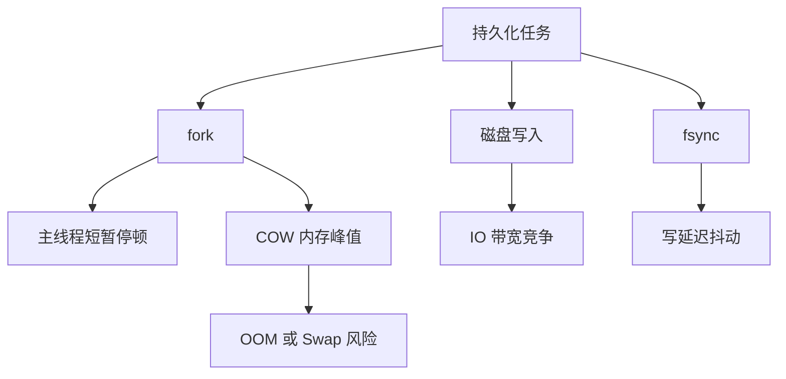

# 17 持久化如何影响延迟和容量规划

## 本章要解决的问题

持久化不只是“会不会丢数据”，还会直接影响延迟、内存峰值、磁盘容量和故障恢复时间。本章从容量规划角度，把 RDB、AOF、fork、COW、磁盘 IO 和监控指标串起来。

## 核心观点

- fork 暂停、COW 内存、fsync 抖动是 Redis 持久化影响延迟的三条主线。
- 容量规划要同时预留内存、磁盘、IOPS 和恢复时间。
- 大实例不要只看 `used_memory`，还要看 RSS、碎片率、复制缓冲区和 AOF/RDB 临时文件。
- 持久化策略应该由 RPO、RTO、成本和业务补偿能力共同决定。

## 原理拆解



容量规划可以用一个粗略公式开始：

```text
memory_required =
  dataset_memory
  + cow_peak_during_bgsave_or_rewrite
  + replication_backlog
  + client_output_buffers
  + allocator_fragmentation
  + safety_margin
```

磁盘规划也要考虑临时文件：RDB 生成时有临时 RDB，AOF rewrite 时有临时 AOF，多实例同机时峰值会叠加。

## 命令与代码示例

核心观测命令：

```bash
redis-cli INFO memory
redis-cli INFO persistence
redis-cli INFO stats
redis-cli LATENCY DOCTOR
redis-cli SLOWLOG GET 10
```

重点指标：

```text
latest_fork_usec
rdb_last_bgsave_status
aof_delayed_fsync
aof_current_size
aof_rewrite_in_progress
used_memory
used_memory_rss
mem_fragmentation_ratio
```

持久化容量配置片段：

```conf
maxmemory 24gb
repl-backlog-size 256mb
client-output-buffer-limit normal 0 0 0
client-output-buffer-limit replica 512mb 128mb 60

appendonly yes
appendfsync everysec
aof-use-rdb-preamble yes
```

排障脚本骨架：

```bash
#!/usr/bin/env bash
redis-cli INFO persistence | egrep "fork|rdb|aof|rewrite|fsync"
redis-cli INFO memory | egrep "used_memory|rss|fragmentation"
iostat -xz 1 3
vmstat 1 3
```

## 生产实践

推荐把实例分级：

- 缓存型：可重建数据，RDB 或低频 AOF 即可，重点是低延迟。
- 准存储型：开启 AOF everysec + 混合持久化，并准备业务补偿。
- 关键账务型：Redis 不作为唯一事实源，持久化只是加速恢复。

规划时至少预留 30% 以上内存安全余量；写入高峰和 rewrite 重叠时，COW 峰值可能远超平时。Linux 侧建议关闭 THP，避免 fork 和内存管理抖动。

```bash
cat /sys/kernel/mm/transparent_hugepage/enabled
echo never > /sys/kernel/mm/transparent_hugepage/enabled
```

## 常见坑

- 把 Redis 内存打满后再开启 AOF rewrite，结果 OOM。
- 多个 Redis 实例同机同时 BGSAVE，磁盘 IO 被打爆。
- 只监控 QPS，不监控 `latest_fork_usec` 和 `aof_delayed_fsync`。
- 使用云盘但不了解突发积分、IOPS 上限和 fsync 延迟。

## 面试追问

1. Redis 持久化为什么会造成延迟毛刺？
2. 如何估算 AOF rewrite 期间的额外内存？
3. RPO 和 RTO 分别如何影响持久化方案？
4. 为什么删除大量数据后内存不一定马上下降？

## 章节笔记

- 持久化会消耗 CPU、内存、磁盘 IO 和时间。
- fork 影响延迟，COW 影响内存峰值，fsync 影响写入抖动。
- 容量规划必须覆盖最坏时刻，而不是平均时刻。
- 恢复演练比配置本身更重要。

## 小结

Redis 持久化真正难的是工程边界：什么时候抖、抖多久、会不会 OOM、恢复多久、能丢多少。把这些问题量化进监控和容量规划，才是从“会配置 Redis”走向“能运营 Redis”。
