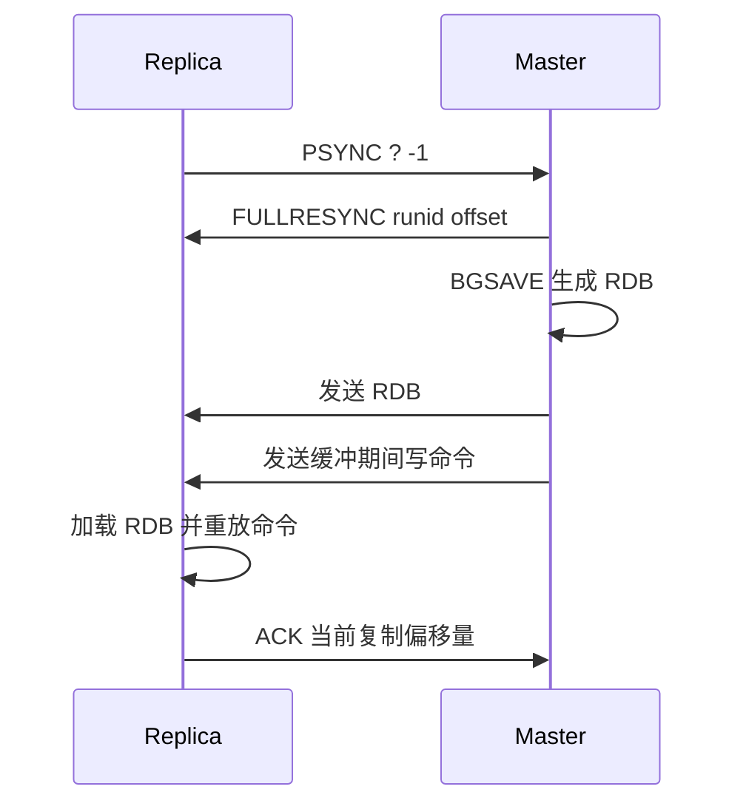

# 18 主从同步：Redis 如何复制数据

## 本章要解决的问题

主从复制是 Redis 高可用和读扩展的基础。本章解释从库如何追上主库、断线后如何增量同步、复制偏移量和 repl backlog 为什么关键，以及主从延迟会带来哪些业务风险。

## 核心观点

- Redis 复制分为全量复制和增量复制。
- 复制偏移量用于判断主从数据差距，repl backlog 用于支持断线后的部分重同步。
- 复制是异步的，从库读可能读到旧数据。
- 主从复制提高可用性基础，但不等于强一致。

## 原理拆解



首次复制通常是全量复制：从库发送 `PSYNC ? -1`，主库返回 `FULLRESYNC`，生成 RDB 并传给从库。后续主库把写命令持续发送给从库，从库执行命令追随主库。

断线重连时，从库带上旧主库 `runid` 和复制偏移量。如果主库的 repl backlog 仍保留这段增量，主库返回 `CONTINUE` 并补发缺失命令；否则只能重新全量复制。

## 命令与代码示例

主库配置：

```conf
port 6379
repl-backlog-size 256mb
repl-backlog-ttl 3600
min-replicas-to-write 1
min-replicas-max-lag 10
```

从库配置：

```conf
port 6380
replicaof 127.0.0.1 6379
replica-read-only yes
replica-serve-stale-data yes
```

Docker Compose 演练：

```yaml
services:
  redis-master:
    image: redis:7
    command: redis-server --port 6379 --repl-backlog-size 256mb
    ports: ["6379:6379"]
  redis-replica:
    image: redis:7
    command: redis-server --port 6380 --replicaof redis-master 6379
    depends_on: [redis-master]
    ports: ["6380:6380"]
```

检查复制状态：

```bash
redis-cli -p 6379 INFO replication
redis-cli -p 6380 INFO replication
redis-cli -p 6379 ROLE
redis-cli -p 6380 REPLICAOF NO ONE
```

## 生产实践

主从延迟要看 `master_repl_offset`、`slave_repl_offset`、`master_link_status`、`master_last_io_seconds_ago`。如果从库用于读扩展，客户端需要接受读旧数据，或者只把弱一致读流量发到从库。

Jedis/Lettuce 客户端读写分离要显式配置：

```java
RedisURI uri = RedisURI.Builder.redis("redis-master", 6379).build();
RedisClient client = RedisClient.create(uri);
StatefulRedisConnection<String, String> conn = client.connect();
conn.sync().set("user:1", "A");
```

生产建议：

- repl backlog 按“写入速率 × 可接受断线时间”估算。
- 避免跨地域同步承载强一致读。
- 大主库新增从库会触发全量复制，要避开高峰。
- 对重要写入使用 `WAIT` 提升同步确认度，但不要误认为它是强一致事务。

```bash
redis-cli SET order:1 paid
redis-cli WAIT 1 1000
```

## 常见坑

- backlog 太小，短暂断线也全量复制。
- 从库对外读，故障或延迟时返回旧数据。
- 同一主库挂多个新从库，连续 BGSAVE 和网络发送造成抖动。
- 把 `WAIT` 当成分布式共识，它只能等待副本确认接收。

## 面试追问

1. Redis 为什么需要 repl backlog？
2. 全量复制期间主库的新写入如何处理？
3. 主从复制为什么不能保证强一致？
4. 如何估算 `repl-backlog-size`？

## 章节笔记

- `PSYNC` 是复制入口。
- `runid + offset` 决定是否能增量复制。
- repl backlog 是主库上的环形缓冲区。
- 复制异步，读写分离必须面对延迟。

## 小结

主从复制的价值是冗余和扩展，但它的本质是异步追随。真正用好复制，要把 backlog、偏移量、延迟监控、读写策略和故障演练一起设计，而不是简单加一个从库。
