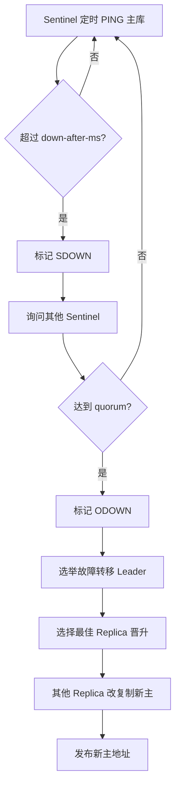

# 19 哨兵机制：主库挂了如何自动切换

## 本章要解决的问题

主从复制提供副本，但主库故障后谁来判断、谁来选新主、客户端如何知道新地址？Redis Sentinel 解决的是主从架构下的自动故障发现、故障转移和配置通知。

## 核心观点

- Sentinel 负责监控、通知、自动故障转移和配置提供。
- SDOWN 是单个哨兵的主观下线，ODOWN 是多个哨兵达成的客观下线。
- 故障转移包括选举 Leader、选择新主、让其他从库复制新主、通知客户端。
- Sentinel 本身也要多节点部署，避免单点误判。

## 原理拆解



Sentinel 会向主从节点发送 `PING`，也通过 Pub/Sub 发现其他 Sentinel。当某个 Sentinel 判断主库超时，会标记 SDOWN；当足够多 Sentinel 同意，才进入 ODOWN。ODOWN 之后需要选出一个 Sentinel Leader 执行故障转移。

新主选择会考虑从库优先级、复制偏移量、与主库断连时间等因素。复制越完整、优先级越高的从库越可能被提升。

## 命令与代码示例

Sentinel 配置：

```conf
port 26379
sentinel monitor mymaster 127.0.0.1 6379 2
sentinel down-after-milliseconds mymaster 5000
sentinel failover-timeout mymaster 60000
sentinel parallel-syncs mymaster 1
```

启动和检查：

```bash
redis-server sentinel.conf --sentinel
redis-cli -p 26379 SENTINEL masters
redis-cli -p 26379 SENTINEL replicas mymaster
redis-cli -p 26379 SENTINEL get-master-addr-by-name mymaster
```

客户端 Sentinel 配置示例：

```java
RedisURI sentinelUri = RedisURI.Builder
    .sentinel("127.0.0.1", 26379, "mymaster")
    .withSentinel("127.0.0.1", 26380)
    .withSentinel("127.0.0.1", 26381)
    .build();
RedisClient client = RedisClient.create(sentinelUri);
```

## 生产实践

Sentinel 至少部署 3 个，分散在不同机器或可用区。`quorum` 不是 Sentinel 总数，它表示判断 ODOWN 所需的同意票；真正执行故障转移还需要多数 Sentinel 授权。

故障演练：

```bash
redis-cli -p 6379 DEBUG sleep 30
redis-cli -p 26379 SENTINEL master mymaster
redis-cli -p 26379 SENTINEL failover mymaster
```

生产上要验证客户端是否能自动刷新主库地址，否则 Sentinel 完成切换后，业务仍可能写旧主或持续报错。

## 常见坑

- 只部署一个 Sentinel，变成新的单点。
- `down-after-milliseconds` 设置过小，网络抖动导致误切。
- 客户端没有使用 Sentinel 地址，而是写死主库 IP。
- 故障转移后旧主恢复，没有正确降级为从库。

## 面试追问

1. SDOWN 和 ODOWN 有什么区别？
2. Sentinel 的 quorum 和 majority 是一回事吗？
3. Sentinel 如何选择新主？
4. 客户端如何感知故障转移后的新主？

## 章节笔记

- Sentinel 是主从高可用协调者。
- SDOWN 是个体判断，ODOWN 是群体判断。
- 故障转移需要 Sentinel Leader。
- 客户端必须接入 Sentinel，不能只写死 Redis 地址。

## 小结

Sentinel 让主从架构具备自动切换能力，但它不是魔法。可靠的 Sentinel 方案依赖合理的超时、足够的节点、客户端适配、旧主回归处理和定期演练。
