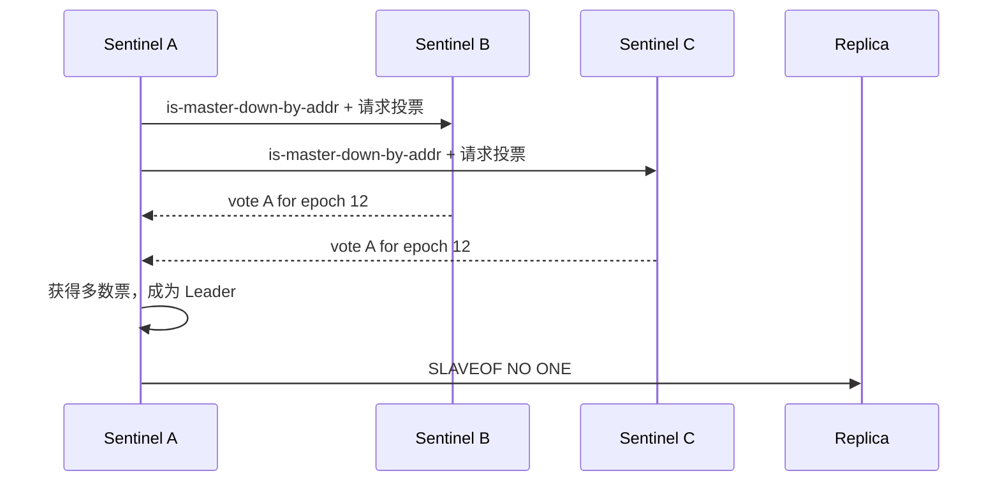

# 20 哨兵 Leader 选举与 Raft 思想

## 本章要解决的问题

多个 Sentinel 都能发现主库故障，但不能大家同时执行故障转移。本章解释 Sentinel 如何选出一个 Leader，并借 Raft 的任期、投票和多数派思想理解它的工程简化。

## 核心观点

- Sentinel 故障转移前要先选 Leader，避免多个哨兵同时切换。
- Sentinel 的 `config-epoch` 类似任期，用于区分配置新旧。
- 每个 Sentinel 在一个 epoch 内只能投一票。
- Sentinel 借鉴了 Raft 思想，但不是完整 Raft 实现。

## 原理拆解



Sentinel Leader 选举发生在 ODOWN 后。候选 Sentinel 增加当前纪元，向其他 Sentinel 请求授权。其他 Sentinel 如果在当前纪元还没有投票，就可以投给它。获得多数票的 Sentinel 才能执行 failover。

和 Raft 相似的地方：

- epoch/term 用于表达时间上的新旧。
- 一个任期内每个节点只投一票。
- 需要多数派同意，减少脑裂式并发操作。

和 Raft 不同的地方：

- Sentinel 不复制完整日志。
- Sentinel 选举的是故障转移执行者，不是 Redis 数据写入 Leader。
- Redis 主从数据复制仍是异步的。

## 命令与代码示例

观察 Sentinel 纪元和投票状态：

```bash
redis-cli -p 26379 SENTINEL master mymaster
redis-cli -p 26379 INFO sentinel
redis-cli -p 26379 SENTINEL ckquorum mymaster
```

典型配置：

```conf
sentinel monitor mymaster 10.0.0.10 6379 2
sentinel down-after-milliseconds mymaster 5000
sentinel failover-timeout mymaster 60000
sentinel parallel-syncs mymaster 1
```

Leader 选举伪代码：

```text
if master_is_odown:
    epoch += 1
    votes = 1
    for sentinel in known_sentinels:
        if sentinel.vote_for(self, epoch):
            votes += 1
    if votes > total_sentinels / 2:
        become_failover_leader()
```

## 生产实践

Sentinel 节点数建议为奇数，常见是 3 或 5。跨机房部署要谨慎，如果网络分区频繁，多数派可能无法形成，或者形成后客户端访问路径不稳定。

故障前检查：

```bash
redis-cli -p 26379 SENTINEL ckquorum mymaster
redis-cli -p 26380 SENTINEL ckquorum mymaster
redis-cli -p 26381 SENTINEL ckquorum mymaster
```

如果 `ckquorum` 不通过，不要假设 Sentinel 能自动切换。

## 常见坑

- 把 quorum 设置成 1，以为切换更快，实际误判风险上升。
- Sentinel 分布在同一台机器，机器故障后完全失效。
- 多机房 Sentinel 数量设计不合理，分区后无法获得多数派。
- 误以为 Sentinel 选举能保证主从数据零丢失。

## 面试追问

1. Sentinel Leader 选举为什么需要多数票？
2. `config-epoch` 有什么作用？
3. Sentinel 和 Raft 的相同点与不同点是什么？
4. 为什么故障转移 Leader 不是 Redis 数据一致性的 Leader？

## 章节笔记

- Leader 选举是为了让一个 Sentinel 执行 failover。
- epoch 防止旧配置覆盖新配置。
- 多数派降低并发切换和误切风险。
- Sentinel 借鉴 Raft，但数据复制仍是 Redis 异步复制。

## 小结

理解 Sentinel Leader 选举，重点不是背协议细节，而是掌握工程目标：在不引入完整共识系统的前提下，让多个 Sentinel 对“谁来切主”达成足够可靠的一致。
