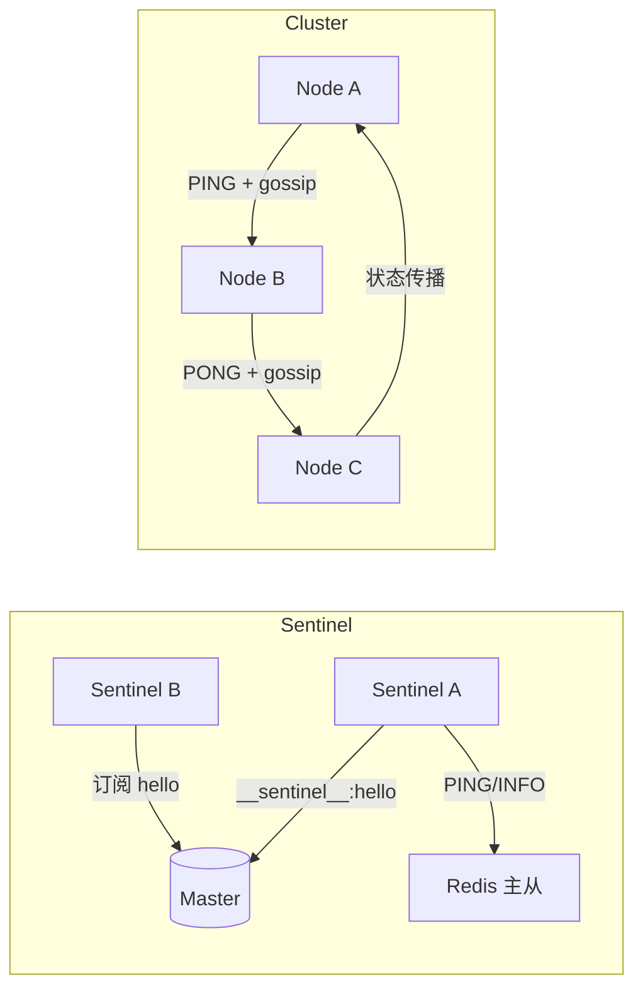

# 21 PubSub、Ping/Pong 与 Gossip 如何支撑集群通信

## 本章要解决的问题

Redis 高可用组件需要互相发现、交换状态和传播配置。Sentinel 主要依赖 Pub/Sub 与命令交互发现同伴，Cluster 则依赖节点间 Ping/Pong 和 Gossip 传播集群状态。本章把这两条通信线讲清楚。

## 核心观点

- Sentinel 使用 Pub/Sub 频道发现其他 Sentinel，并定期探测 Redis 节点状态。
- Redis Cluster 节点通过 cluster bus 交换 Ping/Pong。
- Gossip 不是强一致协议，它用于低成本传播节点视图。
- 通信开销会随着节点规模增长，需要控制集群规模和拓扑。

## 原理拆解



Sentinel 会向被监控主库的 `__sentinel__:hello` 频道发布自身信息，其他 Sentinel 订阅后发现新同伴。它还定期向主从节点发送 `PING`、`INFO`，维护主从拓扑。

Redis Cluster 使用独立的 cluster bus 端口，默认是服务端口 + 10000。节点之间发送 Ping/Pong，消息中携带自己知道的一部分节点状态，这就是 Gossip。它让集群不用中心节点也能传播故障、槽位和节点信息。

## 命令与代码示例

观察 Sentinel Pub/Sub：

```bash
redis-cli -p 6379 PSUBSCRIBE '*sentinel*'
redis-cli -p 26379 SENTINEL sentinels mymaster
```

Cluster 通信配置：

```conf
cluster-enabled yes
cluster-config-file nodes.conf
cluster-node-timeout 5000
cluster-announce-ip 10.0.0.11
cluster-announce-port 6379
cluster-announce-bus-port 16379
```

检查 Cluster 节点视图：

```bash
redis-cli -c -p 6379 CLUSTER NODES
redis-cli -c -p 6379 CLUSTER INFO
redis-cli -c -p 6379 CLUSTER SLOTS
```

Gossip 状态传播伪代码：

```text
every cluster_cron:
    target = pick_random_node()
    send_ping(target, my_state, sample_known_nodes)

on_receive_ping(message):
    update_sender_state()
    merge_gossip_nodes(message.nodes)
    reply_pong(my_state, sample_known_nodes)
```

## 生产实践

网络策略要放通 Redis 服务端口和 cluster bus 端口。很多 Cluster 部署问题不是 Redis 本身，而是容器、NAT、Kubernetes Service 或安全组导致节点互相看到错误 IP。

排障命令：

```bash
redis-cli -p 6379 CLUSTER NODES | grep fail
redis-cli -p 6379 CLUSTER INFO | egrep "cluster_state|slots|known_nodes"
nc -vz 10.0.0.11 6379
nc -vz 10.0.0.11 16379
```

## 常见坑

- 只开放 6379，忘记开放 16379 cluster bus 端口。
- 容器内节点宣布内网不可达 IP，客户端或其他节点无法连接。
- 误以为 Gossip 能立即让所有节点看到一致视图。
- 节点规模过大，Ping/Pong 和 Gossip 开销变明显。

## 面试追问

1. Sentinel 如何发现其他 Sentinel？
2. Redis Cluster 为什么需要 cluster bus？
3. Gossip 的优点和局限是什么？
4. 为什么 Cluster 节点规模不能无限扩大？

## 章节笔记

- Sentinel 用 Pub/Sub 做发现，用 PING/INFO 做监控。
- Cluster 用 Ping/Pong + Gossip 传播状态。
- Gossip 是最终传播，不是强一致。
- 网络地址和端口配置是 Cluster 部署的高频坑。

## 小结

Redis 的高可用通信设计很务实：Sentinel 用简单频道发现同伴，Cluster 用 Gossip 去中心化传播节点状态。理解这些机制，能帮助我们快速定位“为什么节点看不到彼此”“为什么槽位状态不一致”等生产问题。
