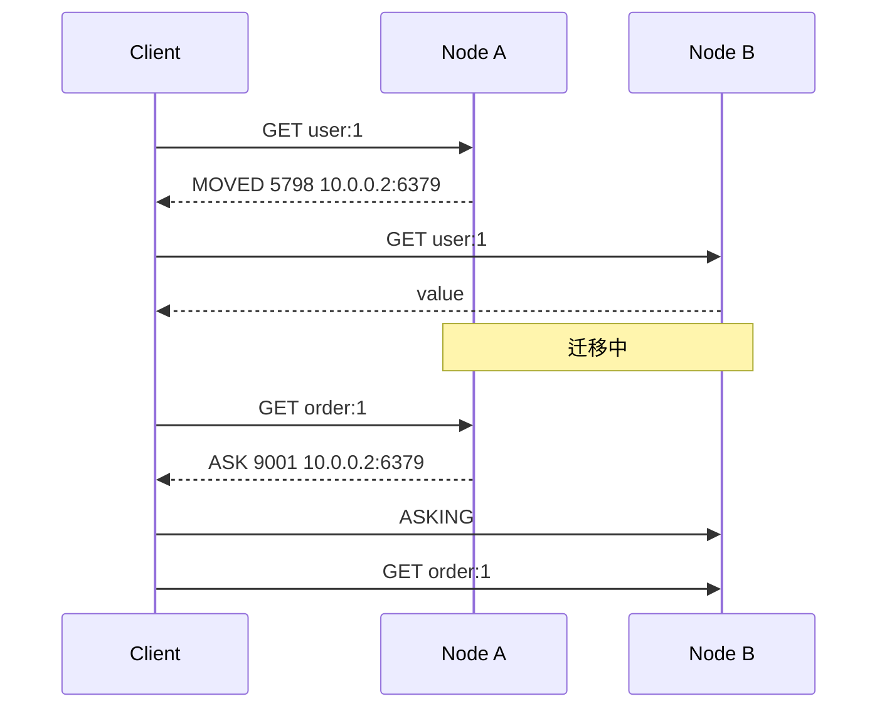

# 22 Redis Cluster：槽、MOVED、ASK 与数据迁移

## 本章要解决的问题

Redis Cluster 如何把数据分散到多个主节点？客户端为什么会收到 `MOVED` 和 `ASK`？在线迁移槽位时，读写请求如何被正确路由？本章围绕 slot 和重定向机制拆解 Cluster。

## 核心观点

- Redis Cluster 使用 16384 个 hash slot 做分片。
- key 通过 CRC16 计算槽位，hash tag 可让多个 key 落到同一槽。
- `MOVED` 表示槽位归属已变更，客户端应更新路由缓存。
- `ASK` 表示槽位迁移中的临时重定向，只对本次请求有效。

## 原理拆解



Cluster 没有中心代理，客户端需要理解槽位路由。槽位归属稳定时，如果请求发错节点，节点返回 `MOVED`，客户端更新本地 slot map。槽位迁移时，源节点可能返回 `ASK`，客户端先向目标节点发送 `ASKING`，再执行原命令。

迁移状态包括：

- 源节点：`MIGRATING`，表示槽正在迁出。
- 目标节点：`IMPORTING`，表示槽正在迁入。
- 迁移完成后更新槽归属，集群传播新配置。

## 命令与代码示例

创建 3 主 3 从集群：

```bash
redis-cli --cluster create \
  127.0.0.1:7000 127.0.0.1:7001 127.0.0.1:7002 \
  127.0.0.1:7003 127.0.0.1:7004 127.0.0.1:7005 \
  --cluster-replicas 1
```

Docker Compose 节点配置片段：

```conf
port 7000
cluster-enabled yes
cluster-config-file nodes-7000.conf
cluster-node-timeout 5000
appendonly yes
```

手工查看和迁移：

```bash
redis-cli -c -p 7000 CLUSTER KEYSLOT user:{42}:profile
redis-cli -c -p 7000 CLUSTER SLOTS
redis-cli --cluster reshard 127.0.0.1:7000
redis-cli --cluster check 127.0.0.1:7000
```

Lettuce Cluster 客户端：

```java
RedisClusterClient client = RedisClusterClient.create("redis://127.0.0.1:7000");
StatefulRedisClusterConnection<String, String> conn = client.connect();
conn.sync().set("user:{42}:name", "Ada");
conn.sync().set("user:{42}:cart", "3");
```

## 生产实践

多 key 操作要求所有 key 在同一 slot，可通过 hash tag 控制：

```bash
MSET user:{100}:name tom user:{100}:age 18
```

客户端必须使用 Cluster-aware 版本，否则遇到 `MOVED/ASK` 无法自动重定向。迁移槽位时要控制速率，避免 `MIGRATE` 命令带来阻塞和网络抖动。

## 常见坑

- 普通 Redis 客户端连接 Cluster，无法处理重定向。
- 多 key 命令跨 slot 报 `CROSSSLOT`。
- 迁移期间客户端不支持 `ASKING`，导致短暂失败。
- Kubernetes/NAT 下 cluster announce 地址错误，MOVED 返回不可达地址。

## 面试追问

1. Redis Cluster 为什么是 16384 个槽？
2. MOVED 和 ASK 有什么区别？
3. hash tag 解决什么问题？
4. 在线 reshard 的主要风险是什么？

## 章节笔记

- slot 是 Redis Cluster 分片基本单位。
- MOVED 是永久重定向，ASK 是迁移期临时重定向。
- 客户端需要维护 slot 到节点的映射。
- 多 key 操作要通过 hash tag 控制同槽。

## 小结

Redis Cluster 的核心不是“多台 Redis 组成集群”这么简单，而是客户端、槽位、重定向和迁移状态共同完成分片路由。理解 MOVED/ASK，才能真正看懂线上 Cluster 的行为。
