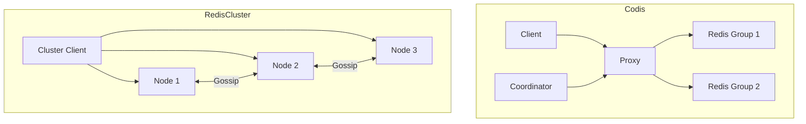

# 23 Codis VS Redis Cluster：如何选集群方案

## 本章要解决的问题

Redis 水平扩展有两类典型路线：代理层分片和原生 Cluster。Codis 代表 proxy 模式，Redis Cluster 代表客户端直连分片。本章从架构、兼容性、运维成本和性能边界比较它们。

## 核心观点

- Codis 通过 Proxy 屏蔽分片，客户端兼容性好。
- Redis Cluster 去中心化，客户端直接感知 slot 和重定向。
- Proxy 模式增加一跳和代理运维，但能统一治理。
- 原生 Cluster 生态更主流，但要求客户端和部署环境支持。

## 原理拆解



Codis 把路由逻辑放在 Proxy，客户端像访问单机 Redis 一样访问 Proxy。Proxy 根据 slot 路由到后端 Redis group，元数据由 ZooKeeper/etcd 等协调组件维护。

Redis Cluster 把路由逻辑下放给客户端和节点。客户端需要处理 `MOVED/ASK`，节点通过 Gossip 传播集群状态。

## 命令与代码示例

Redis Cluster 客户端配置：

```java
RedisClusterClient client = RedisClusterClient.create(Arrays.asList(
    RedisURI.create("redis://10.0.0.1:6379"),
    RedisURI.create("redis://10.0.0.2:6379"),
    RedisURI.create("redis://10.0.0.3:6379")
));
```

Proxy 模式应用侧配置通常更像单机：

```yaml
redis:
  mode: proxy
  endpoints:
    - 10.0.1.10:19000
    - 10.0.1.11:19000
  timeout: 200ms
```

方案选择 checklist：

```text
客户端是否支持 Cluster? yes -> 优先 Redis Cluster
是否大量使用老客户端/多语言 SDK? yes -> 考虑 Proxy
是否需要中心化审计、限流、平滑迁移? yes -> Proxy 有优势
是否希望减少组件和代理瓶颈? yes -> Redis Cluster
```

## 生产实践

选择时不要只看吞吐，要看组织能力：

- 客户端治理能力强，语言栈统一：Redis Cluster 更合适。
- 遗留系统多、客户端升级困难：Proxy 模式迁移成本低。
- 需要跨团队统一限流、审计、透明迁移：Proxy 层有治理空间。
- 对尾延迟敏感且希望减少中间层：原生 Cluster 更直接。

压测要分别测：

```bash
redis-benchmark -c 200 -n 1000000 -t get,set -p 19000
redis-benchmark -c 200 -n 1000000 -t get,set -p 7000 -c
```

## 常见坑

- 只因客户端方便选择 Proxy，却忽略 Proxy HA 和扩容。
- 使用 Redis Cluster 但客户端连接池、拓扑刷新配置不正确。
- Proxy 模式下热 key 仍然会打爆后端单分片。
- 误以为集群方案能自动解决所有大 key 和慢命令问题。

## 面试追问

1. Codis 和 Redis Cluster 的路由分别在哪里完成？
2. Proxy 模式的优缺点是什么？
3. 为什么 Redis Cluster 对客户端要求更高？
4. 集群方案如何处理热 key？

## 章节笔记

- Codis：客户端简单，Proxy 复杂。
- Cluster：组件少，客户端复杂。
- 选型要看客户端生态、运维能力和治理需求。
- 分片方案不能替代数据建模和热点治理。

## 小结

Codis 和 Redis Cluster 没有绝对胜负。Proxy 模式适合屏蔽复杂性和统一治理，原生 Cluster 适合拥抱 Redis 官方生态和减少中间层。真正的选型应该围绕业务约束，而不是围绕架构偏好。
