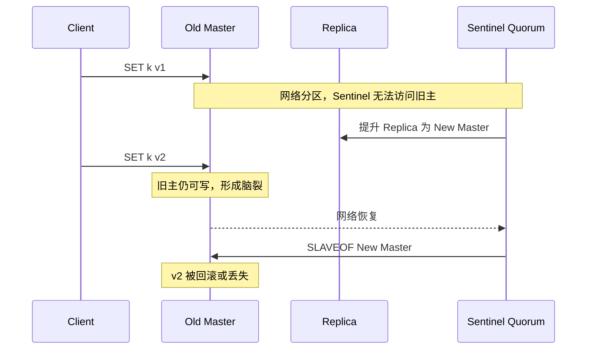

# 24 脑裂与数据丢失：Redis 高可用中的危险边界

## 本章要解决的问题

Redis 主从和哨兵能自动切换，但网络分区可能让旧主继续接收写入，新主也开始服务，形成脑裂。本章讨论脑裂如何发生、为什么会丢数据，以及 Redis 能提供哪些防护边界。

## 核心观点

- 脑裂本质是网络分区下出现多个可写主节点。
- Redis 主从异步复制，旧主未同步的数据在故障转移后可能丢失。
- `min-replicas-to-write` 和 `min-replicas-max-lag` 可降低旧主孤岛写入风险。
- Sentinel/Cluster 是高可用机制，不是强一致共识系统。

## 原理拆解



脑裂常见于客户端仍能访问旧主，但 Sentinel 多数派认为旧主不可达，于是提升从库。旧主继续接受写入，这些写入没有同步到新主；网络恢复后，旧主被降为从库并同步新主数据，孤岛期间写入丢失。

## 命令与代码示例

旧主写入防护配置：

```conf
min-replicas-to-write 1
min-replicas-max-lag 10
```

含义：如果主库看不到至少 1 个延迟不超过 10 秒的从库，就拒绝写入。这不能彻底消除脑裂，但能减少孤岛旧主继续写的窗口。

检查主从延迟：

```bash
redis-cli INFO replication
redis-cli SET critical:key value
redis-cli WAIT 1 1000
```

客户端侧降级伪代码：

```text
try:
    write_to_redis()
    wait_replica_ack()
except RedisUnavailable:
    write_to_durable_queue()
    return ACCEPTED_FOR_RETRY
```

## 生产实践

脑裂防护要从三层做：

- Redis 层：配置最小从库数量和最大延迟。
- 客户端层：连接 Sentinel/Cluster，及时刷新拓扑，避免写死旧主。
- 业务层：关键写入落数据库、消息队列或幂等日志，Redis 不做唯一事实源。

演练方式：

```bash
# Linux 上可用 iptables 模拟 Sentinel 与主库网络断开
iptables -A INPUT -s <sentinel_ip> -p tcp --dport 6379 -j DROP
redis-cli -p 26379 SENTINEL master mymaster
redis-cli -p 6379 INFO replication
```

## 常见坑

- 认为 Sentinel 自动切换就不会丢数据。
- 客户端长连接旧主，不处理角色变化。
- `min-replicas-to-write` 配得过严，网络抖动时业务大量写失败。
- 跨机房部署没有明确多数派和客户端访问策略。

## 面试追问

1. Redis 脑裂是怎么发生的？
2. 为什么脑裂后旧主写入会丢？
3. `min-replicas-to-write` 能完全避免数据丢失吗？
4. 如果业务不能丢数据，Redis 应该处在什么位置？

## 章节笔记

- 脑裂 = 多个主节点同时可写。
- Redis 异步复制决定了故障切换可能丢未复制数据。
- 最小副本配置可以缩小风险窗口。
- 强可靠业务要有 Redis 之外的事实源。

## 小结

Redis 高可用追求的是快速恢复服务，而不是分布式事务级别的一致性。脑裂问题提醒我们：自动切换越方便，越要清楚它的危险边界。对关键数据，必须设计业务补偿和持久事实源。
