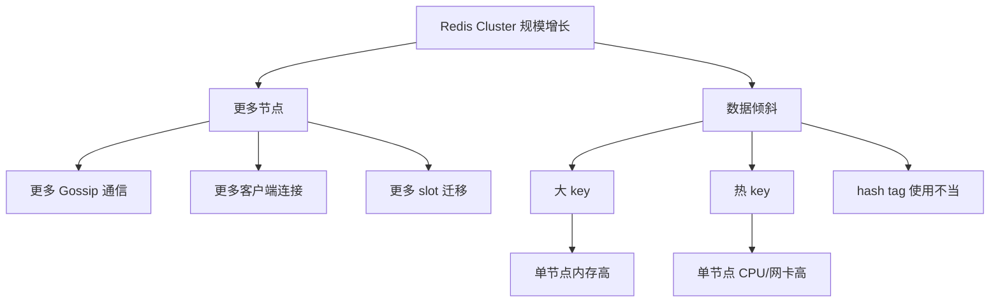

# 25 数据倾斜与通信开销：Redis Cluster 的规模瓶颈

## 本章要解决的问题

Redis Cluster 解决了水平扩展，但不代表节点越多越好。数据倾斜、热 key、slot 分布、Gossip 通信开销和客户端连接数都会成为规模瓶颈。本章讨论 Cluster 扩展到生产规模时必须面对的问题。

## 核心观点

- slot 均匀不等于数据量和访问量均匀。
- 热 key 会让单个节点成为瓶颈，即使集群总容量很大。
- Cluster 节点越多，Gossip、连接数、拓扑刷新和运维复杂度越高。
- 扩容要结合数据模型、热点治理和实例规格，而不是只加节点。

## 原理拆解



Cluster 只保证 slot 维度的分片。一个 slot 内如果有特别大的 key，或者大量热点 key 恰好落到某节点，仍会出现倾斜。hash tag 虽然能支持多 key 操作，但滥用会把大量 key 固定到同一 slot。

通信开销来自节点间 Ping/Pong/Gossip，也来自客户端对每个主节点维护连接池。节点规模变大后，拓扑变更、故障判断、slot 迁移都会更复杂。

## 命令与代码示例

检查 slot 和节点：

```bash
redis-cli -c -p 7000 CLUSTER INFO
redis-cli -c -p 7000 CLUSTER NODES
redis-cli --cluster check 127.0.0.1:7000
```

扫描大 key：

```bash
redis-cli --bigkeys -h 127.0.0.1 -p 7000
redis-cli --memkeys -h 127.0.0.1 -p 7000
redis-cli MEMORY USAGE some:key
```

客户端拓扑刷新配置示例：

```java
ClusterTopologyRefreshOptions options = ClusterTopologyRefreshOptions.builder()
    .enablePeriodicRefresh(Duration.ofSeconds(30))
    .enableAllAdaptiveRefreshTriggers()
    .build();
ClusterClientOptions clientOptions = ClusterClientOptions.builder()
    .topologyRefreshOptions(options)
    .build();
```

热点治理伪代码：

```text
if key_qps > hot_threshold:
    split_key_to_shards(key, n)
    read_random_or_merge()
    write_with_fanout_or_async_aggregation()
```

## 生产实践

容量评估不要只看总内存，例如 6 个主节点每个 16GB，不等于安全承载 96GB。需要按单节点峰值评估：最大节点内存、最大节点 QPS、最大节点网卡、最大 slot 数据量。

治理手段：

- 大 key 拆分：把一个大 Hash/List 拆成多个小 key。
- 热 key 复制：只读热点可做本地缓存或多副本随机读。
- hash tag 审计：避免所有用户订单落入同一 tag。
- 控制节点数：优先提升单节点规格和优化模型，再盲目扩节点。

## 常见坑

- 看到 slot 平均，就误判集群均衡。
- 为了多 key 操作滥用 hash tag，制造单 slot 热点。
- 节点数很多但客户端连接池配置过大，连接数爆炸。
- 扩容迁移没有限速，业务延迟被 `MIGRATE` 影响。

## 面试追问

1. Redis Cluster slot 均匀为什么仍会数据倾斜？
2. 热 key 如何发现和治理？
3. Cluster 节点规模过大有什么问题？
4. hash tag 的收益和风险是什么？

## 章节笔记

- 分片解决容量问题，但不自动解决热点问题。
- 大 key 影响内存和迁移，热 key 影响 CPU 和网络。
- Cluster 规模越大，通信和客户端治理越重要。
- 扩容前先做数据模型和热点分析。

## 小结

Redis Cluster 的瓶颈往往不是“没有分片”，而是“分片后仍然不均衡”。真正成熟的集群治理，需要把 slot、key、QPS、连接、迁移和业务访问模式放在一起看。
