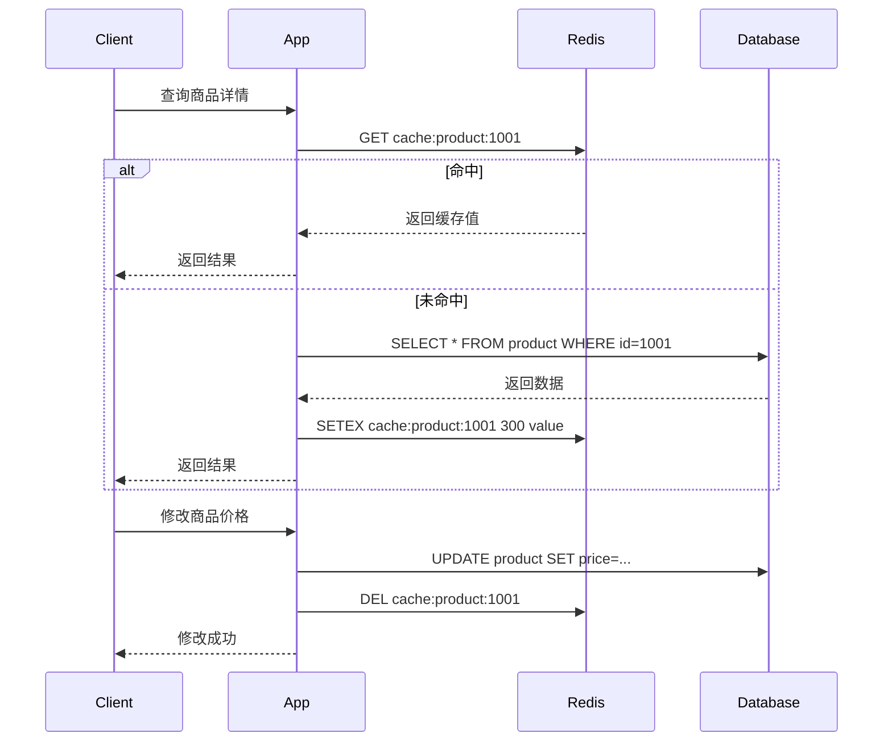

# 26 旁路缓存：Redis 和数据库如何协作

## 1. 本章要解决的问题

业务系统里最常见的 Redis 用法不是把 Redis 当数据库，而是把它放在数据库前面做缓存。问题在于：请求读写并不会天然变快、变稳、变一致。我们需要回答三个问题：

- 读请求应该先查 Redis 还是数据库？
- 写请求应该先更新数据库，还是先更新缓存？
- 缓存失效、并发回源、数据库慢查询叠加时，如何避免雪崩式放大？

旁路缓存（Cache Aside）是最常见、最容易落地，也最需要纪律的缓存模式。

## 2. 核心观点

Cache Aside 的基本原则是：应用代码负责维护缓存，Redis 只负责存储热点副本。

- 读路径：先读缓存，未命中再读数据库，然后写回缓存。
- 写路径：先写数据库，再删除缓存，而不是直接更新缓存。
- 一致性目标：缓存系统通常追求“最终一致”，不是强一致。
- 稳定性目标：缓存未命中不能无限放大到数据库，必须有互斥、限流、降级或逻辑过期保护。

最重要的一句话：缓存是数据库的派生数据，数据库才是事实来源。

## 3. 原理拆解

### 3.1 Cache Aside 读写流程



读缓存是为了减少数据库压力，写数据库后删除缓存是为了让下一次读重新加载最新数据。

### 3.2 为什么不推荐“更新数据库后更新缓存”

更新缓存看似更快让缓存变新，但有几个问题：

- 并发写乱序：请求 A 和 B 同时更新，数据库最终是 B，缓存可能被 A 覆盖。
- 缓存构建成本高：缓存值可能来自多表聚合，不适合在写路径同步构建。
- 写多读少浪费：某些数据更新后很久没人读，更新缓存没有价值。

所以常见实践是“写数据库 + 删除缓存”，让缓存按需重建。

### 3.3 旁路缓存的一致性边界

Cache Aside 天然存在短暂不一致窗口。例如删除缓存失败、主从延迟、事务未提交就删除缓存、并发回源等。工程上需要明确可接受范围：

| 场景 | 风险 | 常用治理 |
| --- | --- | --- |
| 删除缓存失败 | 旧缓存继续存在 | 重试、消息补偿、订阅 binlog |
| 并发读写 | 旧值被重新写入缓存 | 延迟双删、版本号、逻辑过期 |
| 数据库主从延迟 | 回源读到旧值 | 读主库、延迟加载、短 TTL |
| 热点失效 | 大量请求打到 DB | singleflight、互斥锁、逻辑过期 |

## 4. 命令与代码示例

### 4.1 Redis 命令

```bash
# 查询缓存
GET cache:product:1001

# 写入缓存，设置 5 分钟 TTL
SET cache:product:1001 '{"id":1001,"name":"phone","price":3999}' EX 300

# 数据库更新成功后删除缓存
DEL cache:product:1001

# 查看剩余过期时间
TTL cache:product:1001
```

### 4.2 Spring Boot 伪代码

```java
public Product getProduct(Long id) {
    String key = "cache:product:" + id;
    String cached = redis.get(key);
    if (cached != null) {
        return json.fromJson(cached, Product.class);
    }

    Product product = productMapper.selectById(id);
    if (product == null) {
        redis.set(key, "NULL", Duration.ofSeconds(60));
        return null;
    }

    int ttl = 300 + ThreadLocalRandom.current().nextInt(60);
    redis.set(key, json.toJson(product), Duration.ofSeconds(ttl));
    return product;
}

@Transactional
public void updateProduct(ProductUpdateCommand cmd) {
    productMapper.update(cmd);
    transactionSynchronization.afterCommit(() -> {
        redis.delete("cache:product:" + cmd.id());
    });
}
```

关键点是：删除缓存最好放在数据库事务提交之后，否则回源可能读到旧数据。

### 4.3 互斥回源示例

```java
public Product getProductWithMutex(Long id) {
    String key = "cache:product:" + id;
    String value = redis.get(key);
    if (value != null) return decode(value);

    String lockKey = "lock:rebuild:product:" + id;
    boolean locked = redis.setIfAbsent(lockKey, "1", Duration.ofSeconds(5));
    if (!locked) {
        sleep(50);
        return getProduct(id);
    }

    try {
        Product product = productMapper.selectById(id);
        redis.set(key, encode(product), Duration.ofMinutes(5));
        return product;
    } finally {
        redis.delete(lockKey);
    }
}
```

## 5. 生产实践

### 5.1 Key 设计

```text
cache:{业务}:{实体}:{id}
cache:product:detail:1001
cache:user:profile:2002
cache:shop:brief:3003
```

Key 要包含业务域、对象类型和唯一标识，避免过宽、过短、无版本的命名。

### 5.2 TTL 设计

- 普通数据：固定 TTL + 随机抖动。
- 热点数据：逻辑过期 + 异步刷新。
- 空结果：短 TTL，避免穿透。
- 强一致数据：谨慎缓存，必要时读主库或用版本号。

### 5.3 删除缓存失败的补偿

常见方案：

- 删除失败后本地重试 2-3 次。
- 写入可靠消息队列，异步删除。
- 订阅数据库 binlog，根据变更事件删除缓存。
- 给缓存设置较短 TTL，兜底收敛。

## 6. 常见坑

- 把 Redis 当唯一事实来源，结果缓存丢失后无法恢复。
- 写数据库前先删缓存，事务回滚后缓存已空，回源行为不可控。
- 缓存没有 TTL，脏数据长期存在。
- 大量 key 同一时间过期，造成缓存雪崩。
- 缓存 value 过大，网络传输和反序列化成本抵消收益。
- 缓存穿透时没有空值缓存或 Bloom Filter。

## 7. 面试追问

1. Cache Aside 和 Read Through 有什么区别？
2. 为什么通常是“更新数据库后删除缓存”，而不是更新缓存？
3. 删除缓存失败会导致什么问题？怎么补偿？
4. 延迟双删能解决所有一致性问题吗？
5. 热点 key 失效时怎么避免数据库被打穿？

## 8. 章节笔记

### 课程核心观点

Redis 做缓存时，重点不是命令，而是缓存与数据库之间的一致性协议。

### 我的理解

旁路缓存是一种“应用层协议”：Redis 不知道数据库是否变化，数据库也不知道 Redis 是否保存了旧副本，所以应用必须把读写顺序、失效策略、补偿策略设计清楚。

### 关键概念

- Cache Aside
- 缓存命中率
- 回源
- 最终一致性
- 缓存重建
- 空值缓存

### 生产 checklist

- 写路径是否在事务提交后删除缓存？
- 缓存 key 是否有 TTL？
- TTL 是否有随机抖动？
- 热点 key 是否有互斥回源？
- 删除失败是否有补偿？

## 9. 小结

Cache Aside 是 Redis 缓存系统的基本功。它简单，但不等于粗糙。真正的难点在于读写顺序、一致性窗口、回源保护和失败补偿。只要把“数据库是事实来源，缓存是派生副本”这条原则守住，后续的淘汰、过期、热点和一致性治理才有稳定基础。
