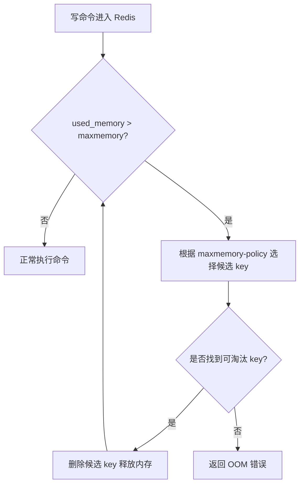
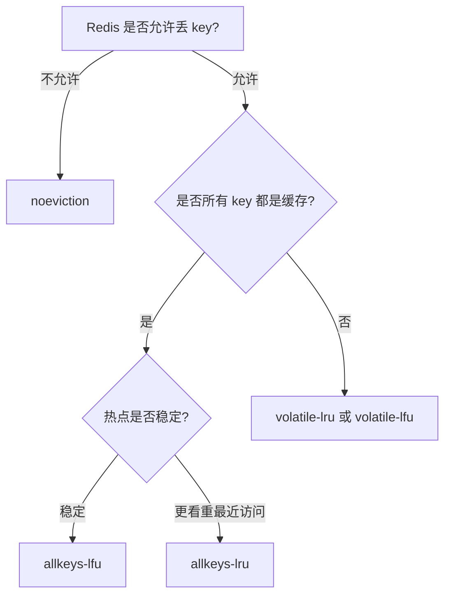

# 27 缓存满了怎么办：淘汰策略如何选择

## 1. 本章要解决的问题

Redis 是内存数据库，内存终究会满。缓存系统要提前回答：

- `maxmemory` 应该怎么设置？
- 内存满了 Redis 是拒绝写入，还是淘汰旧数据？
- LRU、LFU、random、volatile、allkeys 这些策略该怎么选？
- 淘汰和过期有什么区别？

如果没有明确策略，Redis 内存打满后可能出现写入失败、延迟抖动、主从复制压力变大，甚至触发业务大面积故障。

## 2. 核心观点

淘汰策略不是 Redis 自己的事，而是业务缓存模型的一部分。

- 缓存场景通常选择 `allkeys-lru` 或 `allkeys-lfu`。
- 只给部分 key 设置 TTL 时，`volatile-*` 可能导致无 key 可淘汰。
- LRU 适合“最近访问代表未来访问”的场景。
- LFU 适合“历史热点更稳定”的场景。
- 淘汰是内存压力下的被动行为，过期是 TTL 到期后的生命周期管理。

## 3. 原理拆解

### 3.1 Redis 内存淘汰触发流程



Redis 在执行会增加内存的写命令前后检查内存，如果超过 `maxmemory`，就按策略淘汰 key，直到腾出足够空间或无法继续淘汰。

### 3.2 淘汰策略分类

| 策略 | 候选范围 | 选择方式 | 适用场景 |
| --- | --- | --- | --- |
| noeviction | 无 | 不淘汰，写入报错 | Redis 当存储，不能丢数据 |
| allkeys-lru | 所有 key | 近似 LRU | 通用缓存 |
| volatile-lru | 有 TTL 的 key | 近似 LRU | 只有部分数据可淘汰 |
| allkeys-lfu | 所有 key | 近似 LFU | 热点稳定、抗污染 |
| volatile-lfu | 有 TTL 的 key | 近似 LFU | 有 TTL 且热点稳定 |
| allkeys-random | 所有 key | 随机 | 数据价值差不多 |
| volatile-random | 有 TTL 的 key | 随机 | 简单 TTL 缓存 |
| volatile-ttl | 有 TTL 的 key | 优先淘汰快过期的 | 临时数据 |

### 3.3 Redis 的 LRU/LFU 都是近似算法

Redis 不会维护完整链表做精确 LRU，因为那会带来额外内存和更新成本。它采用采样方式：随机抽取若干 key，选择其中最符合淘汰条件的 key。

```text
maxmemory-samples 5
```

采样数越高，淘汰越接近理论算法，但 CPU 成本也越高。生产环境常见设置是 5 到 10。

### 3.4 LFU 为什么更抗缓存污染

LRU 关注“最近访问”，一次性批量扫描可能把真正热点挤出去。LFU 关注“访问频率”，更能保护长期热点。

例如首页热点商品经常被访问，某个批处理任务突然扫过 100 万个冷门商品：

- LRU：冷门商品因为刚被访问，可能挤掉热点。
- LFU：冷门商品访问频率低，不容易挤掉热点。

## 4. 命令与代码示例

### 4.1 配置 maxmemory 和策略

```conf
maxmemory 8gb
maxmemory-policy allkeys-lfu
maxmemory-samples 10

lfu-log-factor 10
lfu-decay-time 1
lazyfree-lazy-eviction yes
```

### 4.2 在线查看内存和淘汰情况

```bash
redis-cli INFO memory
redis-cli INFO stats | grep evicted_keys
redis-cli CONFIG GET maxmemory
redis-cli CONFIG GET maxmemory-policy
redis-cli MEMORY STATS
```

### 4.3 Java 缓存写入示例

```java
public void cacheProduct(Product product) {
    String key = "cache:product:" + product.getId();
    String value = json.toJson(product);
    Duration ttl = Duration.ofMinutes(10 + ThreadLocalRandom.current().nextInt(3));
    redis.opsForValue().set(key, value, ttl);
}
```

缓存 key 最好都设置 TTL。即便使用 `allkeys-lfu`，TTL 也能让脏数据自然收敛。

### 4.4 压测观察淘汰

```bash
redis-benchmark -t set -n 1000000 -r 10000000 -d 1024
redis-cli INFO stats | grep -E "evicted_keys|keyspace_hits|keyspace_misses"
```

## 5. 生产实践

### 5.1 如何选择淘汰策略



### 5.2 容量规划

建议 Redis 的 `maxmemory` 不要等于机器总内存，要给以下部分留空间：

- 操作系统页缓存。
- 主从复制 backlog。
- AOF rewrite / RDB fork 的 COW 开销。
- 客户端输出缓冲区。
- 内存碎片。

生产经验：单机 Redis 如果用于缓存，`maxmemory` 常设置为物理内存的 60%-75%，具体取决于持久化、复制和对象大小。

### 5.3 监控指标

重点监控：

- `used_memory`
- `used_memory_rss`
- `mem_fragmentation_ratio`
- `evicted_keys`
- `expired_keys`
- `keyspace_hits`
- `keyspace_misses`
- `instantaneous_ops_per_sec`

`evicted_keys` 突然增长，通常意味着缓存容量不足或热点模型变化。

## 6. 常见坑

- 使用 `volatile-lru`，但大量 key 没有 TTL，导致 Redis 找不到可淘汰 key。
- 把 Redis 当数据库，却配置了 `allkeys-lru`，数据被淘汰后无法恢复。
- 只看 `used_memory`，忽略 `used_memory_rss` 和碎片率。
- 以为 LRU 是精确 LRU，忽略采样近似带来的偏差。
- 大 key 被淘汰或删除时阻塞主线程，没有启用 lazy free。
- 淘汰频繁但不扩容，导致命中率持续下降。

## 7. 面试追问

1. Redis 的 LRU 为什么不是精确 LRU？
2. `volatile-lru` 和 `allkeys-lru` 有什么区别？
3. LFU 适合什么场景？为什么能缓解缓存污染？
4. `maxmemory` 设置过高会有什么风险？
5. 淘汰和过期的区别是什么？

## 8. 章节笔记

### 课程核心观点

Redis 内存淘汰机制决定了缓存满时系统如何自我保护。

### 我的理解

淘汰策略是业务价值排序：哪些 key 可以丢，哪些 key 应该保留，哪些 key 丢了能回源，哪些 key 丢了会造成事故。技术配置只是把这个排序落到 Redis 上。

### 关键概念

- `maxmemory`
- `maxmemory-policy`
- 近似 LRU
- LFU 计数衰减
- `maxmemory-samples`
- lazy free

### 排障命令

```bash
redis-cli INFO memory
redis-cli INFO commandstats
redis-cli --bigkeys
redis-cli MEMORY USAGE cache:product:1001
redis-cli SLOWLOG GET 10
```

## 9. 小结

缓存满了不是异常情况，而是必然会发生的容量边界。合理的策略是：业务上确认可淘汰范围，技术上设置 `maxmemory` 和淘汰算法，运维上监控淘汰趋势和命中率。LRU 是通用选择，LFU 更适合保护长期热点，`noeviction` 则适合不能丢数据的存储型 Redis。
