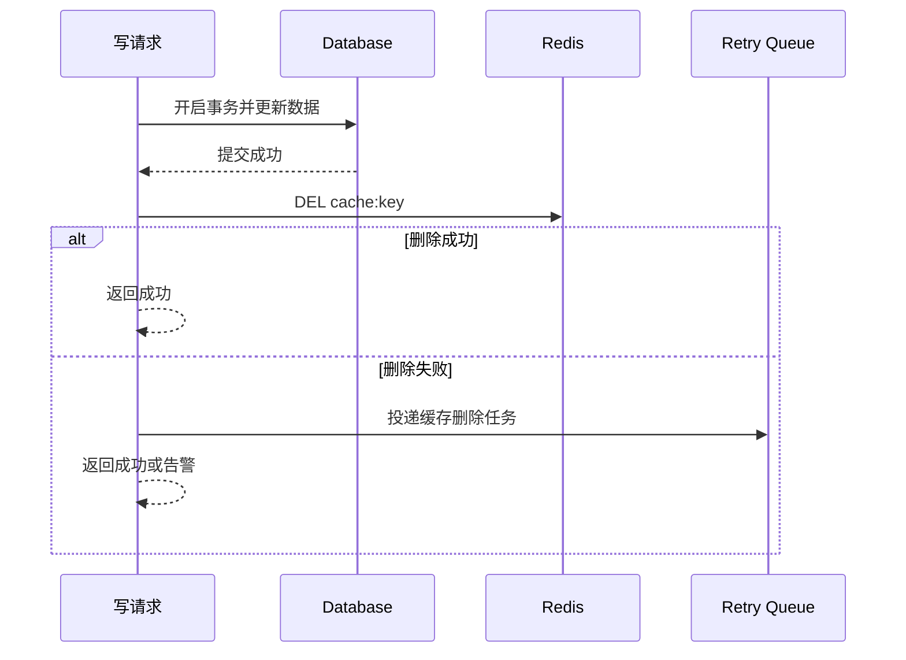
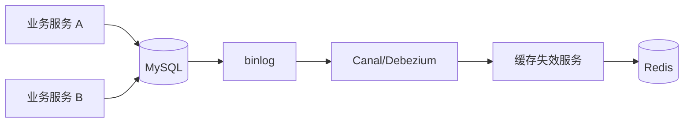

# 28 缓存和数据库不一致怎么解决

## 1. 本章要解决的问题

缓存和数据库不一致，是 Redis 缓存系统里最常见、也最容易被低估的问题。本章要解决：

- 为什么缓存和数据库一定会存在不一致窗口？
- 更新数据时，到底是先删缓存还是先写数据库？
- 延迟双删、binlog 订阅、版本号各自解决什么问题？
- 如何根据业务一致性要求选择方案？

## 2. 核心观点

缓存一致性不是单一技术点，而是“读写顺序 + 失败补偿 + 过期兜底 + 业务容忍度”的组合。

- 最常用方案：更新数据库成功后删除缓存。
- 删除缓存失败必须有补偿。
- 延迟双删只能缩小部分并发窗口，不能保证强一致。
- 强一致场景不要轻易使用旁路缓存，或者把读写收敛到同一个服务内。
- 订阅 binlog 删除缓存适合多服务、多写入口场景。

## 3. 原理拆解

### 3.1 四种写法对比

| 写法 | 主要问题 | 推荐程度 |
| --- | --- | --- |
| 先更新缓存，再更新数据库 | 数据库失败会导致缓存脏写 | 不推荐 |
| 先更新数据库，再更新缓存 | 并发乱序覆盖缓存 | 不推荐 |
| 先删除缓存，再更新数据库 | 并发读可能把旧值写回缓存 | 谨慎 |
| 先更新数据库，再删除缓存 | 不一致窗口较小，易补偿 | 推荐 |

### 3.2 推荐流程



### 3.3 先删缓存再写数据库的问题

假设缓存里是旧值 V1：

1. 写请求 A 先删除缓存。
2. 读请求 B 缓存未命中，读取数据库，此时数据库仍是 V1。
3. B 把 V1 写回缓存。
4. A 更新数据库为 V2。

结果：数据库是 V2，缓存是 V1，直到 TTL 到期。

### 3.4 先写数据库再删缓存的问题

也有不一致窗口：

1. 读请求 A 缓存未命中，查询数据库得到 V1。
2. 写请求 B 更新数据库为 V2，并删除缓存。
3. A 把 V1 写回缓存。

这个窗口通常更短，但在慢查询、网络抖动、线程暂停时仍可能发生。

### 3.5 延迟双删

延迟双删流程：

1. 删除缓存。
2. 更新数据库。
3. 等待一段时间。
4. 再删除缓存。

它主要缓解“先删缓存再写数据库”的旧值回填问题，但延迟时间不好确定。延迟太短没效果，太长增加复杂度。更常见的现代实践是“写数据库后删缓存 + 失败重试 + 短 TTL + binlog 补偿”。

## 4. 命令与代码示例

### 4.1 Redis 删除与版本缓存

```bash
DEL cache:product:1001
SET cache:product:1001 '{"version":12,"data":{"price":3999}}' EX 300
GET cache:product:1001
```

### 4.2 事务提交后删除缓存

```java
@Transactional
public void changePrice(Long productId, BigDecimal price) {
    productMapper.updatePrice(productId, price);

    TransactionSynchronizationManager.registerSynchronization(
        new TransactionSynchronization() {
            @Override
            public void afterCommit() {
                String key = "cache:product:" + productId;
                try {
                    redis.delete(key);
                } catch (Exception e) {
                    cacheDeleteRetryQueue.offer(key);
                }
            }
        }
    );
}
```

### 4.3 删除失败重试任务

```java
public void retryDeleteCache(String key) {
    for (int i = 0; i < 3; i++) {
        try {
            redis.delete(key);
            return;
        } catch (Exception ex) {
            sleep(100L * (i + 1));
        }
    }
    reliableMq.send("cache.delete.failed", key);
}
```

### 4.4 Lua 版本保护写缓存

```lua
-- KEYS[1] = cache key
-- ARGV[1] = new version
-- ARGV[2] = new value
-- ARGV[3] = ttl seconds
local current = redis.call('HGET', KEYS[1], 'version')
if current and tonumber(current) > tonumber(ARGV[1]) then
  return 0
end
redis.call('HSET', KEYS[1], 'version', ARGV[1], 'value', ARGV[2])
redis.call('EXPIRE', KEYS[1], ARGV[3])
return 1
```

版本号可以避免旧请求覆盖新缓存，适合对一致性敏感的聚合缓存。

## 5. 生产实践

### 5.1 binlog 订阅删除缓存

当多个服务都可能改数据库时，让每个服务都正确删除缓存很难。可以引入 Canal、Debezium 等订阅数据库 binlog，然后统一删除缓存。



这种方案的优势是写入口收敛，缺点是链路变长，需要保证消息可靠性和幂等。

### 5.2 一致性级别分层

| 业务类型 | 一致性要求 | 建议 |
| --- | --- | --- |
| 商品详情 | 秒级最终一致 | Cache Aside + TTL |
| 库存扣减 | 强约束 | 数据库/Lua 原子扣减，不依赖普通缓存 |
| 用户余额 | 强一致 | 不建议用 Redis 普通缓存作为判断依据 |
| 配置开关 | 较强一致 | 版本号、主动推送、短 TTL |
| 推荐列表 | 可弱一致 | 长 TTL + 异步刷新 |

### 5.3 缓存删除消息的幂等

删除缓存天然幂等，同一个 key 删除多次没有副作用。因此缓存失效消息适合“至少一次投递”。

## 6. 常见坑

- 在数据库事务提交前删除缓存。
- 删除缓存失败只打印日志，没有重试和告警。
- 多服务写数据库，但只有部分服务维护缓存。
- 延迟双删的延迟时间拍脑袋，没有基于慢查询和主从延迟评估。
- 把 Redis 缓存当强一致读模型，导致余额、库存等场景出错。
- 缓存 value 没有版本，旧请求可能覆盖新数据。

## 7. 面试追问

1. 为什么推荐更新数据库后删除缓存？
2. 延迟双删解决了什么问题？有什么缺陷？
3. 删除缓存失败怎么处理？
4. binlog 订阅删除缓存有什么优缺点？
5. 如何避免旧请求把旧值写回缓存？

## 8. 章节笔记

### 课程核心观点

缓存与数据库一致性，本质是分布式系统中的副本一致性问题。

### 我的理解

不要问“能不能绝对一致”，而要问“业务能容忍多长时间的不一致、哪些字段不能不一致、失败后如何收敛”。缓存系统的工程质量体现在异常路径。

### 关键概念

- 最终一致性
- 延迟双删
- binlog 订阅
- 缓存失效消息
- 版本号防旧写
- 事务提交后回调

### 方案选择

```text
普通详情页：写 DB 后删缓存 + TTL
多写入口：binlog 订阅删缓存
热点强读：逻辑过期 + 异步刷新 + 版本号
资金库存：不要依赖普通缓存保证一致性
```

## 9. 小结

缓存和数据库不一致无法完全消灭，只能缩小窗口、快速收敛、避免放大。推荐的基础方案是“事务提交后删除缓存 + 删除失败补偿 + TTL 兜底”。在多写入口或一致性要求更高的场景，可以引入 binlog 订阅、版本号和读写收敛设计。
