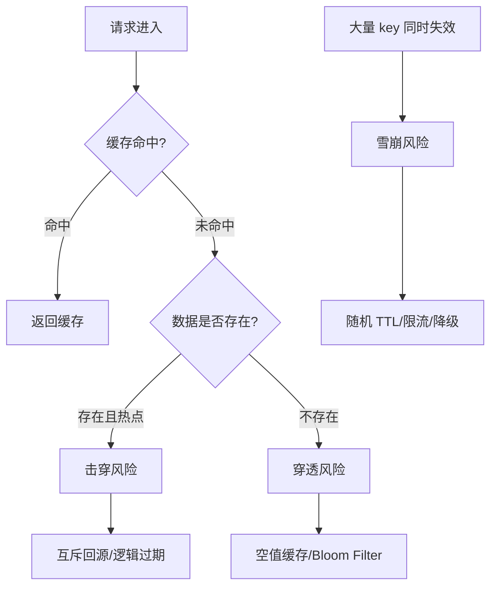

# 29 雪崩、击穿、穿透：三类缓存异常怎么治理

## 1. 本章要解决的问题

Redis 缓存系统最怕的不是单次未命中，而是大量未命中同时发生。本章解决三类经典问题：

- 缓存雪崩：大量 key 同时失效或 Redis 整体不可用。
- 缓存击穿：单个热点 key 失效，大量请求打到数据库。
- 缓存穿透：查询根本不存在的数据，绕过缓存持续打数据库。

这三类问题的共同点是：缓存层没有挡住流量，数据库成为最后的承压点。

## 2. 核心观点

- 雪崩治理靠分散过期、限流降级、多级缓存和高可用。
- 击穿治理靠互斥回源、逻辑过期、热点预热。
- 穿透治理靠空值缓存、Bloom Filter、参数校验。
- 三类问题都要配合监控，不能只靠代码技巧。

## 3. 原理拆解

### 3.1 三类问题对比

| 类型 | 触发原因 | 表现 | 核心治理 |
| --- | --- | --- | --- |
| 雪崩 | 大量 key 同时过期、Redis 故障 | 数据库瞬时流量暴涨 | 随机 TTL、限流、降级、集群高可用 |
| 击穿 | 热点 key 过期 | 单 key 回源并发极高 | 互斥锁、逻辑过期、热点续期 |
| 穿透 | 查询不存在的数据 | 缓存永远不命中 | 空值缓存、Bloom Filter、校验 |



### 3.2 缓存雪崩

常见原因：

- 批量预热时设置了相同 TTL。
- Redis 实例宕机，所有请求直接回源。
- 业务活动结束，大量活动 key 同时过期。

治理思路：

- TTL 加随机抖动。
- 热点 key 分批预热。
- Redis 高可用和本地缓存兜底。
- 数据库限流和熔断。

### 3.3 缓存击穿

击穿通常发生在超级热点 key 上，例如首页配置、爆款商品、秒杀活动信息。一个 key 过期，数千请求同时发现未命中，然后一起查数据库。

治理方式：

- 互斥锁：只有一个线程回源。
- 逻辑过期：缓存不过期，后台异步刷新。
- 热点续期：检测热点后延长 TTL。

### 3.4 缓存穿透

穿透通常来自非法参数、恶意攻击或历史脏链接。例如反复查询不存在的用户 ID。

治理方式：

- 参数校验：明显非法的请求直接拒绝。
- 空值缓存：不存在的数据也缓存短 TTL。
- Bloom Filter：先判断 ID 是否可能存在。

## 4. 命令与代码示例

### 4.1 随机 TTL

```java
int baseTtl = 300;
int jitter = ThreadLocalRandom.current().nextInt(60);
redis.opsForValue().set(key, value, Duration.ofSeconds(baseTtl + jitter));
```

### 4.2 互斥锁防击穿

```bash
SET lock:product:1001 token-abc NX PX 5000
DEL lock:product:1001
```

安全释放锁需要校验 token：

```lua
if redis.call('GET', KEYS[1]) == ARGV[1] then
  return redis.call('DEL', KEYS[1])
end
return 0
```

### 4.3 逻辑过期

```java
record CacheEnvelope<T>(T data, long expireAt) {}

public Product getHotProduct(Long id) {
    String key = "cache:hot:product:" + id;
    CacheEnvelope<Product> envelope = decode(redis.get(key));
    if (envelope.expireAt() > System.currentTimeMillis()) {
        return envelope.data();
    }

    if (tryLock("lock:refresh:" + id)) {
        refreshExecutor.submit(() -> {
            Product fresh = productMapper.selectById(id);
            redis.set(key, encode(new CacheEnvelope<>(fresh, now() + 300_000)));
            unlock("lock:refresh:" + id);
        });
    }
    return envelope.data();
}
```

逻辑过期牺牲短暂新鲜度，换取热点请求不阻塞。

### 4.4 空值缓存

```java
Product product = productMapper.selectById(id);
if (product == null) {
    redis.opsForValue().set("cache:product:" + id, "NULL", Duration.ofSeconds(60));
    return null;
}
```

### 4.5 Bloom Filter 示例

```java
public Product getProduct(Long id) {
    if (!bloomFilter.mightContain(id)) {
        return null;
    }
    return cacheAsideGet(id);
}
```

RedisBloom 命令示例：

```bash
BF.RESERVE bf:product 0.01 10000000
BF.ADD bf:product 1001
BF.EXISTS bf:product 1001
```

## 5. 生产实践

### 5.1 防雪崩组合拳

```text
随机 TTL + 分批预热 + Redis Sentinel/Cluster + 本地缓存 + DB 限流
```

不要把所有希望寄托在随机 TTL 上。Redis 整体故障时，随机 TTL 没用。

### 5.2 热点 key 保护

- 热点 key 单独命名，便于监控和治理。
- 使用本地缓存保存短时间热点副本。
- 逻辑过期替代物理过期。
- 回源线程池隔离，避免拖垮业务线程。
- 对热点重建设置超时和降级值。

### 5.3 Bloom Filter 参数

Bloom Filter 会有误判，不会漏判。误判表示“不存在的数据被认为可能存在”，最多增加一次回源；漏判则会误杀正常请求，所以标准 Bloom Filter 不应漏判。

参数关注：

- 预计元素数量。
- 可接受误判率。
- 重建和扩容方式。
- 删除需求，普通 Bloom Filter 不支持删除。

## 6. 常见坑

- 所有缓存统一设置 30 分钟 TTL，导致整点雪崩。
- 击穿场景只加锁，但锁超时太短，多个线程仍然回源。
- 获取锁失败后忙等，造成 Redis 压力上升。
- 空值缓存 TTL 太长，新创建数据迟迟查不到。
- Bloom Filter 初始化不完整，正常数据被挡掉。
- 把 Bloom Filter 当强一致存在性判断，忽略新增数据同步。

## 7. 面试追问

1. 雪崩、击穿、穿透的区别是什么？
2. 热点 key 过期为什么会打穿数据库？
3. 逻辑过期和互斥锁分别适合什么场景？
4. Bloom Filter 为什么会误判？误判有什么影响？
5. 空值缓存会带来什么一致性问题？

## 8. 章节笔记

### 课程核心观点

缓存异常不是 Redis 单点问题，而是流量、数据和数据库承压能力共同作用的结果。

### 我的理解

雪崩是“面”的问题，击穿是“点”的问题，穿透是“无效请求”的问题。治理时要先判断是哪一类，否则容易拿错工具。

### 关键概念

- 随机 TTL
- 互斥回源
- 逻辑过期
- 空值缓存
- Bloom Filter
- 降级兜底

### 排障指标

```bash
redis-cli INFO stats | grep keyspace
redis-cli INFO stats | grep evicted
redis-cli --hotkeys
redis-cli SLOWLOG GET 20
```

应用侧关注：

- 缓存命中率突然下降。
- DB QPS 突然上升。
- 单 key 请求量异常。
- 不存在 ID 查询比例异常。

## 9. 小结

雪崩、击穿、穿透分别对应大面积失效、热点失效和无效查询。成熟的 Redis 缓存系统必须同时具备 TTL 分散、热点保护、空值缓存、Bloom Filter、限流降级和监控告警。缓存的价值不只是快，更是保护后端系统。
