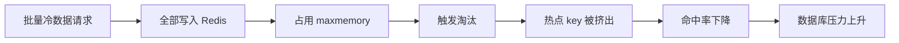
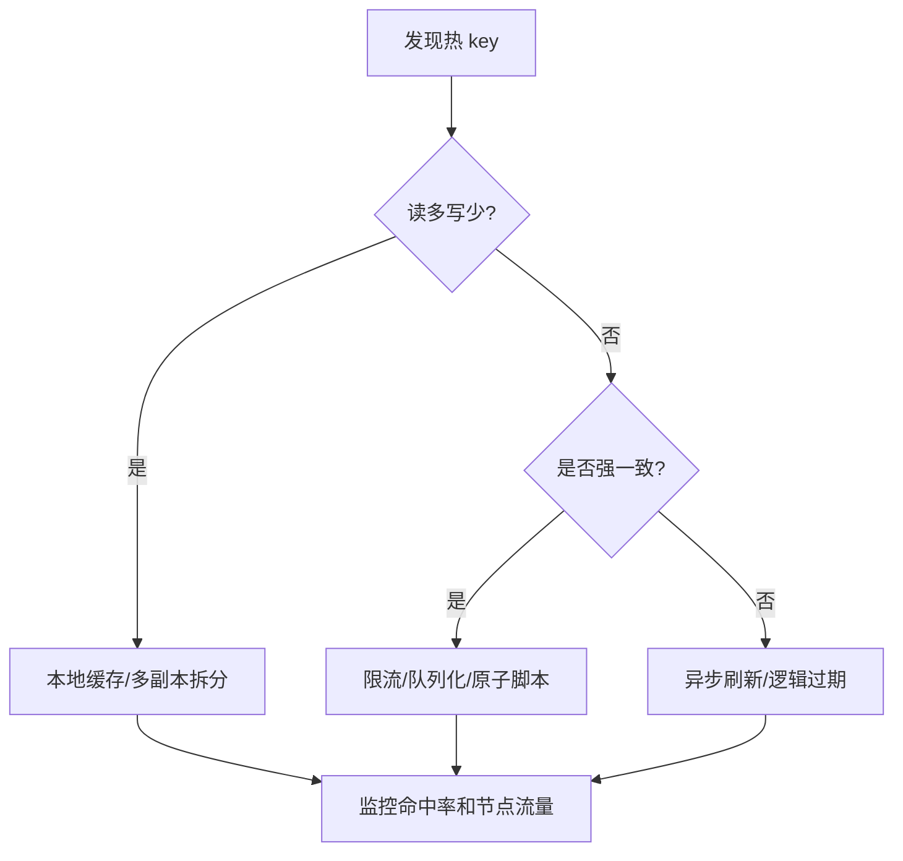

# 30 缓存污染与热 key：如何避免劣币驱逐良币

## 1. 本章要解决的问题

缓存空间有限，真正有价值的是少量高频访问数据。但生产环境经常出现：

- 批处理或爬虫把大量一次性数据写入缓存。
- 热点 key 请求量过高，单个 Redis 节点被打满。
- 大 key 占用内存和网络，导致延迟抖动。
- 低价值数据挤掉高价值数据，命中率下降。

这些现象可以概括为缓存污染和热 key 问题。

## 2. 核心观点

- 缓存污染的本质是低复用数据占用了缓存空间。
- 热 key 的本质是流量集中，不只是 Redis 内存问题。
- LFU、短 TTL、准入策略、多级缓存可以缓解污染。
- 热 key 拆分、本地缓存、读写分离、限流可以缓解热点压力。
- 不要让所有数据“查询一次就进缓存”。

## 3. 原理拆解

### 3.1 缓存污染如何发生



典型场景：

- 后台任务扫描历史订单详情。
- 搜索引擎爬取长尾页面。
- 用户导出报表访问大量冷数据。
- 推荐系统临时拉取一次性特征。

### 3.2 热 key 如何形成

热 key 可能来自：

- 爆款商品详情。
- 首页配置。
- 明星直播间信息。
- 秒杀活动库存。
- 大促优惠券。

单个 key 的 QPS 如果集中到一个 Redis 分片，即使集群整体容量很高，也可能单节点瓶颈。

### 3.3 大 key 与热 key 的区别

| 类型 | 主要问题 | 示例 |
| --- | --- | --- |
| 热 key | 访问频率过高 | `cache:product:1001` 每秒 10 万次 |
| 大 key | value 或成员数量过大 | 一个 Hash 有 100 万字段 |
| 热大 key | 两者兼具 | 大促排行榜大 ZSet 高频读写 |

热 key 主要打 CPU 和网络，大 key 主要打内存、网络和阻塞风险。

## 4. 命令与代码示例

### 4.1 发现大 key 和热 key

```bash
redis-cli --bigkeys
redis-cli --hotkeys
redis-cli MEMORY USAGE cache:product:1001
redis-cli OBJECT FREQ cache:product:1001
redis-cli INFO commandstats
```

`--hotkeys` 依赖 LFU 统计，通常需要配置 LFU 策略或相关字段才更有价值。

### 4.2 准入策略：访问两次才缓存

```java
public Product getProduct(Long id) {
    String key = "cache:product:" + id;
    String cached = redis.get(key);
    if (cached != null) return decode(cached);

    Product product = productMapper.selectById(id);
    Long count = redis.opsForValue().increment("access:product:" + id);
    redis.expire("access:product:" + id, Duration.ofMinutes(5));

    if (count != null && count >= 2) {
        redis.set(key, encode(product), Duration.ofMinutes(10));
    }
    return product;
}
```

这能阻止大量一次性访问污染缓存。

### 4.3 热 key 拆分

```java
public String hotKey(String baseKey) {
    int shard = ThreadLocalRandom.current().nextInt(16);
    return baseKey + ":shard:" + shard;
}

public Product getHotProduct(Long id) {
    String key = "cache:hot:product:" + id + ":shard:" + randomShard();
    return decode(redis.get(key));
}
```

热 key 拆分适合读多写少的数据。写入时要更新多个副本，或者通过异步刷新。

### 4.4 本地缓存保护

```java
LoadingCache<Long, Product> localCache = Caffeine.newBuilder()
    .maximumSize(10_000)
    .expireAfterWrite(Duration.ofSeconds(3))
    .build(id -> getProductFromRedisOrDb(id));
```

本地缓存 TTL 要短，并且要考虑多实例一致性。

## 5. 生产实践

### 5.1 缓存准入策略

不是所有读请求都应该写缓存。可以按以下条件判断：

- 是否可能被重复访问？
- 数据体积是否可控？
- 构建成本是否高？
- 是否容易过期？
- 是否会挤掉更重要的数据？

### 5.2 热 key 处理方案



### 5.3 LFU 抗污染配置

```conf
maxmemory-policy allkeys-lfu
lfu-log-factor 10
lfu-decay-time 1
```

LFU 可以让访问次数少的数据更容易被淘汰，但它不是银弹。准入策略和业务分层仍然重要。

### 5.4 大 key 拆分

示例：

```text
bad:
  user:followers:1001 -> Set(5000000)

better:
  user:followers:1001:0
  user:followers:1001:1
  user:followers:1001:2
```

大 key 拆分要同时考虑分页、聚合、删除和迁移成本。

## 6. 常见坑

- 查询结果不区分冷热，所有数据都写入缓存。
- 热 key 只加机器，不拆流量，单分片仍然被打满。
- 本地缓存 TTL 过长，造成多实例之间数据不一致。
- 大 key 用 `DEL` 删除，阻塞 Redis 主线程。
- 用 `KEYS *` 排查热点，导致线上阻塞。
- 热点副本拆分后，写路径没有同步更新所有副本。

## 7. 面试追问

1. 什么是缓存污染？如何治理？
2. LRU 和 LFU 在缓存污染场景下有什么差异？
3. 热 key 会造成哪些问题？
4. 如何发现大 key 和热 key？
5. 本地缓存能解决热 key 吗？有什么副作用？

## 8. 章节笔记

### 课程核心观点

Redis 缓存不是越多越好，缓存空间应该留给高复用、高价值的数据。

### 我的理解

缓存污染像把仓库塞满一次性物品，真正常用的工具反而找不到。热 key 则像所有人挤在同一个窗口办事，扩建大厅不一定有用，必须拆窗口或分流。

### 关键概念

- 缓存准入
- 缓存污染
- 热 key
- 大 key
- LFU
- 本地缓存
- 多副本拆分

### 排障命令

```bash
redis-cli --bigkeys
redis-cli --hotkeys
redis-cli SCAN 0 MATCH 'cache:product:*' COUNT 1000
redis-cli MEMORY USAGE key
redis-cli UNLINK big:key
```

## 9. 小结

缓存污染和热 key 都会破坏缓存系统的收益。治理污染要控制“谁能进缓存”，治理热 key 要控制“流量如何分散”。优秀的 Redis 缓存设计，不是把所有数据塞进 Redis，而是让有限内存服务最有价值的请求。
